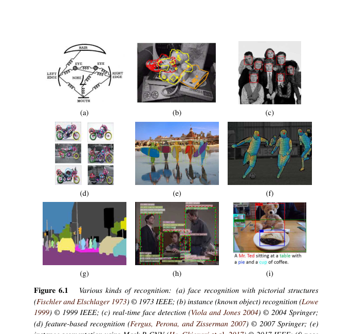
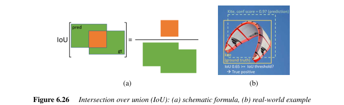
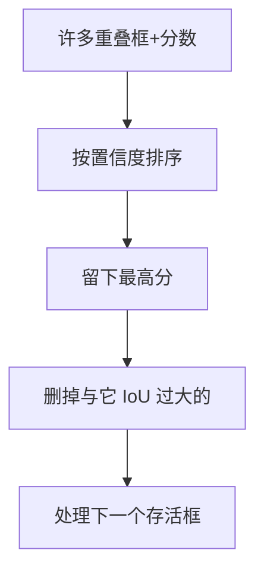
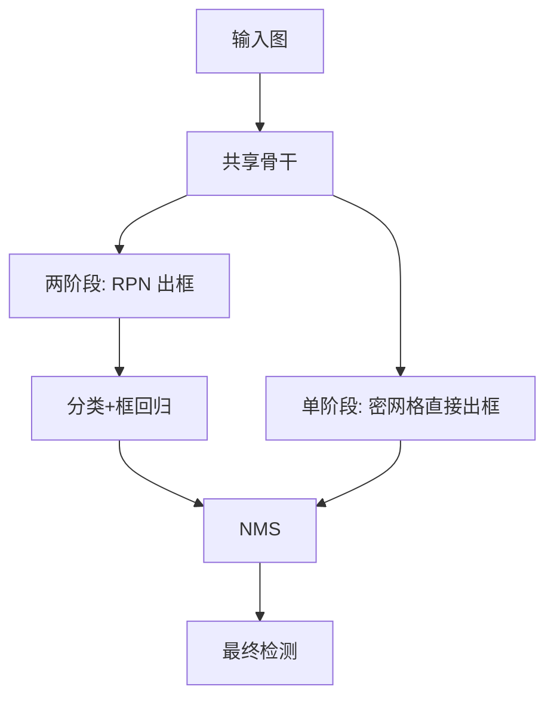

# 第6章 视觉识别

来源：Szeliski《Computer Vision: Algorithms and Applications》第二版电子终稿第6章；书页 343–416 / PDF 369–442。分三批局部阅读。未越界第7章。按前言，不回头补第7章特征工程；人脸检测与通用检测只在识别语境下写。

## 本章总览

识别是近十年变化最大的一章。第一版把它放在书末，当作特征匹配之上的「高层任务」；第二版紧跟第5章，因为现代识别就是深度网的任务头。

任务从整图往像素、再往视频和语言走：实例识别 → 图像分类 / 相似检索 / 人脸识别 → 检测 → 语义 / 实例 / 全景分割与姿态 → 视频理解 → 视觉与语言。图 6.1 把九种任务摆在一起。经典词袋、部件模型本章只留骨架，细节指向第一版与论文。

特征检测、描述与匹配的算法本身在第7章；三维位姿验证在第11章。

## 核心知识点

### 实例识别与图像分类

#### 找「这一件」还是「这一类」

实例识别要找回特定制造物（停车牌、某双鞋）。2000 年代的特征对应 + 几何验证至今仍常用，尤其是三维物体、定位识别。类别识别（猫、摩托）外观变化大，先靠部件和相对位置，后被深度网取代。

图画结构能量

$$
E=\sum_i V_i(l_i)+\sum_{ij\in E}V_{ij}(l_i,l_j)
\tag{6.1}
$$

与第4章 MRF 同形。树拓扑可用动态规划；完全连接的星座模型复杂度 $O(N^P)$，部件一多就不可行。最简是词袋：不管几何，只统计特征词频。空间金字塔在不同区域分别统计，补一点布局。

上下文很关键：图 6.8 里转 90° 后形状相同的色块，人靠场景才能认。部件是物体内部几何，上下文是物体之间、物体与场景的关系。

👉 特征检测与匹配完整深度讲解见第7章。位置识别完整深度讲解见第11章。

🔑 关键速记：实例靠特征+几何；类别先部件后深度网；词袋快但不记空间。

#### 深度分类、相似检索与人脸

整图分类直接接第5章骨干 + softmax。相似检索不预设类表，学嵌入再近邻；对比 / 三元组 / ArcFace 一类损失见第5.3.4节。人脸识别是最长线题目之一：检测 → 对齐 → 嵌入 → 比对。特征脸是第5.2.3节工具，本章谈任务协议（验证 / 辨认）与深度嵌入。

本书不展开第7章描述子公式。

🔑 关键速记：分类给封闭类表；检索给开放相似；人脸是「检测+对齐+嵌入」。

### 物体检测

#### 人脸、行人与提升

检测不但分类，还要框位置。人脸：滑动窗 + 分类器。Viola–Jones 用提升(boosting)把弱分类器加权求和

$$
h(x)=\mathrm{sign}\Bigl[\sum_j\alpha_j h_j(x)\Bigr],
\tag{6.4}
$$

弱学习器是矩形差阈值 (6.5)，靠积分图 $O(1)$ 算。级联先用很少测试甩掉大量非脸。后人脸检测走向 DPM、通道特征、RetinaFace（FPN+RetinaNet 思路）。

行人：Dalal–Triggs 用重叠 HOG + SVM。HOG 在规则网格上按方向直方图投票，像 SIFT 但不只在兴趣点算。可变形部件模型(DPM)再加可动部件。HOG 细节见第7.1.2节。

👉 完整深度讲解见第7章。

🔑 关键速记：Viola–Jones = 矩形特征 + AdaBoost + 级联；行人经典是 HOG+SVM。

#### 指标：IoU、NMS、mAP

框准不准看交并比

$$
\mathrm{IoU}=\frac{B_{\mathrm{pr}}\cap B_{\mathrm{gt}}}{B_{\mathrm{pr}}\cup B_{\mathrm{gt}}}.
\tag{6.6}
$$

检测器先出许多框和置信度，再用非极大抑制(NMS)去掉与高分框重叠过多的弱框。按置信度从高到低扫，对则真阳性、错则假阳性：

$$
\mathrm{precision}=\frac{\mathrm{TP}}{\mathrm{TP}+\mathrm{FP}},\qquad
\mathrm{recall}=\frac{\mathrm{TP}}{P}.
\tag{6.7--6.8}
$$

PR 曲线下面积是平均精度(AP)，各类再平均是 mAP。PASCAL 常用 IoU=0.5；COCO 对 IoU $0.50$–$0.95$ 再平均。F 分数是精确率与召回率的调和平均。

🔑 关键速记：框看 IoU，曲线看 AP；COCO 的 mAP 比 VOC 更苛刻。

📚 基础补充：【精确率、召回率、TPR、FPR、IoU、mAP】

- 是什么：这组指标回答「检测/分类报得准不准、找得全不全」。精确率(precision)是报出来的里面有多少是对的；召回率(recall)是所有该找到的里面找到了多少。真正率 TPR 就是召回率；假正率 FPR 是「把负样本错报成正」的比例。IoU 看两个框重叠多少。mAP 把各类、各置信度下的精度做成一张综合分数。
- 为什么要用它：只报一个准确率会被「全图都当背景」骗过。检测必须同时看框重叠和排序质量。
- 直观理解：海里捞针：精确率高 = 捞上来的几乎都是针；召回率高 = 海里的针基本捞光了。两者常打架：阈值严则精确率升、召回掉。IoU 像两块积木的重叠面积除以总占地，1 是完全重合，0 是没碰上。PR 曲线下面的面积是 AP，各类再平均是 mAP。VOC 常用 IoU≥0.5 就算对；COCO 从 0.50 到 0.95 再平均，更难刷高。

公式人话翻译：(6.6) 输入两个框，输出 0 到 1 的重叠比。(6.7)(6.8) 输入混淆计数 TP/FP 和真值个数 $P$。

- 和本章的关系：后面所有检测器都用这套说话。TPR/FPR 在第7章匹配 ROC 还会再出现。

🔑 关键速记：精确率看报得准，召回率看找得全；框还要 IoU，检测总分看 mAP。

📚 基础补充：【边界框与非极大值抑制 NMS】

- 是什么：边界框(bounding box)是包住物体的轴对齐矩形，常用角点或中心+宽高表示。检测器会在同一物体上冒出许多高度重叠的框。非极大值抑制(NMS, non-maxima suppression)留下置信度最高的那个，把和它 IoU 过大的弱框扔掉。
- 为什么要用它：滑动窗、锚框、密网格都会对同一人脸打出几十个框。不抑制，计数会炸，可视化也没法看。
- 直观理解：一堆人指着同一只猫喊「在这」。NMS 请分数最高的留下，旁边几乎同一位置的小声提议解散。阈值太大（要求极重叠才删）会留下重框；太小可能把两只靠近的猫删成一只。DETR 一类用集合匹配，训练时不再依赖 NMS。

图注：NMS 按分数贪心保留，用 IoU 去重。框是检测的几何输出，类分数是分类输出。

- 和本章的关系：R-CNN 家族和 YOLO/SSD 推理末尾几乎都接 NMS。指标计算也是在 NMS 之后的框上算 TP/FP。

🔑 关键速记：一个物体许多框，NMS 只留最自信的那个；IoU 阈值要在「重框」和「靠近的两个物体」之间折中。

#### 两阶段与单阶段检测器

R-CNN：选择性搜索约 2000 个提议 → 缩放到 $224^2$ → CNN+SVM。Fast R-CNN 先整图卷积，再对特征做 ROI 池化，头部分类+框回归。Faster R-CNN 用区域提议网络(RPN)在粗网格上放不同形状的锚框，推理更快。单分辨率特征图对尺度不友好，特征金字塔网络(FPN)自上而下回灌语义。DETR 用 Transformer 一次出 $N$ 个框，训练时二分图匹配，不再要锚框和 NMS。

单阶段：SSD、YOLO 系列、RetinaNet。RetinaNet 用焦点损失压低易分负样本，避免海量背景淹没训练。数据集：PASCAL VOC（约 20 类）、ImageNet 检测、COCO（多物体、像素级实例）。

🔑 关键速记：两阶段先提议再分类；单阶段一步出框；FPN 解决尺度。

### 分割、姿态、视频与语言

#### 语义 / 实例 / 全景

语义分割给每个像素一个类，不管「第几只猫」。全卷积网、编码器–解码器、DeepLab（空洞卷积 + 稠密 CRF 收拾）是主干。医学影像是密集标注的重要应用。实例分割还要区分同一个类的不同个体，Mask R-CNN 在检测头上再加掩模头。全景分割把「东西」(thing，可数实例)和「东西周围」(stuff，天空/路面)拼成一张无重叠图。智能修图用分割选区再补洞，补洞算法见第10章。

姿态估计出关节点或稠密表面对应；多人实时二维姿态与把 RGB 接到三维人体表面，书用图 6.42–6.43 示范。

👉 补洞与合成完整深度讲解见第10章。三维人体完整深度讲解见第13章。

🔑 关键速记：语义只认类，实例还数个数，全景把可数物和背景铺满全图。

#### 视频与视觉语言

视频动作：双流（RGB + 光流）、三维卷积、SlowFast（慢通路低帧率、快通路高采样少通道）。数据集与指标见原书表，笔记不抄清单。

视觉语言：看图说话、视觉问答、密集描述、文本到图像（如接 VQ-VAE-2 的 DALL·E）。注意力让生成每个词时看图的不同位置。对抗排版攻击说明多模态模型也会被字贴骗。任务头建立在第5章 Transformer / RNN 上。

👉 光流完整深度讲解见第9章。神经绘制与图像合成完整深度讲解见第14章。

🔑 关键速记：视频要融时间；看图说话是「视觉编码 + 语言解码 + 注意力」。

## 易混淆点&差异对比

| 名称 | 功能 | 主要参数 | 约束&坑点 |
| --- | --- | --- | --- |
| 实例 vs 类别识别 | 特定物体 / 可变类 | 特征+几何 vs 深度分类 | 实例仍常走第7章特征，不是过时 |
| 词袋 vs 部件模型 | 无几何 / 有弹簧或树 | 拓扑 | 星座 $O(N^P)$ 爆 |
| 检测 vs 分类 | 框+类 / 整图一类 | IoU、NMS | 分类对了框歪，AP 仍低 |
| 两阶段 vs 单阶段 | RPN+头 / 密网格 | 锚框、焦点损失 | 单阶段更快，易被易分负样本带偏 |
| 语义 vs 实例 vs 全景 | 像素类 / 个体掩模 / 两者合一 | thing vs stuff | 全景禁止重叠 |
| AP@0.5 vs COCO AP | 松框 / 多 IoU 平均 | 阈值集合 | 数字不能直接比 |

精确率是「报出来的有多准」，召回率是「该找到的找全了没」，不是同一回事。

🔑 关键速记：先问输出是类、框、掩模还是句子，再选指标。

## 本章要点总结

- 第二版识别紧跟深度学习；实例识别仍常用特征对应，类别识别主战场是深度网。
- 图画结构 (6.1) 是带几何的 MRF；词袋丢掉空间，上下文补场景。
- 检测：Viola–Jones 级联、HOG+SVM、R-CNN 家族、YOLO/SSD/RetinaNet、DETR；指标 IoU 与 mAP。
- 分割三层语义/实例/全景；姿态、视频双流/SlowFast、视觉语言只接任务，不重讲第5章网络。
- 不在本章展开 SIFT/HOG 公式、RANSAC 全景和光束法平差。

【信息缺口，需要局部查阅文档】表 6.2 检测数据集的完整条目未逐行抄；焦点损失的公式未从 RetinaNet 段抽出。
