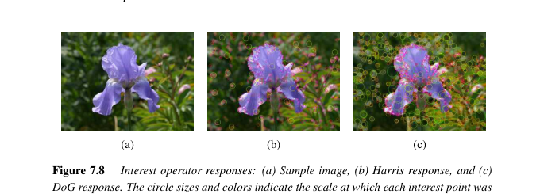
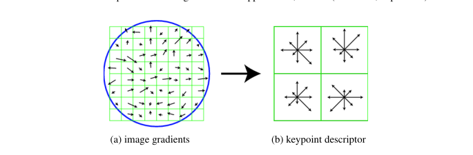
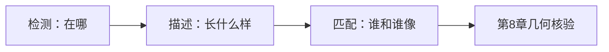
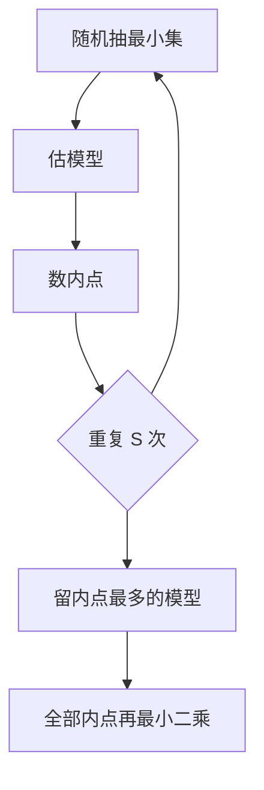
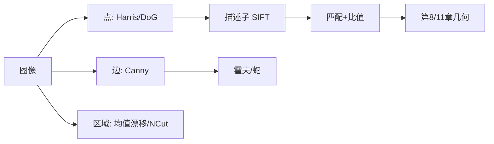

# 第7章 特征检测与匹配

来源：Szeliski《Computer Vision: Algorithms and Applications》第二版电子终稿第7章；书页 417–500 / PDF 443–526。分三批局部阅读。未越界第8章。RANSAC 全景与光束法平差留第8、11章；消失点在第11.1.1节还要用于标定。

## 本章总览

要对齐两张图或建三维，先要找到能对上的东西。书把特征分成点（兴趣点/角点）、边与轮廓、直线与消失点，最后补一节自底向上、不带语义的分割。

点特征能在遮挡、大尺度和旋转下仍匹配，是拼接、HDR、稳像、实例识别、位姿的共用输入。边描述人造物边界。第7.5节的图合并、均值漂移、归一化割曾经是识别前置，现多被第6.4节语义分割替代，偶尔还用来把像素捆成超像素以加快匹配。

## 核心知识点

### 点与块

#### 自相关矩阵与 Harris

匹配两块用加权 SSD (7.1)，与后文光流同一套路。检测阶段不知道对手在哪，只能看块相对自己挪一点是否稳定，即自相关 (7.2)。花坛纹理有尖谷（好定位），屋檐沿边模糊（孔径问题），云没有谷（没法锁）。

一阶展开后 $E_{\mathrm{AC}}(\Delta\mathbf{u})\approx\Delta\mathbf{u}^\mathrm{T}A\Delta\mathbf{u}$，

$$
A=w*\begin{bmatrix}I_x^2&I_xI_y\\I_xI_y&I_y^2\end{bmatrix}.
\tag{7.8}
$$

$A$ 的小特征值决定最大不确定度，Shi–Tomasi 取 $\lambda_0$ 的局部最大当「好跟的点」。Harris 用旋转不变标量

$$
\det(A)-\alpha\,\mathrm{tr}(A)^2=\lambda_0\lambda_1-\alpha(\lambda_0+\lambda_1)^2,
\tag{7.9}
$$

$\alpha=0.06$，压低「一条边很强」的点。Triggs 用 $\lambda_0-\alpha\lambda_1$（$\alpha\approx0.05$）；Brown 等用调和平均 $\det A/\mathrm{tr}A$。自适应非极大抑制(ANMS)要求比半径 $r$ 内邻居强至少约 10%，点在图上更匀。

DoG 在尺度空间找极值，SIFT 检测器走这条路；Harris–Laplace 在 Harris 点上再评拉普拉斯选尺度。

👉 光流里同一 $A$ 的用法完整深度讲解见第9章。

🔑 关键速记：好角点 = $A$ 的两个特征值都大；Harris 用 $\det-\alpha\,\mathrm{tr}^2$ 躲开纯边缘。

📚 基础补充：【图像梯度与边缘】

- 是什么：图像梯度(image gradient) $\nabla I=(I_x,I_y)$ 是灰度在水平和竖直方向上的变化速度。幅值 $\|\nabla I\|$ 大的地方，颜色跳得急，通常就是边缘(edge)；方向指向变化最快的那边（从暗到亮）。
- 为什么要用它：角点、Canny、SIFT 描述子、光流，全都先问「这儿往哪边变、变得多狠」。没有梯度，边缘和角都没有操作定义。
- 直观理解：把图像当成地形高度。梯度是坡度矢量：平地（墙心、天空）梯度≈0；悬崖（物体轮廓）梯度很大。沿悬崖走，一个方向变化大、沿边方向变化小——这就是后面 Harris 说的「一条边」。离散上常用 Sobel 等差分近似 $I_x,I_y$，先轻微平滑以免噪声把坡度测炸。

- 和本章的关系：$A$ 的元素就是窗口内 $I_x^2$、$I_y^2$、$I_xI_y$ 的加权和。Canny 直接用梯度幅值+方向把边描成细线。

🔑 关键速记：梯度 = 灰度坡度；坡陡是边，两个方向都陡才是角。

📚 基础补充：【Harris 角点：为什么两个方向都大变才是角】

- 是什么：角点(corner)是窗口往任意方向挪一点点，块里的内容都会明显变样的位置。Harris 用自相关矩阵 $A$ 的两个特征值来检查这件事。
- 为什么要用它：平坦处没法锁定（怎么挪都差不多）；纯边缘沿边滑也差不多（孔径问题）。只有角才能在二维都钉住，匹配和跟踪才稳。
- 直观理解：窗户里看花纹。花坛：上下左右一挪，图案全变——两个特征值都大。屋檐：垂直于边挪变化大，顺着边挪几乎不变——一个大一个小。云：怎么挪都糊——两个都小。Harris 公式 (7.9) 的人话：$\lambda_0\lambda_1$ 要大，但不要被「一条超强的边」骗走，所以减去 $\alpha(\lambda_0+\lambda_1)^2$。

公式人话翻译：(7.8) 的 $A$ 输入是图像导数，输出 $2\times 2$ 矩阵；它的椭圆轴就是「往哪挪最敏感」。

- 和本章的关系：Shi–Tomasi 直接看较小特征值；光流第9章用同一 $A$ 判断跟踪稳不稳。上面已有 Harris/DoG 响应图。

🔑 关键速记：两个坡度都大才是角；一条边再强也只锁得住一个方向。

#### 描述子：MOPS、SIFT 与变体

MOPS：按检测尺度在金字塔更粗一层采样（间隔约 5 像素），强度减均值、除方差，抗曝光偏置/增益，适合拼接这类透视不太狠的任务。

SIFT：在检测尺度的 $16\times16$ 窗算梯度，高斯衰减压外围；每 $4\times4$ 子块 8 个方向直方图，三线性插值摊到邻箱，得到 128 维；单位化，截到 0.2 再单位化。图 7.16 画的是 $8\times8$/$2\times2$ 示意，实现是 $16\times16$/$4\times4$。

PCA-SIFT 把大梯度向量压到 36 维。SURF 用盒滤波近似。RootSIFT：先 $L_1$ 再逐维开方，区分力明显升。GLOH 改对数极坐标分箱，再 PCA 到 128，评测略优于 SIFT。学习型描述子要先有局部特征，宽基线评测里「经典 SIFT + 新点子」仍很强。

🔑 关键速记：检测给位置/尺度/方向，描述给可比较的向量；SIFT 是 128 维梯度直方图。

📚 基础补充：【特征点、描述子、匹配三者的关系】

- 是什么：特征点(feature point)回答「图上哪些位置值得记住」；描述子(descriptor)回答「这个点长什么样」，通常是一根固定长度的向量；匹配(matching)回答「两张图里哪两个向量足够像，可以当成同一处景物」。
- 为什么要用它：直接比整张图既慢又怕遮挡、旋转。先稀疏取点，再比局部指纹，才能对接第8章几何。
- 直观理解：侦探比对指纹。检测 = 在现场找出有纹路的位置；描述 = 把纹路编成一串数字；匹配 = 两份档案里找最近的数字串。检测稳但描述差，仍配不上；描述好但点打在重复纹理上，会配错。Lowe 比值：最近邻比次近邻还不够近，多半是假匹配。

图注：三步流水线。检测给几何位置，描述给可比向量，匹配给候选对应，几何（RANSAC）再剔外点。

- 和本章的关系：Harris/DoG 是检测，SIFT/MOPS 是描述，本节后的比值与近邻是匹配。不要把「检出了很多点」当成「已经对齐」。

🔑 关键速记：点是位置，描述子是指纹，匹配是比指纹；三步缺一都会挂。

#### 匹配、指标与检索

穷举或近似近邻比描述子。Lowe 比值检测：最近 / 次近过大就丢掉，压假匹配。评估用混淆表：TPR (7.14)、FPR (7.15)、PPV/精确率 (7.16)、准确率 (7.17)；信息检索里召回=TPR。阈值一扫得到 ROC / PR。大规模用 k-d 树 + BBF、视觉词 + 倒排、FLANN/Faiss。几何核验（RANSAC）留给第8章。跟踪是时间上的连续匹配，表演驱动动画是应用。

👉 RANSAC 与全景核验完整深度讲解见第8章。

🔑 关键速记：匹配先比描述子，再用比值或几何扔掉假对应；精确率≠召回率。

### 边缘、轮廓、直线

#### Canny 与轮廓

边缘：梯度幅值 + 非极大抑制 + 双阈值滞后。Canny 用近似最优的平滑微分；DoG 过零点也可当多尺度边。轮廓检测再连成更长曲线。滞后：强边留下，弱边只有连着强边才留。

蛇模型(snake)与智能剪刀把轮廓跟踪写成能量：贴边、短、光滑。水平集把轮廓嵌进高一维函数的零水平，拓扑能变（裂开、合并）。转描是应用。能量框架见第4章，这里不重写求解器。

🔑 关键速记：Canny = 平滑梯度 + 细线 + 双阈值；轮廓跟踪是带形状先验的能量。

#### 霍夫与消失点

直线：逐次折线逼近，或霍夫投票。点–线对偶：每个点给一族直线投票；有方向的边用极坐标 $(r,\theta)$ (7.39)。累加器要小心量化。也可用 RANSAC 随机抽两点成线再数内点，不用累加器。消失点是平行线在像平面的交，标定还要用，本章只检测到点。

👉 用消失点标定完整深度讲解见第11章。RANSAC 细节完整深度讲解见第8章。

🔑 关键速记：霍夫在参数空间投票；消失点是平行世界线的像交点。

📚 基础补充：【RANSAC：为什么能剔除外点】

- 是什么：RANSAC（随机抽样一致性，random sample consensus）反复从对应里抽一个刚够用的最小子集估模型，然后数有多少点符合这个模型（内点），留下内点最多的那次，最后只用内点精炼。
- 为什么要用它：最小二乘会把所有点一视同仁，几个假匹配就能把直线或单应拧歪。外点比例高时，先找「 internally consistent 的那一核」比一上来平方更稳。
- 直观理解：会议室里多数人同意一个时间，少数乱报。你随机拉刚够开会的几个人定一个时间，再数有多少人点头。碰巧抽到全是靠谱的人，点头的就特别多——留下这次。抽到捣乱的人，点头的很少，扔掉重来。试验次数随外点比例和最小样本数 $k$ 指数涨，所以 $k$ 要尽量小（直线 2 点，单应 4 点）。

图注：RANSAC 用投票找一致核，不对外点做平方。精炼仍是最小二乘，只是样本已被清洗。拼接流程见第8章。

- 和本章的关系：直线拟合可以霍夫也可以 RANSAC。特征匹配的几何核验在第8章把同一套路用到单应上。

🔑 关键速记：先抽小样本找多数派，再精炼；平方拟合解决不了「里面有骗子」。

### 自底向上分割

图方法：像素当顶点，边权看颜色差，合并小区域（Felzenszwalb–Huttenlocher）。均值漂移在联合空域–色域找密度众数，同一众数的像素成一块。归一化割最小化「切开的边权 / 与全集的联系」，避免切出太碎的一小块。这些不管语义类名；要类名走第6.4节。

👉 完整深度讲解见第6章。均值漂移与第5章核密度是同一工具。

🔑 关键速记：本章分割是捆像素，不是认物体；语义分割不在这里。

## 易混淆点&差异对比

| 名称 | 功能 | 主要参数 | 约束&坑点 |
| --- | --- | --- | --- |
| Harris vs DoG | 角点 / 尺度空间斑点 | $\alpha$、尺度 | 峰位置常互补 |
| 检测 vs 描述 | 哪里有点 / 点长什么样 | 窗、直方图 | 检测稳、描述差仍配不上 |
| SIFT vs HOG | 兴趣点局部 / 检测滑窗网格 | 128 维 vs 规则细胞 | 行人检测的 HOG 不是 SIFT |
| TPR vs PPV | 召回 / 精确率 | 阈值 | 阈值松则召回升、精确率掉 |
| 霍夫 vs RANSAC 直线 | 投票 / 随机抽样 | 量化 vs 迭代次数 | 霍夫要设计累加器 |
| 第7.5分割 vs 第6.4 | 无语义 / 有类名 | — | 不要把超像素当识别结果 |

$A$ 既是角点检测器也是光流不确定度，不是两套无关矩阵。

🔑 关键速记：点、边、区域是三种描述，匹配指标和检测指标不要混用。

## 本章要点总结

- 自相关 $A$ (7.8) 是角点与光流的共用底座；Harris (7.9)、Shi–Tomasi、调和平均是不同标量化。
- SIFT：DoG 定位 + 128 维方向直方图；RootSIFT/GLOH/SURF 是变体。
- 匹配看 TPR/FPR/精确率；大规模走近似近邻与视觉词；几何核验留第8章。
- Canny、蛇/水平集、霍夫/消失点服务边界与人造几何。
- 图分割、均值漂移、归一化割是无语义捆块。

【信息缺口，需要局部查阅文档】DoG 尺度空间的完整离散公式 (7.12)(7.13) 未逐式抄出；霍夫 (7.39) 的 $r$–$\theta$ 定义未从页缝核对。
