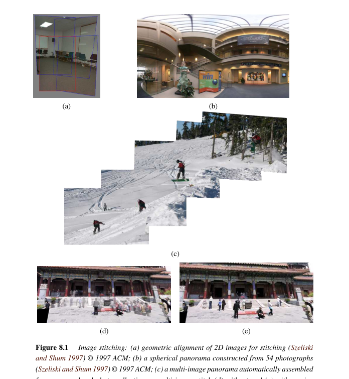
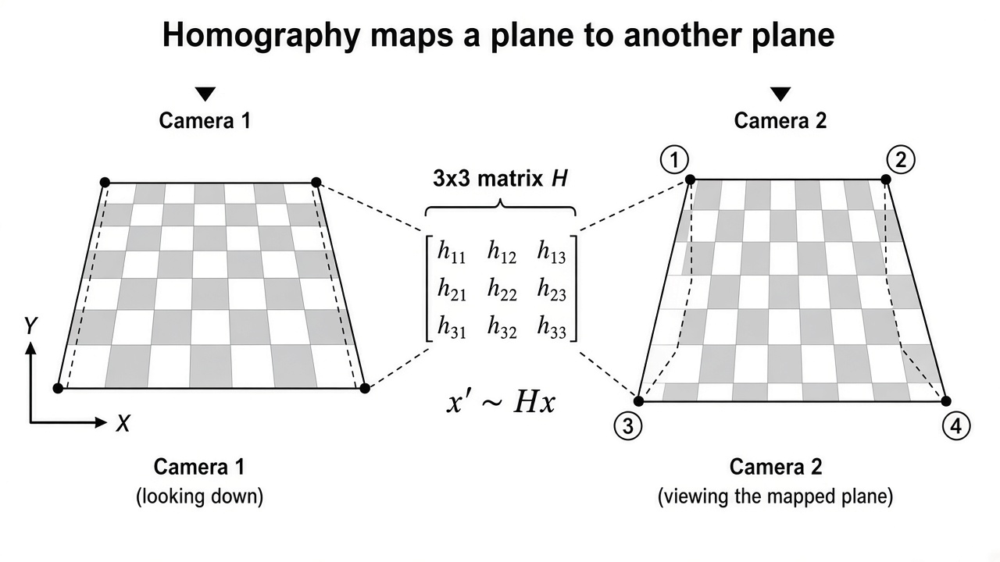
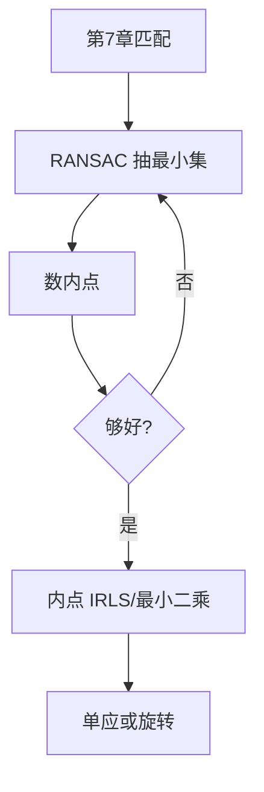

# 第8章 图像对齐与拼接

来源：Szeliski《Computer Vision: Algorithms and Applications》第二版电子终稿第8章；书页 501–554 / PDF 527–580。分两批局部阅读。未越界第9章。成对与全局对齐止于拼接；多视三维与 SLAM 留第11章。

## 本章总览

第7章给出对应点，本章把它们变成一张能看的全景：先估两图之间的平面运动，再把许多图绕相机转成柱面/球面，最后选缝、去鬼影、融合曝光。

图 8.1 从几何框、球面 54 张、无序相册自动拼，到运动物体造成的重影与去掉重影。多视重建不在本章。

## 核心知识点

### 成对对齐

#### 最小二乘与迭代

对应点 $\{(x_i,x'_i)\}$ 与平面变换 $x'=f(x;p)$ (8.1)，最小化残差平方和 (8.2)。平移、相似、仿射对参数线性：$\Delta x=J(x)p$，法方程 $Ap=b$ (8.5)–(8.8)。射影（单应）非线性，要迭代：用表 8.1 的雅可比，在 $p=0$ 处参数化增量，或把增量单应左乘到当前单应上。白板/文档扫描常用平移或仿射；拼贴摄影(panography)故意留错位当风格。

三维对齐（点云、位姿）只点到，完整求解在第11章。

👉 2D 变换群完整深度讲解见第2章。非线性最小二乘完整深度讲解见附录 A。

🔑 关键速记：线性模型一次解 $Ap=b$；单应要迭代，残差是像素距离不是矩阵元素差。

📚 基础补充：【单应性矩阵 Homography】

- 是什么：单应(homography)是一个 $3\times 3$ 齐次矩阵 $\mathbf{H}$，把一个平面上的点映到另一个平面：$ \tilde{\mathbf{x}}'\sim\mathbf{H}\tilde{\mathbf{x}}$。它是第2章射影变换在「两张照片」里的名字。
- 为什么要用它：相机绕光心转、或者拍的是远处墙壁/桌面，两图之间没有视差，一个 $\mathbf{H}$ 就能把整张图拧过去。拼全景的几何核心就是它。
- 直观理解：桌面上的矩形日历，换个角度看变成梯形，但直边还是直的——这就是平面射影。四个点对应（没有三点共线）刚够定 8 个自由度。有平移又有近景时，不同深度的点不服从同一个 $\mathbf{H}$，会出现视差和重影。

公式人话翻译：(2.21) / 本章 (8.1) 输入源像素 $(x,y)$，用 $\mathbf{H}$ 的行做线性组合再除以第三个数，输出目标像素。残差要在像素平面上量，不要拿矩阵元素差当误差。

- 和本章的关系：白板扫描可用更简单的平移/仿射；手持转一圈用旋转约束下的单应。有视差就要局部变形或第11章多视。

🔑 关键速记：单应 = 平面到平面的射影；$x'\sim Hx$；转圈或远平面才成立。

#### 稳健拟合与 RANSAC

对应里几乎总有外点。M-估计对残差加 $\rho$ (8.25)，等价于迭代重加权最小二乘 (8.27)。外点太多时 IRLS 到不了好盆地，先用 RANSAC 或最小中位数平方找内点核：随机抽 $k$ 对算出 $p$，数 $\|r_i\|\le\epsilon$ 的内点（$\epsilon$ 常约 1–3 像素），重复 $S$ 次留内点最多的那次，再拿全部内点精炼。变体：Preemptive RANSAC、PROSAC、MLESAC、可微 DSAC、Graph-Cut RANSAC、MAGSAC。需要的试验次数随外点比例和 $k$ 指数涨，所以 $k$ 取模型最小样本数。

🔑 关键速记：RANSAC 先找一致的内点核，再稳健最小二乘精炼；不要一上来对所有匹配平方。

📚 基础补充：【RANSAC + 最小二乘的配合流程】

- 是什么：拼接里几乎从不会「只做 RANSAC」或「只做最小二乘」。RANSAC 负责从脏匹配里找出内点，最小二乘（或 IRLS）负责用全部内点把 $\mathbf{H}$ 估准。
- 为什么要用它：RANSAC 的最小集解噪声大；最小二乘见外点就崩。两者接力才又稳又准。
- 直观理解：先海选（RANSAC 投票），再对入围者做精细测量（平方拟合）。$\epsilon$ 常约 1–3 像素；外点很多时必须先海选。完整 RANSAC 直觉见第7章直线一节。

- 和本章的关系：上面流程图就是这条流水线。后面多图光束法平差假定成对内点已经比较干净。

🔑 关键速记：RANSAC 洗数据，最小二乘做精炼；顺序不能反。

### 图像拼接

#### 运动模型与旋转全景

若相机只绕投影中心转（或场景是远平面），两图关系是单应。纯旋转时单应由内参与相对旋转构成，不要无约束 8 自由度乱漂。补缝(gap closing)处理没扫到的条带。柱面/球面坐标把每张图先映到统一曲面上再混合，长条 360° 常用柱面，完整环境用球面。参数运动模型也服务白板扫描和视频摘要（把一段视频压成一张拼图）。

有视差时单应不够，去视差用局部变形，完整多视几何留第11章。

🔑 关键速记：手持转一圈 ≈ 旋转全景；先映到柱面/球面，再谈融合。

#### 全局对齐与认出全景

多图链式成对误差会累积。光束法平差(bundle adjustment)同时调各图姿态（及可选内参），让重投影误差全局最小。拼接场景里点的三维常常约束在无穷远或浅深度。认出全景：无序相册里用特征检索找能拼上的连通分量，不是假设用户已按顺序给图。

👉 完整 SfM 光束法平差完整深度讲解见第11章。

🔑 关键速记：成对对齐会漂，多图要一次全局平差；无序图先检索再拼。

📚 基础补充：【光束法平差 BA（拼接语境）】

- 是什么：光束法平差(bundle adjustment)同时调整所有照片的姿态（以及可选的内参），让特征点重投影到各图上的误差一起变小。拼接里三维点常常被钉在很远或浅深度，重点是把图与图的缝收紧。
- 为什么要用它：一对一对拼会像手链一样越拉越偏，360° 接不拢。全局一起改，误差被摊到所有图上。
- 直观理解：每张照片是一根从光心射向特征的「光束」。拧一拧每台相机的朝向，让这些光束在空间里尽量交在同一点，像平面上的残差就小了。完整三维 SfM 版 BA 见第11章。

- 和本章的关系：本节的全局对齐就是「深度被简化了的 BA」。有明显视差时不要指望单应 BA 能代替真正的三维重建。

🔑 关键速记：多图不要只成对累加；一次平差收漂移，真三维留给第11章。

### 合成：选面、选缝、融合

投影面：平面适合小视场，柱面/球面适合大视场，多面体或透视中心选取得当可减小拉伸。像素选择：重叠区简单平均会出鬼影（人和车出现两次）；用加权、中值或图割选缝，让缝走在不好对齐的地方。照片蒙太奇是无序标签 MRF（第4章框架）在源图编号上的应用。

融合：接缝附近拉普拉斯金字塔混合（第3章），或泊松/梯度域融合让色调接上。曝光不一致先做增益补偿。第3章的 over 公式在这里变成「选哪张的像素 + 怎么抹缝」。

👉 拉普拉斯金字塔完整深度讲解见第3章。泊松融合能量完整深度讲解见第4章。自然抠图完整深度讲解见第10章。

🔑 关键速记：几何对上之后还要选缝和融合，否则会有重影和色带。

## 易混淆点&差异对比

| 名称 | 功能 | 主要参数 | 约束&坑点 |
| --- | --- | --- | --- |
| 成对 vs 全局 | 两图 / 所有图一起 | 单应 vs BA | 只成对会累积漂移 |
| IRLS vs RANSAC | 降权外点 / 先找内点 | $\rho$、$\epsilon$、$S$ | 外点比例高时先 RANSAC |
| 单应 vs 纯旋转 | 8 自由度 / 由 $K,R$ 约束 | 是否绕光心转 | 有平移+近景就有视差 |
| 柱面 vs 球面 | 长条 360° / 完整环境 | 投影面 | 顶底在柱面拉伸大 |
| 平均混合 vs 选缝 | 叠像素 / 图割选源 | 缝代价 | 平均必出鬼影 |
| 本章 BA vs 第11章 SfM | 拼图姿态 / 稀疏三维 | 深度是否固定 | 拼接常把点放很远 |

平移、相似、仿射、单应的自由度见表 2.1，不要在拼接里乱用 8 参数去拟合几乎是平移的白板。

🔑 关键速记：先问有没有视差、图是否有序，再选模型和融合。

## 本章要点总结

- 成对：线性模型法方程；单应迭代；RANSAC+IRLS 抗外点。
- 旋转全景用内参+旋转，柱面/球面展开；无序相册先认连通分量。
- 全局用光束法平差收累积误差；视差只能局部补，真多视走第11章。
- 合成：选投影面、选缝去鬼、金字塔或泊松融合。

【信息缺口，需要局部查阅文档】RANSAC 试验次数 $S$ 的闭式 (8.29)(8.30) 未逐式抄出；增益补偿的具体公式未从 8.4 抽出。
