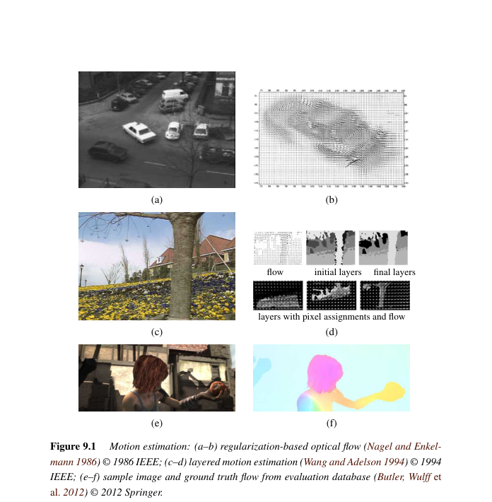
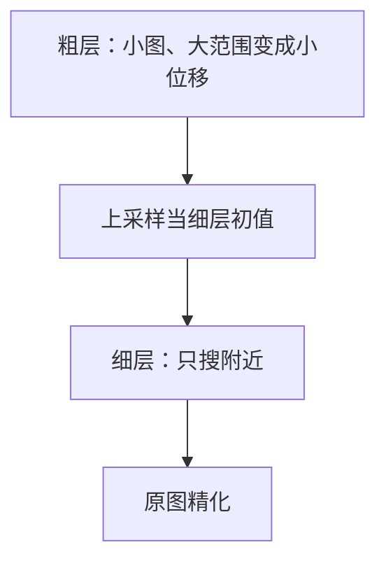
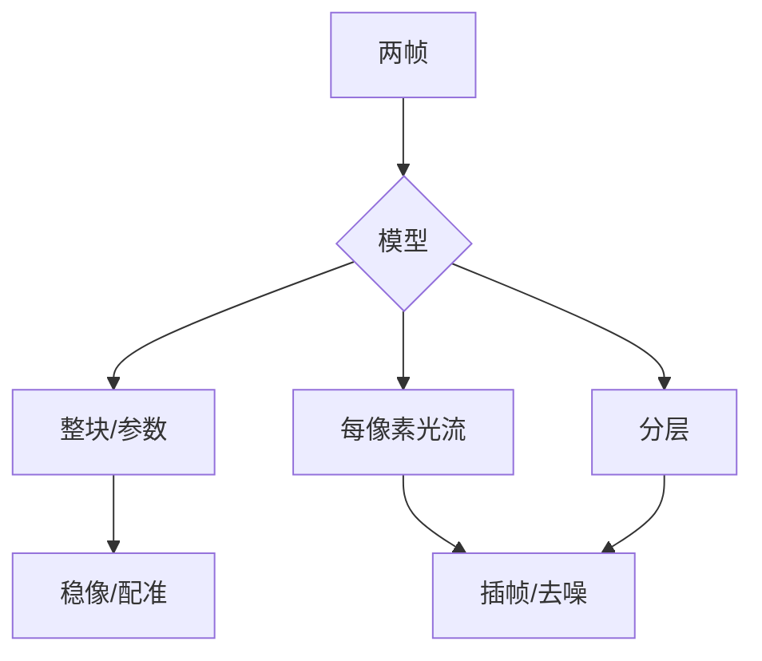

# 第9章 运动估计

来源：Szeliski《Computer Vision: Algorithms and Applications》第二版电子终稿第9章；书页 555–606 / PDF 581–632。分两批局部阅读。未越界第10章。二维运动与光流；场景流留第12.7.1节，三维跟踪留第13章。

## 本章总览

上一章估的是两张图之间「一块板」的运动。这一章允许每个像素有自己的位移，也就是光流(optical flow)，以及介于两者之间的参数运动和分层运动。

亮度恒常(brightness constancy)：对应点灰度（或颜色）尽量不变。搜索可以是整块平移、傅里叶互相关、金字塔由粗到精，或把约束写成能量再正则化。深度网后来在评测集上超过经典变分法。场景里的三维运动不在本章展开。

## 核心知识点

### 平移对齐

整块位移 $u=(u,v)$ 最小化 SSD (9.1)。位移常是分数，要双线性或双三次插值。更稳健用 $\rho(e_i)$ (9.2) 或 SAD (9.3)；Geman–McClure (9.4) 小残差二次、大残差饱和。边界外像素、被擦掉的前景、稳像时画面中心的独立运动，都要降权。

大位移先在金字塔粗层搜小范围，再把结果当细层初值。傅里叶对齐用互功率谱的相位相关找平移峰，适合几乎是整图平移的情况。增量精化是 Lucas–Kanade：把残差对 $u$ 线性化，又得到第7章那个 $A\Delta u=b$，所以角点处光流最稳，边上有孔径问题。

👉 自相关矩阵 $A$ 完整深度讲解见第7章。

🔑 关键速记：整块平移用 SSD/相位相关；局部精化是 LK，靠的是 $A$ 可逆。

### 参数运动

整图共用一个第2章的变换（相似、仿射、单应），算法与第8章成对对齐相同，服务视频稳定（估相机抖、平滑路径、再扭曲回去）和医学配准。样条运动：控制点上的位移插成平滑场，自由度介于「一个单应」和「每像素一流」之间。

🔑 关键速记：稳像估的是全局参数运动，不是光流本身；样条是半稠密折中。

### 光流

每像素一个 $u(x)$。亮度恒常只给出沿梯度的一个方程，必须加平滑（Horn–Schunck 二次，或 TV/$L_1$、各向异性）。全局能量在运动边界附近比大窗 SSD 更干净。搜索空间是 2D，多用由粗到精梯度下降，不像立体那样早期就走组合优化。可把稀疏特征匹配嵌进变分（DeepFlow 的手工卷积匹配、EpicFlow 的沿边插值）。Middlebury / Sintel 评测里，中值滤波等后处理对经典方法影响很大。

深度方法：在金字塔上预测并扭曲（SPyNet），或先做特征金字塔再扭曲融合（PWC-Net 一类）。卷帘快门抖动去除、多帧、视频去噪是应用：对齐之后才能安全平均。

立体是 1D 视差，光流是 2D；场景流把光流抬到 3D，见第12章。

👉 完整深度讲解见第12章。深度骨干完整深度讲解见第5章。

🔑 关键速记：光流 = 亮度恒常 + 平滑；大位移靠金字塔或特征；深度网现已主导评测。

📚 基础补充：【光流的亮度恒常假设】

- 是什么：亮度恒常(brightness constancy)假设：同一景物点在下一帧里灰度（或颜色）几乎不变，变的只是它在画面上的位置。
- 为什么要用它：两帧之间没有现成的对应点时，只能靠「这块斑的亮度像谁」来推断位移。没有这条，光流方程写不出来。
- 直观理解：手电筒照在墙上的光斑挪了，但光斑本身没变亮变暗——我们靠「同样的亮块出现在旁边」判断它动了。光照突变、高光、阴影扫过时假设会破，可改匹配梯度或相位。

- 和本章的关系：SSD、LK、Horn–Schunck 全都把恒常当数据项。恒常只约束沿梯度的一个方向，所以还要平滑项。

🔑 关键速记：光流先假定「颜色跟着点走」；光照一变这条腿就瘸。

📚 基础补充：【分层由粗到精】

- 是什么：由粗到精(coarse-to-fine)先在金字塔小图上估一个大概位移，再拿到更细的一层当初值，只搜附近的小范围。
- 为什么要用它：原分辨率上位移可能几十像素，局部线性化（LK）只在「挪一点点」时成立；穷举又太贵。粗层上几十像素变成几个像素，好搜也更稳。
- 直观理解：先眯眼看整栋楼挪了大概哪，再睁眼对齐窗户。SPyNet / PWC-Net 把同一思想做成网络：每层预测、扭曲、再细化。

图注：大位移在粗层变成小位移，局部光流假设才成立。稳像、特征匹配也常用这套。

- 和本章的关系：平移对齐、稠密光流、后面立体匹配都把金字塔当标准前置。

🔑 关键速记：先粗后细，把大位移变成每层的小修正。

📚 基础补充：【微分光流基本方程】

- 是什么：把亮度恒常对时间微分，得到 $I_x u+I_y v+I_t\approx 0$。这是一个方程、两个未知数 $(u,v)$，所以必须再加假设（窗口内流相同，或邻居流相近）。
- 为什么要用它：它把「找对应」变成可求导的线性约束，Lucas–Kanade 和 Horn–Schunck 都从这儿起步。
- 直观理解：图像在动，某像素的灰度变化 $I_t$ 应该等于「空间坡度 × 速度」的反向——就像你走下坡，海拔下降速度 = 坡度 × 步行速度。只有坡度的方向能被看见：沿着一条均匀的边滑动，灰度不变，这就是孔径问题。角点处 $A$ 可逆，$(u,v)$ 才能钉死。

公式人话翻译：$I_x,I_y$ 是空间导数，$I_t$ 是两帧之差，$(u,v)$ 是要求的光流。输入是图像导数，输出是速度场（还欠一条约束）。

- 和本章的关系：LK 在窗内堆许多这样的方程，得到第7章那个 $A\Delta u=b$。全局方法把平滑写进能量。

🔑 关键速记：一个像素一个方程锁不住 2D 流；角点稳，边上有孔径问题。

### 分层运动

场景常是几块近乎平面的层。先估层的运动再给像素分配层，迭代（Wang–Adelson）。插帧：沿流半程取像素，分层能处理遮挡。透明与反射是两路运动叠在同一像素，不是 over 合成，见第3.1节点名。视频目标分割与跟踪用运动+外观把前景抠出来并跟上。

👉 透明运动与合成差异见第3章。三维人体跟踪见第13章。

🔑 关键速记：一层一个运动比每像素乱流更稳；反射是两层相加，不是 α 混合。

## 易混淆点&差异对比

| 名称 | 功能 | 主要参数 | 约束&坑点 |
| --- | --- | --- | --- |
| SSD vs SAD | 平方 / 绝对值 | 窗大小 | SAD 原点不可微，不便 LK |
| LK vs Horn–Schunck | 窗内常流 / 全局平滑 | 窗 vs $\lambda$ | LK 孔径问题；HS 会糊过边界 |
| 光流 vs 立体 | 2D 位移 / 1D 视差 | 搜索维数 | 立体可组合优化，光流早期很少 |
| 光流 vs 场景流 | 像平面 / 三维运动 | — | 场景流在第12章 |
| 参数运动 vs 光流 | 少量参数 / 每像素 | 变换族 | 稳像用前者就够 |
| 层 vs α 合成 | 两路运动相加 / 前景贴背景 | — | 玻璃反射不是 over |

亮度恒常在光照变时会破，可改匹配梯度或相位。

🔑 关键速记：先选「一块、一层、还是每像素」，再选平滑和金字塔。

## 本章要点总结

- 平移：SSD/稳健范数、金字塔、相位相关、LK 增量（共用 $A$）。
- 参数运动服务稳像与医学配准；样条是中间表示。
- 光流：恒常+正则；TV 保边；深度金字塔扭曲成主流。
- 分层处理遮挡、插帧、反射；视频分割跟踪是应用。
- 不在本章做场景流和三维跟踪。

【信息缺口，需要局部查阅文档】LK 法方程与 Horn–Schunck 连续能量的印刷编号未在笔记逐式对齐；PWC-Net 等网络结构细节未从 9.3.1 逐层抄。
