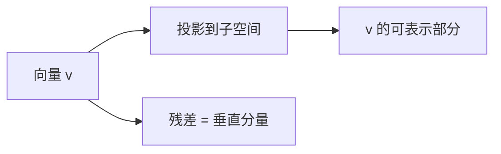
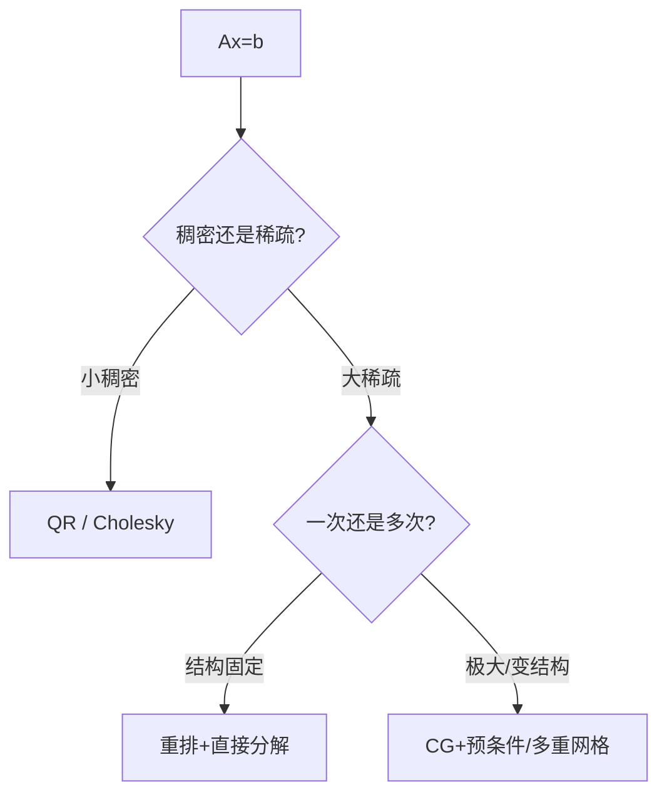

# 附录 A 线性代数与数值方法

来源：Szeliski《Computer Vision: Algorithms and Applications》第二版电子终稿附录 A；书页 919–938 / PDF 945–964。正文章引用线性代数时只给简写，公式细节放本附录。索引从 0 开始，和多数数学书的 1 起始不同。

## 本章总览

视觉里的标定、对齐、BA、正则化，最后几乎都是「解一个线性或非线性最小二乘」。本附录给分解、最小二乘、稀疏直接法、迭代法（共轭梯度、预条件、多重网格）。不是另开一门数值分析课，只收书里反复用到的那一套。

📚 基础补充：【向量空间、基与投影】

- 是什么：向量空间(vector space)是「可以相加、可以数乘」的箭头的家。基(basis)是一组刚好能拼出空间里每一个向量、又不多余的轴。投影(projection)是把一个向量垂直地（或按某种内积）扔到某个子空间上，落差就是残差。
- 为什么要用它：图像、相机参数、形变系数都可以当成高维向量。最小二乘的几何就是「往模型能到达的子空间上投影」。
- 直观理解：地上有一根木棍的影子：太阳从头顶照下来，影子就是投影。三维箭头投到桌面，丢掉高度。换一组基等于换一把尺子——PCA 就是把尺子转到「数据最散」的方向。坐标是「沿各根基轴要走多远」。

图注：最小二乘把观测投影到 $A$ 的列空间；残差与列空间正交。基是那套用来写坐标的轴。

- 和本附录的关系：后面 SVD 的 $U,V$ 就是两组正交基；法方程是在列空间上做正交投影。第4章最小二乘图就是这一几何。

🔑 关键速记：基是坐标轴；投影丢掉垂直分量；最小二乘 = 向列空间投影。

## 核心知识点

### 矩阵分解

任意实矩阵 $A_{m\times n}$ 的奇异值分解

$$
A=U\Sigma V^\mathrm{T}.
\tag{A.1}
$$

奇异值小的方向是病态方向，截断小奇异值可降噪（PCA/特征脸用特征分解 (A.6)，样本多于像素时用 $N\times N$ 内积技巧 (A.13)–(A.14)）。QR 把 $A$ 写成正交×上三角，适合最小二乘，**这里的 R 不是旋转矩阵**。Cholesky 分解对称正定 $A=LL^\mathrm{T}$，解 $Ax=b$ 比求逆稳。第2章已提醒：QR 里的 R 与旋转 R 撞名。

👉 特征脸完整深度讲解见第5章。旋转表示完整深度讲解见第2章。

🔑 关键速记：SVD 看秩和病态；QR/Cholesky 用来解，不要求逆。

📚 基础补充：【SVD、QR、特征值分解分别在干什么】

- 是什么：三种常用分解把矩阵拆成更好懂的块。SVD：任意矩阵 = 正交 × 对角拉伸 × 正交，看秩、做伪逆、做 PCA。QR：$A=QR$，$Q$ 列正交、$R$ 上三角，用来稳稳地解最小二乘。特征值分解：方阵（常对称）= 特征向量方向上的缩放，特征脸走这条。
- 为什么要用它：直接求逆又慢又炸。分解一次，求秩、降噪、解方程都能复用。
- 直观理解：SVD 像找出橡皮的拉伸主轴（第4章已有几何补充）。QR 像「先把列向量正交化成一套干净尺子 $Q$，剩下的三角系数放进 $R$」。特征分解只对「能找到特征方向」的方阵有意义，散度矩阵对称正定，所以特征脸合法。Cholesky 是对称正定的更快版本：$A=LL^{\mathrm{T}}$。

- 和本附录的关系：(A.1) 是 SVD。提醒：QR 的 $R$ 是上三角，不是旋转。截断小奇异值 = 丢掉噪声方向。

🔑 关键速记：SVD 管任意矩阵的拉伸轴；QR/Cholesky 管稳求解；特征分解管对称方阵的主轴。

### 线性与非线性最小二乘

线性：$Ax\approx b$，法方程 $A^\mathrm{T}Ax=A^\mathrm{T}b$，或更稳的 QR。总体最小二乘(TLS)认为 $A$ 和 $b$ 都有噪声。测量对未知量非线性，或用了稳健 $\rho$，就要非线性最小二乘：Gauss–Newton / Levenberg–Marquardt，反复线性化。第8章单应、第11章 BA 都走这条。

👉 IRLS 与稳健 $\rho$ 完整深度讲解见第4章与附录 B。

🔑 关键速记：线性一次法方程或 QR；非线性就迭代线性化。

📚 基础补充：【线性方程组、最小二乘、总最小二乘】

- 是什么：线性方程组 $Ax=b$ 在 $A$ 可逆且尺寸刚好时有唯一解。最小二乘面对 $m>n$ 的过定系统，让 $\|Ax-b\|^2$ 最小，默认「只有 $b$ 有噪声」。总最小二乘(TLS, total least squares)认为 $A$ 的元素也有噪声，误差垂直于拟合流形，而不是只垂直于 $b$ 轴。
- 为什么要用它：视觉里对应点数量远多于未知数，几乎从不用「刚好方的精确解」。直线拟合、基础矩阵，测量误差在两边都有，有时该用 TLS。
- 直观理解：普通最小二乘量的是竖直接近误差（第4章图）。TLS 量的是到直线的垂直距离——点的 $x$ 和 $y$ 都可能测歪。非线性最小二乘（单应、BA）没有一次闭式，Gauss–Newton / LM 反复把问题线性化。法方程 $A^{\mathrm{T}}Ax=A^{\mathrm{T}}b$ 会把条件数平方，病态时优先 QR。

- 和本附录的关系：第8、11章的精炼都是非线性最小二乘。RANSAC 洗完内点之后，仍要回到这里的求解器。

🔑 关键速记：过定用最小二乘；两边都有噪考虑 TLS；病态避开显式 $A^{\mathrm{T}}A$。

### 稀疏直接法与迭代法

BA 和网格正则化的 Hessian 极稀疏。变量重排（填入最小化）决定直接分解的内存。太大则迭代：共轭梯度吃的是矩阵–向量积；预条件让谱变好（第4章分层预条件）；多重网格在粗细层之间传误差，接近线性于未知量个数。

🔑 关键速记：像素级问题不要稠密求逆；预条件和多重网格是为了线性复杂度。

📚 基础补充：【共轭梯度与多重网格】

- 是什么：共轭梯度(conjugate gradient, CG)是解大型稀疏正定 $Ax=b$ 的迭代法：不分解矩阵，只反复做矩阵–向量乘法，沿一组「互相共轭」的方向往下走。多重网格(multigrid)在粗网格上改大尺度误差，在细网格上改细节，来回传送。
- 为什么要用它：百万像素的正则化、BA 的海森，稠密分解内存会爆。CG+好预条件、或多重网格，复杂度才能接近线性于未知量个数。
- 直观理解：CG 像在椭球山谷里走：普通梯度下降会锯齿形晃，共轭方向保证每一步都不浪费已经消掉的误差分量。多重网格像修一张皱桌布：先眯眼把大皱褶抚平（粗层），再睁眼熨小皱（细层），只在细层上磨会把大皱褶当很多次局部起伏，收敛极慢。预条件是「先换一双更圆的鞋」，让椭球别那么扁。

- 和本附录的关系：第4章网格能量、第11章 BA 都点名这些求解器。结构固定的中等问题也可以重排后直接分解。

🔑 关键速记：CG 靠矩阵–向量积迭代；多重网格在粗细层之间传误差，才能线性于像素数。

## 易混淆点&差异对比

| 名称 | 功能 | 主要参数 | 约束&坑点 |
| --- | --- | --- | --- |
| SVD vs 特征分解 | 任意矩阵 / 方阵（常对称） | — | 特征脸走对称散度矩阵 |
| QR 的 R vs 旋转 R | 上三角 / $SO(3)$ | — | 第2章已标坑 |
| 法方程 vs QR | $A^\mathrm{T}A$ / 不显式平方 | 条件数 | 法方程把条件数平方 |
| 直接 vs 迭代 | 分解一次 / 逐步逼近 | 重排 vs 预条件 | 迭代要停准则 |

🔑 关键速记：条件数差时避开显式 $A^\mathrm{T}A$。

## 本章要点总结

- SVD (A.1)、特征分解、QR、Cholesky。
- 线性 / 总体 / 非线性最小二乘。
- 稀疏重排；CG、预条件、多重网格。
- 0 起始下标，对照外文书要换算。

【信息缺口，需要局部查阅文档】Levenberg–Marquardt 阻尼项的印刷编号未逐式抄出。
