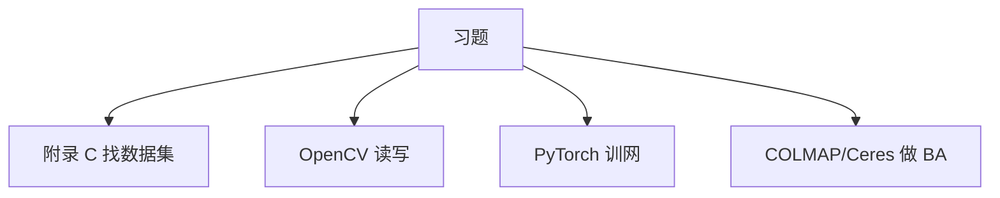

# 附录 C 补充材料

来源：Szeliski《Computer Vision: Algorithms and Applications》第二版电子终稿附录 C；书页 953–972 / PDF 979–998。习题与小项目的数据/库入口在此，正文章不单开软件清单。书网站 https://szeliski.org/Book 有更新课表。

## 本章总览

三块：数据集与基准、软件、幻灯与课程。前言把「去做作业时去哪找数据和库」指到这里。名单以 2021 终稿为准，网址可能已迁。

## 核心知识点

### 数据集与基准（按章归类，摘录书中已点名者）

开发算法要在有挑战、有代表性的数据上测；有真值或别人结果才能定量比。书已在各章表里列过，本附录汇总。更老的见第一版附录 C.1；Keith Price 维护的 VisionBib.Com 从 1994 年收到现在。

下面只记附录正文明确写出的条目，不补书外新库。

| 对应章 | 书中点名的数据/基准 | 约束&坑点 |
| --- | --- | --- |
| 第2章 | CUReT 反射与纹理；Middlebury 颜色数据集 | 研究相机色域，不是识别 |
| 第4章 | Middlebury MRF；OpenGM2 | 比的是推断算法不是分类精度 |
| 第5章 | MNIST、CIFAR-100、Fashion MNIST 作小作业；TorchVision / TF Datasets 下载入口 | 大识别集见表 6.1–6.4 |
| 第6章 | 表 6.1 人脸；Caltech 行人；KITTI、Cityscapes；表 6.2 分类检测分割；FGVC；表 6.3 视频；Robust Vision Challenge、COCO+LVIS 研讨 | 表内逐行未全抄 |
| 后文（书继续按章列） | Middlebury 立体、ImageNet、Sintel 光流、COCO 等在引言已点名 | 以各章正文表为准 |

👉 各章任务指标（mAP、IoU）完整深度讲解见第6、9、12章。

🔑 关键速记：先对上章再下数据；小作业用 MNIST/CIFAR，论文用 ImageNet/COCO/KITTI。

### 软件（书中点名）

建议路径：先自己用 NumPy 写点处理，OpenCV 只做读写，Matplotlib 显示；再把代码迁到 PyTorch 或 TensorFlow。

书点名的库：

- OpenCV：通用视觉，Features2D、标定与位姿。
- PyTorch / TensorFlow：深度训练；TorchVision 权重与数据。
- Detectron2：检测分割。
- PyTorch3D：网格/点微分绘制。
- Ceres Solver：BA 与非线性最小二乘。
- COLMAP：大规模 SfM，书称当时研究里最常用；也有稠密。
- 另有 MVE 等重建，与 COLMAP 一并被点到。

幻灯与课程：指向作者站点与 CS231n 等；具体课表以网站更新为准。

🔑 关键速记：作业链是 NumPy → 深度框架；重建链是 OpenCV 特征 + COLMAP/Ceres。

## 易混淆点&差异对比

| 名称 | 功能 | 主要参数 | 约束&坑点 |
| --- | --- | --- | --- |
| 数据集 vs 基准 | 图+标签 / 排行榜协议 | 提交格式 | 同一 COCO 不同任务协议不同 |
| OpenCV vs PyTorch | 传统算子 / 可微训练 | — | 不要在正文章把库当算法本身 |
| COLMAP vs 第11章笔记 | 实现 / 原理 | — | 原理在第11章，软件在本附录 |

🔑 关键速记：数据、指标、软件分开放；正文章不堆安装说明。

## 本章要点总结

- 按章索引数据：Middlebury、PASCAL、ImageNet、KITTI、Sintel、COCO 等。
- 软件：OpenCV、PyTorch/TF、Detectron2、PyTorch3D、Ceres、COLMAP。
- 幻灯课表看 szeliski.org/Book。
- 本附录不写参考文献全文。

【信息缺口，需要局部查阅文档】C.1 后半按第7–14章展开的条目未逐条抄进笔记，用时局部回 PDF 979–998。
