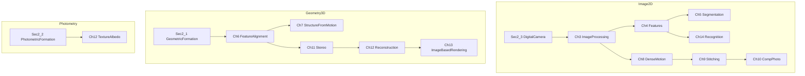

# Szeliski 计算机视觉算法与应用 中文版 章节规划大纲

> 状态：规划已确认，待按章生成笔记。本文件只做章节规划，不替代 MEMORY，也不含正文笔记。
> 参考文档：`./docs/图像视觉基础/计算机视觉算法与应用中文版.pdf`
> 版本：Richard Szeliski 著，艾海舟、兴军亮 等译；清华大学出版社，2012 年 1 月第 1 版第 1 次印刷
> 原著：*Computer Vision: Algorithms and Applications, 1st Edition*（Springer，2010）
> PDF 共 680 页，扫描件（Pdg2Pic / FreePic2Pdf），无文字层。
> 详细目录在书页 VII–XI（PDF 10–14）已完整读出，目录无缺失章。
> 页码换算（阿拉伯数字书页，已用第1章书页 1/2/16/21/22/23 = PDF 15/16/30/35/36/37 核对）：**PDF 页 = 书页 + 14**
> 本阶段已读封面/版权、译者的话、序、目录、第1章概述；**未读第2章及之后正文**。各章核心简述仅来自目录节名、序与第1.3节导览，生成笔记前以该章正文为准。
> 本大纲按**中文版第一版**章节顺序与命名，不套用英文第二版结构。

---

## 整体说明

### 书籍定位

| 项目 | 说明 |
| --- | --- |
| 书名 | 计算机视觉——算法与应用 |
| 英文原名 | Computer Vision: Algorithms and Applications |
| 作者 | Richard Szeliski |
| 译者 | 艾海舟、兴军亮 等译 |
| 源文档 | 中文版扫描 PDF；后续全部笔记输出中文，关键术语保留英文原名对照 |
| 读者定位 | 计算机与电子工程专业高年级本科 / 研究生；序建议最好已修图像处理或计算机图形学 |
| 风格 | 强调真实世界中行之有效的算法，弱化过度形式化的数学；三条途径贯穿全书：科学建模反演、统计推断、工程可实现 |
| 结构 | 第1–15章 + 附录 A/B/C + 词汇表 |
| 全书页数 | 680 PDF 页；目录列至词汇表书页 617，词汇表结束页目录未给出 |
| 笔记根目录 | `./Visual-Knowledge/机器视觉原理应用/计算机视觉算法与应用中文版/` |

这是**单书顺序大纲**，一章对一章，不拆不并，也不与英文第二版笔记目录对齐。

### 与英文第二版的目录级差异（只作防混用）

本中文版译自 2010 年第一版。仓库中已有的 `[szeliski-cvaa-2ed]` 是 2021 年第二版电子终稿，章节号不可混用：

- 第一版第3章含全局优化与马尔可夫随机场(MRF)；第二版把拟合/优化拆成独立第4章。
- 第一版第4章是特征检测与匹配、第5章是分割；第二版特征在第7章，分割并入特征/识别。
- 第一版识别在第14章；第二版识别前移到第6章，并单独设深度学习第5章。
- 第一版无独立深度学习章、无同时定位与建图(SLAM)、无视觉惯性里程计(VIO)、无神经绘制(Neural Rendering)专节。
- 第一版第15章结语仅约 2 页（书页 567–568）；第二版结语仍短，但前面章节已重排。

### 规划约定

- 粒度：对齐原书主章节，不拆到 1.2.3 级；各章简述可点到目录中的一级/二级节名。
- 语言：后续笔记只做概念、算法与流程总结，不写可运行工程代码。
- 附录 A/B/C 各作一份附录笔记；词汇表不写笔记。附录 C 的 C.4「参考文献」是补充材料内的入口，不是独立参考文献部。
- 不编造目录里没有的章节或算法。尤其不要把第二版的深度学习、SLAM、神经绘制写进本大纲。
- 第1章表 1.1 的 10/13 周课表只是选用样例，不是全书必讲清单。
- 扫描目录有两处 OCR 待核，不改章名，只在对应章脚注标明：3.3.4「连通量」或为连通分量(connected components)；10.2.2「闪影术」或为闪光摄影(flash photography)。

---

## 融合章节大纲（按原书顺序）

### 第1章 概述

- 原书对应页码范围：书页 1–24 / PDF 15–38（正文止于书页 23；PDF 38 为空白页）
- 本章核心内容简述：什么是计算机视觉（逆问题(inverse problem)，前向模型来自物理学与计算机图形学）；简史（20 世纪 70 年代积木世界/线标注/内在图像/立体与光流，80 年代金字塔与正则化/MRF，90 年代因子分解与光束平差、与图形学交叉，21 世纪初计算摄影与统计/机器学习识别）；本书概述与图 1.11 依赖图；表 1.1 课程大纲样例；标记法说明与扩展阅读。
- 核心前置基础：无硬性数学。读完即可作为全书地图。记号约定：向量 $\mathbf{v}$ 粗体小写、矩阵 $\mathbf{M}$ 粗体大写、标量斜体；向量按列右乘矩阵；齐次坐标加点波浪线，叉乘记作 $[\ ]_{\times}$。齐次坐标的完整定义在第2.1节。

### 第2章 图像形成

- 原书对应页码范围：书页 25–76 / PDF 39–90
- 本章核心内容简述：几何基元和变换（几何基元、2D/3D 变换、3D 旋转、3D 到 2D 投影、镜头畸变）；光度测定学的图像形成（照明、反射和阴影、光学）；数字摄像机（采样与混叠、色彩、压缩）。第1.3节把图像形成分成几何、光度、传感器三块，作为后文几何、标定、立体与 Shape from X 的共用底座。
- 核心前置基础：线性代数（矩阵、齐次坐标直觉）；透视投影的图形学直觉。序建议先修计算机图形学则本章更顺。第1.3节允许时间紧或只关心实现算法的读者先跳到第3章，晚些再回看。

### 第3章 图像处理

- 原书对应页码范围：书页 77–156 / PDF 91–170
- 本章核心内容简述：点算子（像素/彩色变换、合成与抠图、直方图均衡化、色调调整）；线性滤波（可分离核、带通和导向滤波器）；更多邻域算子（非线性滤波、形态学、距离变换、连通量）；傅里叶变换与维纳滤波；金字塔与小波、插值与降采样、图像融合；几何变换（参数化变换、基于网格的卷绕、基于特征的变形）；**全局优化（正则化、马尔可夫随机场、图像恢复）**。第1.3节强调几乎所有后续视觉算法都要用到本章，并说明 3.7 节是全书首次引入贝叶斯推断，更抽象的层次在附录 B。
- 核心前置基础：信号/图像处理中的卷积与滤波直觉。3.7 节的概率与图模型细节指向附录 B，本章只建立框架。完整抠图留第10章，拼接融合留第9章。

### 第4章 特征检测与匹配

- 原书对应页码范围：书页 157–204 / PDF 171–218
- 本章核心内容简述：点和块（特征检测器、描述子、匹配、跟踪、表演驱动的动画）；边缘（检测、连接、边缘编辑和增强）；线条（逐次近似、Hough 变换、消失点、矩形检测）。第1.3节：很多 3D 重建和识别方法建立在特征点(feature point)上，因此本章是第6、7、9、14章的共用输入。
- 核心前置基础：第3章线性滤波与梯度。配准、RANSAC 全景与光束平差不在本章展开。

### 第5章 分割

- 原书对应页码范围：书页 205–236 / PDF 219–250
- 本章核心内容简述：活动轮廓（蛇行、动态蛇行和 CONDENSATION、剪刀、水平集、轮廓跟踪和转描机）；分裂与归并（分水岭、区域分裂/区分式聚类、区域归并/凝聚式聚类、基于图的分割、概率聚集）；均值移位和模态发现（k-均值和高斯混合、均值移位）；规范图割(normalized cuts)；图割和基于能量的方法。第1.3节：这些方法广泛用于表演驱动动画、交互图像编辑和识别。
- 核心前置基础：第3章图像处理；图与聚类的基本直觉。能量/图割的更抽象推导见附录 B。识别应用留第14章。

### 第6章 基于特征的配准

- 原书对应页码范围：书页 237–262 / PDF 251–276
- 本章核心内容简述：基于 2D 和 3D 特征的配准（最小二乘 2D 配准、全景图、迭代算法、鲁棒最小二乘和 RANSAC、3D 配准）；姿态估计（线性/迭代算法、增强现实）；几何内参数标定（标定模式、消失点、单视图测量学、旋转运动、径向畸变）。第1.3节：说明如何用线性或非线性最小二乘，并引入不确定性加权和鲁棒回归。
- 核心前置基础：第2章几何变换 + 第4章特征点；最小二乘与矩阵求解见附录 A。多视三维重建留第7章。

### 第7章 由运动到结构

- 原书对应页码范围：书页 263–292 / PDF 277–306
- 本章核心内容简述：三角测量；二视图由运动到结构(structure from motion)（投影/未标定重建、自标定、视图变形）；因子分解（透视与投影因子分解、稀疏 3D 模型提取）；光束平差法（挖掘稀疏性、匹配运动和增强现实、不确定性和二义性、由因特网照片重建）；限定结构和运动（基于线条、基于平面）。第1.3节：从摄像机位置已知时的 3D 点三角剖分开始，再讲两帧与多帧方法。
- 核心前置基础：第2章投影几何 + 第6章配准与标定；矩阵分解与稀疏求解见附录 A。稠密运动留第8章，立体对应留第11章。

### 第8章 稠密运动估计

- 原书对应页码范围：书页 293–326 / PDF 307–340
- 本章核心内容简述：平移配准（分层运动估计、基于傅里叶的配准、逐次求精）；参数化运动（视频稳定化、学到的运动模型）；基于样条的运动；光流（多帧运动估计、视频去噪、去隔行扫描）；层次运动（帧插值、透明层和反射）。第1.3节：本章回到直接处理图像亮度（相对于特征轨道），从最简单的平移模型推到光流。
- 核心前置基础：第3章金字塔、滤波与傅里叶变换。立体几何与场景流不在本章；与第9章拼接的运动模型分工：本章讲稠密亮度运动，第9章讲全景几何与合成。

### 第9章 图像拼接

- 原书对应页码范围：书页 327–358 / PDF 341–372
- 本章核心内容简述：运动模型（平面透视运动、白板和文档扫描、旋转全景图、缝隙消除、视频摘要和压缩、圆柱面和球面坐标）；全局配准（光束平差法、视差消除、认出全景图、直接配准和基于特征的配准）；合成（合成表面的选择、像素选择和加权/去虚影、照片蒙太奇、融合）。第1.3节：拼接把前面多数材料联在一起，也是合适的期中课程设计题目；它是计算摄影学的一个例子，深度却足以单独成章。
- 核心前置基础：第2章平面透视 + 第4章特征 + 第6章配准 + 第3章图像融合。HDR、超分辨率、完整抠图留第10章。

### 第10章 计算摄影学

- 原书对应页码范围：书页 359–408 / PDF 373–422
- 本章核心内容简述：光度学标定（辐射度响应函数、噪声水平估计、虚影、光学模糊/空间响应估计）；高动态范围成像(high dynamic range image)与色调映射、闪影术；超分辨率和模糊去除、彩色图像去马赛克、彩色化；图像抠图和合成（蓝幕、自然图像、基于优化、烟/阴影和闪抠图、视频抠图）；纹理分析与合成、空洞填充与修图、非真实感绘制。第1.3节：通常基于对图像形成过程的精细建模和标定。
- 核心前置基础：第2章光度成像与数字摄像机 + 第3章点运算。几何三维重建不在本章。

### 第11章 立体视觉对应

- 原书对应页码范围：书页 409–442 / PDF 423–456
- 本章核心内容简述：极线几何学（矫正、平面扫描）；稀疏对应与稠密对应；局部方法（亚像素估计与不确定性、基于立体视觉的头部跟踪）；全局优化（动态规划、基于分割的方法、z-键控与背景替换）；多视图立体视觉（体积与 3D 表面重建、由轮廓到形状）。第1.3节：可看成摄像机位置已知情况下的运动估计特例，附加的极线约束把对应搜索空间大大减小。
- 核心前置基础：第2章几何成像；第7章两帧几何直觉；全局能量优化接第3.7节与附录 B。把深度图融成完整三维模型留第12章。

### 第12章 3D重建

- 原书对应页码范围：书页 443–476 / PDF 457–490
- 本章核心内容简述：由 X 到形状（由阴影到形状与光度测量立体视觉、由纹理到形状、由聚焦到形状）；主动距离获取（距离数据归并、数字遗产）；表面表达（插值、简化、几何图像）；基于点的表达；体积表达；基于模型的重建（建筑结构、头部和人脸、脸部动画、完整人体建模与跟踪）；恢复纹理映射与反照率、估计 BRDF、3D 摄影学。第1.3节：从单幅或多幅图像到部分或全部 3D 的方法常称作基于图像的建模或 3D 摄影学。
- 核心前置基础：第2章光度与几何；第11章立体/轮廓。不重讲立体匹配本身。

### 第13章 基于图像的绘制

- 原书对应页码范围：书页 477–506 / PDF 491–520
- 本章核心内容简述：视图插值（视图相关的纹理映射、照片游览）；层次深度图像；光场与发光图（非结构化发光图、表面光场、同心拼图）；环境影像形板(environment matte)与更高维光场、从建模到绘制；基于视频的绘制（基于视频的动画、视频纹理、图片动画、3D 视频、基于视频的游览）。第1.3节：应用包括用照片导览来浏览照片的 3D 收藏。
- 核心前置基础：第2章几何/光度，以及第11/12章已经得到的三维或多视结果。本章讲绘制与视点合成，不新开立体匹配。

### 第14章 识别

- 原书对应页码范围：书页 507–566 / PDF 521–580
- 本章核心内容简述：物体检测（人脸检测、行人检测）；人脸识别（特征脸、活动表观与 3D 形状模型、个人照片收藏）；实例识别（几何配准、大型数据库、位置识别）；类别识别（词袋、基于部件的模型、基于分割的识别、智能照片编辑）；上下文与场景理解、图像搜索；识别数据库和测试集。第1.3节：先讲检测与识别人脸，再讲寻找特定物体（实例识别），然后是更难的类别识别，并介绍场景上下文。
- 核心前置基础：特征路线依赖第4章检测与描述；分割线索可回看第5章。表 1.1 把本章放在课表较后，不依赖第12/13章三维重建。

### 第15章 结语

- 原书对应页码范围：书页 567–568 / PDF 581–582
- 本章核心内容简述：目录无细分节，篇幅约 2 页，不新开算法专节。生成笔记前按该章正文收束，不以第二版结语内容填补。
- 核心前置基础：无新的数学或图形学要求。

### 附录A 线性代数与数值方法

- 原书对应页码范围：书页 569–584 / PDF 583–598
- 本章核心内容简述：矩阵分解（奇异值分解、特征值分解、QR 因子分解、乔里斯基分解）；线性最小二乘；非线性最小二乘；直接稀疏矩阵方法；迭代方法（共轭梯度、预处理、多重网格）。第1.3节：正文章引用线性代数时只给简写，公式细节放本附录。
- 核心前置基础：本科线性代数（向量、矩阵、线性方程组）。被第6、7、9、11章引用时，正文章只给 2～5 句核心解释并跳转。

### 附录B 贝叶斯建模与推断

- 原书对应页码范围：书页 585–603 / PDF 599–617
- 本章核心内容简述：估计理论；最大似然估计与最小二乘；鲁棒统计学；先验模型与贝叶斯推断；马尔可夫随机场（梯度下降与模拟退火、动态规划、置信传播、图割、线性规划）；不确定性估计（误差分析）。第1.3节：第3.7节是正文中首次引入贝叶斯方法，本附录给更抽象层次。
- 核心前置基础：概率统计的基本语言（似然、先验、后验）。与第3.7节、第5章图割/能量方法互补，不在正文章重写公式推导。

### 附录C 补充材料

- 原书对应页码范围：书页 604–616 / PDF 618–630
- 本章核心内容简述：数据集、软件、幻灯片与讲座、参考文献入口。序把补充阅读、常用数据集和软件库指向本书网站与本附录。
- 核心前置基础：无。各章习题需要数据或软件库时跳到此处，不在正文章开软件清单。

词汇表自书页 617 / PDF 631 起；**结束页目录未给出**，不以 PDF 末页 680 冒充目录页码。词汇表不写学习笔记。

---

## 跨章节前置说明

哪些知识点需要依赖后续章节展开；生成笔记时，本章只点名，完整深度讲解留给对应章。依赖关系来自第1.3节导览与图 1.11（图像 / 几何 / 光度三条轴），未读后文。

图注：图 1.11 把主题按「更接近图像 / 几何 / 表观」从左到右排，按抽象层次从上到下排。第1.3节提醒：分类应留有余地，许多算法同时涉及两种表达。

- **第1章**：全书地图和课表只定位，算法细节按后续对应章写。齐次坐标定义留第2.1节。
- **第2章**：几何、光度与相机模型是后文共用底座；标定、由运动到结构、立体、Shape from X 不在本章展开。
- **第3章**：抠图与融合只作处理算子；完整抠图与 HDR 合成留第10章，拼接融合留第9章。3.7 节 MRF 只建框架，公式细节留附录 B。
- **第4章**：特征是对齐、SfM、拼接与识别的输入；RANSAC 全景与光束平差留第6、7、9章；消失点在第6.3.2节还要用于标定。
- **第5章**：分割方法本身；识别与智能修图应用留第14章。图割能量的抽象推断留附录 B。
- **第6章**：成对配准、姿态与内参标定止于本章；多视三维与光束平差的完整 SfM 留第7章。
- **第7章**：稀疏由运动到结构；稠密亮度运动留第8章，极线约束下的稠密立体留第11章。
- **第8章**：二维稠密运动与光流；立体几何与完整三维留第11、12章。
- **第9章**：拼接与全景合成；HDR、超分辨率、完整抠图留第10章。
- **第10章**：成像链路与计算摄影；几何重建不在本章。
- **第11章**：默认已具备第2章几何；稠密对应在摄像机已知时展开，把结果融成完整三维模型留第12章。
- **第12章**：Shape from X 用第2章光度，但不重讲第11章立体匹配。
- **第13章**：绘制与光场建立在第11、12章几何/三维结果上。
- **第14章**：不回头补第4章特征公式；检测与类别识别在识别语境下写。
- **第15章**：只收束，不新开算法。
- **附录 A / 附录 B**：被第3、6、7、9、11章引用时，正文章只给 2～5 句核心解释并跳转，公式细节放附录。
- **附录 C**：各章习题需要数据或软件库时跳到此处。

第1.3节还明确：计算机视觉领域很宽，本书不必严格按顺序通读；有些章只是松散关联。表 1.1 的 10 周课省略带括号的周次（第2章图像形成、第10章计算摄影学、第12章 3D重建），13 周课才覆盖这三项，最后一周做最终课程设计汇报。

---

## 后续执行约定

1. 生成笔记前先查根目录 `MEMORY.md` 的 `[szeliski-cvaa-cn]`；本书目前仅登记目录、译者的话、序与第1章概述，第2章起正文未读。
2. 按上表书页 / PDF 页逐章局部读取，禁止整本重读；已读过的章只补缺失小节。扫描件无文字层，局部阅读需渲染对应页。
3. 笔记输出到本目录，中文正文，术语保留英文原名；不写可运行工程代码。
4. 每章笔记完成后再追加更新 MEMORY 原有条目，并再更新 `Visual-Knowledge/README.md` 对应区块链接。本阶段不改 README。
5. 禁止把英文第二版 `[szeliski-cvaa-2ed]` 的章节结构、公式编号或后增主题（深度学习专章、SLAM、神经绘制）写入本中文版笔记。
