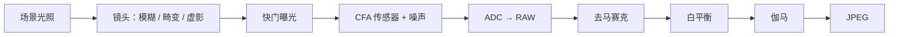
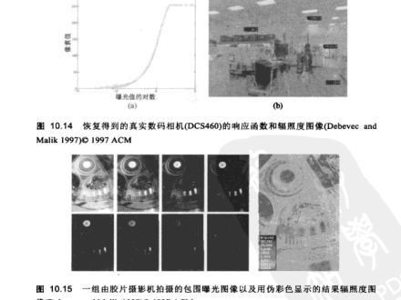
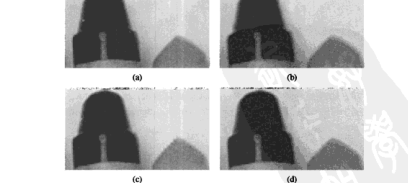
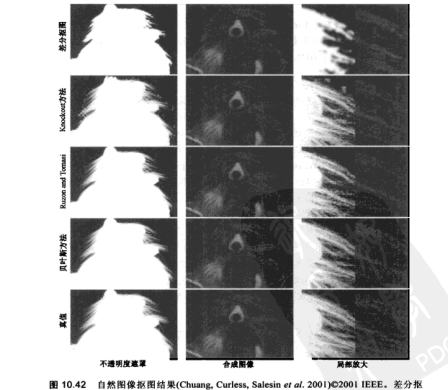

# 第10章 计算摄影学

来源：Szeliski《计算机视觉——算法与应用》中文第一版第10章；书页 359–408 / PDF 373–422。未越界第11章（书页 409 / PDF 423 起）。

## 本章总览

第9章讲的是把多张重叠照片拼成更宽视野。本章把同一思路推到**成像链路本身**：用多幅图、精细标定和全局优化，做出单次快门做不到的照片。书把这类工作统称计算摄影学(computational photography)。

流水线按五个问题展开。先标定摄像机怎样把入射光变成像素（10.1）：辐射度响应函数(CRF)、噪声水平函数(NLF)、虚影(vignetting)、点扩散函数(PSF)。再把不同曝光合成高动态范围辐照度图，并压回显示器（10.2）；其中 10.2.2 正文标题是「闪影术」，内容是闪光/非闪光融合。然后用多帧或先验做超分辨率与去模糊，并把 Bayer 马赛克插成全彩（10.3）。接着把前景连同半透明边界抠出来再贴到新背景（10.4）。最后用样例纹理补洞、修图，以及非真实感绘制（10.5）。

几何三维、立体对应和光场不在本章。学完应能分清：JPEG 8 位已经过伽马，不能当线性亮度；包围曝光要先估 CRF 再在辐照度域融合，而不是直接平均像素；去马赛克的拉链/假彩色和普通模糊不是一回事；硬分割的 0/1 遮罩不够贴毛发，必须估计连续 $\alpha$。

🔑 关键速记：计算摄影 = 标定成像链路 + 多图融合；算物理量要回到线性辐照度，不要在 JPEG 上假装在算光。

## 核心知识点

### 成像流水线与光度学标定

在把多幅图融合之前，要先弄清「到达镜头的光」怎样变成文件里的数。图 10.2 把链路拆成光学与电子两段：镜头引入模糊、径向畸变与虚影；快门决定曝光时间；传感器上有色彩滤波阵列(CFA)、增益、散粒噪声与读出噪声；模数转换后得到 RAW。后续数字信号处理器再做去马赛克、白平衡、伽马校正和 JPEG 压缩。

图注：对应原书图 10.2 的数字成像链路。物理量在 RAW 之前近似线性；JPEG 之后已经过去马赛克、白平衡和伽马，不能直接当辐照度。

本章标定只关心三个映射：辐射度响应、空间渐晕、光学模糊。几何内参与径向畸变已在第6.3节。👉 针孔、Bayer 排列与伽马压缩见第2.3节；双边滤波见第3.3节。

#### 辐射度响应函数

到达镜头的光最终有多少被存成数值，由光圈、快门、模拟增益、ADC 以及后续伽马共同决定。RAW 若支持，传感器输出在忽略噪声时近似线性；JPEG 则已经过 DSP 的非线性。直接对整条链路建模很难，实用做法是标定「入射辐照度 $E$ ↔ 像素值 $z$」这条曲线，即辐射度响应函数(camera radiometric response function, CRF)。

最准也最贵的是积分球：内壁均匀漫反射，已知光源从小球孔打进去，镜头对着球体。更常见的是 Macbeth / Munsell 色卡，或把摄像机架在三脚架上拍同一场景的一组不同曝光。Mann 与 Picard(1995)、Debevec 与 Malik(1997)、Mitsunaga 与 Nayar(1999)走的就是多曝光路线，细节在 10.2 节。只有一张照片时，可退回 ICC 配置文件，或对 RAW 假设线性、对 JPEG 假设每通道幂次 $\gamma=2.2$。

#### 噪声水平函数

除了响应曲线，还要知道特定 ISO / 增益下噪声有多大。最简单模型是与像素无关的加性标准差。更准的是噪声水平函数(noise level function, NLF)：把标准差写成亮度的函数。Liu、Szeliski 与 Kang(2008)从单张彩图估计 NLF：把图切成平滑块，每块拟合常数或线性，再对带噪声像素与平滑拟合的差求空间标准差，分通道画出色阶–标准差曲线，最后对外点包一层上包络。也可以对上包络再套低维函数（如 B 样条）。Matsushita 与 Lin(2007)则同时估响应曲线和水平依赖的噪声分布倾斜。

#### 虚影

大光圈、广角镜头常见边角变暗，即虚影。来源可以是自然 $\cos^{4}\alpha$、光学或机械挡光。最干净的标定是积分球或拍一张均匀被照的白墙。也可以拼全景并假设每像素的真光照来自各帧中心。Goldman(2011)同时估虚影、曝光和 CRF；若只做梯度域混合而不补虚影，中心亮、四周暗仍会留下。单张输入时，可在径向寻找缓慢一致的亮度变化：Zheng、Lin 与 Kang(2006)先分割成变化平滑的区域再逐区分析；Zheng、Yu、Kang 等(2008)则用径向梯度分布的不对称性（远离中心的梯度均值有偏）。习题 10.3 给出常用多项式 $f(r)=1+\alpha_1 r+\alpha_2 r^2+\cdots$。

#### 光学模糊 / 点扩散函数

空间响应由点扩散函数(PSF)或光学传递函数(OTF)刻画，形状取决于光圈、镜头像差、径向畸变和反走样滤波。理论上无限多点光源就能取样 PSF，实际做不到。更实用的是拍稍稍倾斜的直边或棋盘：沿边的一维线扩散函数(LSF)可换成调制传递函数(MTF)。Joshi、Szeliski 与 Kriegman(2008)用各向都有均匀边的标定图案，先找角点，把已知解析图案拟合到图像中心并估亮度，再在超像素分辨率上解

$$
K=\arg\min\lVert B-D(I*K)\rVert^{2}
\tag{10.1}
$$

$B$ 是模糊观察，$I$ 是已知锐利图案，$D$ 是下采样。未知标定图时，可检测细长边、在邻域拟合理想阶跃，再用同样最小二乘估局部核。PSF 中心偏移还能揭示色差：不同通道的核心不重合。估计应在感知的线性像素上做；JPEG 须先对亮度线性化。

🔑 关键速记：CRF 把像素还原成光，NLF 告诉噪声随亮度怎么长，虚影管边角变暗，PSF 管「点被抹成多大一块」。

### 高动态范围成像

室内窗边常见窗外过曝、室内欠曝。自然界辐照度可跨 $1$ 到 $2\times 10^{6}$ 以上，远超单次曝光的传感器。自动包围曝光(AEB)一次拍一组不同快门的图，就是制作 HDR 的原料。

不要直接把不同曝光的像素平均：对比会反转，高光会糊。书给出三步：

1. 从配准好的多曝光估计辐射度响应函数。
2. 按曝光选择或加权混合像素，得到辐照度图(radiance map)。
3. 把 HDR 色调映射回显示器色域。

#### Debevec–Malik 标定

记第 $i$ 个像素在第 $j$ 张图上的值为 $z_{ij}$，曝光时间为 $t_j$，未知辐照度为 $E_i$，响应为 $f$：

$$
z_{ij}=f(E_i t_j)
\tag{10.3}
$$

取逆并取对数（以 2 为底时单位是 EV）：

$$
g(z_{ij})=\log f^{-1}(z_{ij})=\log E_i+\log t_j
\tag{10.5}
$$

$g$ 把 8 位的 256 个色阶映射成对数辐照度，要和所有 $E_i$ 一起求。Debevec 与 Malik(1997)假设 $t_j$ 已知（常从 EXIF 读，实际是按 2 的幂：1、1/2、1/4、…），并加二阶平滑

$$
\lambda\sum_k g''(k)^{2}=\lambda\sum_k[g(k-1)-2g(k)+g(k+1)]^{2}
\tag{10.6}
$$

中段像素更可信，两端接近饱和时用帽子权重 $w(z)$ 衰减到 0。合成最小二乘为

$$
E=\sum_i\sum_j w(z_{ij})[g(z_{ij})-\log E_i-\log t_j]^{2}+\lambda\sum_k w(k)[g''(k)]^{2}
\tag{10.8}
$$

响应曲线中部可固定以消掉全局偏移。Mann 与 Picard 用三参数 $f(E)=\alpha+\beta E^{\gamma}$（10.9）；Mitsunaga 与 Nayar 用不超过 10 次的多项式刻画 $g$ 的逆；Pal、Szeliski、Uyttendaele 等(2004)为每张图各估一条响应，以跟踪自动对比度。

#### 合成辐照度图

响应已知且图像无噪声时，非饱和像素可直接 $E=g(z)$。实际有噪声，尤其是暗部光子少。Mann 与 Picard 用响应导数作权重，避开曲线平坦段；Debevec 与 Malik 用帽子函数；Mitsunaga 与 Nayar 强调信噪比，取 $w(z)=g(z)/g'(z)$（10.10）。最终

$$
\log E_i=\frac{\sum_j w(z_{ij})[g(z_{ij})-\log t_j]}{\sum_j w(z_{ij})}
\tag{10.11}
$$

手持拍摄还有位移和运动物体。Kang、Uyttendaele、Winder 等(2003)把全局参数配准和局部光流一起用；曝光差大时，必须先检查运动一致性，否则出现鬼影和碎片。摄像机一边摇一边改曝光时，可先做一致拼图，再按位置挑选欠曝/过曝区域的辐照度（Eden、Uyttendaele 与 Szeliski 2006）。部分相机（如书中列举的 Sony α550、Pentax K-7）已把多曝光融合做进机内。

HDR 存储：不考虑体积时，每通道 32 位 IEEE 浮点最直接。常用格式包括 Portable PixMap 扩成的 Portable FloatMap(.pfm)、辐射亮度格式(.pic/.hdr，8 位尾数 + 公共指数)、OpenEXR（每通道 16 位浮点）。

👉 多图几何配准与选缝见第9章；光流与参数运动见第8章。本章假定图像已经对齐，只处理曝光。

#### 色调映射

辐照度图动态范围可达数千比一，显示器常只有 8 位。全局方法用一条公共曲线压缩，例如先把图像拆成亮度 $L$ 和色彩，只对 $L$ 做映射再乘回色度，避免各通道独立伽马造成偏色。对比变化剧烈时，全局曲线仍保不住局部反差，需要类似暗房「遮挡 / 加光」(dodging/burning) 的局部方法。

Durand 与 Dorsey(2002)把对数亮度

$$
H(x,y)=\log L(x,y)
\tag{10.12}
$$

分成低频基底 $H_{\mathrm{L}}=B*H$ 和细节 $H_{\mathrm{H}}=H-H_{\mathrm{L}}$，只压缩基底（乘 $s$），再加回细节。线性低通会在强边产生光晕(halo)；把 $B$ 换成双边滤波后，边缘不被抹平，光晕明显减轻。Fattal、Lischinski 与 Werman(2002)则压缩对数亮度的梯度：$\mathbf{H}'=\nabla H$，再乘空间变化的衰减 $\Phi$，最后解泊松问题 $\min\int\lVert\nabla I-\mathbf{G}\rVert^{2}$ 还原。指数 $s\in[0.4,0.6]$ 用来把压缩后的亮度配回彩色。Reinhard、Stark、Shirley 等(2002)用局部尺度选择算子模仿遮挡/加光。Lischinski、Farbman、Uyttendaele 等(2006b)让用户在稀疏笔画上指定曝光，再解带梯度加权的最小二乘得到分段平滑的调整图。

#### 应用：闪影术

目录 10.2.2 写作「闪影术」，正文就是把闪光图 $F$ 和非闪光环境光图 $A$ 合成一张：既有环境光的自然色彩，又有闪光的低噪声和锐细节。非闪光为了够亮往往高 ISO、长快门，噪声大、易糊；闪光色彩不自然、有硬阴影和高光，但边更可靠。

Petschnigg、Agrawala、Hoppe 等(2004)用联合双边滤波：空间邻域在 $F$ 上找（边准、噪声低），值域权重却用来平滑 $A$。得到去噪环境图 $A^{\mathrm{NR}}$ 后，从闪光计算细节层

$$
F^{\mathrm{Detail}}=\frac{F+\varepsilon}{F^{\mathrm{Base}}+\varepsilon}
\tag{10.24}
$$

阴影/高光不可靠处用遮罩 $M$ 改回闪光基底，最终

$$
A^{\mathrm{Final}}=(1-M)A^{\mathrm{NR}}F^{\mathrm{Detail}}+M A^{\mathrm{Base}}
\tag{10.25}
$$

Eisemann 与 Durand(2004)走交叉双边滤波，思路相近。闪光对还可用于更可靠的前景抠图。

🔑 关键速记：HDR 三步 = 估 $g$ + 加权合成 $E$ + 色调映射；闪影术不是再做一套包围曝光，而是用闪光的边去给环境光图去噪并加细节。

### 超分辨率、去模糊和去马赛克

超分辨率通常指把若干幅配准后的低分辨率图合成一张更高分辨率、噪声更低的图。单幅超分则更依赖先验。它和去模糊共享同一个成像方程。把第 $k$ 张观察写成

$$
o_k(\mathbf{x})=D\{b(\mathbf{x})*s(\hat{\mathbf{h}}_k(\mathbf{x}))\}+n_k(\mathbf{x})
\tag{10.26}
$$

$s$ 是未知高分辨率图像，$\hat{\mathbf{h}}_k$ 是配准卷绕，$b$ 是模糊核，$D$ 是下采样。配准可来自特征（第6章）或参数运动（第8.2节）；更好的是把 $\hat{\mathbf{h}}_k$ 和 $s$ 放进同一个最小二乘。写成矩阵

$$
\min_s\sum_k\lVert\mathbf{o}_k-DB_k W_k\mathbf{s}\rVert^{2}
\tag{10.28}
$$

这仍严重欠定。纯最小二乘（最大似然）会放大噪声。常见先验是对图像导数加惩罚，二次时就是 Tikhonov / 薄膜正则；也可换成高斯马尔可夫随机场，或更重尾的 Huber、Hyper-Laplacian。GMRF 容易出波纹。基于样例的方法从训练图像学高频细节（Freeman、Jones 与 Pasztor 2002），可与稀疏导数先验合用。Baker 与 Kanade(2002)的「幻生」(hallucination)识别训练集中对应高分辨率块，对人脸等类别特别有效；输入若一开始就很糊，超分只能减糊，不能无中生有。

盲去卷积还要同时估 $b$。编码孔径(coded aperture)试图一次曝光里兼得深度和去模糊。运动模糊可用高速短曝光序列，或从光流估计核。

👉 维纳滤波与图像形成方程见第3.4节；正则 $\mathcal{E}_d+\lambda\mathcal{E}_s$ 见第3.7节。立体几何和场景流不在本章。

#### 彩色图像去马赛克

日常数码相机并不在每像素记录完整 RGB，而是在 CFA 上稀疏取样。最常见的 Bayer 样式：$2\times 2$ 里绿占两格、红蓝各一格。去马赛克(demosaicing)就是从这套马赛克恢复每像素三通道。

普通超分里猜错未知像素，主要是模糊或走样；去马赛克猜错则常出现假彩色和高频拉链(zippering)，在边缘尤其明显。双线性插值几乎总会拉链。多数算法先相信采样更密的绿色通道，用绿边或梯度去指导红、蓝。彩色边缘还可用互补色通道的中值滤波来压。Bennett、Uyttendaele、Zitnick 等(2006)在 $5\times 5$ 窗里估两种局部主导色，再把贝叶斯推断收到这两条色线上，从而减轻光晕。同一套局部色线模型也可一次完成去马赛克加超分，即用多帧 CFA 融合成高质量全彩。

#### 应用：彩色化

给灰度图上色严格说不是超分，但是同一类插值。用户在几笔上指定颜色，系统把色度沿着相似亮度传播。Levin、Lischinski 与 Weiss(2004)用的局部仿射色线模型和后来的闭式抠图是同一套加权最小二乘，也启发了 10.2.1 的局部色调映射。

🔑 关键速记：超分是解「下采样 ∘ 模糊 ∘ 运动」的逆；Bayer 去马赛克是它的 CFA 特例，错了先出拉链和假彩色，不是普通糊。

### 图像抠图和合成

抠图(matting)把前景从原图分离；合成(compositing)再把它放到新背景上。覆盖方程与第3章相同：

$$
C=(1-\alpha)B+\alpha F
\tag{10.30}
$$

已知的是合成色 $C$，未知的是前景 $F$、背景 $B$ 和透明度 $\alpha$，每个像素 3+3+1=7 个未知、只有 3 个测量，所以必须加约束。蛇、智能剪刀和 GrabCut 给出的是硬边界或混合像素标号，抓不住毛发那种半透明。

下面表格对比本章几类抠图。没有一种能在「未知自然背景 + 毛发 + 用户只画几笔」上同时做到又快又准。

| 名称 | 功能 | 主要参数 | 约束&坑点 |
| --- | --- | --- | --- |
| 蓝屏 / Mishima | 已知单色背景上估 $\alpha$ | 背景色分布、距离 | 蓝溢出让半透明发蓝 |
| 三角剖分 | 多个已知 $B$ 解 $\alpha F$ | 须 $B=0$ 的黑背景或多种 $B$ | 摄像机或物体一动就失效 |
| 差分 / 垃圾遮罩 | 已知但不规则的静背景 | 背景板、阈值 | 只适合锁定机位 |
| Knockout / Bayesian | 从 trimap 推未知区 | 邻域颜色统计 | 复杂背景或 trimap 粗则差 |
| Poisson | 假设 $\nabla\alpha$ 跟 $\nabla C$ | trimap 内 $F,B$ 已知 | 光滑边界好，细头发差 |
| 闭式 Laplacian | 局部色线 + $\boldsymbol{\alpha}^{T}L\boldsymbol{\alpha}$ | 窗口 $W_k$、正则 $\varepsilon$ | 用户可只给稀疏笔画 |

#### 蓝屏、三角剖分和差分

蓝屏抠图在单一颜色幕前拍演员。Smith 与 Blinn(1996)综述了多种专利算法。Chuang、Curless、Salesin 等(2001)的 Mishima 算法拟合背景色多面体，再按前景样本色到这些面的相对距离估 $\alpha$；半透明处容易蓝溢出(blue spill)。三角剖分抠图用两个已知背景：若其中一个为黑 $B=0$，则 $C=\alpha F$，约束更强。差分抠图适合背景已知但不规则的静场，常先用垃圾遮罩去掉无关前景。

📝待补全：三角剖分在两摄像机独立处理时，运动物体会对不齐；用立体摄像机对可以明显改善。中文版第11.6.2 节标题是「由轮廓到形状」，讲的是视觉外壳 / 八叉树，**不是**三角剖分抠图。立体对应本身见第11.1–11.5节（极线、DSI、分割式立体还能在深度边界出分数透明度，方便 z-键控换背景）。本章只强调「多个已知 $B$ 能解 $\alpha$」；立体辅助抠图在本版没有单列成节。

👉 完整深度讲解见第11章。

#### 自然图像抠图

最一般的情况是前、背景都未知，用户只给一张三值图(trimap)：确定前景、确定背景、未知带。Knockout 对未知像素在颜色空间找最近的前/背景簇，把 $C$ 往 $F$–$B$ 连线上投，再用各通道加权平均得 $\alpha$；背景有多种主色时会失败。Ruzon 与 Tomasi(2000)把局部颜色建成非中心的高斯混合，再按条带推进。Chuang 等用 $3\times 3$ 颜色协方差建高斯混合，并以贝叶斯 MAP 同时估 $F,B,\alpha$：

$$
L(F,B,\alpha\mid C)=L(C\mid F,B,\alpha)+L(F)+L(B)+L(\alpha)
\tag{10.33}
$$

数据项是 $C$ 相对 $\alpha F+(1-\alpha)B$ 的高斯噪声（10.34）；$L(F)$ 来自前景样本聚类后的加权均值与协方差（10.35）。复杂背景或 trimap 很粗时，Bayesian 仍不如后来的全局优化。

#### 基于优化的抠图

另一条路是让相邻 $\alpha$ 相关，求全局最优遮罩。边界抠图先把 GrabCut 的硬边界膨胀成带，再沿法向估亚像素位置和模糊宽度，适合脸部等光滑轮廓，细头发仍然吃力。

Poisson 抠图(Sun、Jia、Tang 等 2004)假定 trimap 里每个像素的 $F,B$ 已知，并令

$$
\nabla\alpha=\frac{\nabla C}{\lVert F-B\rVert^{2}}
\tag{10.36}
$$

即不透明度的变化跟着图像梯度走。求解又回到第3.7节和第9.3.4节的泊松方程。

Levin、Lischinski 与 Weiss(2008)不再先估每像素 $F,B$，只假设局部窗口里颜色落在一条色线上：$\alpha_i=\mathbf{a}_k\cdot\mathbf{C}_i+b_k$。对所有重叠窗口堆起来，消掉 $\mathbf{a}_k,b_k$ 后得到闭式二次能量 $E=\boldsymbol{\alpha}^{T}L\boldsymbol{\alpha}$，$L$ 称为抠图拉普拉斯(matting Laplacian)：

$$
L_{ij}=\sum_{k\mid(i,j)\in W_k}\Bigl(\delta_{ij}-\frac{1}{M}\bigl(1+(\mathbf{C}_i-\boldsymbol{\mu}_k)^{T}\hat{\Sigma}_k^{-1}(\mathbf{C}_j-\boldsymbol{\mu}_k)\bigr)\Bigr)
\tag{10.40}
$$

$M=\lvert W_k\rvert$，$\boldsymbol{\mu}_k,\hat{\Sigma}_k$ 是窗内颜色均值与协方差（加 $\varepsilon/M$ 的正则）。颜色相近的像素亲和度高，因而倾向于共享 $\alpha$。笔画约束 $\alpha\in\{0,1\}$ 之后，这就是稀疏线性系统。同一套 $L$ 和随机游走、薄膜正则是亲戚。得到 $\alpha$ 后再解 $F,B$ 的一阶平滑（10.41）。Wang 与 Cohen(2007a)对当时一批优化方法做了对比；稀疏笔画往往就够，不必画完整 trimap。

👉 GrabCut 硬分割见第5.5节；智能剪刀见第5.1.3节；泊松融合见第9.3.4节。本章要的是连续 $\alpha$，不是物体内部为 1、外部为 0 的标号。

#### 烟、阴影、闪抠图和视频

半透明介质（烟）可把每个像素写成未知背景色与恒定前景（烟）的线性组合，在颜色空间投到色线上估 $\alpha$。阴影抠图假设像素只在全亮和全暗两个颜色之间变，用鲁棒的最大/最小估分数遮罩，并可按几何把阴影重新投影。闪光/非闪光对能标出亮度变化大的区域，从而得到更稳的前景遮罩。环境抠图拍摄带折射的物体，把复杂背景「吸」进前景。

📝待补全：环境影像形板把每个像素写成对背景的积分 $I_i=R_i\int A_i(x)B(x)\,\mathrm{d}x$，支撑 $A_i$ 可用一组二维高斯；采集时用周期条带或高斯条扫背景，估出参数后再换新 $B(x)$ 合成。它记的是折射路径，不是一张 $\alpha$。动态液体要用分级彩色背景。完整流程见第13.4节。本章只点到「折射物体 + 模式化背景」。

👉 完整深度讲解见第13章。

视频抠图可把单帧算法逐帧用，但运动物体容易闪。Chuang、Agarwala、Curless 等(2002)先用保守的垃圾遮罩抠前景，再把背景板配准成干净背景，并用光流把关键帧 trimap 传到中间帧。转描(rotoscoping)则在视频里跟手绘曲线。

🔑 关键速记：合成容易、抠图难，因为 $C=(1-\alpha)B+\alpha F$ 永远欠定；自然图靠 trimap 或笔画，闭式 Laplacian 把「局部同色线」写成一张稀疏 $L$。

### 纹理分析与合成

给定一小块纹理样本，生成大片外观相似的图，就是纹理合成。早期方法匹配频谱或滤波响应直方图，容易留下结构性噪声。Efros 与 Leung(1999)改为在样本里找与已合成邻域最像的像素，按相似度加权随机取样，可从外向内填洞（「剥洋葱」）。Wei 与 Levoy(2000)加由粗到精；Efros 与 Freeman(2001)一次贴一小块而不是一个像素，重叠区用动态规划选缝，称为图像绗缝(image quilting)。Komodakis 与 Tziritas(2007b)把它写成 MRF，用优先级置信度传播加速。

#### 应用：空洞填充与修图

从照片去掉物体或划痕后要填空洞，即修图(inpainting)。沿等照度线做各向异性扩散能补平滑区域，但不能在缺失处造出纹理。Criminisi、Pérez 与 Toyama(2004)用基于样例的合成，并按边界梯度强度决定填充顺序，让结构先走。有大型图像库时，也可以直接借一整块相容区域再泊松混合。

📝待补全：Hays 与 Efros(2007) 用 gist 在约两百万张图里找相似场景，图割贴块再用泊松融合，这叫场景补全，见第14.4.4节。Photo Clip Art 则先检出可粘贴物体。没有检索时仍退回本章的单张样本合成。本章给出的是同一张图上的像素 / 块合成。

👉 完整深度讲解见第14章。

#### 应用：非真实感绘制

基于样例的合成还能做纹理转移和图像模拟，都属于非真实感绘制(NPR)。纹理转移在匹配邻域时同时看源纹理和参考图的亮度，让砖墙「长」到人脸的明暗上。图像模拟(image analogies)给定一对 $A,A'$（处理前/后）和目标 $B$，生成 $B'$，使 $A:A'::B:B'$；系统不必知道「油画」算法，只要有一张样例。Hertzmann、Jacobs、Oliver 等(2001)在高斯金字塔里找邻域。也可用传统滤波：Winkenbach 与 Salesin(1994)的钢笔画、Litwinowicz(1997)的印象派笔触、DeCarlo 与 Santella(2002)以及 Farbman、Fattal、Lischinski 等(2008)的照片抽象，都结合保边平滑（第3.3节）和边缘检测与增强（第4.2.3节）。均值移位得到的平滑色块，也常直接当卡通色。

🔑 关键速记：纹理合成是「在样本里抄最像的邻域」；修图是合成加上填充顺序；NPR 是把同一套匹配用到风格样例或显著边上。

## 易混淆点&差异对比

### RAW / 线性辐照度 vs JPEG 8 位

RAW 在忽略噪声时近似线性，适合估 CRF、PSF、去马赛克和 HDR。JPEG 已经过 CFA 插值、白平衡、伽马和量化。在 JPEG 上当线性亮度做加权平均，暗部噪声模型和饱和段都会错。能拍 RAW 就在 RAW 上标定；只有 JPEG 时，先按 $\gamma\approx 2.2$ 线性化，并承认这只是近似。

### 直接混合曝光 vs 辐照度域 HDR

把亮图、暗图像素直接平均，高光和阴影的对比会反转。正确顺序是先估 $g$，把每张图映到 $\log E$，用 $w(z)$ 丢掉饱和与噪声大的样本，再色调映射。色调映射是显示问题，不是又做一次曝光融合：全局曲线保不住局部反差，局部方法（双边基底、梯度衰减）才处理光晕。

### 闪影术 vs 包围曝光

包围曝光改的是快门，合成的是同一照明下的动态范围。闪影术是同一快门附近的两张图，照明却不同：一张环境光、一张闪光。它借用闪光的可靠边缘给环境光去噪，不是把两张曝光叠成 HDR。

### 双线性去马赛克 vs 边缘 / 色线先验

Bayer 不是「分辨率不够的普通超分」。绿通道更密，应主导边的方向；红蓝跟着走。双线性不管边，拉链和假彩色几乎必然出现。局部二色模型把像素收到两条色线上，才能压光晕。

### 硬分割 vs $\alpha$ 抠图

GrabCut、图割、智能剪刀给出的是物体标号，边界上要么切得太硬，要么把半透明当成混合像素。抠图要的是连续 $\alpha$ 和未被背景污染的 $F$。蓝屏是 $B$ 已知；自然图 $B$ 也未知，必须 trimap 或笔画。Poisson 抠图假设 $F,B$ 已知且 $\alpha$ 跟着梯度；闭式 Laplacian 只假设局部色线，用户更省事。

### 像素纹理合成 vs 块绗缝 vs 扩散修图

扩散 / 等照度线只能补平滑；结构纹理要到样本里抄。逐像素邻域匹配慢、易「下雨」；一次贴块并在重叠区选缝更稳。填充顺序很关键：让强边先长进空洞，否则纹理会把物体轮廓冲掉。

🔑 关键速记：线性域里融合，JPEG 上显示；HDR 管动态范围，闪影术管两种光；去马赛克管 CFA 拉链，$\alpha$ 管半透明，不是同一类「把图弄清楚」。

## 本章要点总结

- 计算摄影学接在拼接之后，处理光度标定、HDR、超分/去模糊/去马赛克、抠图和纹理/NPR。不重建三维几何。
- 成像链路：镜头（模糊、畸变、虚影）→ 曝光 → CFA 传感器 → RAW → 去马赛克 / 白平衡 / 伽马 / JPEG。物理计算尽量在线性域。
- CRF 用多曝光或色卡标定；NLF 描述噪声随亮度变化；虚影可径向建模；PSF 用倾斜边或标定图案估，并能带出色差。
- HDR：Debevec–Malik 同时估 $g$ 和 $\log E$，帽子权重避开饱和；手持要配准加去鬼影；显示用全局曲线或局部（双边 / 梯度域）色调映射。
- 10.2.2「闪影术」= 闪光/非闪光融合：联合双边滤波用闪光的边去噪环境光，再乘闪光细节层。
- 超分与去模糊共享 $o=D(b*s\circ h)+n$；必须加导数或样例先验。Bayer 去马赛克是 CFA 上的超分，绿通道主导，防拉链和假彩色。
- 抠图方程 $C=(1-\alpha)B+\alpha F$ 欠定。蓝屏 / 三角 / 差分约束 $B$；自然图用 trimap 或笔画；闭式 Laplacian 把局部色线写成 $\boldsymbol{\alpha}^{T}L\boldsymbol{\alpha}$。
- 纹理合成从样本抄邻域或图块；修图要结构优先的填充顺序；NPR 用样例类比或保边平滑 + 显著边。

🔑 关键速记：先标定再融合，先线性再显示；HDR 出辐照度，色调映射才出 8 位图；$\alpha$ 不是硬遮罩，Bayer 不是普通插值。
