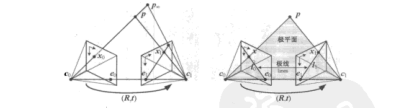
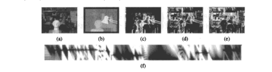
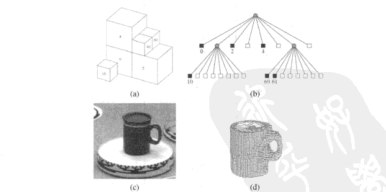

# 第11章 立体视觉对应

来源：Szeliski《计算机视觉——算法与应用》中文第一版第11章；书页 409–442 / PDF 423–456。未越界第12章（书页 443 / PDF 457 起）。

## 本章总览

第6、7章已经能从稀疏对应里把相机姿态和场景点算出来。本章假定**摄像机已知**（或已经由 SfM 标定好），任务变成：在两幅或多幅图之间找出稠密对应，并把对应换成深度 / 视差，必要时再融成完整三维物体。

书把这件事叫立体视觉对应(stereo correspondence)。和未矫正的二维光流不同，静态场景加已知几何之后，搜索可以从平面上的二维收成沿极线的一维。标准矫正几何下，视差 $d$ 和深度 $Z$ 成反比。多数算法先建视差空间图像(disparity space image, DSI)，再在局部窗口或全局能量上选每个像素的 $d$。

本章按这条链展开：极线与矫正（11.1）→ 稀疏轮廓对应（11.2）→ 稠密四步流水线（11.3）→ 局部窗口（11.4）→ 全局优化（11.5）→ 多视立体与由轮廓到形状（11.6）。深度图怎样并成带纹理的完整模型，留给第12章；新视角怎么画，留给第13章。

学完应能分清：极线几何是约束不是匹配；平面扫描是任意相机的重采样，不是只能左右并排；局部 WTA 和全局 $E_d+\lambda E_s$ 差在要不要邻像素互相管；11.6.2 在本版是由轮廓到形状，不是抠图。

🔑 关键速记：相机已知之后，对应沿极线搜；输出多半是视差图，完整网格和绘制在后两章。

## 核心知识点

### 极线几何学与矫正

给定一幅图上的像素，另一幅图里对应点只能落在极线(epipolar line)上。第一幅的观察射线投到第二幅，得到极线片段：一端是无穷远，一端是第一个光心在第二幅上的投影，也就是极点(epipole)。两幅像平面与两个光心、空间点 $p$ 所张的极平面交出一对极线。

极线几何本身由第7章的本质矩阵 / 基本矩阵给出。👉 $\mathbf{E}=[\mathbf{t}]_{\times}\mathbf{R}$、$\mathbf{F}=\mathbf{K}^{-\mathrm{T}}\mathbf{E}\mathbf{K}^{-1}$ 与八点法见第7.2节。本章用它来限制匹配，不再重推 $\mathbf{F}$。

#### 矫正

更省事的做法是先把两幅图卷绕成标准矫正几何(standard rectified geometry)：对应极线变成同一条水平扫描线。Loop 与 Zhang(1999)一类多阶段流程大致是：先转摄像机使光轴垂直于基线，再绕光轴扭到极线水平，最后缩放平移让像素对齐。任意多相机不能保证同时矫正，除非光心共线。

矫正之后

$$
d=f\frac{B}{Z},\qquad x'=x+d,\quad y'=y
\tag{11.1}--\text{(11.2)}
$$

$f$ 是像素焦距，$B$ 是基线，$Z$ 是深度。视差大就是离得近。任务收成估计视差图 $d(x,y)$。

🔑 关键速记：极线把搜索收成一维；矫正后再收成「同一行里左右平移 $d$」。

### 平面扫描与视差空间

矫正只是重采样的一种。更一般的是平面扫描(plane sweep)：在场景里铺一组平面，把各相机图像按单应投到同一虚拟视点上，比较影像一致性(photoconsistency)。这就是第2.1.5 节「平面加视差」在多图上的用法。

虚拟相机 $\tilde{\mathbf{P}}$ 的最后一行可改成任一扫描平面；空间点 $\mathbf{p}_k$ 经 $\tilde{\mathbf{P}}_k\tilde{\mathbf{P}}^{-1}$ 映到参考像素。对应单应随视差 $d$ 变成秩 4 的参数化 $\tilde{\mathbf{H}}_k(d)=\tilde{\mathbf{H}}_k+t_k[0\,0\,d]$（11.3）。每一层平面给出一张重采样图，叠起来就是推广的视差空间图像 $\tilde{I}(x,y,d,k)$。

对参考图 $I_r$ 的匹配代价常写成

$$
C(x,y,d)=\sum_k\rho\bigl(\tilde{I}(x,y,d,k)-I_r(x,y)\bigr)
\tag{11.4}
$$

$\rho$ 可以是平方、鲁棒范数、截断或 census。平面也可以换成柱面，尤其和全景结合时。

一旦有了 DSI，下一步是在 $(x,y,d)$ 里嵌入一个「好」的表面：低匹配代价、空间平滑。图 11.5 给出典型切片：正确深度处的像素偏暗；无纹理处会出现水平条纹。

图注：稠密立体的共用流水线。局部方法常把代价、聚集、WTA 连在一起；全局方法可以跳过聚集，直接优化 $E_d+\lambda E_s$。

📝待补全：平面扫描得到的多层深度，先用 ICP 在未知对应下对齐，再把各张图收成带符号距离、按可信度加权平均（VRIP），只在表面附近存体素；等值面用移动立方体抽出网格。也可以从有向点做泊松表面。完整融合见第12.2–12.5节。用这些深度做中间视图：按姿态把参考图像素卷到虚拟相机再混合，空洞来自遮挡；一层不够时用层次深度把被挡颜色也存上，见第13.1–13.2节。本章只把扫描当成对应的重采样。

👉 完整深度讲解见第12、13章。

🔑 关键速记：DSI 是 $(x,y,d)$ 上的代价体；平面扫描让未并排的相机也能往这个体里填数。

### 稀疏对应

早期立体先检兴趣点或边缘，再在另一幅里用块度量搜对应。今天仍有用处：只要高稳定性特征，或当稠密匹配的种子。匹配遮挡轮廓(occluding contour) / 轮廓曲线(profile curve)是另一类稀疏问题：轮廓随视角变，两视直接配会把形状配错；三视或更多可以在空间拟合密切圆(osculating circle)（11.5），再长成半稠密网格。轮廓适合无纹理、但前背景颜色差足够大的物体。后续表面插值见第12.3.1 节。

🔑 关键速记：稀疏立体配的是可重复特征或轮廓，不是每个像素；轮廓至少要三视才稳。

### 稠密对应：四步与相似性度量

Scharstein 与 Szeliski(2002)把稠密立体拆成四步：

1. 匹配代价计算
2. 代价（支持）聚集
3. 视差计算与优化
4. 视差求精

局部窗口算法通常隐含「窗口内视差光滑」，把 1、2、3 连在一起，最后 WTA。全局算法明确写平滑项，常常不做第 2 步，直接给每个像素一个视差（第 3 步），最小化含数据项的全局能量。两类之间还有由粗到精的分层搜索，在金字塔上限制细层的搜索范围。

下面表格对比常用匹配代价。没有一种能在「重复纹理、无纹理、曝光差、半透明」上同时最好。

| 名称 | 功能 | 主要参数 | 约束&坑点 |
| --- | --- | --- | --- |
| SSD / SAD | 亮度平方或绝对差 | 窗口大小 | 曝光一变就偏；无纹理处平坦 |
| 鲁棒 $\rho$ / 截断 | 限制错误匹配进窗口 | 截断阈值 | 阈值要跟噪声匹配 |
| NCC (8.11) | 去均值去方差的相关 | 窗口 | 对增益/偏差稳，纹理弱时仍糊 |
| 梯度 / 秩 / census | 对摄像机增益不敏感 | 窗口、比特串 | census 把邻域收成相对中心的比特 |
| 互信息 | 全局亮度映射 | 直方图 | 要迭代估映射，适合曝光差大的对 |

预处理可以先做互信息回归、直方图均衡或局部平滑补偿增益。Birchfield 与 Tomasi(1998)用线性插值后的最小差，减轻采样造成的「高梯度处像素对不齐」。

👉 偏差–增益模型与 NCC 公式见第8.1 节（公式 8.9、8.11，不是独立小节）。

🔑 关键速记：先选代价，再决定窗口里聚还是全局里优；SSD 好看图，NCC / census 更能扛曝光。

### 局部方法

局部方法在 DSI 的支持区域(support region)上对 $C(x,y,d)$ 求和或平均。支持区可以是固定视差上的二维窗（对应正对平面），也可以是 $(x,y,d)$ 里倾斜的三维窗。二维聚集就是盒式 / 高斯卷积，或可分离、固定/自适应大小、可移动窗口。

$$
C(x,y,d)=w(x,y,d)*C_0(x,y,d)
\tag{11.6}
$$

可移动窗口(shiftable window)试像素周围所有 $3\times 3$ 窗位置，取和最小的那个，深度跳变处比死盯中心窗干净（图 11.8）。也可以按颜色相似度加权（接近联合双边），或先分割再在连通块上聚。关键仍是两件事：算匹配代价，再在窗口里聚集。两步都做完后，每个像素独立选代价最小的视差，即赢家通吃(winner-take-all, WTA)。

#### 亚像素与不确定性

多数算法先在整数（或样条）视差上离散求，再对获胜视差附近做曲线拟合或 Lucas–Kanade 一次迭代，得到亚像素 $d$。无纹理处拟合不可靠。左右交叉检验(L/R check)可标遮挡：左右视差对不上就丢掉，再用中值或邻域填充。置信度可与深度一起输出。在光度标定和稠密采样假设下，局部深度估计的方差近似

$$
\mathrm{Var}(d)=\frac{\sigma_I^2}{a}
\tag{11.7}
$$

$a$ 是 DSI 在获胜处的曲率（窗口内水平梯度能量），$\sigma_I^2$ 是图像噪声，可用最小 SSD 估。👉 窗口 Hessian 与光流协方差见第8.1.3 节、附录 B.6。

#### 应用：头部跟踪

实时立体可跟头部姿态，比单靠肤色稳。得到的深度能改虚拟视点、做人头替换，或修正桌面会议里「摄像机在显示器顶上、人却像在看下面」的视线。完整三维头模和中间视图见第13.1 节。

🔑 关键速记：局部立体 = 窗口聚集 + WTA；跳变处换可移动窗，遮挡靠左右检查，亚像素靠曲线拟合。

### 全局优化

全局方法在视差计算阶段（有时跳过聚集）加平滑，写成能量最小化：

$$
E(d)=E_d(d)+\lambda E_s(d)
\tag{11.8}
$$

数据项把 DSI 加起来

$$
E_d(d)=\sum_{(x,y)}C\bigl(x,y,d(x,y)\bigr)
\tag{11.9}
$$

平滑项通常只看四邻的视差差

$$
E_s(d)=\sum_{(x,y)}\rho\bigl(d(x,y)-d(x+1,y)\bigr)+\rho\bigl(d(x,y)-d(x,y+1)\bigr)
\tag{11.10}
$$

$\rho$ 若是二次，边界会被抹平；改成鲁棒 $\rho$ 才能不连续保持(discontinuity-preserving)。也可以让平滑强度跟着亮度差走：边强的地方少罚视差跳变（11.11）。传统解法包括正则化、模拟退火、最高置信度优先；近年更多用最大流 / 图割，以及带环置信度传播。

📝待补全：全局立体能量是多标签 MRF。二值子模用 s-t 图割；多视差用 $\alpha$-扩张 / 交换，或环上 BP。链上 DP（11.5.1）是树上精确消去的特例，但强制序约束。TRW 可给能量下界。完整推断保证见附录 B.5。本章只写出 $E_d+\lambda E_s$。

👉 完整深度讲解见附录 B。

协作算法、由粗到精和增量卷绕是另一路：不必先写完整 $E$，但效果通常不如真正的全局能量。

#### 动态规划与扫描线优化

普通 2D 平滑下 (11.8) 是 NP-难的。沿一条扫描线做动态规划(dynamic programming, DP)则是多项式的。传统 DP 把左右扫描线之间的匹配看成最短路径，用遮挡代价 $O$ 允许水平/垂直走，禁止「对不准的对角」（11.12）（11.13）。它强制单调性 / 序约束：同一条线上的对应相对顺序不变，前景互相挡住时会失败。

扫描线优化丢掉序约束，只保留 (11.10) 的水平平滑，对每条扫描线独立递推

$$
D(x,y,d)=C(x,y,d)+\min_{d'}\bigl(D(x-1,y,d')+\rho_d(d-d')\bigr)
\tag{11.14}
$$

实现简单，但条纹伪影明显。半全局(semi-global)匹配从多个方向累加这类代价，常能兼顾速度和质量。DP / 扫描线单独都不是最精的，和认真设计的聚集合在一起仍然好用。

#### 基于分割的方法

先把参考图切成区域，再给每个区域一个视差（常是平面）。Tao、Sawhney 与 Kumar(2001)先分割，局部拟合，再在片段间加平滑。Zitnick 等把片段代价塞进视差空间分布(DSD)，用松弛或环状 BP 调整。Klaus、Sormann 与 Karner 用均值移位切图，再 $3\times 3$ SAD + 交叉检验，局部平面拟合后环状 BP——书中写到 2010 年初仍靠近评测前列。Wang 与 Zheng(2008)则在分割后做平面拟合与参数优化。分割的额外好处是：深度不连续处可以输出分数透明度，方便抠边界、做无缝虚物体。

📝待补全：均值移位本身只是联合域聚类，见第5.3.2 节。把它当立体对应单元，是 11.5.2 的用法：一块一个平面，再在块与块之间做 MRF。识别用区域分类仍见第14章。

👉 完整深度讲解见第5、14章。

#### 应用：z-键控与背景替换

z-键控(z-keying)用深度把前景行动者(actor)从背景抠走，换成计算机生成的图。早期靠贵的实时距离传感器；后来普通立体摄像机也能做桌面会议的背景替换（图 11.14）。深度边界要对齐物体轮廓，分割式立体在这里特别有用。

🔑 关键速记：全局立体写 $E_d+\lambda E_s$；DP 管一条线，图割 / BP 管整幅图，分割式给每块一个平面。

### 多视图立体视觉

两图能出深度，多图通常更好。把 (11.4) 写成多图相对参考图的差，就是多图 SSD（11.15）。也可用自适应基线：宽基线几何准、窄基线遮挡少。

检查对应的一个办法是极平面图像(epipolar plane image, EPI)：把矫正后的多帧沿扫描线叠成时空切片。深度不同的物体是斜率不同的条；半透明和镜面反射会留下能分开的条纹。运动立体(motion stereo)用摄像机边走边拍，时序选择窗口可避开遮挡（Kang、Szeliski 与 Chai 2001）。

同时估多个深度图，还能用跨视图一致性当硬约束。场景流(scene flow)则在一个时间点恢复物体 3D 形状和相邻帧之间每个表面点的完整 3D 运动，可同时支撑空间与时间插值。

📝待补全：固定一维相机运动时，光场的 $(u,v,s)$ 切片就是 EPI，直线斜率编码深度，绘制时对 4D $L(s,t,u,v)$ 重采样，见第13.3节。场景流是表面点的 3D 速度，多相机 3D 视频用它做层间时空插值：相邻源的前景/背景层当纹理三角形，接缝用 $\alpha$ 和 z 缓冲，见第13.5.4节。本章只把它当成多帧对应的可视化。

👉 完整深度讲解见第13章。

#### 体积与 3D 表面重建

多视立体的目标是从已知相机的图像集重建完整 3D 物体，而不只是一张视差图。Seitz、Curless、Diebel 等(2006)按场景表达、影像一致性、可见性、形状先验、重建算法和初始化六个点分类。常见表达：

- 体素(voxel)着色 / 空间雕刻：从头到尾扫平面，把一致体素标成物体，再从源图擦掉；环状相机看不见的背面要换子集再雕。
- 水平集 / 带符号距离：在连续表面上演化，细节比二值占位细。
- 多边形网格：图形学标准，便于可见性和遮挡。
- 多张深度图再合并：先各自估深度，再融成一个模型。

可见性既可从当前 3D 模型预测（几何可见性），也可只用邻域子集匹配（准几何），或靠鲁棒 $\rho$ 吃掉外点。无纹理处多数算法要光滑或极小曲面一类形状先验；深度图方法则常用传统的图像平滑性。体素着色在无噪声、真 Lambertian、扫描顺序正确时，可保证产生与所有图一致的 3D 模型；实际噪声下不能。初始化可以是视觉外壳，也可以很粗的体。深度图合并、泊松表面和点表示的细节在第12章。👉 完整表面与距离归并见第12.1–12.3 节。

Temple 等数据集和 Middlebury 多视评测（`vision.middlebury.edu/mview`）是当时定量比较的入口。

#### 11.6.2 由轮廓到形状

很多情况先做前景–背景分割，再把二值轮廓当成集合约束，或直接从轮廓重建。各视角轮廓锥的交集是视觉外形(visual hull)，也叫线外形(line hull)：它是相对视觉外壳最大的、沿轮廓射线的并。Laurentini(1994)用观察射线；Sinha 与 Pollefeys 可从轮廓或影子往里雕。

多边形近似每个轮廓，三维相交得到多面体，再用三角形网格精化。更常用的是八叉树(octree)：黑节点在内部、白在外部、灰是混合。Szeliski(1993)先把轮廓收成距离图上的最大内接正方形，再投影到八叉树判定内外，由粗到精求精。图 11.22 是转盘上咖啡杯的八叉树结果。

基于图像的视觉外形(image-based visual hull)不先建全局网格，而是对新视点把观察射线与各图二值轮廓求交，顺带把输入颜色贴回去，适合实时新视角。也可以和质量可变形模板合在一起跟全身运动。

本版 11.6.2 讲的是轮廓 → 视觉外壳 / 八叉树，**不是**三角剖分抠图。三角剖分抠图仍在第10.4 节：多个已知背景解 $\alpha$；立体相机能减轻物体一动就对不齐，但中文版第11章没有把「立体辅助抠图」单列成节。

🔑 关键速记：多视立体要的是完整物体，不是一张视差；体素、网格、多深度图是三条表达；轮廓只能给出外壳，凹洞要靠纹理一致性往里雕。

## 易混淆点&差异对比

### 极线几何 vs 立体匹配

第7章的 $\mathbf{F}$ 只告诉你「对应在哪条线上」，不告诉你线上哪一点对。立体匹配才在线上比亮度或描述子。没有极线约束的二维搜索是光流；有极线但不矫正，仍可沿倾斜线搜，只是实现麻烦。

### 矫正 vs 平面扫描

矫正把两幅图拧成水平扫描线，公式 $d=fB/Z$ 好看。平面扫描不要求相机并排：每一层平面产生一组单应，任意数目、任意朝向的相机都能往 DSI 里投票。全景或机器人导航里，扫描面甚至可以是柱面。

### 视差图 vs 完整 3D 模型

两视立体的主输出是一张（或一对）视差 / 深度图，遮挡处会烂。多视立体才追求闭合表面。深度图合并、泊松重建、点/体积表达在第12章；不要把 Middlebury 两视榜和多视物体重建当成同一个评测。

### 局部 WTA vs 全局能量 vs 分割平面

局部：窗口内视差常数，像素独立取最小代价。快，跳变和遮挡靠可移动窗、左右检查补。全局：邻像素的 $d$ 进 $E_s$，无纹理靠平滑填，边界靠鲁棒 $\rho$ 或亮度对齐。分割：一块一个平面，MRF 加在片段上，深度边界更贴物体边，还能出分数 $\alpha$。

### 场景流 vs 光流 vs 立体

光流是未矫正图像上的二维位移。立体是静态场景、已知相机下的一维视差。场景流是「形状 + 每个表面点的 3D 速度」，同一套相机既看空间也看时间。多帧花园序列上的运动立体仍假设场景刚或缓变，和一般场景流不是同一算法。

### 视觉外壳 vs 影像一致性重建

轮廓交集给出的是最大外壳，杯子把手里的洞、凹进去的嘴单靠剪影填不上。影像一致性（体素着色、水平集、多深度图）靠纹理往里雕，无纹理处又要退回光滑先验。初始化常用外壳，精化才用颜色。

🔑 关键速记：极线是约束，匹配才出对应；矫正是特例，平面扫描更一般；视差图不是网格，外壳不是真表面。

## 本章要点总结

- 立体对应假定相机已知。极线把搜索收成一维；矫正后 $d=fB/Z$，$x'=x+d$。
- 平面扫描用一组平面单应把任意相机重采样进 DSI；匹配代价 $C(x,y,d)$ 对多图 $\rho$ 求和。
- 稀疏路线配特征或轮廓；轮廓密切圆至少三视。稠密四步：代价、聚集、优化、求精。
- 局部：支持窗聚集 + WTA；可移动窗、census/NCC、亚像素拟合、左右检查、$\mathrm{Var}(d)=\sigma_I^2/a$。
- 全局：$E=E_d+\lambda E_s$。DP 有序约束；扫描线优化有条纹；半全局多方向累加；图割 / BP 见附录 B。分割式一块一平面，均值移位常当前置。
- 应用：头部跟踪、z-键控换背景。
- 多视：多图 SSD、EPI、时序选窗、场景流。表达含体素着色/空间雕刻、水平集、网格、多深度图合并。
- 11.6.2 由轮廓到形状：视觉外壳 + 八叉树 / 基于图像的外壳。不是三角剖分抠图。
- 深度融成完整模型和纹理 / BRDF 留第12章；新视图和光场留第13章。

🔑 关键速记：已知相机 → 沿极线填 DSI → 局部窗或全局能量出视差；多视才谈完整物体，轮廓只给外壳。
