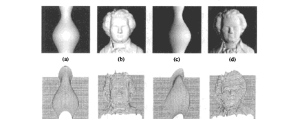
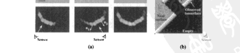
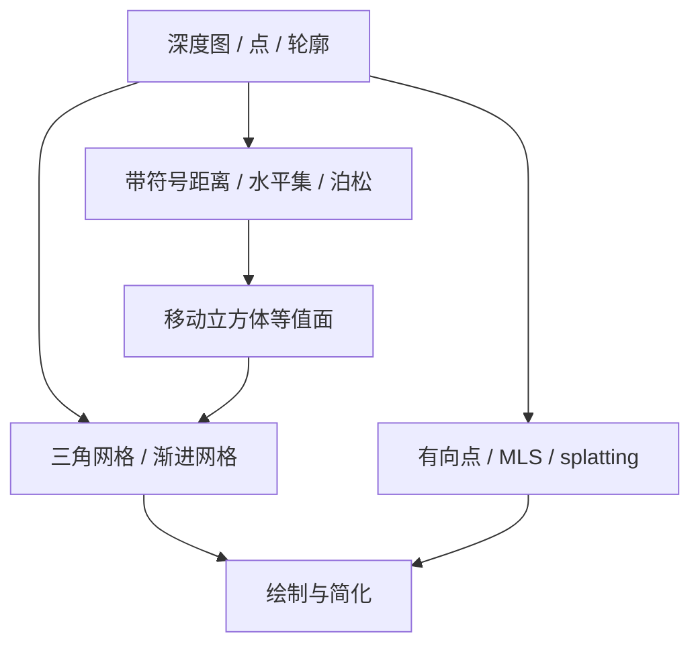
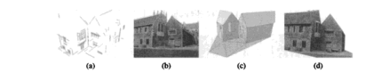

# 第12章 3D重建

来源：Szeliski《计算机视觉——算法与应用》中文第一版第12章；书页 443–476 / PDF 457–490。未越界第13章（书页 477 / PDF 491 起）。PDF 490 为章末空白。

## 本章总览

第11章把已知相机下的对应做成视差或深度图。本章回答下一步：怎样从阴影、纹理、聚焦、主动测距和已有深度图，得到**完整 3D 形状**，并在知道物体类别时换成更省事的参数模型，最后把纹理或 BRDF 贴回去。

书不重讲立体匹配。线索分成几路：由 X 到形状（明暗 / 光度立体、纹理、聚焦，12.1）；主动光带、结构光、飞行时间（12.2）；把多张距离图用 ICP 和带符号距离并起来；表面、点、体积三种表达（12.3–12.5）；建筑、头脸、人体这类基于模型的重建（12.6）；纹理映射与反射率（12.7）。新视角怎么画，仍留给第13章。

学完应能分清：光度立体解的是法向不是完整度量网格；ICP 在对应未知时迭代，不是第6章已配对的绝对定向；视觉外壳只给外轮廓，凹洞要靠距离或颜色往里填；建筑建模吃的是平面和消失点，不是稠密点云本身。

🔑 关键速记：立体给深度切片，本章把切片、阴影和主动测距收成可画的三维模型。

## 核心知识点

### 由 X 到形状

除双目视差外，阴影、纹理和聚焦也提供形状。这类工作统称由 X 到形状(Shape from X)。单幅图往往只能给出相对深度或法向场，要绝对尺度还得加光源、焦距或主动照明。

#### 由阴影到形状与光度测量立体视觉

光滑无阴影物体的亮度随法向与入射光夹角变，即第2.2.2 节的反射图。由图像亮度反推表面取向，叫由阴影到形状(shape from shading)。多数算法假设均匀反照率和反射率、已知光源方向，观察者在远处，把辐照度方程写成局部取向的函数

$$
I(x,y)=R\bigl(p(x,y),q(x,y)\bigr)
\tag{12.1}
$$

$(p,q)=(z_x,z_y)$ 是深度图的导数。朗伯表面

$$
R(p,q)=\max\Bigl(\rho\frac{pv_x+qv_y+v_z}{\sqrt{1+p^2+q^2}},0\Bigr)
\tag{12.2}
$$

每个像素两个未知 $(p,q)$，一个测量 $I$，必须加光滑性（12.3）或可积性 $p_y=q_x$（12.4）。也可以直接对深度 $z$ 做非线性最小二乘（Horn 1990），但容易陷进局部极小。真实表面很少只有一个反照率，所以常和立体或纹理合在一起。

更稳的路是换光源、相机不动，即光度测量立体视觉(photometric stereo)。每个光源 $k$ 一张图 $I_k$，朗伯下

$$
I_k=\rho\hat{\mathbf{n}}\cdot\mathbf{v}_k
\tag{12.5}
$$

三个或更多线性无关的 $\mathbf{v}_k$ 就能最小二乘恢复 $\rho\hat{\mathbf{n}}$，再正规化拟合成深度图。镜面反射要多于三个方向；物体内部互反射会在凹处看到额外的亮，是阴影的一个主要来源。

👉 朗伯 $[\mathbf{v}\cdot\mathbf{n}]^{+}$、Phong 与 BRDF 定义见第2.2节。

🔑 关键速记：一张图的明暗不够解法向，要光滑或可积；换几个已知灯，光度立体就能线性解 $\rho\mathbf{n}$。

#### 由纹理到形状与由聚焦到形状

规则纹理的透视收缩能透露局部法向：抽重复模式或局部频率，再估切变 / 缩放。曲面上的规则反射（高光流）也能反推 3D 点和法向。布料一类特殊印刷纹理会更容易。

物体离焦平面越远，散焦圈越大。由聚焦到形状(shape from focus / defocus)用两幅或更多不同焦距的图，找最锐利的深度，或比较两方向上的模糊增量。放大率随焦距变，简单梯度能量会受放大干扰，更好的是专门设计的多项式滤波器。Nayar、Watanabe 与 Noguchi(1996)用棱镜把同一光路分到两个 CCD，实时出高精度深度（图 12.4）。

🔑 关键速记：纹理看收缩，聚焦看哪一档最锐；两者都是单目线索，绝对尺度仍要标定。

### 主动距离获取与距离数据归并

主动照明能给无纹理表面造出可匹配的图案。激光或光带：相机从旁边看一条扫描光平面，光带变形即深度，光学三角测量把每个被照像素换成 3D（公式见 2.70、2.71）。精度取决于斜边(slant edge)标定。Bouguet 与 Perona(1999)用一根棍子在点光源前挥，阴影当「光带」。结构光可投二进制码或格雷码，一次编出整幅地址；也可以投棋盘、随机带。飞行时间(time of flight) / LIDAR 测的是光来回时间，不必三角。

还可以把已知图案投进被动立体：纹理一够，单相机加投影仪就等价于主动立体。动态场景要用时空窗，假设局部 3D 时空内深度近似恒定（Davis、Ramamoorthi 与 Rusinkiewicz 2003）。

#### 12.2.1 迭代最近点

多张距离图要先**注册**（未知 3D 对应下的绝对定向），再融成一张表面。最常用的是迭代最近点(iterative closest point, ICP)：在待注册的两个表面（常有部分重叠）上找最近点，解一次 3D 绝对定向，再迭代。对应未知，所以和第6章已配对点的 Procrustes 不是同一步。重叠区常有外点，要用鲁棒匹配。为加速最近点查询，可把其中一个点集收成带符号距离函数，或用八叉树。点上的颜色或法向也可当对应度量。

ICP 只给出局部最优。没有好的全局粗配准先验时，需要更不变的局部描述子或搜索。旋转图像(spin image)是绕法向的轴投影；飞溅(splash)是早期的法向邻域描述。

两张或更多已对齐的距离图，用体积距离图像处理(volumetric range image processing, VRIP)：每张图先变成带符号距离，再按可信度加权平均。只在表面附近存体素。等值面用移动立方体(marching cubes)抽出网格。

带符号距离或特征（内外）函数的体积归并，也便于从有向点集抽光滑表面，包括泊松表面重建。数字遗产（数字米开朗基罗、吴哥窟）是这类方法的大型应用：激光扫描 + 高分辨率照片，再配准碎片。

📝待补全：已知对应时的绝对定向（质心对齐 + SVD / 四元数）见第6.2 节。本章 ICP 是对应未知时的迭代外壳。泊松方程 $L\mathbf{x}=\mathbf{b}$ 是大型稀疏正定系统：规则网格用多重网格接近线性时间，不规则则代数多重网格或预处理共轭梯度；同一套也用于第9.3.4节泊松融合。分解与迭代的选择见附录 A.4–A.5。

👉 完整深度讲解见第6章、附录 A。

🔑 关键速记：主动光给无纹理造特征；多扫描先 ICP 对齐，再把带符号距离加权平均，等值面就是网格。

### 表面、点与体积表达

距离扫描并完之后，还要选怎么存这个形状。

#### 表面：插值、简化、几何图像

从稀疏 $\{(x_i,d_i)\}$ 重建高度场或参数曲面，可走第3.7 节的正则化，用有限元 / 网格，或径向基

$$
f(\mathbf{x})=\frac{\sum_i w_i(\mathbf{x})d_i}{\sum_i w_i(\mathbf{x})},\qquad w_i(\mathbf{x})=K(\lVert\mathbf{x}-\mathbf{x}_i\rVert)
\tag{12.6}--\text{(12.7)}
$$

要求精确插值时核在原点须奇异。三维弹性体可在体内加光滑、体外加数据拟合。三角形网格建好后，常用边折叠(edge collapse)做渐进网格(progressive mesh)，得到可调细节层次(LOD)的金字塔，类似第3.5 节图像金字塔。几何图像(geometry image)把不规则三角网格沿缝切开，展成正方形，存 $(x,y,z)$ 和法向，便于压缩。

#### 基于点的表达

可以丢掉三角形，只用有向点 / 粒子 / 表面元(surfels)。给粒子系统加成对弹簧近似薄板能量，或让影响函数耦合邻近点，演化时改拓扑和采样密度。渲染可用表面元扫描(splatting)，或先转成隐式带符号距离再抽等值面。移动最小二乘(MLS)用局部对最近带符号距离做加权拟合，能自适应采样密度。

#### 体积：隐式表面与水平集

第三种是 3D 体内外函数。第11.6 节的体素着色、空间雕刻、水平集已经用过离散版。连续隐式表面用指示函数 $F(\mathbf{x})$：体内 $<0$、体外 $>0$。超二次型是早期参数例子（12.8）。也可以在正规 3D 网格上存带符号距离，或用八叉树。水平集让网格上的值随表面演化，更新时可拟合多视光度一致性。泊松重建用紧密结合的体积函数，即经过平滑的 0/1 内外指示，梯度靠近有向点法向；低通核做成八叉树上的卷积 B 样条，可用泊松方程高效求解。$L_1$ 全变差可换成二次惩罚，以保持尖角。

图注：三种表达可以互转。体积适合融合多扫描和改拓扑；网格适合图形学绘制；点适合不规则采样。

🔑 关键速记：网格好画，点灵活，体积好融合；泊松把有向点变成光滑指示函数再抽等值面。

### 基于模型的重建

若事先知道对象是建筑、头或人体，可以用更强的参数模型，不必从零雕每一个体素。

#### 建筑结构

建筑物通常由大块平面构成，墙面常铅垂、互相垂直。Debevec、Taylor 与 Malik 的 Façade 系统：用户勾边，系统用强几何约束从少数对应恢复平面尺寸和相机，再局部平面扫描出偏移图(offset map)，绘制时按视角混合纹理。Shum、Han 与 Szeliski 先拼已标定全景，再画铅垂 / 水平线划分墙面。Werner 与 Zisserman(2002)自动检直线和消失点，标定后用表观和三视重建 3D 线段，再平面扫描生成共面假设，交线定墙角。

城市规模可把车载视频、GPS、平面扫描立体和物体分割合在一起（Pollefeys 等 UrbanScan；Cornelis 等）。也可以直接拼主动距离扫描，再曝光 / 光斑补偿。👉 消失点标定见第6.3.2 节；全景见第9章；三视线条见第7.5.1 节。

#### 头部、人脸与人体

人脸形状变化比外观小，几十个参数的低维非刚性模型往往够用。用户标定关键点后，可把通用头模拟合到一组照片，抽出纹理做成可动画模型。多张 3D 扫描上做 PCA，得到可变形 3D 模型，再拟合单幅图，用于表情跟踪、人脸转脸、去识别。空间参数可关联到性别、表情、体重等属性。表演驱动的动画把演员表情配到模型上；电影级系统用磷光漆 + 多机（CONTOUR）或实时 3D 扫描，再映射到 FACS 参数。

人体跟踪是另一大类：背景差分抽出轮廓，初始化检测（行人检测见第14.1.2 节），再用流跟踪或 3D 运动链。运动链把肢体收成 2D/3D 旋转角，从可见表面反推关节角叫逆运动学(inverse kinematics)。松散肢体的人(loose-limbed people)对肢体间几何约束建时间动力学，粒子滤波推断。也可以把视觉外壳或距离扫描拟合到参数人体，再补形状。活动识别（走、跑、跳）是建模之后的识别问题。

📝待补全：行人检测用重叠窗上的 HOG 送进 SVM，形变部件再在两层金字塔上对齐根滤波器和零件，见第14.1.2节。人脸检测是金字塔滑窗 + Haar 瀑布（14.1.1）；认证把对齐脸投到特征脸 / Fisher 子空间或拟合 AAM（14.2）。视角相关纹理只建一个 3D 模型，绘制时按虚拟相机与源相机夹角选最近几张照片混合；照片密、几何糙时也可直接对光场重采样。完整画法见第13.1、13.3节。本章只给出 3D 形状与运动链。

👉 完整深度讲解见第13、14章。

🔑 关键速记：建筑靠平面和消失点；脸靠低维可变形头模；人靠轮廓加运动链。有模型就别从每个体素抠起。

### 恢复纹理映射与反照率

形状有了，还要把 $(u,v)$ 贴到每个三角，再按透视投影把图像色拷进去。多幅图时，可选最正面的一张，或按视角混合（视角相关纹理映射）。光源相对物体固定时，直接拷颜色往往够；光照方向性强或物体相对光源动，会出现错误高光。这时应先恢复漫反射（反照率）映射，估出光源后再加镜面项（Torrance–Sparrow 的 $k_s$）。

更一般的是表面上每点一个双向反射分布函数(BRDF) $f_r(\theta_i,\phi_i,\theta_r,\phi_r;\lambda)$（12.9）。随空间变则是 SVBRDF（12.10）；次表面散射要 8 维 BSSRDF（12.11）。Lensch 等把表面点收成 lumitexel（位置 + 法向 + 稀疏辐射样本），聚类成共享材质，再投影回模型。

3D 摄影学把「多图 → 完整网格 + 外观」连成一条流水线，包括交互式计算机视觉（用户在视频上画三角和平面）。运动到结构仍是前置。👉 完整 SfM 见第7.4 节。

🔑 关键速记：贴纹理前先问光照会不会动；会动就先出反照率，再加 BRDF，不要把高光烤进贴图。

## 易混淆点&差异对比

### Shape from X vs 立体 vs 主动测距

立体要两台已知相机和纹理。Shape from X 用单目的明暗、纹理、聚焦，法向多、绝对尺度少。主动测距自己打光，无纹理也能测，但要专用硬件。三条线索经常绑在一起：光度立体补法向细节，激光给度量骨架。

### ICP vs 第6章绝对定向

绝对定向假设 3D–3D 对应已经知道，一次 SVD 或四元数就出 $\mathbf{R},\mathbf{t}$。ICP 的对应是「当前姿态下的最近点」，每步重找，只能局部收敛，重叠和外点要用鲁棒核。没有粗配准先验时，要先靠旋转图像一类描述子。

### 视差图 / 视觉外壳 vs 完整表面

第11章的视差是某一视点的深度；视觉外壳是轮廓锥的交集，凹洞填不上。本章的 VRIP / 泊松 / 水平集才把多视深度合成闭合或带洞但一致的表面。不要把一张深度图叫「重建完成」。

### 三角网格 vs 点 vs 体积

网格有固定拓扑，LOD 和 GPU 友好，变形要小心。点没有连接，改采样容易，绘制靠 splatting。体积改拓扑、融合扫描最自然，内存大，最后仍常抽成网格。

### 反照率贴图 vs BRDF

把照片直接烤到 $(u,v)$ 上，等于假设这次拍照的光照永远不变。换灯或换视点，高光会错地方。反照率是去掉光照的漫反射率；BRDF 再把「从哪来、往哪看」做成四维表。

🔑 关键速记：单目线索给相对形状，主动和立体给度量；ICP 不是一次对齐；外壳不是真表面；烤贴图不等于外观。

## 本章要点总结

- Shape from X：阴影要光滑或可积；光度立体用 $\ge 3$ 个已知灯线性解 $\rho\mathbf{n}$；纹理看收缩；聚焦看最锐深度。
- 主动测距：光带三角、结构光编码、飞行时间；动态场景用时空窗。
- ICP：未知对应下迭代最近点 + 绝对定向；多扫描收成带符号距离再 VRIP / 泊松，移动立方体出网格。
- 表达：正则化 / RBF 插值表面；边折叠渐进网格；几何图像；有向点 / MLS；隐式 $F$ 与水平集。
- 基于模型：建筑用平面 + 消失点 + 局部平面扫描；头脸用 PCA 可变形模型；人体用轮廓、运动链、粒子滤波。
- 最后一步贴 $(u,v)$ 或估 SVBRDF；光源会动时先出反照率再加镜面。
- 不重讲第11章立体匹配；新视图绘制留第13章。

🔑 关键速记：先有深度或法向，再选网格 / 点 / 体积融起来；有类别模型就用平面和 PCA，最后才贴没被高光污染的纹理。
