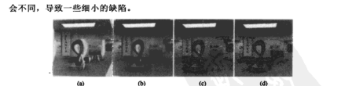
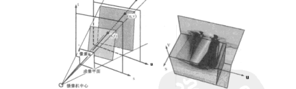
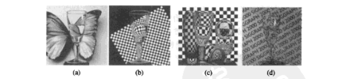

# 第13章 基于图像的绘制

来源：Szeliski《计算机视觉——算法与应用》中文第一版第13章；书页 477–506 / PDF 491–520。未越界第14章（书页 507 / PDF 521 起）。

## 本章总览

第11、12章已经能从多视得到深度、网格或平面模型。本章换问题：怎样用已有照片直接画出**新视点**，而不必每次都走完整的图形学光照。这叫基于图像的绘制(image-based rendering, IBR)。

线索按「几何用多少」排成一条谱：视图插值与视图相关纹理仍挂在一张 3D 模型上（13.1）；层次深度、平面替代和子画面把几何收成几层（13.2）；光场 / 发光图几乎不建网格，只对四维光线重采样（13.3）；环境影像形板再把折射、反射写进每条光线（13.4）；视频侧把同样想法接到改写、纹理、3D 视频和游览（13.5）。不新开立体匹配。

学完应能分清：视图插值要深度，光场可以不要；同心拼图只能在拍摄圆附近转，不是任意 6 自由度；环境影像形板不是第10章的 α 抠图，它还记背景怎么弯进相机。

🔑 关键速记：IBR 用照片当外观，几何可多可少；几何越少，视点自由度往往越受拍摄轨迹限制。

## 核心知识点

### 视图插值

Chen 与 Williams(1993) 把两幅参考图和各自的深度图合成中间视点：先按参考相机与虚拟相机的姿态，用透视投影（2.68–2.70）把像素卷绕到新位置，再把两张卷绕结果交叉淡入淡出。前向卷绕会把多个源像素打到同一目标，也容易留空洞，所以常改成反向卷绕，或按深度从后往前画。

两幅图都卷过来之后，若只有一边看见该像素，就用看得见的那张；两边都看见，按虚拟相机到两台源相机的距离加权。曝光差会在接缝上留下细带。最后一步填剩余空洞和裂纹：可从更远邻域抄颜色（容易「肥胖」），或改用前向–后向绘制（Shade、Gortler、He 等 1998）。非刚性场景（一张笑一张不笑）要接到视图变形(view morphing)，把插值与一般变形合在一起。

🔑 关键速记：插值 = 用深度把两张图拧到新相机，再混合；拧的时候会出洞，洞要另填。

#### 视图相关的纹理映射

不必给每个视点各存一张深度。Debevec、Taylor 与 Malik 的视图相关纹理映射(view-dependent texture map)只建一个 3D 模型，绘制时按虚拟相机与各源相机的夹角，给每个多边形选最近的几张照片做纹理，再按视角加权混合。几何可以很粗，窗户一类细节靠照片补。Façade 把这件事接到「基于几何–图像混合」的绘制：全局 3D 模型加局部视差和视图插值。👉 建筑平面与偏移图见第12.6.1节。

#### 应用：照片游览

Snavely、Seitz 与 Szeliski(2006) 的照片游览：对大量随意拍摄的照片做由运动到结构，得到每张图的姿态和稀疏点云，用户可以在照片之间「飞」。导航方式包括：在场景中选虚拟相机、点感兴趣区域跳到近视图、或选物体当缩略图。系统用半透明平面代理(proxy)当背景，并可选更稳的 3D 轴减少晃动。平面代理在转折处会有「视点轨道」伪影，多视物体检测能改善。标注可以从一张图传到空间上相近的图。

📝待补全：稀疏点与相机姿态来自第7.4节增量 SfM；稠密表面仍见第11.6、12章。互联网上先认出哪些图该配在一起：把 SIFT 量化成视觉词，用词汇树倒排缩小候选再几何验证，见第14.3.2节。本章只讲「有了姿态之后怎么逛」。

👉 完整深度讲解见第7、14章。

🔑 关键速记：照片游览先 SfM 出相机，再在照片之间插路径；平面代理便宜，但转弯时会破。

### 层次深度图像

传统插值一张图只挂一幅深度。前景一挡，卷到新视点就会露馅。层次深度图像(layered depth image, LDI)给每个像素存一串颜色–深度样本，把被挡住的层也留下。从后往前画（抛雪球）就能填新视点。

也可以把场景收成几层子画面(sprite) / 平面替代(impostor)：近处用细网格，中距用 LDI，远处用带 α 的广告牌和环境贴图（图 13.5）。平面视差(plane parallax)相对一块基准平面建偏移，比每像素一张深度更省，也和第8.5节的运动层是同一思路。带深度的子画面不要只前向拧像素，较好的是先把深度或 $(u,v)$ 位移拧过去、填洞，再反向把彩色拧回来。

🔑 关键速记：一层深度挡不住新视点的「背后」；LDI 或多层子画面把被挡的颜色也存下来。

### 光场与发光图

更一般的问题：能不能捕获并画出**所有可能视点**的外观？若场景静止、光源固定，观察者 6 自由度加相机内参，每个位置拍一张球面图，得到 5D 全光函数(plenoptic function)。无散射（无烟无雾）时，沿一条光线颜色不变，5D 可降成 4D 光场(light field)：一条光线用两个平面上的坐标 $(s,t)$ 与 $(u,v)$ 表示，记 $L(s,t,u,v)$。$st$ 平面是相机阵列，$uv$ 是像平面。有限范围时，从一个 $st$ 孔看向 $uv$ 平面，就像视截锥。

固定一个相机坐标 $t$，只沿 $s$ 扫，得到的 $(u,v,s)$ 切片就是极线平面图像(EPI)：同一 3D 点的像素落在一条直线上，斜率与到 $uv$ 平面的深度有关。这和第11.6节把多帧收成 EPI 是同一几何。

Gortler、Grzeszczuk、Szeliski 等(1996) 的发光图(Lumigraph)在基本光场上加了物体表面的 3D 位置，重采样时先修正到表面再混合，质量更好。规则网格上，$(s,t)$ 对应各相机，$(u,v)$ 用双线性插值；非规则手持拍摄则要先把照片重分箱(rebin)，或直接走非结构化发光图。

光场数据极大，但相关也极强，可压缩。采集可用标定相机阵、龙门架，或手持加 SfM 再重分箱。微透镜阵列 / 光场显微镜是同一 4D 的硬件版。

#### 非结构化发光图与表面光场

源图不规则时，无法先收成干净的 $(s,t,u,v)$ 网格。Buehler、Bosse、McMillan 等(2001) 的非结构化发光图绘制(ULR)：对虚拟相机的每条光线，按极点一致性、分辨率、连续性和角度等准则，从附近源相机里加权混合。相机很少、但几何较准时，它接近视图相关纹理映射。

若已知精细 3D 形状，可把 4D 光场贴到表面上：每个表面点存一圈出射光线，即表面光场(surface light field)。完全漫反射时各方向颜色相同，光场退化成纹理；完全镜面则每个点映周围环境的一个缩影。Wood、Azuma、Aldinger 等(2000) 把每点的光球分解成漫反射加镜面，便于压缩和「改反射」。

#### 应用：同心拼图

同心拼图(concentric mosaic)是光场的便宜特例：相机绕竖直轴转一圈（或相机固定、转台转物体），得到与一组同心圆相切的列射线。绘制时，虚拟视点的每一列到源图里找最近的一列。视点被限制在拍摄平面附近、半径以内，不能任意 6 自由度，但能出视差和反射。若还能估列向深度，可把列在竖直方向拉长，补偿不同相机高度。

🔑 关键速记：无散射时外观是 4D 光线；规则阵叫光场，不规则叫发光图；同心拼图只在转圈轨迹附近逛。

### 环境影像形板

前面的方法画的是不透明场景的新视点。若把高脚杯一类折射体放在背景前，要对的是「背景光线怎么弯进相机」，不是物体表面的四维出射光。这叫环境影像形板(environment matte)，可看成物体抠图的推广：不但切出物体，还记下折射、反射和精细互影响。

覆盖公式从第3章 / 第10章的

$$
C_i=\alpha_i F_i+(1-\alpha_i)B_i
\tag{13.1}
$$

改成对背景的加权积分。Zongker、Werner、Curless 等(1999) 写成

$$
I_i=R_i\int A_i(x)B(x)\,\mathrm{d}x
\tag{13.2}
$$

$A_i$ 是该像素在背景上的支撑面积，$R_i$ 是折射或透射率。Chuang、Zongker、Hendroff 等(2000) 用一组二维高斯

$$
I_i=\sum_j R_{ij}\int G_{ij}(x)B(x)\,\mathrm{d}x
\tag{13.3}
$$

每个 $G_{ij}$ 由中心、轴宽和方向参数化（13.4）。采集时用周期条带或四向高斯条扫描背景，估出这些参数后，换一张新背景 $B(x)$ 就能合成。动态物体（倒入液体）要用分级彩色背景估每像素的二维垂替换。

更高维：每个像素映到一条 4D 光线，本质上是 6D；若还要换视点，光线到光线是 8D。表面 BRDF 是 4D，光场绘制常降到 6D，代价是牺牲路径追踪能力。动态再加时间维。有了物理规律和专用采集，维数可以压下来。图 13.11 把方法排成「几何多 / 图像多」一条谱：传统图形学在左，纯光场插值在右。

📝待补全：普通 α 抠图 $C=(1-\alpha)B+\alpha F$ 见第10.4节。本章环境影像形板多了折射积分，背景必须是可控图案。蓝屏 / 自然图 trimap 解不了弯光。

👉 完整深度讲解见第10章。

🔑 关键速记：α 抠图问「这块有多透明」；环境影像形板问「这块从背景的哪一处折过来」。

### 基于视频的绘制

把「用已有影像生成新影像」从静图接到视频，叫基于视频的绘制 / 基于视频的动画。早期视频改写(Video Rewrite)按音素把口型片段拼到新台词上。人脸转移用视觉语音、表情和头部姿态元素重绘说话人。也可以在两段视频之间匹配光流场，用一段指导另一段；或先用光流加 3D 模型解开再改。

#### 视频纹理与图片动画

视频纹理(video texture)把较短片段重排，接成看起来连续、无限长的播放：用 $L_2$ 找相似帧，建跳转表；相邻三帧一起比更稳。接缝处运动对不齐时，用光流变形或加长交叉淡入淡出。跳转可看成马尔可夫模型。除了风、火、水这类平稳随机现象，笑脸、城市车流也可以区域分开做。全景视频纹理把摇镜头拍的条收成可扫的条。静态照片则先交互抠图层，再给每层不同运动（风位移图、水面波），最后叠回去。

#### 3D 视频与基于视频的游览

3D 视频 / 自由视点视频：多台同步相机围着拍，再用视图插值在相机之间走。Zitnick、Kang、Uyttendaele 等(2004) 用 8 相机加两层深度，专门处理边界混合。绘制时相邻两源的层当纹理三角形，先前景后背景，接缝用 α 和 z 缓冲。显式深度不是必须的，光场相机也能直接画。

更大范围的游览：沿预先路径拍全景或车载视频，回放时只能在这条轨道附近看（Aspen MovieMap 一类）。灰点瓢虫(Point Grey Ladybug)把 6 相机拼成球面视频，重叠区用多视角平面扫描消视差，再用受约束的 SfM 稳姿态。室内可用可编辑曝光控制做包围曝光，合成 HDR 视频。系统常配概览地图，地图与视频用「地图相关」自动对齐。商业上接到 Google 街景、路线预览和游戏里的预置轨道。

📝待补全：场景流是表面点的 3D 速度，用于多视视频的时空插值，几何定义见第11.5–11.6节。本章 13.5.4 把它当成绘制时的层间运动。行人用 HOG+SVM 或形变部件框窗，人脸用 Haar 瀑布，见第14.1节。

👉 完整深度讲解见第11章；检测见第14章。

🔑 关键速记：视频纹理是把短片接成可循环的马尔可夫链；3D 视频在相机阵里插视点；游览多半被锁在拍摄轨道上。

## 易混淆点&差异对比

### 视图插值 vs 视图相关纹理 vs 光场

视图插值：每张参考图自带深度，把像素拧到新相机。视图相关纹理：一张几何，多张照片当纹理，按视角选图。光场：几乎不建网格，直接对 4D 光线重采样。几何越准，越少的照片也能画；照片越密，几何可以越糙。

### 层次深度 vs 立体视差图

第11章的视差是某一视点的一张深度。LDI 在同一像素存多层，为的是新视点能看见「当时被挡」的颜色。不要把一张视差图直接叫 IBR 完成。

### 环境影像形板 vs 第10章抠图

自然图抠图估 $\alpha$ 和前景色 $F$，假设背景透过时不弯。环境影像形板的每个像素对应背景上的一块支撑（甚至一组高斯），换背景时按这块积分，专门对付玻璃、液体。采集要可控条带，不能拿普通 trimap 替代。

### 同心拼图 vs 任意视点光场

同心拼图只需绕轴转一圈，硬件简单，但虚拟相机不能离开拍摄平面太远。完整 4D 光场（两平面参数）才能在 $st$ 范围内自由平移。照片游览的「飞」靠的是离散照片 + 平面代理，也不是连续光场。

### 视频纹理 vs 光流插帧

第8章插帧是在已知两帧之间估运动，合成中间时刻。视频纹理是在时间轴上**跳转重排**已有帧，让短循环看起来无限。两者都可能用光流补接缝，目标不同。

🔑 关键速记：几何多少决定能走多远；α 不管弯光；转圈拼图不是 6 自由度；循环播放不是插帧。

## 本章要点总结

- 视图插值用深度把参考图卷到新相机再混合；空洞来自遮挡和前向卷绕。
- 视图相关纹理只建一个模型，按视角选照片；照片游览用 SfM 姿态在照片间导航。
- LDI / 子画面 / 平面视差把被挡层留下，新视点才填得上。
- 无散射时 5D 全光函数降成 4D 光场 $L(s,t,u,v)$；EPI 切片的直线斜率即深度。发光图加表面几何做重采样；非结构化发光图直接在源相机上加权。
- 同心拼图是转轴采集的光场特例，视点锁在圆附近。
- 环境影像形板用 (13.2)(13.3) 记折射路径，不是普通 α。
- 视频：改写与人脸转移；视频纹理跳转表；图片分层动画；多相机 3D 视频；轨道 / 街景游览。
- 表示按「几何 ↔ 图像」一条谱选择，输入照片越多，越能少建网格。

🔑 关键速记：新视图要么拧已有像素，要么查 4D 光线；几何和照片数量此消彼长，采集轨迹决定你能逛多远。
