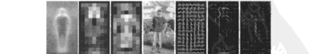
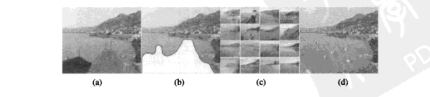

# 第14章 识别

来源：Szeliski《计算机视觉——算法与应用》中文第一版第14章；书页 507–566 / PDF 521–580。未越界第15章（书页 567 / PDF 581 起）。本版无独立深度学习章，检测停在正文方法（级联 / HOG / 词袋一类），不以第二版第5/6章填空。

## 本章总览

重建已经能给出三维，识别要回答的是「图里是谁、是哪一件、是哪一类」。书按难度爬：先在图上快速框出人脸和行人（14.1），再认这张脸是哪个人（14.2），然后在杂乱背景里找一件已知的刚性物体（实例识别，14.3），最后才是开放的类别识别（14.4），并加上场景上下文（14.5）。

三条主线不要混：检测是滑窗 / 级联「在不在」；实例识别靠稀疏特征加几何验证，可接到词汇树做百万级检索；类别识别常常丢掉精确几何，改用词袋直方图、部件图或分割标签。智能照片编辑（14.4.4）把识别接到互联网图库修图，不是第10章单张样本合成。

学完应能分清：Viola–Jones 的 Haar 级联不是 HOG+SVM；特征脸是 PCA 子空间，Fisherface 才显式拉大类间；词汇树量化视觉词，不是 k-d 树直接比 SIFT 向量；环境影像形板在第13章，本章修图是检索相似块再泊松贴回去。

🔑 关键速记：先框、再认、再检索、最后才分类；几何能用就用，类别问题往往只剩直方图和部件关系。

## 核心知识点

### 物体检测

检测器的任务是在图上快速找到可能出现某类物体的窗口，而不是对每个像素做完整识别。人脸是这条线上最成熟的例子，已经进了相机对焦和视频会议；行人检测则接到车载安全。

#### 人脸检测

逐像素、逐尺度做人脸识别太慢。实用系统在图像金字塔上扫重叠窗口，再用一层比一层严的分类器过滤。Yang、Kriegman 与 Ahuja(2002) 把早期方法分成基于特征（先找眼鼻嘴再验证几何）、基于模板（AAM 一类，要好的初始化，不适合粗检）和基于表观。

基于表观的主流：先收集大量人脸 / 非人脸窗，用平移、旋转、尺度和少量镜像扩充，再减光照梯度、做直方图均衡。Sung 与 Poggio(1998) 用 k-均值加 PCA，在聚类上算马氏距离送进多层感知器。Rowley、Baluja 与 Kanade(1998a) 直接用 MLP 扫 20×20 窗，再用融合网合并重叠响应。SVM 在预处理后的特征空间里找最大间隔超平面，核函数处理线性不可分。

Viola 与 Jones(2004) 把 boosting 引进视觉，成为当时最快也最常用的人脸检测。强分类器是弱分类器的加权投票

$$
h(\mathbf{x})=\mathrm{sign}\Bigl[\sum_{j=0}^{m-1}\alpha_j h_j(\mathbf{x})\Bigr]
\tag{14.1}
$$

每个弱分类器是阈值桩(decision stump)，特征 $f_j$ 是两到四个矩形的像素和之差（Haar 类特征）。积分图(summed area table)让任意矩形和变成常数时间，特征差只要几次加减。AdaBoost 每轮按加权误差挑最好的 $(f_j,\theta_j)$，提高分错样本的权重（算法 14.1，(14.3)–(14.7)）。再把许多强分类器串成瀑布(cascade)：前几级扔掉绝大多数非人脸，后面的级才仔细看。训练可能要很久，检测可以实时。

🔑 关键速记：人脸检测 = 金字塔滑窗 + 便宜特征 + 瀑布；Haar+积分图让每个窗只做几次加减。

#### 行人检测

Dalal 与 Triggs(2005) 把重叠窗口上的方向梯度直方图(HOG)送进 SVM。HOG 在规则网格上统计梯度方向，用对比度归一化，强调头、躯干、脚附近的边缘，衣服中间几乎没响应。后续工作比较下来，局部感受野加 SVM 往往最好，其次才是 boosting。Felzenszwalb、McAllester 与 Ramanan(2008) 把行人收成带形变的部件：根滤波器加部件滤波器在两层金字塔上用 HOG，部件相对根的偏移是隐变量，训练半监督。视频里光流和不连续性能再帮一把。人体精细姿态仍见第12.6.4节。

🔑 关键速记：行人看的是梯度直方图的形状，不是 Haar 明暗块；部件模型允许腿和胳膊相对身体挪一点。

### 人脸识别

检测出脸框之后，要问这是哪个人。早期量眼鼻嘴距离；后来把对齐后的窗口投到低维表观空间。正面、均匀光照最好；侧脸、遮挡、浓妆都难。消费照片里的登录、相册聚类是主要出口。

#### 特征脸与 Fisherface

任意人脸 $\mathbf{x}$ 写成平均脸加主轴的组合

$$
\hat{\mathbf{x}}=\mathbf{m}+\sum_{i=0}^{M-1}a_i\mathbf{u}_i
\tag{14.8}
$$

$\mathbf{u}_i$ 来自训练协方差 $C$ 的特征向量，叫特征脸(eigenface)（14.9）（14.10）。系数 $a_i=(\mathbf{x}-\mathbf{m})\cdot\mathbf{u}_i$（14.11）。人脸空间内距离 DIFS 是系数欧氏差（14.12）（14.13）；人脸空间外距离 DFFS 是到子空间的垂距。用特征值把各轴拉成单位方差，就得到马氏距离（14.14）（14.15）。同一人光照变化常常大于不同人同一光照，普通 PCA 分不开；Fisher 线性判别(FLD/LDA)最大化类间 / 类内散度比 $\mathbf{u}^{T}S_B\mathbf{u}/\mathbf{u}^{T}S_W\mathbf{u}$（14.17）–（14.21），在强光照下往往优于特征脸。也可以对类内、类间差分别建高斯，用贝叶斯比（14.28）；或把脸切成眼、鼻、嘴独立匹配。

#### 活动表观与 3D 形状

形状和纹理会一起变。活动形状模型(ASM)在控制点上做 PCA；活动表观模型(AAM)同时写

$$
\mathbf{s}=\bar{\mathbf{s}}+U_s\mathbf{a},\qquad \mathbf{t}=\bar{\mathbf{t}}+U_t\mathbf{a}
\tag{14.29}--\text{(14.30)}
$$

同一个 $\mathbf{a}$ 管形状和归一化到平均形状后的纹理。拟合用差分图像相对参数的导数（14.31），或接到第8章的反向组合。3D 可变形模型(Blanz–Vetter)和 3D AAM 能解释大姿态。👉 蛇与 ASM 的曲线能量见第5.1.1节；头模扫描见第12.6.2节。

个人相册：检测脸之后聚类、标朋友；难例要结合发型、衣服和位置上下文。桌面登录、家庭相册、社交网站点名是典型应用。

🔑 关键速记：特征脸是「像平均脸的哪些方向」；Fisherface 硬拉类间距；AAM 让形状和纹理共用一套系数。

### 实例识别

实例识别找的是**这一件**已知物体（新视点、部分遮挡也可以），类别识别才是「猫 / 车」这种开放类。Lowe(2004) 的路线：从样本抽 SIFT，新图同样抽特征，匹配后用仿射或单应的 Hough 投票验证几何，至少三四个一致对应才算找到。SIFT 自带位置、尺度、方向，Hough 用四维相似变换；也可用局部仿射框或因子分解出的 3D。外点多时几何验证不可省。

#### 大型数据库与词汇树

百万级图像不能每张都暴力比 SIFT。思路来自文本检索：把局部描述子量化成视觉词(visual word)，图像变成词频向量，用倒排索引找共享词的候选，再几何重排。词频–逆文档频率

$$
t_i=\frac{n_{id}}{n_d}\log\frac{N}{N_i}
\tag{14.33}
$$

$n_{id}$ 是词 $i$ 在图 $d$ 中的次数，$N_i$ 是含该词的图像数。查询和库图都表示成 $\mathbf{t}$（14.34），比余弦或 $L_p$。Nistér 与 Stewénius(2006) 的词汇树(vocabulary tree)用层次 k-均值把描述子分成 $10^6$ 级视觉词：每个内部节点再分，叶子存倒排表。查询时描述子沿树往下走，只要约 $10\times 6$ 次比较。过于普通的词放进停止表。算法 14.2：离线建词和倒排，在线量化、查表、可选空间一致性或查询扩展。书称可在约 4 万张 CD 封面库上接近实时，并扩到百万电影帧。随机森林是另一条量化路。位置识别（手机「我在哪」）和地标发现是同一套检索接到 GPS / 街景；照片游览的大规模匹配也走这里。

📝待补全：SIFT 检测与 128 维描述见第4.1节；单应 / 仿射 RANSAC 见第6.1.4节。本章词汇树解决的是「百万图里先缩小候选」。照片游览的姿态仍见第13.1.2、7.4节。

👉 完整深度讲解见第4、6、7、13章。

🔑 关键速记：实例识别 = 特征匹配 + 几何；库一大就先把描述子收成视觉词，倒排检索，最后再验几何。

### 类别识别

类别识别没有「这一件」的三维模型，类内变化极大。书先讲更简单的词袋，再讲部件和分割，最后接到修图。

#### 词袋

把图收成视觉词直方图，丢掉精确位置，用最近邻、贝叶斯或 SVM 分类。Csurka、Dance、Fan 等(2004) 叫关键点袋；后续加上空间金字塔匹配核：在多级网格里比直方图交（14.40）（14.41），既保留一点布局，又不必对齐部件。距离可用地球移动距离(EMD)或 $\chi^2$，再做成 SVM 核（14.37）–（14.39）。gist 一类整图描述适合「有没有天空」这种无结构区域。

图注：词袋类别识别的共用流水线。与实例识别不同，这里通常不再做单应验证。

#### 基于部件的模型

更老的路线是找部件再量几何。图案结构(pictorial structure)把能量写成一元外观加成对几何（14.42），可用 MRF；树形先验能用 Viterbi 动态规划。稀疏灵活模型给部件排序，每个部件在前 $k$ 个候选里选位置。星座、k-扇、有向无环图、全连接星座复杂度不同，全连接分配部件是 $O(N^P)$。Ferrari、Perona 与 Zisserman(2007) 在摩托车上同时学外观和形状。👉 成对能量与树推断见附录 B。

#### 基于分割的识别

最难的是同时给出类别和精确边界。一条路把物体模型反投到新场景；另一条先过分割成超像素，再让每块和模型部件匹配。Leibe、Leonardis 与 Schiele(2008) 用码本投票位置和尺度，再反投前景掩模。也可以把每像素标成类别，用最小能量 / 条件随机场，TextonBoost 把纹理基元布局和 boosting 合在一起。LayoutCRF 再加物体实例之间的遮挡关系。

#### 应用：智能照片编辑

识别一旦能在互联网图库里找到「同类区域」，修图就不必只靠单张样本。Photo Clip Art 检出可粘贴物体；Hays 与 Efros(2007) 的场景补全：擦掉一块后，用 gist 在约两百万张图里找相似场景，图割贴块、泊松融合。这和第10.5节在同一张图上抄邻域不同。人脸检测还能做拼贴、去识别（把脸换成别人或平均脸）。Hoiem、Efros 与 Hebert(2005a) 从单张图把像素标成地面 / 直立 / 天空，恢复粗 3D「弹出」。

📝待补全：单张样本上的像素 / 块合成与结构优先修图见第10.5节。本章 14.4.4 依赖大规模检索。超像素本身见第5章。

👉 完整深度讲解见第10、5章。

🔑 关键速记：词袋看「有哪些词」，部件看「零件怎么摆」，分割要连边界一起标；互联网修图是检索再贴，不是本图克隆。

### 上下文与场景理解

单独检测物体忽略了「物体出现在什么场景里」。字母和数字旋转 90° 就认不出，说明形状不够，上下文很重要。把 gist 或物体共现放进条件随机场，能让「人在马上比人在狗上」更合理。Sudderth、Torralba、Freeman 等(2008) 用层次主题模型同时生成场景类别、物体和部件。场景匹配甚至可以直接拿整张图当「标签」去库里找结构相似的图（Russell、Torralba、Liu 等 2007）。学习本身（PCA、子空间、判别分类）贯穿全章，不一定单开一节。评测常用 PASCAL VOC 一类封闭世界集合；数据库名单见 14.6 与附录 C。

🔑 关键速记：上下文是「这类东西通常和谁、在哪一起出现」；它能救单独检测救不了的歧义。

## 易混淆点&差异对比

### 检测 vs 识别 vs 实例 vs 类别

检测：窗口里有没有这类。识别（人脸）：这是哪个人。实例：这一件已知物体。类别：属于哪一类，没有三维样本。滑窗级联解不了「哪一件」；词袋解不了精确姿态。

### Haar 级联 vs HOG+SVM vs 1990s MLP

Viola–Jones 用积分图上的矩形差和瀑布，为人脸速度服务。HOG+SVM 用梯度方向直方图，更适合行人全身。Rowley 的 MLP 是 1990 年代末的小网络扫窗，不是本版之后的深度卷积专章，不要用后来的检测器填空。

### 特征脸 vs Fisherface vs AAM

特征脸最大化总体方差，把光照和身份混在一起。Fisherface 显式用类标拉大类间。AAM 还有形状系数，能对齐表情和姿态，检测阶段通常太慢，要先有粗框。

### 词汇树 vs 词袋直方图

词汇树是层次量化 + 倒排，为实例检索加速，后面仍要几何验证。类别词袋往往只用一层直方图或空间金字塔，不再验单应。k-d 树比的是原始描述子，词汇树比的是离散词号。

### 互联网修图 vs 第10章纹理合成

第10章在同一张图或一小块样本上抄邻域。14.4.4 先按 gist 到百万图库里找整块相容区域，再图割和泊松贴。没有检索，就退回第10章。

🔑 关键速记：框、身份、这一件、这一类是四件事；加速检索的树和分类用的直方图也不要混。

## 本章要点总结

- 人脸检测：金字塔滑窗；Haar 矩形差 + AdaBoost + 瀑布；积分图使特征 $O(1)$。
- 行人：HOG+SVM；形变部件在两层金字塔上对齐根和零件。
- 人脸识别：特征脸 PCA（14.8）–（14.15）；Fisher/LDA 拉类间；贝叶斯双空间；AAM 形状+纹理共用 $\mathbf{a}$。
- 实例识别：SIFT 匹配 + Hough/仿射验证；百万库用视觉词、tf-idf 和词汇树倒排。
- 类别：词袋 / 空间金字塔；图案结构与星座等部件图；分割+CRF；互联网场景补全。
- 上下文和 gist 能抬整体识别；评测看 VOC 一类集合。
- 本版停留在级联、HOG、词袋和部件，不写独立深度学习检测器。

🔑 关键速记：能用几何验证的当实例检索；只能统计词和部件的当类别；检测只负责先把窗框出来。
