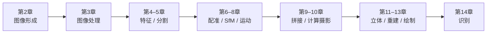

# 第15章 结语

来源：Szeliski《计算机视觉——算法与应用》中文第一版第15章；书页 567–568 / PDF 581–582。约两页，无细分节。未越界附录 A（书页 569 / PDF 583 起）。不以英文第二版结语填补。

## 本章总览

这一章不新开算法，只把全书收成三件事：视觉问题为什么这么宽、三条解题途径怎样叠用、当时作者看到的趋势和缺口。

前面各章已经走过一条链：成像物理 → 图像处理 → 特征与匹配 → 运动与三维 → 融合与绘制 → 语义识别。数学上既有连续侧（信号、变分、三维几何、线性代数、最小二乘），也有离散侧（图算法、组合优化、信息检索）。几乎都是从带噪声的观测反推未知量，所以仍是逆问题。

学完应能说清：科学 / 统计 / 工程为什么缺一不可；互联网标注和图形学交叉当时在推什么；人脸一类任务实验室好看、野外仍差，并不等于已经「看懂」。

🔑 关键速记：结语不讲新算子；它把全书收成「逆问题 + 三条途径 + 仍远未语义理解」。

## 核心知识点

### 全书路线：从光子到语义

作者按难度递进回顾：先弄清图像怎么形成，再处理像素，再抽特征、做对应，然后估运动和三维，把多源观测融起来，最后才试图解释「图里是什么」。练习题用来让学生把同一条链在真实数据上走一遍。

图注：中文第一版的阅读路线。几何侧（配准、SfM、立体）和光度侧（HDR、抠图、IBR）并行，识别放在已经能对上几何之后。本版没有独立深度学习章。

数学工具也按连续 / 离散两条线并行。连续：信号处理、变分法、三维几何、线性代数、最小二乘。离散：图上的最短路与割、组合优化、信息检索。附录 A 管分解与稀疏求解，附录 B 管估计与 MRF 推断。

🔑 关键速记：几何把像素变成三维；光度把像素变成外观；识别再问「是什么」——本版按这个顺序写。

### 三条途径仍然要叠着用

视觉世界和航空、机械、电气工程一样复杂，所以作者坚持第1章已经立过的三条习惯，不以第二版后增的途径改写。

1. **科学(scientific)**：把光照、大气、光学、带噪声的传感器建成可反演的物理模型，必要时做可算的简化，再把获取过程倒转过来。
2. **统计(statistical)**：数清未知量相对噪声有多少；给场景和观测写概率；用贝叶斯先验收解；用机器学习估概率模型；用动态规划、图割、信念传播做推断。
3. **工程(engineering)**：先把问题定义清楚，质疑假设，准备几套解法，同时看可靠性和代价，最后在真实使用条件下评测。只给漂亮公式、却不能在真实图上稳定估计，书认为太容易。

互联网上越来越多带标注的图像，使统计学习这条腿明显变粗：语音、识别、翻译都在吃同一类数据。图形学侧的基于图像的绘制、运动捕捉，则把「看起来像」和「测得准」拧到一起。

📝待补全：科学侧的成像公式见第2章；统计侧的 MLE / 鲁棒 / MRF 推断见附录 B；工程侧反复出现的最小二乘、LM、稀疏 Hessian 见附录 A。光场与照片游览见第13章；检测与词袋见第14章。本章不再展开算子。

👉 完整深度讲解见第2、13、14章与附录 A、B。

🔑 关键速记：物理给前向模型，概率给取舍，工程给能跑、能测的实现。

### 当时看到的趋势与缺口

静态场景上，特征匹配、由运动到结构和三维重建正在「爆炸」：更好的运动 / 立体 / 增强数据集，加上统计推断，使稀疏点和稠密表面都能规模化。互联网图库同时在推识别：能检索、能补全、能做场景上下文。

缺口仍然大。和人的语义理解相比，机器还差一截。人脸识别在实验室数据上可以看起来很好，换到不受控的野外就掉一截。作者提醒：做到完整的场景理解，有可能是人工智能完全问题(AI-complete)——不要把检测框或特征脸误当成已经「看懂」。

应用冲击当时已经看得见：计算摄影、视觉特效、医学、安防、互联网搜索。领域本身的问题清单，加上连续与离散两套数学，足够让这门课长期有意思。

本版结语只有两页，没有独立「未来工作」清单，也不讨论后来的深度卷积检测器、SLAM/VIO 算法或神经绘制。那些内容不属于这一版正文。

🔑 关键速记：几何重建当时在加速，语义理解仍远；实验室指标好不等于野外可用。

## 易混淆点&差异对比

### 结语 vs 第1章概述

第1章负责「为什么难、后面怎么读」。本章负责「读完之后三条途径有没有走通、缺口在哪」。算法细节仍回前面各章，不在这两页里补新公式。

### 本版结语 vs 后来的第二版

中文第一版止于 2010 年前后的方法：级联检测、词袋、图割 / BP、光场、光束平差。不要用第二版才独立成章的深度学习、SLAM/VIO 或神经绘制来填这两页。

### 「爆炸」的三维 vs 「看懂」

特征匹配和 SfM 可以在互联网照片上长出稀疏点云，不等于场景语义已经解决。前者是几何逆问题在数据变多时变好；后者仍缺可靠的类别、关系与常识。

🔑 关键速记：数据变多先救几何和检索；语义缺口要另算，不能用实验室人脸数字代替。

## 本章要点总结

- 全书链：形成 → 处理 → 特征/分割 → 运动与三维 → 融合/绘制 → 识别。
- 数学：连续（变分、几何、最小二乘）与离散（图、组合优化、检索）并用。
- 三条途径：科学建模、统计推断、工程评测，缺一不可。
- 趋势：互联网标注推动识别；图形学交叉推动 IBR 与捕捉；静态场景的匹配 / SfM / 重建在加速。
- 缺口：野外语义理解、不受控人脸；完整场景理解可能是 AI-complete。
- 不新开算法，不以第二版后增主题填空。

🔑 关键速记：读完这本书，应能把一个真实问题同时写成物理模型、概率推断和可测实现，而不是只记住算子名。
