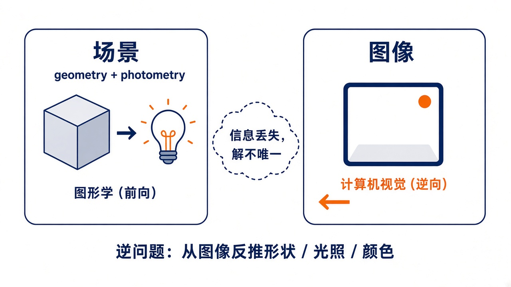
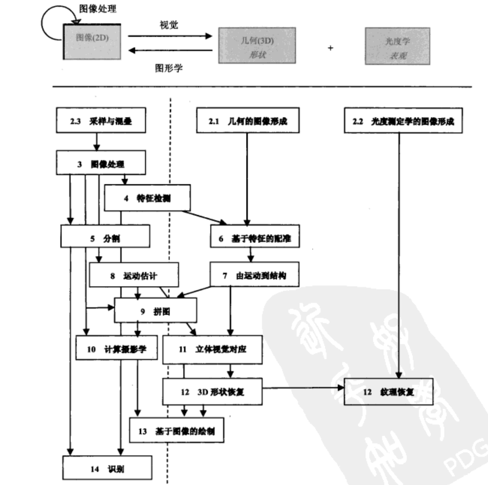

# 第1章 概述

来源：Szeliski《计算机视觉——算法与应用》中文第一版第1章；书页 1–24 / PDF 15–38。正文止于书页 23；PDF 38 为空白。未越界第2章（书页 25 / PDF 39 起）。

## 本章总览

这一章先回答三件事：计算机视觉在干什么、为什么难、这本书后面怎么读。

人看一瓶花几乎不费力：花瓣形状、半透明、前后关系都能读出来。机器要从一张或几张图反推三维形状、光照和颜色，观测往往不够唯一确定解，所以它是**逆问题(inverse problem)**。

后文算法本章只定位，不展开。学完应能说清：视觉相对图像处理多了什么、科学 / 统计 / 工程三条途径怎么配合、图 1.11 怎样把各章排成「图像侧 / 几何侧 / 光度侧」、记号约定是什么。

## 核心知识点

### 什么是计算机视觉

#### 人看世界几乎不费力，机器要数学化同一件事

人能从明暗读出花瓣的半透明，也能从合影里数人、认人、猜表情。知觉心理学用光学错觉拆原理，书中指向 Marr、Palmer、Livingstone 等；完整解释仍未完成。

计算机视觉并行发展的是：从影像里恢复物体的三维形状和外观。书中已能做到：上千张部分重叠照片算出环境的稀疏三维；足够多视角可用立体匹配做出建筑物正面外观；复杂背景里跟踪行人，并把人脸、衣服、头发检测合起来尝试对上名字。但要计算机像两岁孩子那样解释场景，仍然做不到。

图 1.2 给出当时已能工作的例子：由运动到结构、多视立体、行人跟踪、人脸检测。同事常找作者要「找出照片里所有人并说出名字」的软件——这件事听起来有趣，做起来难。

🔑 关键速记：视觉要从图里恢复三维形状和外观，人轻松，机器仍远未「看懂」。

#### 视觉是逆问题

难，首先因为它是逆问题：未知量多，观测不够。必须靠物理或概率模型，在多个可能解里做取舍。视觉世界的复杂度，远高于给发声器官建模。

前向模型(forward model)多半来自物理学（辐射测量、光学、传感器）和计算机图形学：物体怎么动、光怎么反射、大气怎么散射、镜头怎么折射，最后投到像平面。图形学在不少静态日常场景里已经能「看起来像真的」，甚至能跨过非比寻常的峡谷(uncanny valley)；视觉做的是反过来：从一张或多张图描述世界，重建形状、光照和颜色分布。

早期人工智能曾以为「知觉比推理容易」。这个误判本身就说明：没做过的人容易低估视觉。

🔑 关键速记：图形学前向成像，视觉反向恢复；观测不够，必须加模型和可测的算法。

#### 工业与消费应用（本章只列用途，算法见后文）

工业侧书中列出：

- 光学字符识别(OCR)与自动号码牌识别(ANPR)
- 机器检验：专用光照下用立体测公差，或 X 光查铸件缺陷
- 零售：自动结账通道上的物体识别
- 摄影测量：航拍照片自动建三维（如地图系统）
- 医学成像：术中影像，或脑形态长期跟踪
- 汽车安全：雷达不好用时用视觉看行人等障碍
- 匹配运动(match move)：跟特征点估相机与场景，把 CGI 嵌进实拍，常还要精确抠图
- 运动捕捉(mocap)
- 监视与交通监控、指纹与生物测定

消费侧更贴近个人照片视频：拼接、包围曝光、变形、把快照建成三维、视频匹配运动与稳像、在三维里预览照片收藏、人脸检测对焦、家庭成员视觉登录。这些题目学生立刻用得上，也方便从需求倒推方法，而不是先抓一个听说过的算法。

📝待补全：后文对应关系（本章不展开算法）。拼接是把多张重叠照片合成一张全景：先选运动模型（平面单应或纯旋转 $\mathbf{H}=\mathbf{K}\mathbf{R}\mathbf{K}^{-1}$），再全局光束平差让多图一致，最后在柱面/球面上选缝并做金字塔或泊松融合，完整流程见第9章。包围曝光先用 Debevec–Malik 同时估响应曲线 $g$ 和对数辐照度，用帽子权重丢掉饱和像素合成辐照度图，再以全局曲线或双边/梯度域做色调映射；目录 10.2.2「闪影术」则是闪光/非闪光融合，不是改快门。完整公式见第10.2节。把快照建成带纹理的三维模型：建筑走平面 + 消失点（Façade 勾边、Werner–Zisserman 直线共面），头脸用 PCA 可变形模型，网格再贴 $(u,v)$ 或估反照率以免把高光烤进贴图，完整流程见第12.6–12.7节。把电脑图形嵌进实拍视频，要同时恢复相机运动和稀疏三维，见第7.4.2节。去抖（视频稳定化）用稠密或参数化运动估计：先估背景相似变换，平滑掉高频抖动，再把帧卷绕回去（8.2.1）；3D 路径平滑要接到第7章 SfM。在三维里逛照片收藏：照片游览先 SfM 出每张图的姿态和稀疏点，用户在照片之间飞，场景用半透明平面代理，完整流程见第13.1.2节；基于视频的游览则沿预置轨道或球面相机阵回放，重叠区用平面扫描消视差，见第13.5.5节。人脸检测改进对焦：在图像金字塔上扫窗，用 Haar 矩形差 + AdaBoost 瀑布快速丢掉非人脸，完整算法见第14.1.1节。家庭成员视觉登录把对齐后的脸投到特征脸 / Fisher 子空间，或用 AAM 同时拟合形状和纹理，见第14.2节。

👉 完整深度讲解见第7、8、9、10、12、13、14章。

作者还用「学生想做边缘检测」当反例：先问他们要解决什么。若是找人脸，简单团块(blob)特征往往够用，并不依赖边缘；若是为三维重建去配窗户边，才值得把边缘连成共消失点的直线再匹配。

🔑 关键速记：先把问题定义清楚，再用真实数据选「能干活」的算法。

#### 三条途径要叠着用

书把解题习惯收成三条，后面各章都会反复出现。序里已经写过，第1.1节再展开：

1. **科学(scientific)**：把成像过程建成可反演的物理模型（场景如何生成、光如何与大气和表面作用、传感器如何带噪声），必要时做可算的简化，再把获取过程倒转过来。
2. **统计(statistical)**：用概率分布给场景和带噪声的观测建模，把未知量与先验合在一起，通常叫贝叶斯建模。用风险或损失函数度量错误的代价；收集训练数据学习概率模型，并对估计的不确定性量化。更抽象的层次在附录 B。
3. **工程(engineering)**：从详细的问题定义和约束出发，找已知有效的方法实现、评测，再选定。算法既要对噪声和模型偏差鲁棒(robust)，又要在运行时间和空间上高效。只给一个漂亮的数学描述、却不能在真实世界条件下给出稳定估计，书认为太容易。

测试数据(test data)被单独强调：先用合成数据验正确性和噪声敏感度，再用系统最终会遇到的那种真实图验收。只在几张「看起来像样」的图上成功，不算过关。

图注：三条途径互相依存，贯穿全书；不是三选一。

🔑 关键速记：物理模型、概率推断、实践里稳得住的算法，三条一起用。

### 简史：从积木世界到计算摄影

书强调这是作者个人视角，只记「站得住」的主线。不关心谁先发明的读者可以直接跳到 1.3。原书图 1.6 是竖排关键词时间轴，扫描件上字太密，这里改用文字加流程，不另抽原图。

#### 20 世纪 70 年代：视觉被当成「给机器人接摄像头」

早期人工智能和机器人圈子（MIT、Stanford、CMU）一度觉得「看」只是更高层推理之前的小台阶。1966 年的著名故事是：Minsky 让本科生 Sussman「花一个暑假把摄像机接到计算机上，让它描述看见了什么」。书注实际 Vision Memo 由 Papert 执笔。现在知道这件事难得多。

和当时已有的数字图像处理不同，计算机视觉从一开始就想恢复三维结构，再走向场景理解。早期路子包括：抽边缘，再从二维线段拓扑推断积木世界的三维；线标记算法；广义圆柱与图画结构(pictorial structures)；内在图像(intrinsic image)和 Marr 的 2½-D 草图；基于特征的立体对应与基于亮度的光流；同时恢复三维结构与相机运动。

Marr（1982）把视觉信息处理分成三层，书按作者理解转述为：

- **计算理论**：任务目标是什么，能用哪些约束。
- **表示和算法**：输入、中间量和输出怎么表示，用什么算法算。
- **硬件实现**：怎么映射到生物视觉或专用芯片；反过来，硬件约束如何指导表示和算法的选择。图形芯片(GPU)与多核让这一层再次变得实际。

作者的立场是：成像与先验的科学/统计约束，必须配上稳健高效的工程算法。Marr 这套今天仍能当框架用。

🔑 关键速记：1970s 要的是三维结构，不只是滤波；Marr 三层仍是提问清单。

#### 20 世纪 80 年代：定量化、金字塔、正则与 MRF

图像金字塔广泛用于融合和由粗到精的对应；尺度空间与小波随后补上或替换部分金字塔。立体之外出现一批由 X 到形状(Shape from X)：明暗、纹理、聚焦。边缘与动态轮廓，以及基于物理的视觉，都在这时活跃。

人们发现立体、光流、Shape from X、边缘检测，很多可以写成变分优化，再用正则化把问题摆稳。同样问题也能写成离散马尔可夫随机场(Markov Random Field, MRF)，从而用模拟退火一类搜索。三维距离数据的采集、融合、建模和识别继续推进。

📝待补全：金字塔每级宽高减半、面积为四分之一；高斯金字塔是低通缩小，拉普拉斯是本级减去上采样的下一级（带通），重建可逆。正则化写 $\mathcal{E}_{d}+\lambda\mathcal{E}_{s}$，一阶像膜、二阶像薄板；MRF 把同样能量放到 4 邻接格子上，二次时回到稀疏线性系统，二值常用图割。分割时把像素连到源/汇做成 s-t 图，最小割就是物体边界；GrabCut 再用颜色混合迭代。规范割看的是 $\mathrm{cut}/\mathrm{assoc}$，不是最大流。多标签不能一次图割：$\alpha$-扩张每次让任意像素改成某个 $\alpha$，内层仍是二值 s-t；信念传播在树上精确、环上近似。完整移动策略与子模条件见附录 B.5。Shape from X：由阴影到形状用辐照度 $I=R(p,q)$，朗伯下还要光滑或可积才能解两个未知法向；换 $\ge 3$ 个已知灯就是光度立体 $I_k=\rho\hat{\mathbf{n}}\cdot\mathbf{v}_k$，可线性解 $\rho\mathbf{n}$。纹理看透视收缩，聚焦看哪一档最锐。单目线索多给相对深度或法向，绝对尺度仍要标定或主动光。完整算法见第12.1节。

👉 金字塔与小波见第3章；正则与 MRF 见第3.7节与附录 B；二值分割图割见第5章；Shape from X 见第12章。

🔑 关键速记：1980s 把一批视觉问题收成「能量 + 正则 / MRF」。

#### 20 世纪 90 年代：运动恢复结构、物理视觉、与图形学交叉

射影不变量推动由运动到结构(structure from motion)：先做不必先标定的射影重建，再有正交近似下的因子分解，后来接到与摄影测量相同的光束平差法(bundle adjustment)。光流和稠密立体对应都有明显进展；分割侧出现规范化割(normalized cuts)、均值移位(mean shift)和基于能量的方法。统计学习开始露面，例如用于人脸的特征脸。

最显眼的变化是与计算机图形学的互动：图像变形、视点插值、全景拼接、光场绘制，以及从照片自动建真实感三维。这些后来很多被叫成基于图像的建模与绘制。

📝待补全：由运动到结构是从一组跟踪到的二维特征同时恢复三维点和相机运动。相机已知时用三角测量把多条视线合成点；两视图用本质矩阵 $\mathbf{E}=[\mathbf{t}]_{\times}\mathbf{R}$ 或未标定的基本矩阵 $\mathbf{F}$；多帧正交投影可用因子分解，精确解是光束平差（同时动点和相机，Schur 消点）。拼接要把多张图配到同一个曲面再融合：纯旋转用 $\mathbf{H}=\mathbf{K}\mathbf{R}\mathbf{K}^{-1}$，360° 缝隙改焦距，柱面/球面展开后选缝并用金字塔或泊松融合，见第9章。无散射时 5D 全光函数降成 4D 光场 $L(s,t,u,v)$，换视点就是对两平面参数重采样；不规则手持走发光图，绕轴转一圈是同心拼图。有深度的视图插值和几乎无几何的光场是同一谱的两端。完整方法见第13.3节。

👉 SfM 与光束平差见第7章；立体见图割相关的第11章；拼接见第9章；光场与绘制见第13章。

🔑 关键速记：1990s 把几何重建做全局，并和图形学合成了「用照片做新图/新三维」。

#### 21 世纪最初十年：计算摄影、特征识别、更强的全局优化

拼接、光场、包围曝光被重新叫成计算摄影学(computational photography)。HDR 普及倒逼出色调映射；闪光/非闪光融合、从重叠图里挑区域、纹理合成与修图(inpainting)也都归到这条线上。

识别侧出现特征 + 学习：星座模型(constellation model)、图画结构、场景与位置识别；也有人走轮廓或区域。全局优化更实用：图割之外，还有循环信念传播(loopy belief propagation, LBP)等消息传递。机器学习开始渗透几乎所有视觉题目，背景是因特网上半标注数据变多。

本书 2010 年出版，导论写到这里为止，没有单独开深度学习十年。不要用后出的第二版导论来填这一节。

🔑 关键速记：2000s 日常摄影算法产品化，识别靠特征，优化能算更大的图。

### 全书导览与怎么用这本书

#### 章节可以跳着读，但有依赖

视觉从图像走到语义理解和三维结构，两头并不总要一起学。例如可以先学几何成像和三维恢复，后读反射与明暗。图 1.11 把各章按「更靠近图像 / 更靠近几何 / 更靠近表观」从左到右排，再按抽象层次从上到下排。书提醒：分类应留有余地，许多算法同时涉及两种表达，图上细线也没有画全。

顶上还有一张小图：图像处理在二维图像上打转；视觉从图像走向三维几何（形状）加光度学（外观）；图形学走相反方向。

各章在导论里的定位（只记地图，算法留给对应章）：

导论对各章的说法如下，读的时候把它当目录索引，不要当成公式清单。

| 章 | 导论里怎么说 |
| --- | --- |
| 2 图像形成 | 几何投影与畸变、光度与光学、传感器（采样/混叠、颜色、机内压缩）。想先写算法的课可以后读 |
| 3 图像处理 | 线性/非线性滤波、傅里叶、金字塔与小波、几何变换；3.7 节正则化与 MRF 是全书首次引入贝叶斯方法 |
| 4 特征检测与匹配 | 点、边、直线。第6、7、9、14章都要用 |
| 5 分割 | 活动轮廓、分裂归并、均值移位、规范图割、图割与能量方法 |
| 6 基于特征的配准 | 最小二乘与 RANSAC、姿态估计、几何内参标定 |
| 7 由运动到结构 | 三角测量、两帧与多帧 SfM、因子分解、光束平差 |
| 8 稠密运动估计 | 从平移、参数、样条一直到光流与层次运动 |
| 9 图像拼接 | 运动模型、全局配准、合成与融合。适合作为期中大作业把前面技术串起来 |
| 10 计算摄影学 | 成像标定、HDR、超分去模糊、抠图合成、纹理与修图 |
| 11 立体视觉对应 | 摄像机已知时的稠密对应，可看成运动估计的特例 |
| 12 3D重建 | Shape from X、主动测距、表面/点/体积表示、建筑/人脸/人体、BRDF |
| 13 基于图像的绘制 | 视点插值、层次深度、光场与发光图、环境影像形板、视频绘制 |
| 14 识别 | 检测、人脸、实例、类别、场景 |
| 附录 A/B/C | 线性代数与数值、贝叶斯、数据/软件/课件 |

练习分书面作业、一周小项目和开放研究题。作者建议至少做几个小实验，最好拿自己的照片，并主动去试会失败的情况。这本书当参考书用时，重点是讲清「实践里什么好使」，并指向新文献。

👉 各章算法完整讲解见对应章节；附录公式见附录 A/B，数据与课件清单见附录 C。

🔑 关键速记：先看图 1.11 的左右（图像 vs 几何 vs 光度）和上下（依赖），再按课的项目挑章，不必从头硬读到尾。

#### 示例课表

教完全书在一学期里非常困难，也不值得硬教完。应按教师重点和项目来挑。作者与 Steve Seitz 用过类似表 1.1 的 10 周课表（省略带括号的周次），本科少数学、多复习，研究生假定已有视觉或相关数学。三维摄影、计算摄影也可以单独开课。

表 1.1 是 10 周和 13 周的样例。P1、P2 是前期小课程设计，PP 是最终课程设计提案截止，FP 是最后一周汇报。带括号的周次在较短课程中不用。

| 周次 | 材料 | 课程设计 |
| --- | --- | --- |
| (1) | 第2章 图像形成 |  |
| 2 | 第3章 图像处理 |  |
| 3 | 第4章 特征检测和匹配 | P1 |
| 4 | 第6章 基于特征的配准 |  |
| 5 | 第9章 图像拼接 | P2 |
| 6 | 第8章 稠密运动估计 |  |
| 7 | 第7章 由运动到结构 | PP |
| 8 | 第14章 识别 |  |
| (9) | 第10章 计算摄影学 |  |
| 10 | 第11章 立体视觉对应 |  |
| (11) | 第12章 3D重建 |  |
| 12 | 第13章 基于图像的绘制 |  |
| 13 | 最终课程设计汇报 | FP |

10 周课因此跳过图像形成、计算摄影学和 3D重建。他们更愿意前期多给编程小作业，让作业互相承接（例如先做特征匹配，再做拼接；或用光流对齐，把力气放在图割接缝或多分辨率融合）。

🔑 关键速记：课表是菜单不是清单；小作业串起来，比一次讲完全书有用。

### 标记法说明

视觉和多视几何教材记号很乱。本书沿用作者中学物理、多元微积分和计算机图形学里的习惯：

- 向量 $\mathbf{v}$：小写粗体，默认列向量，写在矩阵右边：$\mathbf{Mv}$
- 矩阵 $\mathbf{M}$：大写粗体
- 标量 $T$、$s$：斜体
- 有时把二维点写成 $(x,y)$，等价于列向量 $(x\ y)^{\mathrm{T}}$
- 常见矩阵：$\mathbf{R}$ 旋转，$\mathbf{K}$ 标定，$\mathbf{I}$ 单位阵
- 齐次坐标（第2.1节）头顶波浪线：平面上 $\tilde{\mathbf{x}}=(\tilde{x},\tilde{y},\tilde{w})=\tilde{w}(x,y,1)=\tilde{w}\bar{\mathbf{x}}$，在射影平面 $\mathbb{P}^{2}$ 里
- 叉乘的矩阵形式写成 $[\ ]_{\times}$

📝待补全：齐次坐标是在普通像素坐标后面多写一个分量 $w$。除以 $w$ 回到平常的 $(x,y)$；$w=0$ 表示无穷远点，没有普通像素位置。平面上的平移、旋转、仿射和透视（单应）都可以写成 $3\times 3$ 矩阵，再乘在这个三维向量上。直线用 $\tilde{\mathbf{l}}$，交点和连线靠叉乘；点用 $\mathbf{H}$ 变，直线用 $\mathbf{H}^{-T}$。

👉 齐次坐标、2D/3D 变换族和相机矩阵 $\mathbf{K}$ 的完整讲法见第2章。

🔑 关键速记：粗体分大小写管向量/矩阵；齐次坐标加波浪线；向量按列去乘矩阵。

### 扩展阅读

本书尽量自洽，基础作业不必外找资料，但默认你对线性代数、数值方法和图像处理有常识，分别在附录 A 和第3章复习。

书中点名的外读书（只记门类，不抄书单当正文）：矩阵与线性代数（Golub & Van Loan，Strang）；图像处理（Gonzalez & Woods 等）；图形学（Foley、van Dam 等，Watt，Glassner 的成像与绘制）；统计与机器学习（Bishop）。其他视觉教材包括 Ballard & Brown、Faugeras、Nalwa、Trucco & Verri、Forsyth & Ponce。

没有替代读新论文。作者按子领域尽量引到较新的工作。建议翻近几年 CVPR / ECCV / ICCV / SIGGRAPH，会议教程的幻灯往往能当快速入口。Keith Price 的 Annotated Computer Vision Bibliography 被当作分类书目。

🔑 关键速记：作业先靠本书；要往深走就读附录、标准教材和当年会议。

## 易混淆点&差异对比

### 计算机视觉 vs 数字图像处理

图像处理改的是二维像素（增强、压缩、滤波）。视觉还要恢复三维结构，并把它当作场景理解的台阶。两者共享算子，目标不是同一层。图 1.11 顶上那条「图像处理」自环，就是在提醒：可以只在二维里打转，但本书多数章会走出这一环。

### 科学建模 vs 统计推断 vs 工程配方

书既不是只给菜谱，也不是只写优雅但不好算的式子。科学侧要把成像建准再反演；统计侧把未知量和观测都写成分布，方便说「有多不确定」；工程侧要在噪声和模型偏差下仍然稳、算得动。三条要叠用，不是三选一。

中文第一版导论写的是这三条。不要把英文第二版后来补上的「数据驱动」第四条硬套进本章。

### 本中文版 vs 英文第二版的读法

本笔记对应 2010 年第一版中译本。第一版识别在第14章，特征在第4章，分割独立为第5章，全局优化放在第3.7节。第二版把深度学习单列、识别前移，并加入 SLAM 与神经绘制。读图 1.11 和表 1.1 时，一律用本版章号。

### 图 1.11 的左中右不要太当真

左偏「图上是什么」、中偏「三维在哪里」、右偏「表面看起来怎样」。书明确说应留有余地：识别也会用三维，立体也会用图像处理。虚线只是大致分界。

### 合成数据 vs 真实数据

合成数据用来验对错和噪声曲线；真实数据用来暴露模型假设之外的东西。只拿几张好看的结果图，书认为不够。

## 本章要点总结

- 计算机视觉要从影像恢复三维形状和外观；本质是信息不足的逆问题。
- 前向靠物理和图形学，反向靠科学建模、统计推断，以及实践里稳得住的工程算法。
- 应用从工业检测到手机摄影都有；本章只点名，算法按导论指针去后文（第一版章号）。
- 简史主线：1970s 三维与 Marr 三层 → 1980s 定量优化 → 1990s SfM 与图形学交叉 → 2000s 计算摄影与特征识别。
- 读这本书先看图 1.11 的依赖和左中右分工；课表按项目裁剪，10 周课可跳过第2、10、12章。
- 记号：粗体向量/矩阵，齐次坐标加波浪线；公式细节从第2章和附录 A 补。
