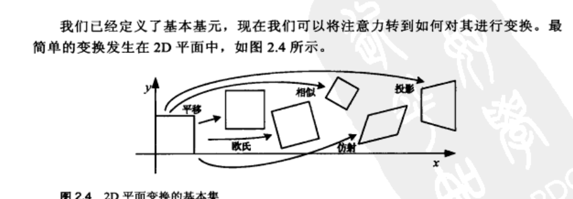
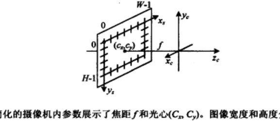
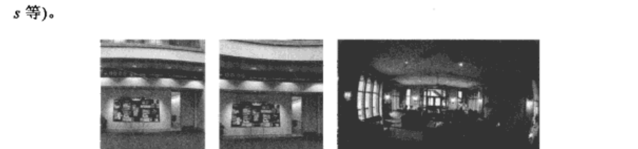

# 第2章 图像形成

来源：Szeliski《计算机视觉——算法与应用》中文第一版第2章；书页 25–76 / PDF 39–90。未越界第3章（书页 77 / PDF 91 起）。

## 本章总览

能智能地分析和处理图像之前，先要有描述场景几何的词汇，也要搞清一幅具体图像是怎么来的：给定光照、场景几何、表面特性和摄像机光学，如何得到那张图。

本章按三块讲：几何基元和变换（2.1）、光度测定学的图像形成（2.2）、数字摄像机（2.3）。图 2.1 把这三块画成透视投影、表面散射、镜头光学和 Bayer 阵列。后文标定、立体、Shape from X 都建立在这一章上。学完应能写出齐次坐标怎么除回来、2D/3D 变换各保什么、针孔加内参矩阵 $\mathbf{K}$ 怎么用，以及朗伯反射和径向畸变各管哪一步。

序和第1.3节允许时间紧的课先跳到第3章，晚些再回看投影深度和以物体为中心的投影。

## 核心知识点

### 几何基元

#### 2D 点、直线与齐次坐标

像素点可写成 $\mathbf{x}=(x,y)\in\mathbb{R}^{2}$，列向量如 (2.1)。也可用齐次坐标 $\tilde{\mathbf{x}}=(\tilde{x},\tilde{y},\tilde{w})\in\mathbb{P}^{2}$。只差一个尺度的矢量视为等同；$\mathbb{P}^{2}=\mathbb{R}^{3}-(0,0,0)$。

除以最后一个分量得到非齐次点：

$$
\tilde{\mathbf{x}}=(\tilde{x},\tilde{y},\tilde{w})=\tilde{w}(x,y,1)=\tilde{w}\bar{\mathbf{x}}
\tag{2.2}
$$

其中 $\bar{\mathbf{x}}=(x,y,1)$ 是增广矢量。$\tilde{w}=0$ 的点叫理想点或无穷远点，没有普通像素位置。

2D 直线用齐次 $\tilde{\mathbf{l}}=(a,b,c)$，方程 $\tilde{\mathbf{x}}\cdot\tilde{\mathbf{l}}=ax+by+c=0$（2.3）。可把法向单位化成 $(\hat{\mathbf{n}},d)$，$d$ 是到原点的距离。$\hat{\mathbf{n}}=(\cos\theta,\sin\theta)$ 时 $(\theta,d)$ 就是极坐标，后文霍夫变换(4.3.2)会用。两条直线交点 $\tilde{\mathbf{x}}=\tilde{\mathbf{l}}_{1}\times\tilde{\mathbf{l}}_{2}$（2.4）；两点连线 $\tilde{\mathbf{l}}=\tilde{\mathbf{x}}_{1}\times\tilde{\mathbf{x}}_{2}$（2.5）。圆锥曲线写成 $\tilde{\mathbf{x}}^{T}\mathbf{Q}\tilde{\mathbf{x}}=0$（2.6）。

🔑 关键速记：齐次坐标多一个 $w$；除以 $w$ 回像素，$w=0$ 是无穷远；直线和点用叉乘互转。

#### 3D 点、平面与直线

3D 点 $\mathbf{x}=(x,y,z)$ 或 $\tilde{\mathbf{x}}\in\mathbb{P}^{3}$。平面 $\tilde{\mathbf{m}}=(a,b,c,d)$，方程 $\tilde{\mathbf{x}}\cdot\tilde{\mathbf{m}}=0$（2.7）。无穷远平面是 $(0,0,0,1)$，不能单位化成唯一法向。

3D 直线没有 2D 直线那么干净的写法。两点线性组合 $\mathbf{r}=(1-\lambda)\mathbf{p}+\lambda\mathbf{q}$（2.9）；齐次 $\tilde{\mathbf{r}}=\mu\tilde{\mathbf{p}}+\lambda\tilde{\mathbf{q}}$（2.10）。两端点共 6 个数，真正自由度是 4。Plücker 坐标用 $4\times 4$ 反对称矩阵里 6 个独立非零项，再加 $\det L=0$ 这一条二次约束（2.12）。本书后文更常用有限线段或已知方向。二次曲面 $\tilde{\mathbf{x}}^{T}\mathbf{Q}\tilde{\mathbf{x}}=0$（2.13）点到为止。

曲线、表面和体分别推到 5.1 / 11.2、12.3、12.5 节。

🔑 关键速记：3D 平面用四元齐次；3D 直线自由度是 4，两端点写法多了两个多余参数。

### 2D 与 3D 变换

#### 2D 变换嵌套群

最简单的变换发生在 2D 平面。平移、欧氏（旋转+平移）、相似（再加均匀缩放）、仿射、投影（单应）一层套一层，构成嵌套的群：复合封闭，且属于自己的逆。后文 3.6 节在图像上施加这些变换时，群的性质会用到。

表 2.1（齐次下把 $2\times 3$ 扩成 $3\times 3$）：

| 变换 | 矩阵 | 自由度 | 保持 |
| --- | --- | --- | --- |
| 平移 | $[\mathbf{I}\mid\mathbf{t}]_{2\times 3}$ | 2 | 方向 |
| 刚性(欧氏) | $[\mathbf{R}\mid\mathbf{t}]_{2\times 3}$ | 3 | 长度 |
| 相似 | $[s\mathbf{R}\mid\mathbf{t}]_{2\times 3}$ | 4 | 夹角 |
| 仿射 | $[\mathbf{A}]_{2\times 3}$ | 6 | 平行性 |
| 投影 | $[\tilde{\mathbf{H}}]_{3\times 3}$ | 8 | 直线性 |

平移 $\mathbf{x}'=\mathbf{x}+\mathbf{t}$，齐次写成 $[\mathbf{I}\ \mathbf{t}; \mathbf{0}^{T}\ 1]$（2.15）。欧氏 $\mathbf{x}'=\mathbf{R}\mathbf{x}+\mathbf{t}$，$\mathbf{R}$ 是 $2\times 2$ 正交且 $\det\mathbf{R}=1$（2.16）（2.17）。相似 $\mathbf{x}'=s\mathbf{R}\mathbf{x}+\mathbf{t}$（2.18）。仿射 $\mathbf{x}'=\mathbf{A}\bar{\mathbf{x}}$，$\mathbf{A}$ 为 $2\times 3$（2.19），平行线仍平行。投影 $\tilde{\mathbf{x}}'=\tilde{\mathbf{H}}\tilde{\mathbf{x}}$（2.20），$\tilde{\mathbf{H}}$ 只定义到相差一个尺度；要非齐次结果必须再除以第三个分量（2.21）。投影保直线，不保平行。

直线（共向量）怎么变：若点按 $\mathbf{x}'=\tilde{\mathbf{H}}\mathbf{x}$，则 $\tilde{\mathbf{l}}'=\tilde{\mathbf{H}}^{-T}\tilde{\mathbf{l}}$（2.22）。因为投影矩阵是齐次的，逆转置等于伴随。

表 2.1 之外还有：拉伸/挤压（仿射的受限形式，不能干净嵌进群里）；平面状表面流 8 参数（含 $x^{2},xy,y^{2}$）；双线性内插 8 参数（含 $xy$，常用来插一个方块四角的运动）。双线性一般不保直线性，只保平行于方块轴的线。

🔑 关键速记：2D 变换是嵌套群，自由度 2/3/4/6/8；投影用 $3\times 3$，点右乘、直线用逆转置。

#### 3D 变换

与 2D 非常像，齐次下把 $3\times 4$ 扩成 $4\times 4$。表 2.2：平移 3、刚性 6、相似 7、仿射 12、投影 15。刚体 $\mathbf{x}'=\mathbf{R}\mathbf{x}+\mathbf{t}$，$\mathbf{R}$ 是 $3\times 3$ 正交且 $\det=1$（2.24）。绕某中心 $\mathbf{c}$ 转可写成 $\mathbf{x}'=\mathbf{R}(\mathbf{x}-\mathbf{c})$（2.25），$\mathbf{c}$ 常取摄像机中心。3D 投影（透视 / 单应 / 直射）作用在齐次上，$\tilde{\mathbf{H}}$ 为 $4\times 4$（2.28）。

🔑 关键速记：3D 刚体 6 自由度；投影 15 自由度；旋转矩阵的参数化比 2D 麻烦得多。

### 3D 旋转

欧拉角把旋转写成绕坐标轴三次相乘，结果依赖顺序，参数空间还不光滑（万向节锁）。本书不列欧拉公式。

推荐轴角：轴 $\hat{\mathbf{n}}$ 与角 $\theta$，或 $\boldsymbol{\omega}=\theta\hat{\mathbf{n}}$。把 $\mathbf{v}$ 拆成平行于轴的分量 $\mathbf{v}_{\parallel}=(\hat{\mathbf{n}}\cdot\mathbf{v})\hat{\mathbf{n}}$ 和垂直分量，垂直分量在轴上转 $\theta$，得到 Rodriguez 公式：

$$
\mathbf{R}(\hat{\mathbf{n}},\theta)=\mathbf{I}+\sin\theta[\hat{\mathbf{n}}]_{\times}+(1-\cos\theta)[\hat{\mathbf{n}}]_{\times}^{2}
\tag{2.34}
$$

叉乘矩阵 $[\hat{\mathbf{n}}]_{\times}$ 见 (2.32)。小角度时 $\mathbf{R}(\boldsymbol{\omega})\approx\mathbf{I}+[\boldsymbol{\omega}]_{\times}$（2.35），于是 $\mathbf{Rv}\approx\mathbf{v}+\boldsymbol{\omega}\times\mathbf{v}$，对 $\boldsymbol{\omega}$ 求导方便（2.36）。矩阵指数 $\mathbf{R}=\exp[\boldsymbol{\omega}]_{\times}$（2.37）展开后又回到 Rodriguez。

单位四元数 $\mathbf{q}=(x,y,z,w)$，$\|\mathbf{q}\|=1$；$\mathbf{q}$ 与 $-\mathbf{q}$ 表示同一旋转。从轴角：

$$
\mathbf{q}=\bigl(\sin(\theta/2)\hat{\mathbf{n}},\ \cos(\theta/2)\bigr)
\tag{2.39}
$$

转到矩阵用 (2.41)。四元数乘法对应旋转复合且不可交换（2.42）；求逆只需把虚部 $x,y,z$ 反号、不改 $w$（2.43）。两个姿态之间的平滑过渡用球面线性内插(slerp)，算法 2.1：先算相对四元数，再按比例取角。书通常优先四元数；增量更新时用轴角，细节见 6.2.2 节。

🔑 关键速记：不要用欧拉角；Rodriguez 给轴角，四元数给插值和复合，小转动才用 $\mathbf{I}+[\boldsymbol{\omega}]_{\times}$。

### 3D 到 2D 投影

最简单的是正交投影：丢掉 $z$，得到 $\mathbf{x}=[\mathbf{I}_{2\times 2}\mid\mathbf{0}]\mathbf{p}$（2.46）。它适合长焦、物体深度远小于物距的情形。实践里更常用归的正交投影(scaled orthography)：先乘一个缩放 $s$（2.48），相当于先投到局部正放平面再按透视缩放。类透视投影(para-perspective)先投到平行于像面的平面，再沿指向物体中心的视线投到像面，两步合起来是仿射（2.49），3D 平行线在图上仍平行。

真正常用的是透视投影：非齐次 $\mathcal{P}_{z}(\mathbf{p})=(x/z,\ y/z,\ 1)$（2.50）；齐次则丢掉 $\tilde{w}$ 分量（2.51）。除以 $z$ 之后回不到原来的深度。图形学里常见的两步是：先规范到设备坐标，再用视口变成像素；也可以写成带近/远裁剪面的 $4\times 4$（2.52）。把 $z$ 换成深度的倒数（视差）往往比直接用距离更良态。

#### 摄像机内参与 $\mathbf{K}$

针孔投完之后，还要把度量坐标变成像素。传感器平面用间距 $(s_{x},s_{y})$、原点 $\mathbf{c}_{s}$ 和旋转 $\mathbf{R}_{s}$ 描述（图 2.8）。合成后 $\mathbf{p}=\mathbf{M}_{s}\tilde{\mathbf{x}}_{s}$（2.53）。内参矩阵定义为 $\tilde{\mathbf{x}}_{s}=\alpha\mathbf{M}_{s}^{-1}\mathbf{p}_{c}=\mathbf{K}\mathbf{p}_{c}$（2.54）。$\mathbf{K}$ 管摄像机内部；方向和位置是外参 $(\mathbf{R},\mathbf{t})$。

完整投影：

$$
\tilde{\mathbf{x}}_{s}=\mathbf{K}[\mathbf{R}\mid\mathbf{t}]\mathbf{p}_{w}=\mathbf{P}\mathbf{p}_{w},\qquad \mathbf{P}=\mathbf{K}[\mathbf{R}\mid\mathbf{t}]
\tag{2.55}\text{–}(2.56)
$$

$\mathbf{K}$ 常取上三角。一般形式含 $f_{x},f_{y}$、倾斜 $s$ 和光心 $(c_{x},c_{y})$（2.57）。实践里多设纵横比 $a=1$、$s=0$，得到：

$$
\mathbf{K}=\begin{bmatrix} f & 0 & c_{x}\\ 0 & f & c_{y}\\ 0 & 0 & 1\end{bmatrix}
\tag{2.59}
$$

光心常取图像中心 $(W/2,H/2)$，只剩一个未知量 $f$。注意：书中 $W$ 是宽度、$H$ 是高度；有的图形库 $y$ 轴朝上，和图像处理里 $y$ 向下不一致。

焦距依赖像素单位。图 2.10 给出视场关系：

$$
\tan(\theta/2)=W/(2f)\quad\text{或}\quad f=(W/2)[\tan(\theta/2)]^{-1}
\tag{2.60}
$$

胶片相机 $W=35\,\mathrm{mm}$，$f$ 用毫米；数字图用像素表示 $W$，则 $f$ 直接进 $\mathbf{K}$。像素焦距和 35mm 焦距不能拿数字直接比：从无单位 $f$ 到像素乘 $W/2$，从像素到 35mm 乘 $35/W$。

满秩 $4\times 4$ 写法 $\tilde{\mathbf{P}}=\tilde{\mathbf{K}}\mathbf{E}$（2.64）可把最后一行映射成平面加平行视差（投影深度）$d=s_{1}(\hat{\mathbf{n}}_{0}\cdot\mathbf{p}_{w}+c_{0})$（2.66）。$d=1/z$ 是深度的倒数。两台摄像机之间：若已知第一幅的视差，可反投到 3D 再投到第二幅，得到单应 $\tilde{\mathbf{x}}_{1}\sim\mathbf{M}_{10}\tilde{\mathbf{x}}_{0}$（2.70）。普通照片通常没有逐像素深度，这一步留给立体和第11章。

📝待补全：有标定板时，每张图先估平面到像的单应，再在 $\mathbf{B}=\mathbf{K}^{-\mathrm{T}}\mathbf{K}^{-1}$ 上列线性约束，这就是 Zhang 的 N 平面法。人造场景里两个正交有限消失点能估焦距 (6.51)，三个消失点的垂心能给光心。纯旋转全景则用 $\hat{\mathbf{H}}=\mathbf{K}\mathbf{R}\mathbf{K}^{-1}$。仅靠单张未标定图恢复不了传感器的真实物理方向；把 $\mathbf{P}$ 前面 $3\times 3$ 做 RQ 分解得到上三角 $\mathbf{K}$ 和旋转，视觉里这个 $\mathbf{R}$ 是旋转不是上三角。完整公式见第6.3节。

👉 完整深度讲解见第6章。

🔑 关键速记：$\mathbf{P}=\mathbf{K}[\mathbf{R}\mid\mathbf{t}]$；日常 $\mathbf{K}$ 用 (2.59)；像素 $f$ 和 35mm $f$ 差一个 $W$ 的换算。

### 镜头畸变

线性投影假定「世界直线→图像直线」。广角镜头常有径向畸变（失真）：桶形向外鼓、枕形向里收。不校正的话，全景拼接会糊，因为对应点在像素混合前对不齐。切向和偏心畸变书中不覆盖。

设透视除法之后、乘焦距之前的坐标为 $(x_{c},y_{c})$（2.77）。最简单的径向模型：

$$
\hat{x}_{c}=x_{c}(1+\kappa_{1}r_{c}^{2}+\kappa_{2}r_{c}^{4}),\quad
\hat{y}_{c}=y_{c}(1+\kappa_{1}r_{c}^{2}+\kappa_{2}r_{c}^{4})
\tag{2.78}
$$

其中 $r_{c}^{2}=x_{c}^{2}+y_{c}^{2}$。然后再 $x_{s}=f\hat{x}_{c}+c_{x}$（2.79）。参数估计见 6.3.5 节。鱼眼要用等距投影一类模型，不是这个多项式；图 2.13c 几乎能到 180°。

很多应用里，先把径向畸变矫回线性成像器，再继续用上三角 $\mathbf{K}$ 和分解。

🔑 关键速记：径向畸变发生在透视除法后、乘 $f$ 前；先矫回直线，再当针孔用。

### 光度测定学的图像形成

图像不是 2D 特征的清单，而是色彩或亮度数值。这些值来自光源、表面、几何、光学和传感器（图 2.14）。简化模型通常忽略多次反射。

#### 照明

没有光就没有图像。点光源来自一个位置（或无穷远的太阳），强度按距离平方衰减；软阴影里太阳必须当面光源。面光源更复杂。环境贴图(environment map)把更复杂的光照写成方向 $\hat{\mathbf{v}}$ 到波长 $\lambda$ 的函数 $L(\hat{\mathbf{v}};\lambda)$（2.80），可从镜面球照片展开。

#### 反射：BRDF、朗伯、Phong

光线打到表面后散射。最一般的是双向反射分布函数(BRDF) $f_{r}(\theta_{i},\phi_{i},\theta_{r},\phi_{r};\lambda)$（2.81），对入射和反射方向互易（Helmholtz）。各向同性表面可简化成 (2.82)。出射辐射要对入射光与 BRDF 积分，并乘透视收缩 $\cos^{+}\theta_{i}=\max(0,\cos\theta_{i})$（2.83）（2.84）。离散点光源改求和（2.85）。

漫反射（朗伯）在所有方向均匀散光，BRDF 为常数（2.86），但收到的光仍随 $\hat{\mathbf{v}}_{i}\cdot\hat{\mathbf{n}}$ 变：

$$
L_{d}(\hat{\mathbf{v}}_{r};\lambda)=\sum_{i}L_{i}(\lambda)f_{d}(\lambda)[\hat{\mathbf{v}}_{i}\cdot\hat{\mathbf{n}}]^{+}
\tag{2.87}
$$

背光一侧 $[\cdot]^{+}=0$，就是自身阴影。镜面反射把入射绕法向折到镜向 $\hat{\mathbf{s}}_{i}$；Phong 用 $\cos^{k_{s}}\theta_{s}$（2.90），Torrance–Sparrow 用高斯（2.91）。Phong 阴影再加不依赖法向的环境项 $f_{a}=k_{a}L_{a}$（2.92），合起来是 (2.93)。环境项颜色 $k_{a}$ 和漫反射 $k_{d}$ 通常相同（次表面体反射）；镜面 $k_{s}$ 常接近白。色散反射把界面反射和体反射分开（2.94）（2.95），后文可启发 Bayer 去马赛克。

全局光照（光线追踪、辐射度）能解释多次反弹，本书不细讲；从照片恢复 BRDF 见 12.7.1 节。

📝待补全：由明暗恢复形状把辐照度写成 $I=R(p,q)$，朗伯公式即本章 $[\mathbf{v}\cdot\mathbf{n}]^{+}$；每个像素两个未知 $(p,q)$、一个测量，必须加光滑或可积 $p_y=q_x$。相机不动、换 $\ge 3$ 个已知灯，光度立体 $I_k=\rho\hat{\mathbf{n}}\cdot\mathbf{v}_k$ 可线性解 $\rho\mathbf{n}$，再积分成深度。镜面要更多方向；凹处互反射会当额外光源。完整算法见第12.1节。本章只给出正向成像。

👉 完整深度讲解见第12章。

🔑 关键速记：朗伯看「光和法向夹角」；高光看镜向；BRDF 是把两者都包进去的总表。

#### 光学：光圈、$f$ 数、辐照度

薄透镜把物距、像距和焦距连在一起；景深是聚焦距离和光圈孔径 $d$ 的函数。$f$ 数

$$
N=f/d
\tag{2.97}
$$

级数按 $\sqrt{2}$ 进阶，每加一档通光面积减半，和减一档曝光时间等价。到达传感器的辐照度

$$
E=L\,\frac{\pi}{4}\Bigl(\frac{d}{f}\Bigr)^{2}\cos^{4}\alpha
\tag{2.101}
$$

与像素面积无关（这是傻瓜相机比大底噪声大的原因之一），并含 $f$ 数平方的倒数和 $\cos^{4}\alpha$ 自然虚影。机械虚影来自镜筒挡光，标定见 10.1.3 节。真实镜头还有赛德尔像差（球差、彗差、像散、场曲、畸变）。

🔑 关键速记：$N=f/d$；光圈越大 $E$ 越大；$\cos^{4}\alpha$ 让边角变暗。

### 数字摄像机

光经镜头落到传感器，再变成我们看到的 RGB 数。流水线包括曝光、非线性响应、采样与混叠、噪声、ADC、以及去马赛克/白平衡/伽马/压缩。

#### 采样与混叠

感光元填充率不够或带宽有限时，高于奈奎斯特的频率会折进低频，叫混叠（走样）。一维例子：用 $f=2$ 采样 $f=3/4$ 和 $f=5/4$ 会得到同一串样本。抗混叠要在采样前低通；后文 3.4、3.5.2 会讲滤波器怎么减操作引入的混叠。

噪声水平函数(NLF)可用 CRF 数据库或拍色卡来估，去噪、边缘和立体都会受益。多数相机 JPEG 是 8 位；单反 RAW 名义 16 位。预测前要标定响应，因为曝光和增益会改方差。

#### 色彩

传感器把光谱积分成离散的红绿蓝。加性基色 RGB 能混出青、洋红、黄、白；减性 CMY（印刷）吸收光谱。人眼有三种视锥，所以三基色够用；遥感和监控常加更多波段或近红外。CIE 色度图给出可感知颜色的 $(x,y)$；要把亮度和色度分开可用 Yxy。L*a*b*（CIELAB）用非线性把感觉上均匀的差别映射得更匀，(2.105)–(2.107)。多数图像其实是伽马压缩过的 R'G'B'，和感知均匀的 L*a*b* 不是一回事——先问要解决什么问题再选空间。

Bayer 阵列每 $2\times 2$ 里绿占两格、红蓝各一格（图 2.1d）。从马赛克恢复满彩色叫去马赛克，完整算法在计算摄影一章。

📝待补全：去马赛克把 Bayer 的稀疏红/绿/蓝插成每像素三通道。绿通道采样更密，应主导边缘方向；双线性不管边，会在轮廓上出拉链和假彩色。局部二色先验把邻域收到两条色线上，可同时减轻光晕，也可和多帧超分一次做完。白平衡和伽马仍在链路后段。完整对比见图 10.35 与第10.3.1节。计算应尽量在线性 RAW 上做，JPEG 8 位已经过伽马，不能直接当线性亮度。

👉 完整深度讲解见第10章。

🔑 关键速记：三通道来自三种视锥，不是因为光只有三种波长；Bayer 先稀疏再插值。

#### 压缩

除非 RAW/PNG，最后通常有损压缩。先转到 YCbCr，对色度更狠地降采样；再分块 DCT（JPEG 常用 $8\times 8$），量化后做 Huffman 或算术编码。DC 系数还可按块预测。质量太低会出现块效应和高频蚊子噪声（图 2.33）。DCT 细节见 3.4.3 节。

🔑 关键速记：JPEG 先保亮度、再丢色度、再量化 DCT；看起来糊或开花，往往是压缩而不是光学。

## 易混淆点&差异对比

### 齐次 $w=0$ vs 普通像素

$w\neq 0$ 才能除回 $(x,y)$。$w=0$ 表示无穷远方向，不是「像素在无限远的屏幕上」。平行线在透视下交于这样一个点。

### QR 里的 R vs 旋转 R

把 $\mathbf{P}$ 做 QR 分解时，代数教材里的 $\mathbf{R}$ 是上三角；视觉里 $\mathbf{R}$ 是旋转。书提醒这是术语冲突。内参 $\mathbf{K}$ 才是上三角。

### 像素焦距 vs 35mm 焦距

同样写 $f$，单位一变数字就变。(2.60) 用当前的 $W$（像素宽或 35mm）才能和视场对应。不要拿手机 App 上的「26mm」去和 $\mathbf{K}$ 里的像素 $f$ 直接比。

### 正交 / 归的正交 / 类透视 / 透视

正交丢 $z$，平行线仍平行。归的正交多一个全局缩放，适合 SfM 里深度变化不大。类透视是仿射，仍保 3D 平行。透视除以 $z$，平行线可相交，因子分解那套正交算法会失效。

### 径向公式写在哪一步

(2.78) 在透视除法之后、乘 $f$ 之前。有的文献把畸变写在像素平面上，系数不是同一套 $\kappa$。切向畸变本书不估。

### 朗伯 vs Phong vs BRDF

朗伯只看入射与法向，没有高光。Phong 用三项凑环境+漫射+高光，图形学常用，物理上已被更精细的微面元模型取代。BRDF 是总表，二者都是它的特例。

### 线性域 vs 伽马图

传感器线性辐照经过伽马才存成 8 位 JPEG。在压缩过的像素上做「物理」运算会偏。去马赛克和光度计算应尽量回到线性域。

## 本章要点总结

- 齐次点除以 $w$ 回像素；$w=0$ 是无穷远。2D 直线用 $\tilde{\mathbf{l}}$，交点与连线靠叉乘。
- 2D 变换自由度 2/3/4/6/8，3D 为 3/6/7/12/15；点用 $\mathbf{H}$，直线用 $\mathbf{H}^{-T}$。
- 旋转用 Rodriguez (2.34) 或四元数 (2.39)(2.41)，欧拉角不推荐。
- 投影 $\mathbf{P}=\mathbf{K}[\mathbf{R}\mid\mathbf{t}]$，日常 $\mathbf{K}$ 取 (2.59)；$\tan(\theta/2)=W/(2f)$。
- 径向畸变 (2.78) 在除 $z$ 之后、乘 $f$ 之前；鱼眼另说。
- 朗伯 $[\mathbf{v}\cdot\mathbf{n}]^{+}$；Phong 再加环境和高光。辐照度 $E$ 含 $(d/f)^{2}$ 和 $\cos^{4}\alpha$。
- Bayer + 伽马 + JPEG 是传感器之后的事；去马赛克已在第10.3.1节（绿通道主导，防拉链/假彩色），滤波抗混叠留第3章。
