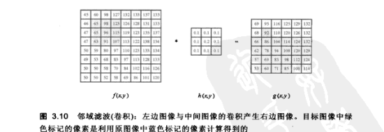
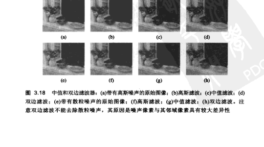
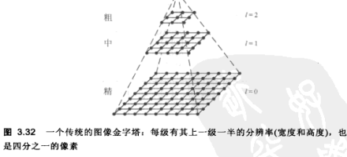
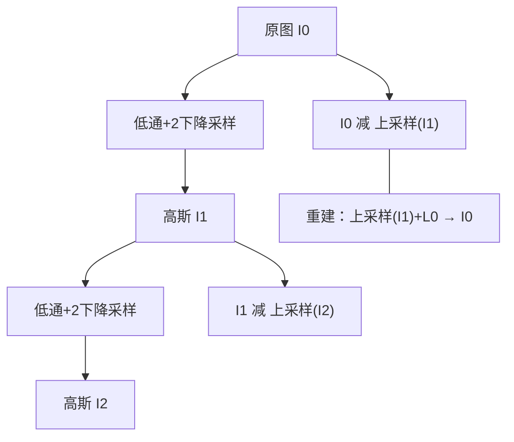

# 第3章 图像处理

来源：Szeliski《计算机视觉——算法与应用》中文第一版第3章；书页 77–156 / PDF 91–170。未越界第4章（书页 157 / PDF 171 起）。

## 本章总览

第2章讲完几何、光度和传感器之后，视觉流水线的**第一步**通常仍是图像处理：把像素改成更便于后续分析的形式。曝光校正、白平衡、去噪、锐化、旋转矫正都属于这一层（图 3.1）。

有人觉得这不像「计算机视觉」，但计算摄影和识别要得到满意结果，往往先要把预处理设计对。本章回顾标准算子：一幅图到另一幅图的像素映射。图像处理也是信号处理的后续课程。

路径是：先做不看邻域的点算子（3.1），再做线性邻域滤波（3.2）和非线性 / 形态学 / 距离 / 连通量（3.3），用傅里叶看频率（3.4），用金字塔和小波换分辨率（3.5），再改定义域做几何卷绕（3.6）。最后用能量最小和马尔可夫随机场(Markov Random Field, MRF)做全局优化（3.7）——第1.3节强调这里是全书**首次**引入贝叶斯推断，更抽象的层次在附录 B。

抠图细节留第10章，拼接选缝与融合留第9章。学完应能分清相关与卷积、何时用中值而不用高斯、金字塔每级面积为何是四分之一，以及正则项 $\lambda$ 和 MRF 成对势能各管什么。

## 核心知识点

### 点算子

#### 像素变换

点运算的输出只取决于该像素输入（可再加一些全局统计）。连续域写成 $g(\mathbf{x})=h(f(\mathbf{x}))$ 或多输入 $h(f_0,\ldots,f_n)$（3.1）；离散网格上是 $g(i,j)=h(f(i,j))$（3.2）。

最常用的两个是乘增益和加偏差：

$$
g(\mathbf{x})=a f(\mathbf{x})+b
\tag{3.3}
$$

$a>0$ 管对比度，$b$ 管亮度（图 3.2b–c）。二者也可以随位置变，如分级密度滤镜（3.4）。乘法增益服从叠加原理（3.5），是线性算子；像素平方一类能量估计则不是。

线性混合 $g=(1-\alpha)f_0+\alpha f_1$（3.6）用来淡入淡出，也是变形(morphing)的一部分（3.6.3）。伽马校正把传感器的非线性倒回去：

$$
g(\mathbf{x})=[f(\mathbf{x})]^{1/\gamma}
\tag{3.7}
$$

多数数字摄像机 $\gamma$ 取 2.2。计算应尽量在线性辐照域做。👉 伽马与传感器非线性见第2.3.2节。

🔑 关键速记：点运算不看邻居；$g=af+b$ 调亮暗，伽马 $\gamma\approx 2.2$ 把显示非线性解开。

#### 彩色变换、合成与抠图

三个通道加同一个常数，亮度会变，但色调和饱和度也会跟着跑。更稳的做法是先算亮度坐标，只增强 $Y$，再按原色度合回 RGB。白平衡可对每通道乘不同尺度，或经 XYZ 扭白点后再映回 RGB。

从场景裁前景放到新背景叫**抠图(matting)**；把物体嵌进另一幅图叫**合成(compositing)**。中间量是透明度遮罩 $\alpha$：物体内 $\alpha=1$，外 $\alpha=0$，边界平滑过渡以免锯齿。覆盖算子(over operator)为

$$
C=(1-\alpha)B+\alpha F
\tag{3.8}
$$

预乘 $\alpha F$ 的 RGBA 更利于再采样。局部彩色一致性时，抠图才好把 $F$ 和 $\alpha$ 拆开。

📝待补全：合成用 $C=(1-\alpha)B+\alpha F$ 容易，反求 $\alpha,F,B$ 每个像素却有 7 个未知。蓝屏 / 三角剖分 / 差分靠已知背景；自然图要 trimap 或几笔约束。闭式 Laplacian 假设局部颜色落在一条色线上，消掉仿射参数后变成 $\boldsymbol{\alpha}^{T}L\boldsymbol{\alpha}$ 的稀疏线性系统，毛发比硬分割干净得多。视频还可把关键帧 trimap 用光流传开。完整算法见第10.4节。本章只把合成写成点运算。

👉 完整深度讲解见第10章。

🔑 关键速记：合成用 $C=(1-\alpha)B+\alpha F$；$\alpha$ 是覆盖程度，不是「第四种颜色」。

#### 直方图均衡化与色调调整

全局做法：把最亮最暗拉到纯白纯黑，或把均值放到中间灰。直方图是各灰度出现次数；8 位图要 256 项累计表。累积分布

$$
c(I)=\frac{1}{N}\sum_{i=0}^{I}h(i)=c(I-1)+\frac{1}{N}h(I)
\tag{3.9}
$$

映射 $f(I)=c(I)$ 会让直方图变「平」，观感对比度往往上去，但暗区噪声也会被放大。可与恒等混合 $f(I)=\alpha c(I)+(1-\alpha)I$ 折中。

分块做均衡会出现块边界不连续（图 3.8b）；真正局部自适应要把每个像素附近的分布估平滑，而不是硬切 $M\times M$ 块。更复杂的色调映射放到 10.2.1 节动态范围。

🔑 关键速记：均衡用累积分布 $c(I)$ 当映射；全局会抬暗噪声，分块会出接缝。

### 线性滤波

#### 相关、卷积与边界填塞

邻域算子用周围像素决定输出。线性滤波是加权和：

$$
g(i,j)=\sum_{k,l}f(i+k,j+l)h(k,l)
\tag{3.12}
$$

$h(k,l)$ 叫滤波系数。书中把 (3.12) 称为**相关**，$g=f\circledast h$（3.13）。把核翻转后是**卷积**：

$$
g(i,j)=\sum_{k,l}f(i-k,j-l)h(k,l)=\sum_{k,l}f(k,l)h(i-k,j-l)
\tag{3.14}
$$

$g=f*h$（3.15），$h$ 是脉冲响应。卷积可交换、可结合；两图卷积的傅里叶变换等于各自变换的乘积。相关和卷积都是线性平移不变(LSI)算子，服从叠加（3.16）和移位不变（3.17）。核随位置变时写成 $h(k,l;i,j)$（3.18），可用来建散焦模型。

向量化后 $g=\mathbf{H}f$（3.19），$\mathbf{H}$ 是稀疏卷积矩阵。边界要填塞，否则角会变暗。书列：0 填塞、常数填塞、夹取/复制边缘、循环重叠、镜像、延长。图形学里对应 OpenGL「重叠模式」或 Direct3D「纹理寻址」。先对带 $\alpha$ 的 0 填塞图模糊，再用遮罩归一，暗角会轻很多（图 3.13）。

🔑 关键速记：相关不翻核，卷积翻核；两者都是 LSI；边界填塞选不好就会出黑框或接缝。

#### 可分离核与常用线性滤波器

$K\times K$ 核每像素要 $K^2$ 次乘加。若 $\mathbf{K}=\mathbf{v}\mathbf{h}^{T}$（3.20），可先水平再垂直，共 $2K$ 次。用 SVD 看 2D 核：只有一个非零奇异值才可分离（3.21）；多个显著奇异值可累加几对可分离核（Perona 1995）。

图 3.14 给出可分离例子：方框、双线性、高斯、Sobel、角点。方框是移动平均，大核可用滑动窗口递推。线性帐篷(tent)核是两个一阶样条的乘积，也叫 Bartlett。高斯可由 tent 反复卷积近似，应用里常微调模板（Freeman and Adelson 1991）。平滑核是低通：压高频、留低频。理想低通是 $\mathrm{sinc}$，空域无限、有振铃。

锐化把模糊前后的差加回去：

$$
g_{\mathrm{sharp}}=f+\gamma(f-h_{\mathrm{blur}}*f)
\tag{3.22}
$$

暗房里对应「反锐化掩模」$g_{\mathrm{unsharp}}=f(1-\gamma h_{\mathrm{blur}}*f)$（3.23），后者非线性。Sobel 是可分离的一阶差分，突出水平/垂直边；图 3.14e 的角点核同时响应直角和部分对角边。更好的旋转不变角点在 4.1 节。

🔑 关键速记：能写成 $\mathbf{v}\mathbf{h}^{T}$ 就先横后竖；方框糊、高斯更稳、锐化是「原图减模糊再加回」。

#### 带通、导向滤波与非线性邻域

高斯

$$
G(x,y;\sigma)=\frac{1}{2\pi\sigma^{2}}\exp\left(-\frac{x^{2}+y^{2}}{2\sigma^{2}}\right)
\tag{3.24}
$$

之后再取导数，得到带通核。无方向二阶导是拉普拉斯 $\nabla^{2}f$（3.25）；先高斯再拉普拉斯等价于 LoG：

$$
\nabla^{2}G(x,y;\sigma)=\left(\frac{x^{2}+y^{2}}{\sigma^{4}}-\frac{2}{\sigma^{2}}\right)G(x,y;\sigma)
\tag{3.26}
$$

五点拉普拉斯是其紧凑近似。方向导数可写成 $\hat{\mathbf{u}}\cdot\nabla(G*f)=(\nabla_{\hat{\mathbf{u}}}G)*f$（3.27）；$G_{\hat{\mathbf{u}}}=uG_{x}+vG_{y}$（3.28）具有导向（steerable）性：少数基滤波再线性组合就能转方向。

线性平滑去不掉散粒噪声，只会把它摊成斑。中值滤波取邻域中值，散粒常落在两端，容易滤掉。双边滤波把定义域高斯 $d$（3.35）和值域高斯 $r$（3.36）相乘：

$$
w(i,j,k,l)=\exp\left(-\frac{(i-k)^{2}+(j-l)^{2}}{2\sigma_{d}^{2}}-\frac{\|f(i,j)-f(k,l)\|^{2}}{2\sigma_{r}^{2}}\right)
\tag{3.37}
$$

$$
g(i,j)=\frac{\sum_{k,l}f(k,l)w(i,j,k,l)}{\sum_{k,l}w(i,j,k,l)}
\tag{3.34}
$$

值域核看亮度（彩色则看矢量距离）像不像中心像素，所以能保边。它去不掉与邻域差很大的散粒——那正是中值的强项。迭代四点邻域形式（3.40）与 Perona–Malik 各向异性扩散同类，值域核也叫边缘停滞或扩散系数；$\eta\to 0$ 时趋近梯度范数惩罚的最小化，接到 3.7 节。

🔑 关键速记：高斯糊边也糊噪声；中值打散粒；双边按「空间近且灰度像」加权，保边不打点噪声。

### 形态学、距离与连通量

二值化 $\theta(f,t)=1$ 当 $f\ge t$（3.41）。形态学可看成结构元素 $s$ 与二值图卷积后，再按阈值取 0/1。令 $c=f\circledast s$（3.42）为结构内 1 的个数，$S$ 为结构大小，则：膨胀 $\mathrm{dilate}(f,s)=\theta(c,1)$；腐蚀 $\mathrm{erode}(f,s)=\theta(c,S)$；过半 $\mathrm{maj}(f,s)=\theta(c,S/2)$；开运算 $\mathrm{open}=\mathrm{dilate}(\mathrm{erode}(f,s),s)$。闭运算按括号内顺序是 $\mathrm{erode}(\mathrm{dilate}(f,s),s)$。本节扫描件把闭运算也印成了 $\mathrm{open}(\cdots)$，以算子嵌套为准：开先腐蚀后膨胀（去小点），闭先膨胀后腐蚀（填小洞）。结构太窄时，开运算去不掉笔画上的点。

距离变换 $D(i,j)$ 是到最近背景（值为 0）的距离（3.45）。城街距离 $d_{1}=|k|+|l|$（3.43）可用正反向两趟光栅扫描；欧氏 $d_{2}=\sqrt{k^{2}+l^{2}}$（3.44）要斜边规则，不能只比轴对齐邻域。从黑区向外长、白区成脊，也叫烧草变换；脊可当骨架。符号距离场再结合物体的补图距离，是水平集(5.1.4)的特征函数。

**连通量**（书中用语，即连通分量）：取值相同且 4 邻接的像素构成一块。算法概念上先给水平行程贴唯一标签，垂直邻接时尽量合并。统计量包括面积、周长、质心、二阶矩 $M$（3.46）；本征分析给出长短轴。多数图像库已有现成实现。

🔑 关键速记：开去小点、闭填小洞；距离是到背景的最短路；连通量是「同色且挨着」的一块。

### 傅里叶变换

用已知频率的正弦 $s(x)=\sin(\omega x+\phi_{i})$（3.47）看滤波器：卷积后仍是同频正弦，只改幅度 $A$ 和相位（3.48）。复数形式 $e^{j\omega x}$（3.49）。连续傅里叶变换（3.53），离散(DFT)

$$
H(k)=\frac{1}{N}\sum_{x=0}^{N-1}h(x)e^{-j\frac{2\pi kx}{N}}
\tag{3.54}
$$

有意义的 $k$ 在 $[-N/2,N/2]$，再大就混叠。DFT 直接算 $O(N^{2})$，FFT 为 $O(N\log_{2}N)$。表 3.1：叠加、平移乘线性相位、反向取共轭、卷积变乘积、相关变共轭乘积、乘变卷积、微分乘 $j\omega$、Parseval。方框核频响有旁瓣（振铃）；二项核 $(1,4,6,4,1)/16$ 更接近高斯；Sobel 对应 $\sin\omega$，角点对应 $\frac12(1-\cos\omega)$（表 3.3）。

维纳滤波在频域对 $O=S+N$ 做 MAP：高斯先验下

$$
W(\omega_{x},\omega_{y})=\frac{1}{1+P_{n}/P_{s}}=\frac{1}{1+\sigma_{n}^{2}/P_{s}(\omega_{x},\omega_{y})}
\tag{3.74}
$$

低频 $P_{s}\gg\sigma_{n}^{2}$ 时增益近 1，高频则按噪声功率衰减。模糊加噪声 $o=b*s+n$（3.75）的维纳形式留作习题，更强去卷积见 3.7 与 10.3。DCT（3.76）（3.77）是 JPEG 分块变换，第一基是块均值 DC。

🔑 关键速记：卷积在频域变乘法；FFT 把大核滤波变便宜；维纳按 $P_{s}/(P_{s}+P_{n})$ 压噪声。

### 金字塔与小波

#### 插值、降采样与高斯 / 拉普拉斯金字塔

改分辨率：插值（上采样）把核中的 $k,l$ 换成 $rk,rl$（3.78）；降采样先低通再抽第 $r$ 个样（3.80）（3.81）。双线性对应 tent，图像上会出折痕。双三次（3.79）常用 $a=-0.5$ 兼顾线性与二次；窗 $\mathrm{sinc}$ 保低频、抗混叠，但有振铃。$r=2$ 时二项核 $(1,4,6,4,1)$ 适合分析金字塔；窗 $\mathrm{sinc}$ 更适合给人看的缩小图（表 3.4、图 3.31）。

传统金字塔每级宽高减半，像素数为上一级的四分之一（图 3.32）。Burt–Adelson 用可分离五阶核 $\begin{bmatrix}c&b&a&b&c\end{bmatrix}$，$b=1/4$，$c=1/4-a/2$；取 $a=3/8$ 得二项核（3.82）（3.83）。反复卷积趋向高斯，故分析通路叫**高斯金字塔**。低通缩小后再插值回来，与原图相减得到**拉普拉斯金字塔**（带通）；重建是「上一级高斯 + 本级拉普拉斯」。DoG 是两个高斯之差（3.84），LoG 是 $\nabla^{2}(G_{\sigma}*I)$（3.85）。半倍频（五角）采样和导向金字塔是变种。

小波在空域和频域同时定位，分解无块效应。二维一级分成 LL / LH / HL / HH，HH 含不常出现的混合导数。传统金字塔用更多像素描述图像；小波常保持与原图像素总数相同（图 3.36b）。第二代提升方案先分奇偶再预测，可逆且省内存。导向可移位多尺度变换比棋盘高频小波更适合纹理分析。

拉普拉斯金字塔混合把两幅图的低频缓慢过渡、高频按纹理尽快切换，苹果与橘子那张假果是经典演示。拼多张曝光不同、配准略偏的照片时：先把缝放在重叠区里两图一致的地方（动态规划或图割，避免切人），再用拉普拉斯塔（实践中两层往往够）补低频曝光差；梯度域泊松融合把源图梯度贴进目标，求解带 Dirichlet 边界的泊松方程。平均和简单羽化去不干净半透明鬼影。大曝光差应回到辐射度域做 HDR，见第10.2节。

📝待补全：大曝光差不要在 8 位像素上平均。先标定响应 $g(z)=\log E+\log t$，用帽子权重合成辐照度，再色调映射：全局曲线保不住局部反差，双边基底或梯度域压缩才能少出光晕。选缝、金字塔与泊松的写法已在第9.3.2–9.3.4节；辐射度域 HDR 见第10.2节。

👉 完整深度讲解见第9.3.4节、第10.2节。

👉 完整深度讲解见第9章。

🔑 关键速记：塔每级面积 1/4；高斯是模糊缩小，拉普拉斯是「本级减模糊」的带通，重建可逆。

### 几何变换

点运算改值域 $g(\mathbf{x})=h(f(\mathbf{x}))$（3.87）；几何变换改定义域 $g(\mathbf{x})=f(h(\mathbf{x}))$（3.88）。参数化变换沿用第2章表 2.1：平移 2、欧氏 3、相似 4、仿射 6、投影 8（表 3.5）。

**前向卷绕**对源像素算 $\mathbf{x}'=h(\mathbf{x})$ 再写入目标（算法 3.1）：非整数位置、裂缝和空洞都不好办；把值「泼」到邻域叫体空间扫描(splatting)，仍会混叠或糊。**反向卷绕**对每个目标像素 $\mathbf{x}'$ 求 $\mathbf{x}=\hat{h}(\mathbf{x}')$ 再从源图重采样（算法 3.2）。闭合变换对 $3\times 3$ 求逆即可。光流要把目标像素映回源位置；径向畸变校正也是对校正图的每个像素去畸变图里取样。👉 变换群与径向公式见第2章。

一般重采样 $g(x,y)=\sum f(k,l)h(x-k,y-l)$（3.89）。仿射的傅里叶缩放法则 $g(A\mathbf{x})\leftrightarrow |A|^{-1}G(A^{-T}\mathbf{f})$（3.90）。透视可局部仿射近似。MIP 映射用高斯金字塔按 $l=\log_{2} r$（3.91）选级；EWA 用椭圆高斯按局部雅可比滤波。网格卷绕和基于特征的变形(morphing)先把两图卷到中间再混合，直接淡入淡出会鬼影（图 3.53）。

🔑 关键速记：几何变换改的是坐标不是灰度；反向卷绕按目标找源，空洞少、插值质量可控。

### 全局优化：正则化与 MRF

与「输入图→输出图」不同，这里先写优化准则，再求最符合准则的解。两条紧密相关的路：连续域**正则化 / 变分**（3.7.1），以及离散**贝叶斯 + MRF**（3.7.2）。例子：散乱点插表面、去噪补洞、前景/背景分割。

一维平滑泛函用一阶或二阶导数平方（3.92）（3.93）；二维对应膜能量 $\mathcal{E}_{1}=\int\|\nabla f\|^{2}$（3.94）和薄板 $\mathcal{E}_{2}$（3.95）（交叉项 $2f_{xy}^{2}$ 为旋转不变）。数据项对插值是 $\sum|f(\mathbf{x}_{i})-d_{i}|^{2}$（3.96），对去噪是 $\int|f-d|^{2}$（3.97）。总能量

$$
\mathcal{E}=\mathcal{E}_{d}+\lambda\mathcal{E}_{s}
\tag{3.98}
$$

$\lambda$ 管光滑程度。网格化后一阶、二阶变成 (3.99)(3.100)；总能量写成二次型 $\mathbf{x}^{T}A\mathbf{x}-2\mathbf{x}^{T}b+c$（3.102），最小化为稀疏 $A\mathbf{x}=b$（3.103）。鲁棒版把平方换成 $\rho(|\cdot|)$（3.104）；$p<2$ 的 $p$-范数更允许断裂。$p=1$ 即全变差(total variation)。GNC 用凸平方逐步换成非凸 $\min(x^{2},V)$（3.105）。

MRF 把未知 $\mathbf{x}$ 和观测 $\mathbf{y}$ 建成贝叶斯模型。MAP 最小化负对数后验，仍写成 $E=E_{d}+E_{p}$（3.108）。Gibbs 分布下先验是成对势能之和（Hammersley–Clifford）：

$$
E_{p}(\mathbf{x})=\sum_{\{(i,j),(k,l)\}\in\mathcal{N}}V_{i,j,k,l}(f(i,j),f(k,l))
\tag{3.109}
$$

最常用 4 邻域 $\mathcal{N}_{4}$。二值 MRF 的数据项 $wd(f,d)$（3.110）与平滑项 $s\delta(f(i,j),f(i\pm 1,\cdot))$（3.111）可用 ICM、模拟退火；更好的是重写成图的最大流 / 最小割（图割），条件是二值子模能量。顺序值（灰度、深度）用置信度传播等。二次成对势能对应高斯 MRF，最小化又回到 (3.103)。超拉普拉斯 $p<1$ 的 $\rho_{p}(d)=|d|^{p}$（3.114）更贴自然图像梯度。推断细节留附录 B。

📝待补全：图割把子模二值能量变成 s-t 网络流，多项式时间给全局最优。多标签收成一串二值问题：$\alpha$-扩张允许任何像素改成当前 $\alpha$，$\alpha$-$\beta$ 交换只在两个标签之间对换，内环都调用一次图割。信念传播在链 / 树上与动态规划等价、给出精确 MAP；环上不再保证，顺序更新和距离变换可加速，TRW-S 还维护对偶下界。模拟退火按 $e^{-E/T}$ 接受较差状态，慢，现多当对照。分割里，二值物体可把像素连到源/汇做成 s-t 图，最小割对应区域边界（Boykov–Jolly）；GrabCut 用颜色高斯混合、用户框初始化，在分割与模型之间迭代。规范割则是看簇间割除以簇的关联度，松弛成本征向量，不是同一套最大流。完整保证与移动策略见附录 B.5。

👉 完整深度讲解见附录 B；分割流程见第5章。

🔑 关键速记：正则是连续能量 $\mathcal{E}_{d}+\lambda\mathcal{E}_{s}$；MRF 是格子上的同样故事，二值常用图割。

## 易混淆点&差异对比

### 相关 vs 卷积

(3.12) 核不翻转，是相关；(3.14) 翻转，是卷积。图 3.10 配图按相关网格画，中文图题却写「卷积」。对称核（高斯、方框）二者数值一样，Sobel 一类反对称核会差一个符号。

### 高斯 vs 中值 vs 双边

高斯是线性低通，散粒变成斑。中值吃掉两端异常，保台阶边，但会剪细线和尖角。双边保边去小噪声，对「和邻居差很多」的点无效。不要用双边当散粒滤波器。

### 开运算 vs 闭运算

开 = 先腐蚀后膨胀，去小亮点、拆细连接。闭 = 先膨胀后腐蚀，填小洞、连近缝。中文版闭运算那一行函数名也印成了 $\mathrm{open}$，看括号里的嵌套顺序。

### 连通量 vs 分割

连通量要求取值相同且邻接，是半全局标签。分割（第5章）允许灰度渐变的同一物体，要用轮廓、图割或均值移位，不能只靠 4 邻同色。

### 前向卷绕 vs 反向卷绕

前向从源打到目标，易出洞和重叠。反向从目标取样，每像素都有定义，插值核直接用 3.5 节那套。畸变校正、光流、仿射变形默认走反向。

### 高斯金字塔 vs 拉普拉斯金字塔 vs 小波

高斯：每级低通缩小，像素递减。拉普拉斯：本级减上采样的下一级，带通，可完美重建。小波：常保持总系数个数与原图像素相同，方向分成 LH/HL/HH。DoG 近似 LoG，不是第三种金字塔存储格式。

### 正则化 vs MRF

正则在连续函数上积分；MRF 在离散图上加势能。二次平滑时离散化后是同一套稀疏线性系统。非二次、二值、顺序标签时，MRF + 图割 / BP 更常用。MAP 取的是后验的峰，不一定是更稳健的均值统计量。

## 本章要点总结

- 点运算：$g=af+b$、伽马 (3.7)、覆盖 $C=(1-\alpha)B+\alpha F$（3.8）、均衡用 $c(I)$（3.9）。抠图细节留第10章。
- 线性滤波：相关 (3.12) vs 卷积 (3.14)；可分离 $\mathbf{K}=\mathbf{v}\mathbf{h}^{T}$；锐化 (3.22)；LoG (3.26)。
- 非线性：中值打散粒；双边 (3.34)–(3.37) 保边；形态学开闭；城街距离两趟扫描；连通量按 4 邻同值。
- 傅里叶：DFT (3.54)、卷积定理、维纳 (3.74)、DCT (3.76)(3.77) 供 JPEG。
- 金字塔：插值 (3.78) / 降采样 (3.80)；Burt–Adelson 二项核；高斯 + 拉普拉斯可重建；小波保持系数总数。融合应用留第9章。
- 几何：改定义域；反向卷绕 + 3.5 节插值；MIP / EWA 抗混叠。
- 全局优化：$\mathcal{E}_{d}+\lambda\mathcal{E}_{s}$；鲁棒 $\rho$；MRF 成对势能；二值图割；公式级推断留附录 B。
