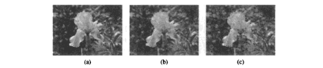
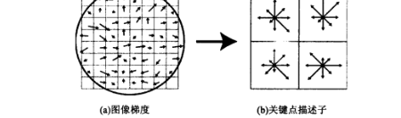
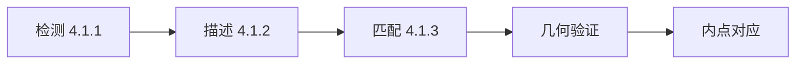
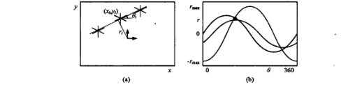

# 第4章 特征检测与匹配

来源：Szeliski《计算机视觉——算法与应用》中文第一版第4章；书页 157–204 / PDF 171–218。未越界第5章（书页 205 / PDF 219 起）。

## 本章总览

特征检测和匹配是许多视觉应用的前置步骤。图 4.2 给出两类典型任务：一对重叠照片要对齐成马赛克（第9章）；另一对则要建立较密的对应，以便建三维或中间视图（第11章）。图 4.1 把可用特征分成点、区域、边缘和直线四类。

点特征又叫关键点(keypoint)、兴趣点(interest point)或角点(corner)，用其周围图像块描述（4.1）。边缘对应轮廓或褶皱，方向和邻域结构都可用来匹配，也是遮挡的指示（4.2）。边缘再聚成曲线或直线段，可直接匹配，也可找消失点(vanishing point)去估摄像机内外参（4.3）。

获取对应有两条路。一条是在第一幅图里找那些能被局部搜索精确跟踪的点，如相关或最小二乘（4.1.4）。另一条是各图独立检测，再靠描述子在视角差大、运动大或遮挡多时配对，如全景拼接和宽基线立体。本章把关键点流水线分成检测（4.1.1）、描述（4.1.2）、匹配（4.1.3）；跟踪（4.1.4）是视频里的替代。Lowe 的尺度不变特征变换(Scale Invariant Feature Transform, SIFT)把这几步写得很完整。

RANSAC 全景与光束平差不在本章展开。学完应能分清孔径问题、Harris / Shi-Tomasi / DoG 各看什么量、SIFT 128 维怎么来、最近邻距离比率(NNDR)为何比固定阈值稳，以及霍夫(Hough)累加器里一条直线如何变成一条正弦曲线的交点。

## 核心知识点

### 点和块

#### 特征检测器：孔径、自相关与 Harris 族

适合跟踪的位置，是那些平移一小块就能被唯一对上的地方。平坦纹理几乎无法定位；只有一个方向的直线段有孔径问题(aperture problem)：只能沿法向对齐（图 4.4b）。至少两个明显不同方向的梯度时，块才好定（图 4.4a）。

两块之间最简单的匹配误差是加权平方和(weighted sum of squared differences, WSSD)：

$$
E_{\mathrm{WSSD}}(\mathbf{u})=\sum_{i}w(\mathbf{x}_{i})\bigl[I_{1}(\mathbf{x}_{i}+\mathbf{u})-I_{0}(\mathbf{x}_{i})\bigr]^{2}
\tag{4.1}
$$

检测时还不知道会匹配到哪，只能看位置扰动 $\Delta\mathbf{u}$ 时，同一幅图自己和自己比有没有稳定的谷。这就是自相关表面(auto-correlation surface)

$$
E_{\mathrm{AC}}(\Delta\mathbf{u})=\sum_{i}w(\mathbf{x}_{i})\bigl[I_{0}(\mathbf{x}_{i}+\Delta\mathbf{u})-I_{0}(\mathbf{x}_{i})\bigr]^{2}
\tag{4.2}
$$

花坛一类纹理有尖谷，屋顶边缘只在一个方向有谷（孔径），云朵则几乎没有峰（图 4.5）。把 $I_{0}(\mathbf{x}_{i}+\Delta\mathbf{u})$ 一阶展开，得到二次型 $\Delta\mathbf{u}^{T}\mathbf{A}\Delta\mathbf{u}$（4.3）–（4.6）。自相关矩阵（结构张量）

$$
\mathbf{A}=w*\begin{bmatrix}I_{x}^{2}&I_{x}I_{y}\\I_{x}I_{y}&I_{y}^{2}\end{bmatrix}
\tag{4.8}
$$

特征值 $\lambda_{0}\ge\lambda_{1}$ 给出不确定椭圆：较大不确定度由较小特征值决定。Shi 与 Tomasi(1994)因此找较小特征值的局部最大，作为可跟踪点。

Harris 与 Stephens(1988)用旋转不变的

$$
\det(\mathbf{A})-\alpha\,\mathrm{trace}(\mathbf{A})^{2}=\lambda_{0}\lambda_{1}-\alpha(\lambda_{0}+\lambda_{1})^{2}
\tag{4.9}
$$

书中取 $\alpha=0.05$，不必开方，同时压低 $\lambda_{0}\gg\lambda_{1}$ 的边缘。Triggs(2004)建议 $\lambda_{0}-\alpha\lambda_{1}$。Brown、Szeliski 与 Winder(2005)用调和均值

$$
\frac{\det\mathbf{A}}{\mathrm{tr}\,\mathbf{A}}=\frac{\lambda_{0}\lambda_{1}}{\lambda_{0}+\lambda_{1}}
\tag{4.11}
$$

$\lambda_{0}\approx\lambda_{1}$ 时更平滑。图 4.7 画出这几种兴趣值的等高线。

算法 4.1 的步骤是：高斯导数得 $I_{x},I_{y}$；算三个二次项图；再用较大高斯平滑；代入上面任一标量；在阈值之上取局部最大。早期用 $(-2,-1,0,1,2)$ 差分，现在更常用 $\sigma=1$ 的高斯导数。

自适应非最大抑制(Adaptive non-maximal suppression, ANMS)针对「对比度高的地方点过密」：只保留同时是局部最大、且响应明显高于（书中约 10%）半径 $r$ 内邻居的点，再按响应排序并不断减小抑制半径，得到空间更匀的 $n$ 个点。

可重复性(repeatability)由 Schmid、Mohr 与 Bauckhage(2000)定义为：变换后的图里，关键点落在对应位置 $\varepsilon$ 像素内（他们取 $\varepsilon=1.5$）的比例。他们同时看信息量（旋转不变灰度描述子集合的熵）。

🔑 关键速记：角点是两个方向都「贵」的位移；Harris 看 $\det-\alpha\,\mathrm{tr}^{2}$，Shi-Tomasi 看较小特征值。

#### 尺度、旋转、仿射与区域

物体尺度事先不知道时，与其多尺度全匹配，不如直接找位置和尺度都稳的点。Lindeberg 用高斯拉普拉斯(Laplacian of Gaussian, LoG)极值当兴趣点。Lowe(2004)在每组八度(octave)上算高斯差分(Difference of Gaussian, DoG)，在三维（空间+尺度）找与 26 邻都比较后的极值，再亚像素拟合。细实验后，每八度层数取 3，对应面积为四分之一的金字塔，与 Triggs 用法一致。👉 高斯 / 拉普拉斯金字塔的构造见第3.5节。

和 Harris 一样，要去掉 DoG 局部曲率不对称的像素。对差分图 $D$ 的 Hessian

$$
\mathbf{H}=\begin{bmatrix}D_{xx}&D_{xy}\\D_{xy}&D_{yy}\end{bmatrix}
\tag{4.12}
$$

丢掉满足

$$
\frac{\mathrm{Tr}(\mathbf{H})^{2}}{\mathrm{Det}(\mathbf{H})}>10
\tag{4.13}
$$

的点。Mikolajczyk 与 Schmid(2004)则给 Harris 点再套一层尺度：在多尺度金字塔上估 Harris，只留拉普拉斯取极值的那些尺度。

旋转：可设计旋转不变描述子，但区分力往往较弱。更好的是估一个主导方向(dominant orientation)，再在该方向和尺度下取样。最简是邻域平均梯度；更稳的是 Lowe 的 36 维方向直方图（按梯度幅值和到中心的高斯距离加权），取全局最大 80% 以内的峰，再用三分抛物线插值（图 4.12）。

仿射：宽基线立体或定位时，局部透视可用仿射近似。一条路是用自相关或 Hessian 的特征值坐标系把块归一化（图 4.14）。另一条是最大稳定极值区域(Maximally Stable Extremal Region, MSER)：按灰度排序生长连通域，面积随阈值变化率局部最小的区域称为最稳定，对仿射和光滑光度变换不变（图 4.15）。

🔑 关键速记：尺度用 DoG/LoG 三维极值；方向用梯度直方图；仿射用椭圆归一化或 MSER。

#### 特征描述子

检测只给出位置（以及尺度、方向）。匹配还要把关键点周围变成更紧凑、对几何和光照更稳的描述子(descriptor)。图 4.16 的问题是：对图像间变化要不变，对「这是哪一点」仍要分得开。

多尺度带方向图像块(Multi-scale Oriented Patch, MOPS)取相对检测尺度五个像素间隔的 $8\times 8$ 亮度样本，在金字塔较低层采样以抗混叠，再把块均值为 0、方差为 1，以对付线性曝光（图 4.17）。拼接一类透视收缩不大的任务，这样往往够用。

SIFT 在检测尺度对应的高斯金字塔层上，取关键点周围 $16\times 16$ 窗口的梯度；用高斯下降函数降低远离中心的权重（图 4.18a 蓝圈）。每个 $4\times 4$ 象限把加权梯度累进 8 个方向箱，概念图里画的是 $8\times 8$ 块和 $2\times 2$ 描述数组；实现是 16×16 像素与 $4\times 4$ 直方图，每箱 8 方向，共 128 维。为减小位置和主方向误差，用三线性插值把 256 个加权梯度洒到相邻箱。向量先单位化，再把大于 0.2 的分量截断后重新单位化，以减弱非线性光照。

PCA-SIFT 在 $39\times 39$ 块上算 $x,y$ 导数，主成分把 3042 维降到 36 维。SURF 用方框滤波近似 SIFT 里的导数和积分。梯度位置方向直方图(Gradient Location-Orientation Histogram, GLOH)改用对数极坐标：半径分成 6、11、15，角度 8 箱（中心除外），272 维再经在大数据集上训练的 PCA 映到 128 维；评测中整体略优于 SIFT。Mikolajczyk 与 Schmid(2005)比较局部描述子时，GLOH 最好，SIFT 紧随其后（图 4.25）。导向滤波器(steerable filter)是高斯导数组合，对位置和方向误差不那么敏感。👉 一阶导向滤波见第3.2.3节。

后续还有把颜色加进来、以及从训练库学描述子权重的工作（图 4.20）；DAISY 一类则为稠密立体设计。这些检测器若针对「所有物体类上可重复」优化，是一条路；另一条是生成对特定类别有区分力的检测器。

🔑 关键速记：MOPS 是均方差归一化的小亮度块；SIFT 是 128 维加权方向直方图，截断 0.2 再单位化。

#### 特征匹配

两幅或多幅图都有了特征和描述子之后，先选匹配策略，再谈索引结构。策略取决于上下文：拼接时大部分特征应能配上（图 4.16）；识别时多数特征可能根本不该配（图 4.21）。描述子通常先比较欧氏距离；轴尺度不稳时要先缩放或「白化(whitening)」。

固定阈值：距离小于某值才接受。阈值太高误报(false positive)多，太低漏报(false negative)多（图 4.22）。混淆矩阵里：

- TP：正确匹配数；FN：漏掉的正确匹配；FP：错误匹配；TN：正确拒绝的非匹配。

$$
\mathrm{TPR}=\frac{\mathrm{TP}}{\mathrm{TP}+\mathrm{FN}}=\frac{\mathrm{TP}}{P},\quad
\mathrm{FPR}=\frac{\mathrm{FP}}{\mathrm{FP}+\mathrm{TN}}=\frac{\mathrm{FP}}{N}
\tag{4.14, 4.15}
$$

$$
\mathrm{PPV}=\frac{\mathrm{TP}}{\mathrm{TP}+\mathrm{FP}},\quad
\mathrm{ACC}=\frac{\mathrm{TP}+\mathrm{TN}}{P+N}
\tag{4.16, 4.17}
$$

表 4.1 示例为 TPR=0.90、FPR=0.05、PPV=0.82、ACC=0.94。信息检索里 PPV 常叫精度(precision)，TPR 常叫召回率(recall)。扫一遍阈值得到的 TPR–FPR 曲线是受试者工作特性(receiver operating characteristic, ROC)；越靠近左上、曲线下面积(AUC)越大越好。

固定阈值很难：特征空间不同区域有效范围差很多。较好的启发式是最近邻距离比率

$$
\mathrm{NNDR}=\frac{d_{1}}{d_{2}}=\frac{\lVert D_{A}-D_{B}\rVert}{\lVert D_{A}-D_{C}\rVert}
\tag{4.18}
$$

$d_{1}$ 是到最近邻的距离，$d_{2}$ 是到次近邻的距离，次近邻取自已知不匹配的目标（如库中另一物体）。小 NNDR 接受，大 NNDR 拒绝（图 4.24）。评测里最近邻加 NNDR 明显改进 ROC。

高效搜索：朴素是对所有特征两两比，平方复杂度。可用 $k$-d 树、每图单独索引、或多维散列把描述子映到桶里再只搜邻桶。超大规模库还可以走词汇树(vocabulary tree)一类文本检索结构。

📝待补全：百万级库不能两两比 SIFT。先把描述子量化成视觉词，图像变成 tf-idf 向量 $t_i=(n_{id}/n_d)\log(N/N_i)$，用倒排表找共享词的候选。词汇树用层次 k-均值把词分到约 $10^6$ 叶，查询沿树下行只需约 $10\times 6$ 次比较，再几何验证。完整索引见第14.3.2节。本章只强调匹配阶段需要比暴力搜索更快的结构。

👉 完整深度讲解见第14章。

得到假设对应后，常用几何配准区分内点(inlier)与外点(outlier)：先采一小撮点估全局变换，再保留与估计足够近的对应。这个过程叫随机采样(random sampling)或 RANSAC。

📝待补全：RANSAC 随机抽 $k$ 个对应估变换，数距离 $\epsilon$（通常 1～3 像素）内的内点，重复 $S$ 次取最多内点集再精化。失败概率 $1-P=(1-p^{k})^{S}$，故 $S=\log(1-P)/\log(1-p^{k})$。外点不太多时也可用 IRLS 把平方换成 $\rho$。姿态 PnP 与多视光束平差仍见第6.2节与第7章。一旦有了初始对应，还可以在极线上或估计位置附近找额外对应。

👉 完整深度讲解见第6章；立体极线见第11章。

图注：点特征主路径。几何验证（RANSAC、单应/本质矩阵）放到第6章；视频里可用 4.1.4 的跟踪代替独立匹配。

🔑 关键速记：阈值管远近，NNDR 管「最近是否显著近于次近」；ROC 看 TPR 对 FPR。

#### 特征跟踪

替代策略是：第一帧检测，后续帧只在邻域里找对应，即先检测后跟踪(detect and track)。相邻帧运动和外观变形较小时很常用。选跟踪位置和选匹配位置一样，自相关矩阵特征值大的区域提供稳定位置（4.8）。后帧对方差小的对应区域搜索通常高效；光照变了要用亮度补偿或规范化互相关(normalized cross-correlation)。搜索范围大时，分层（金字塔）搜索更有效，它用低分辨率匹配当初始猜测。也可以按预测位置附近搜，或先猜轨迹长什么样再搜。

若要跨较长序列，外观会变。必须决定：一直拿最初检测到的模板去配，还是在后帧匹配位置重新采样模板。前者容易因模板过时而失败。

大位移先走金字塔：粗层搜索范围小，位移乘 2 传到下一层再局部细化（8.1.1）。曝光不同时用偏差–增益 $I_1(\mathbf{x}+\mathbf{u})=(1+\alpha)I_0(\mathbf{x})+\beta$（公式 8.8、8.9），或规范化互相关 NCC（公式 8.11）：两块减均值再除标准差，输出落在 $(-1,1)$。注意 **8.9 / 8.11 是公式号，不是独立小节**，都写在 8.1 平移配准里。亚像素再用 Lucas–Kanade 把亮度差 Taylor 成 $2\times 2$ 正规方程，结构张量小特征值就是本章的孔径。

📝待补全：参数化运动、样条场、稠密光流与层次运动的完整写法见第8章。本章只把跟踪写成「检测一次、邻域接力」。

👉 完整深度讲解见第8章。

4.1.5 节把快速跟踪接到表演驱动动画(performance-driven animation)：跟面部和头部位姿，去变形手绘草图或三维模型。这是应用小品，不是新的检测公式。

🔑 关键速记：跟踪是小运动下的局部搜索；大位移先走金字塔，光照变了不要死用原始灰度差。

### 边缘

点适合精确定位 2D 对应；边缘语义更丰富，常对应物体边界、3D 遮挡、表面褶皱。孤立边点可聚成曲线或直线段（4.3）。把整幅图切成「一致区域」是第5章的分割；若只想要边界，用局部信息检测边缘更合适。

定性上，边缘在颜色、亮度或纹理变化剧烈处。把图像看成高度场，边缘就是陡坡或等高线挤紧的地方。梯度

$$
\mathbf{J}(\mathbf{x})=\nabla I(\mathbf{x})=\Bigl(\frac{\partial I}{\partial x},\frac{\partial I}{\partial y}\Bigr)(\mathbf{x})
\tag{4.19}
$$

指向最陡上升，幅值是斜率。直接求导会放大高频噪声，所以先低通。高斯是唯一可分离的圆对称平滑核，多数边缘检测都用它。微分与卷积可交换，故

$$
\mathbf{J}_{\sigma}(\mathbf{x})=\nabla\bigl[G_{\sigma}*I\bigr]=\bigl[\nabla G_{\sigma}\bigr]*I
\tag{4.20}
$$

$\sigma$ 是带宽。希望把连续梯度稀化成沿轮廓的离散点时，在与梯度垂直的方向上找幅值极大，等价于沿梯度方向对 $\mathbf{J}$ 再求方向导数并找过零。该点算子是拉普拉斯(Laplacian)

$$
S_{\sigma}(\mathbf{x})=\nabla\cdot\mathbf{J}_{\sigma}(\mathbf{x})=\bigl[\nabla^{2}G_{\sigma}\bigr]*I(\mathbf{x})
\tag{4.22}
$$

高斯二阶导数核 $\nabla^{2}G_{\sigma}$ 即高斯拉普拉斯(LoG)（4.23），可分离实现（4.24）。实践中常用高斯差分(DoG)近似 LoG，因为核形相近；若已有拉普拉斯金字塔则更方便。👉 DoG 与拉普拉斯金字塔见第3.5节。

过零：相邻像素符号相反时，线性插值得亚像素位置

$$
x_{z}=\frac{x_{i}S(\mathbf{x}_{j})-x_{j}S(\mathbf{x}_{i})}{S(\mathbf{x}_{j})-S(\mathbf{x}_{i})}
\tag{4.25}
$$

方向和强度由原网格上的梯度插值。也可用双网格把边界元放到像素间。

Canny(1986)讨论了可选用的平滑核，并比较多种检测器。尺度方面：只关心强边缘时，$\sigma$ 可由噪声特性定；要多分辨率边缘则需在尺度空间找。Elder 与 Zucker(1998)为每个像素估「仍能可靠检出边缘」的最小尺度，再用二阶方向导数的最小尺度做过零，模糊宽度可由二阶响应极值间距减高斯宽度得到。

彩色：把各通道带符号梯度相加可能互相抵消（红到绿的边）。较好的是每通道算有向能量(oriented energy)再加权联合，或估计局部颜色统计（含 3D 颜色直方图）。目标若是逼近人工边界检测，则要结合亮度、颜色和纹理，而不是只找「稳定特征」。

4.2.2 边缘连接：零交叉相邻时可直接链起来。链上可再做 Canny 式滞后阈值：设高、低两个阈值，高阈值波允许把连着的低阈值弱边收进来。表示上可用八邻域链码(chain code)（N、NE、E、SE、S、SW、W、NW），或弧长参数化 $\mathbf{x}(s)$，便于匹配、平滑和傅里叶变换比较。平滑过猛会让曲线收缩；可用二阶导数偏移、可变核或小波「扫描(sweep)」在压量化噪声时少动整体形状。

📝待补全：非真实感绘制把显著边当成笔墨轮廓，再配保边平滑或均值移位色块当平涂色。也可以不设计笔触，只给一张「处理前/后」样例，用图像模拟 $A:A'::B:B'$ 在金字塔邻域里抄风格。钢笔画、印象派笔触和照片抽象都走「边 + 保边滤波」这条路。完整应用见第10.5.2节。本章只把边连成链。

👉 完整深度讲解见第10章。

🔑 关键速记：边是梯度大或 LoG/DoG 过零；Canny 滞后用双阈值把弱边接到强边上。

### 线条

人造世界里直线段特别多：建筑、城市姿态、文档分析。本节从曲线抽折线，再用霍夫把共线片段聚成直线，最后把拥有共同消失点的 3D 直线聚在一起。消失点可用来标定摄像机、定它相对矩形场景的朝向。

#### 逐次近似

曲线已写成 $\mathbf{x}_{i}=\mathbf{x}(s_{i})$ 之后，许多应用更想要折线或 B 样条。Ramer(1972)与 Douglas–Peucker(1973)递归地在当前粗折线离曲线最远的点处细分（图 4.40），即直线简化(line simplification)。需要更平滑时再用插值样条或曲线本身的平滑（3.5.1、5.1.1）。

#### 霍夫变换

折线近似在线段被遮挡或断开时不够。霍夫变换(Hough 1962；Duda and Hart 1972)根据边缘点对可能直线「投票」。原始形式里，每个点给所有可能直线 $r=x\cos\theta+y\sin\theta$ 投票；每条正弦曲线的交点就是该直线的 $(r,\theta)$（图 4.41）。

更好的是用每个边界元的局部方向，只向估计方向为中心的少数累加格投票（图 4.42）。有向边界元 $\hat{\mathbf{n}}=(\cos\theta,\sin\theta)$，$r=\hat{\mathbf{n}}\cdot\mathbf{x}$，

$$
\theta=\tan^{-1}n_{y}/n_{x}
\tag{4.26}
$$

直线法向与图像梯度 $\mathbf{J}(\mathbf{x})=\nabla I(\mathbf{x})$ 同向。像素坐标按 (2.61) 规范到 $(-1,1)$ 时，$(\theta,d)$ 范围约为 $[-180^{\circ},180^{\circ}]\times[-\sqrt{2},\sqrt{2}]$。轴上分箱数目由方向精度和期望线密度决定，最好在样本图上试几次。

算法 4.2（有向边缘的霍夫）：清空累加器；对每个位置 $(x,y)$、方向 $\theta=\tan^{-1}n_{x}/n_{y}$ 的边界元，算 $d=xn_{x}+yn_{y}$，给 $(\theta,d)$ 加票；找直线峰值；对候选边界元再最优拟合。原始无方向的霍夫要在第 2 步对所有 $\theta$ 加一重循环。实现细节包括：按边缘段长度或强度加权、在累加器里挂边界元列表、以及把不同「极性」的边选择性地并到同一线段。

另一种 2D 极坐标是把完整 3D 直线方程 $\mathbf{m}=(\hat{\mathbf{n}},d)$ 映到单位球，用球面坐标 (2.8) 参数化（4.27）。球上不均匀，且要用三角函数。立方图(cube map)把 $\mathbf{m}$ 映到包围单位球的立方体，用最大绝对值分量选六个面之一，剩下两坐标当地图索引，从而避开三角函数。

用霍夫找直线上的点时，若外点多，RANSAC 往往更合适。

📝待补全：直线 RANSAC 与平面变换同一套：最小样本 $k=2$，内点是到直线距离小于 $\epsilon$ 的点，试验次数仍用 (6.30)。霍夫在参数空间投票，断线也能累加；外点比例高时 RANSAC 往往更干净。完整写法在第6.1.4节。本章只指出它是霍夫之外的直线假设生成器。

👉 完整深度讲解见第6.1.4节。

🔑 关键速记：一点对应参数平面一条正弦曲线；有方向时 $\theta$ 已由梯度给定，只投 $(d)$ 附近。

#### 消失点与矩形

平行的 3D 直线在透视下交于消失点。一种做法是让每条直线对所有可能消失点方向投票（立方图或高斯球），再鲁棒最小二乘。书中更喜欢用已检测直线段成对投候选：$\hat{\mathbf{m}}_{i},\hat{\mathbf{m}}_{j}$ 为段的单位法向直线方程，$l_{i},l_{j}$ 为段长，

$$
\mathbf{v}_{ij}=\hat{\mathbf{m}}_{i}\times\hat{\mathbf{m}}_{j},\qquad
w_{ij}=\lVert\mathbf{v}_{ij}\rVert\,l_{i}l_{j}
\tag{4.28, 4.29}
$$

近似共线或很短的段权重会低。峰值确定后，对投到该点的线段做鲁棒最小二乘。线段两端 $\mathbf{p}_{i0},\mathbf{p}_{i1}$ 与消失点 $\mathbf{v}$ 的三角形面积

$$
A_{i}=\bigl\lvert(\mathbf{p}_{i0}\times\mathbf{p}_{i1})\cdot\mathbf{v}\bigr\rvert
\tag{4.30}
$$

与点到直线的垂距及端点精度相关，可作为拟合好坏的度量。鲁棒目标可写成 $\mathcal{E}=\mathbf{v}^{T}\mathbf{M}\mathbf{v}$（4.31），$\mathbf{v}$ 取 $\mathbf{M}$ 的最小特征向量。同时搜两个或三个互相正交的消失点会更稳。

📝待补全：两个正交有限消失点加上简化 $\mathbf{K}$（光心居中、像素方）可用 (6.51) 估焦距 $f$，再把方向归一化得到旋转的列。三个可见消失点的三角形垂心给出光心。单视图测量学用这些轴交互量高度、建分片平面模型。完整流程见第6.3.2–6.3.3节。本章只给出如何从线段把消失点投出来。

👉 完整深度讲解见第6章。

4.3.4 矩形检测：有了正交消失点，就可以在建筑图里搜 3D 矩形（图 4.47）。典型步骤包括优化拟合线方程、在直线交点附近找角、再用平面扫描做矩形匹配。这是应用，不是新的投票公式。

🔑 关键速记：消失点是平行 3D 线在像上的交；用段对叉乘投票，短段和近共线段要降权。

## 易混淆点&差异对比

### Harris vs Shi-Tomasi vs 调和均值 vs DoG

Harris 用 $\det-\alpha\,\mathrm{tr}^{2}$，不要求开方。Shi-Tomasi 明确看较小特征值，更贴近「不确定度由弱方向决定」。调和均值在两特征值接近时更平滑。DoG 找的是尺度空间斑状极值，位置常与 Harris 互补（图 4.8），不是同一兴趣函数的两种写法。

### 相关 / WSSD vs 描述子匹配

(4.1) 的 WSSD 是两块亮度直接比，适合小运动跟踪和 MOPS 这类块描述。SIFT/GLOH 先把块变成直方图向量再比欧氏距离，对旋转、尺度和中等光照更稳，但丢掉了像素级相位。拼接透视不大时 MOPS 往往够；宽基线和识别更常上 SIFT。

### 固定阈值 vs NNDR

固定距离阈值在特征空间密度变化时会同时误报和漏报。NNDR 问的是「最近是否明显近于次近」，能拒绝「和谁都差不多近」的模糊匹配。识别场景里多数点本不该配，更该用 NNDR 而不是全局半径。

### Canny / 梯度极大 vs LoG 过零

沿梯度方向找幅值极大，与 LoG/DoG 过零在理想情况下等价（4.22）。实现上前者出的是链上的点，后者先得到符号图再插值（4.25）。Canny 的贡献还包括平滑核选择和滞后双阈值，不只是「再做一个梯度算子」。

### 霍夫 vs RANSAC 直线

霍夫在参数空间投票，断线、间隙也能累加；分箱过粗会糊峰，过细会票散。RANSAC 随机抽最小点集拟合，外点比例高时往往更干净。书中把直线 RANSAC 留给第6.1.4节，不要在本章当已讲算法用。

### 检测–描述–匹配 vs 检测–跟踪

独立检测适合大视角差、拼接和物体识别。跟踪假设帧间运动小，搜索窗可以很小，但模板会过时。二者不是同一流水线的两个旋钮。

## 本章要点总结

- 点：WSSD (4.1) 与自相关 (4.2)–(4.8)；Harris (4.9)、Shi-Tomasi、调和均值 (4.11)；ANMS 让点在空间上散开。
- 尺度与区域：DoG 三维极值 + Hessian 比 (4.13)；主导方向直方图；MSER 面积稳定的极值区。
- 描述子：MOPS 均值方差归一化；SIFT 128 维、截断 0.2；GLOH 对数极坐标后 PCA，评测略优。
- 匹配：TPR/FPR/PPV/ACC（4.14）–（4.17）；NNDR (4.18)；索引结构；几何验证留第6章。
- 跟踪：邻域接力，细节留第8章；表演驱动动画是应用例。
- 边缘：$\nabla G_{\sigma}$ 与 LoG/DoG 过零（4.19）–（4.25）；滞后阈值；链码与弧长 $\mathbf{x}(s)$。
- 线条：Douglas–Peucker 折线；霍夫正弦曲线投票与有向 $(\theta,d)$；消失点叉乘投票（4.28）（4.29）；标定用途留第6.3.2节。
