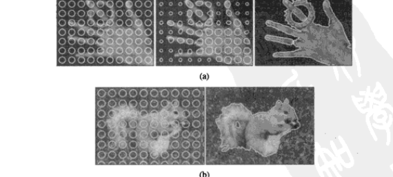
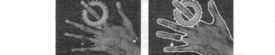
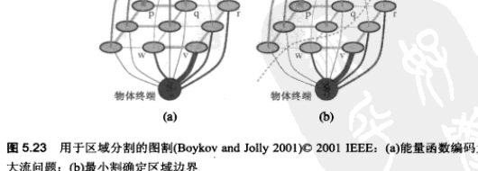
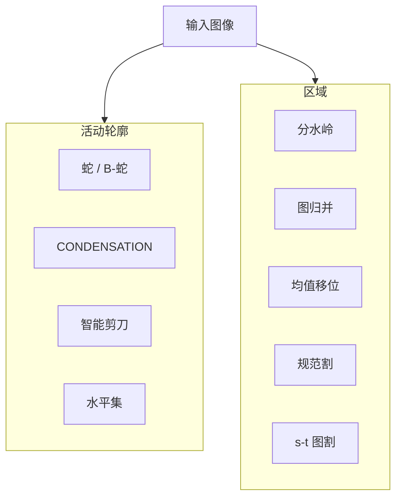

# 第5章 分割

来源：Szeliski《计算机视觉——算法与应用》中文第一版第5章；书页 205–236 / PDF 219–250。未越界第6章（书页 237 / PDF 251 起）。

## 本章总览

图像分割的任务是寻找「相互匹配」的像素组。统计学里对应聚类分析(cluster analysis)。视觉里它是研究最广的问题之一。早期方法倾向自顶向下的分裂与归并：对应文献中的区分式(divisive)和聚集式(agglomerative)聚类。更新的算法往往优化某种全局准则，例如区域内一致性、区域间边界长度或相似度。

3.3.2 节与 3.7.2 节已经看到过分割的例子。本章回顾其余主要方法：活动轮廓（蛇、水平集，5.1）、分裂与归并（5.2）、均值移位(mean shift)与模态发现（5.3）、规范图割(normalized cuts)（5.4），以及图割求解的二值马尔可夫随机场（5.5）。图 5.1 给出这几类的直观结果。识别与智能修图里怎么用分割，留第14章；能量推断的抽象算法留附录 B。

分割文献很密。要掌握哪些表现较好，一个办法是看它们在人工标注数据集上的实验，例如 Berkeley 分割数据集(Berkeley Segmentation Dataset and Benchmark)。学完应能分清：蛇是参数曲线、水平集是隐式曲面、分水岭容易过分割、均值移位找密度峰、规范割看「割/关联」、图割把二值 MRF 变成最大流。

🔑 关键速记：分割是聚类像素；本章五条路是蛇/水平集、分裂归并、均值移位、规范割、s-t 图割。

## 核心知识点

### 活动轮廓

线段、消失点和矩形在人造世界里常见，但物体边界更常是曲线。本节三种方法都在图像和可选的用户指导下，迭代地把边界移向最终解，因此都叫活动轮廓(active contour)。

#### 蛇行

最早由其发明者称为蛇行(snake)（Kass、Witkin 与 Terzopoulos 1988）。它是能量最小化的二维样条曲线，向着如强边界这样的图像特征发展。蛇是 3.7.1 节一维能量最小样条的二维扩展：

$$
\mathcal{E}_{\mathrm{int}}=\int\alpha(s)\lvert\mathbf{f}_{s}(s)\rvert^{2}+\beta(s)\lvert\mathbf{f}_{ss}(s)\rvert^{2}\,ds
\tag{5.1}
$$

$s$ 沿曲线 $\mathbf{f}(s)=(x(s),y(s))$ 的弧长，$\alpha$ 与 $\beta$ 类似 (3.100)(3.101) 的一阶、二阶连续性权重。沿曲线均匀采样后离散为（5.2）；步长 $h$ 在每次迭代后若再按弧长重采样，可以忽略。

图像势是线、边、端点三项加权（5.3）。实践中多数系统只用强梯度项，可直接正比于图像梯度

$$
\mathcal{E}_{\mathrm{edge}}=\sum_{i}-\lvert\nabla I(\mathbf{f}(i))\rvert^{2}
\tag{5.4}
$$

或正比于平滑后的拉普拉斯（5.5）。也可以先抽边，再用到这些边的距离图当势。交互时再加锚点 $\mathbf{d}(i)$ 的弹簧项 $k_{1}\lVert\mathbf{f}(i)-\mathbf{d}(i)\rVert^{2}$（5.6），以及「火山」式 $1/r$ 排斥。因为蛇有收缩趋势，跟踪兴趣物体前最好能画到蛇上进行初始化；动力学里也可加气球膨胀，让控制点沿法向外移。

离散后是稀疏线性系统，可用稀疏直接法（附录 A.4）；该线性系统本质上是五阶对角阵。蛇在线性系统与非线性约束线性化之间交替。全局能量最小可用动态规划，但实践中不常用，因为智能剪刀（5.1.3）和 GrabCut（5.5）等更有效的交互算法已经出现。图 5.2 给出交互塑形和嘴唇跟踪的例子。

弹性网把蛇写成旅行商问题(Traveling Salesman Problem, TSP)的变体：城市是沿轮廓的点，旅行点是蛇上的点。概率上每个城市由以旅行点为中心的高斯混合生成（5.7）。负对数似然给出「光滑弹簧(slippery spring)」能量（5.9）：约束（城市）与曲线（旅程）点的关联随时间逐渐硬化，$\sigma\to 0$ 时每个城市抓住一个旅行点且相邻旅行点之间的旅程为直线。

自由度太大时蛇会陷进局部最小。B 样条降低自由度，得到 B-蛇：$\mathbf{f}(s)=\sum B_{k}(s)\mathbf{x}_{k}$（5.10），矩阵形式 $\mathbf{F}=\mathbf{BX}$（5.11）。被跟踪物体在位置、大小或方向上变化大时，可在控制点上加 $\mathbf{x}'_{i}=\mathbf{sR}\mathbf{x}_{i}+\mathbf{t}$ 一类附加变换，或先检测再配准。

点分布模型(point distribution model)在控制点上估计一组形状先验。每个点的位置均值与 2D 协方差可写成二次惩罚（5.13）；实践中更常用所有点的联合分布：把 $\{x_{k}\}$ 连成向量 $\mathbf{x}$，用训练上的均值 $\bar{\mathbf{x}}$ 和协方差 $\mathbf{C}$（5.14），再特征值分解 $\mathbf{C}=\boldsymbol{\Phi}\,\mathrm{diag}(\lambda_{0},\ldots,\lambda_{K-1})\boldsymbol{\Phi}^{T}$（5.15）。形状写成 $\mathbf{x}=\bar{\mathbf{x}}+\boldsymbol{\Phi}\mathbf{b}$（5.16），二次形状惩罚（5.17），或把每个 $|b_{m}|$ 限制在 $3\sqrt{\lambda_{m}}$ 内。对准新图时，控制点沿法向搜最可能的图像边缘，再连同位置、尺度、方向估计一组新参数，即活动形状模型(Active Shape Model, ASM)。再与基于灰度分布的 PCA 结合，成为活动表观模型(Active Appearance Model, AAM)。

📝待补全：活动形状模型(ASM)在控制点上统计训练形状的均值与主轴，对准时沿法向搜边再估位置、尺度、方向。活动表观模型(AAM)把形状 $\mathbf{s}=\bar{\mathbf{s}}+U_s\mathbf{a}$ 和归一化纹理 $\mathbf{t}=\bar{\mathbf{t}}+U_t\mathbf{a}$ 收到同一套系数，拟合用差分图像对参数的导数或反向组合。人脸识别里用它对齐表情和姿态，检测阶段通常太慢，要先有 Viola–Jones 一类粗框。完整流程见第14.2.2节。本章只把它们写成带形状先验的蛇，不讲检测窗和分类器。

👉 完整深度讲解见第14章。

🔑 关键速记：蛇是带内外能量的参数曲线；内部要光滑，外部被梯度或用户锚点拉。

#### 动态蛇行和 CONDENSATION

感兴趣物体在视频里变形时，应根据前帧预测。卡尔曼蛇(Kalman snake)用形状参数的线性动态模型 $\mathbf{x}_{t}=\mathbf{A}\mathbf{x}_{t-1}+\mathbf{w}_{t}$（5.18）。过程噪声引起漂移（增加熵），测量更新拉回尖峰。拥挤场景里后验常是多模态，卡尔曼的单高斯不够。Isard 与 Blake(1998)引入粒子滤波器(particle filter)：用一带权样本表示概率（图 5.7）。按动态方程漂移，每个样本再生成若干随机扰动态，权重乘上测量似然，再按权重重采样。他们把算法命名为 CONDENSATION（Conditional Density Propagation）。图 5.8 用粒子子集上的 B 样条跟头部；条件密度可以有多个局部最小，从而保持多假设。

🔑 关键速记：卡尔曼蛇跟单峰；多峰轮廓用粒子滤波（CONDENSATION）把一批加权曲线往前传。

#### 智能剪刀

蛇的演化结果可能不可预测，还可能要额外的基于用户的指示。Mortensen 与 Barrett(1995)的智能剪刀(intelligent scissors)让用户描一条粗略曲线，系统实时算出贴着高对比度边缘的最优路径（图 5.9 橙线）。图像先预处理成边界元之间的 8 邻域代价，组合过零点、梯度大小和梯度方向。用户描线时，系统用 Dijkstra 算法从种子点(seed point)不断重算到当前鼠标位置的最低成本路径。Dijkstra 是指定目标位置结束的宽度优先动态规划。一段不活跃后「冻结」当前曲线；系统也会学习重叠曲线下的亮度特性，让后续火线优先走相似边界。滑雪橇(tobogganing)把路径变成更小的图，其节点位于三或四个区域的接缝，本质上是分水岭区域分割的简化，Dijkstra 在缩小的图上更快更稳。JetStream 一类扩展把当前轨迹的概率也考虑进去。

更简单的交互是把当前鼠标当「硬线」，到最近的可能边上实现，用于图像剪贴。

📝待补全：沿边剪下来的物体要贴到另一张图，边界上每个像素往往半透明，需要连续 $\alpha$ 而不是硬 0/1。自然图抠图在 trimap 或笔画约束下同时估 $\alpha$ 和未被污染的前景色 $F$；闭式 Laplacian 用局部色线把问题收成稀疏线性系统，毛发比智能剪刀的硬路径干净。蓝屏、差分和 Poisson 抠图是同一方程的不同约束。完整算法见第10.4节。本章智能剪刀只负责沿高对比度边找最优路径。

👉 完整深度讲解见第10章。

🔑 关键速记：智能剪刀是从种子到鼠标的最低代价路径（Dijkstra 活线），不是把整条蛇能量降完。

#### 水平集

参数曲线 $\mathbf{f}(s)$（蛇、B-蛇、CONDENSATION）很难在演化中改拓扑。水平集(Level Set)把曲线写成特征函数（或带符号距离函数）的过零点。嵌入函数常用 2D 的 $\phi(\mathbf{x},y)$。为少算，每步只更新过零点附近一条带，即快速行进法(fast marching method)。测地活动轮廓(geodesic active contour)的演化一例为

$$
\frac{d\phi}{dt}=\lvert\nabla\phi\rvert\mathrm{div}\Bigl(g(I)\frac{\nabla\phi}{\lvert\nabla\phi\rvert}\Bigr)+\nabla g(I)\cdot\nabla\phi
\tag{5.19}
$$

$g(I)$ 是蛇边缘势（5.5）的推广；$\lvert\phi\rvert=1$ 时第一项沿曲率拉直曲线（受 $g$ 调制），第二项沿 $\nabla g$ 把曲线推向 $g$ 的极小，即强边缘。图 5.10 画出嵌入函数与速度。

水平集仍容易受局部最小影响，因为它基于局部图像梯度。可选做法是在分割框架里重塑造该问题，用能量度量区域内外统计量（颜色、纹理、运动）的一致性，建立在 Leclerc、Mumford–Shah、Chan–Vese 的基于能量框架上，细节在 5.5 节。图 5.11 展示从一列散布的圆演化到最终二值分割：圆随演化改拓扑，形成前景与背景。

5.1.5 应用包括物体跟踪、表演驱动动画、医学图像（3D 医学、超声）以及转描机(rotoscoping)：用跟踪到的轮廓变化一组手画动画形象。Agarwala 等(2004)在关键帧上跟 B 样条轮廓（图 5.12）。

🔑 关键速记：水平集跟的是 $\phi=0$ 的面，拓扑可以变；局部梯度版仍会卡在弱边缘。

### 分裂与归并

对灰度图最简单的办法是选一个阈值再计算连通分量，但整张图一个阈值通常不够（3.3.2）。本节算法递归地把图按区域统计特性分裂或合并。也可以从四叉树的区分式分割出发，再允许归并和分裂（Horowitz 与 Pavlidis 1976）。

#### 分水岭

分水岭(watershed)把图像看成地形：雨水流入局部湖泊（集水盆地）。高效实现是从所有局部最小开始淹没，并在不同盆地将要相接处筑坝。因图像常有被亮脊分开的暗区，分水岭多半加在平滑后的梯度幅值图上，也可用有向能量。过分割几乎必然：每个盆地对应一个局部最小。交互系统因此让用户先标一些种子（点击或短线），作为期望分量的中心（图 5.13）。活动轮廓算法也常用分水岭或滑雪橇预计算这些区域。局部形态学可再平滑坝的边界。相关算法也可高效计算最大稳定极值区域。👉 MSER 作为仿射区域检测器见第4.1.1节。

🔑 关键速记：分水岭把梯度当地形灌水；不加种子几乎一定过分割。

#### 区域分裂、归并与基于图的分割

Ohlander、Price 与 Reddy(1978)在整幅直方图里找最佳区分式阈值，再对每个区域重复，直到不能再分或足够小。更新的分裂算法把「区内相似、区间不相似」的度量放到 5.4、5.5 节。

区域归并同样古老。Brice 与 Fennema(1970)用双网格表示像素边界，按相对边界长度和可见边缘的强度归并。数据聚类里对应单连接（最近邻）、全连接（最远点）或介于二者之间。一个非常简单的像素级归并是：邻域平均颜色差小于某值或很小的那些区域并起来。没有语义的超像素(superpixel)常常作为立体、光流和识别的预处理，更快也更鲁棒。

超像素把图切成几百块颜色相近的小区域，本身没有物体语义，只是减少后续要处理的单元。第8章并没有展开超像素算法，而是把像素按**层 / 物体**分组后再估参数运动（层次运动 8.5），也可以把光流向量估计看成「分割成运动一致的区域」。窗口 Lucas–Kanade 与样条控制点是另一种降自由度，不是本章这种过分割。

立体匹配里多数算法仍在像素上算，但 11.5.2 的基于分割方法先把参考图切成颜色块，每个块拟合一个视差平面，再在片段之间做 MRF / 环状置信度传播。Klaus 等用均值移位切图后，再 $3\times 3$ SAD、交叉检验和局部平面拟合。超像素在这里是「对应单元 / 平面片」，不是语义物体。识别用区域再分类见第14章。

📝待补全：识别把超像素当分类单元：先过分割，再让每块和物体部件匹配，或给每块一个类别标签后做 CRF（14.4.3）。TextonBoost 在纹理基元上 boosting。超像素本身没有语义，只是少算一些节点。光流侧的分层 / 区域运动已在第8.5节；立体分割式匹配已在第11.5.2节。

👉 完整深度讲解见第8、11、14章。

当多数归并只是把固定准则用于像素和区域时，Felzenszwalb 与 Huttenlocher(2004b)用区间相对不相似性(relative dissimilarity)决定该不该并，并能证明优化了一个全局聚类标准。从像素间不相似度权重 $w(e)$ 出发（如度量 $\mathcal{N}_{8}$ 邻域颜色差）。区域内部差别

$$
\mathrm{Int}(R)=\max_{e\in\mathrm{MST}(R)}w(e)
\tag{5.20}
$$

是其最小生成树最大边权。两区域最小跨边

$$
\mathrm{Dif}(R_{1},R_{2})=\min_{e=(v_{1},v_{2}),v_{1}\in R_{1},v_{2}\in R_{2}}w(e)
\tag{5.21}
$$

当 $\mathrm{Dif}$ 小于

$$
\mathrm{MInt}(R_{1},R_{2})=\min\bigl(\mathrm{Int}(R_{1})+\tau(R_{1}),\mathrm{Int}(R_{2})+\tau(R_{2})\bigr)
\tag{5.22}
$$

时归并。$\tau(R)$ 是区域惩罚，书中设为 $k/\lvert R\rvert$，也可换成应用相关的品质度量。按分开区域的边的递增顺序归并（Kruskal 最小生成树思想）时，可证明：分割既不会太精细（固定大小像素区域总该并的被并了），也不会太粗糙（不该并的被分开了）。复杂度 $O(N\log N)$，$N$ 为像素数。图 5.14 给出例。

#### 概率聚集

Alpert、Galun、Basri 等(2007)用灰度相似和纹理相似两条线索。局部最小外部差异 $\sigma_{\mathrm{local}}=\min(\Delta_{I}^{+},\Delta_{I}^{-})$（5.23），再与平均亮度差异比。纹理用 Sobel 响应的直方图相对差异。分层归并受代数多重网格启发。加权聚集类(Segmentation by Weighted Aggregation, SWA)里，节点 $i$ 与所有原始节点（区域）共同强耦合(strongly coupled)定义为 $\sum_{j\in C}p_{ij}>\phi$（5.25），$\phi$ 通常 0.2。粗粒度统计用加权平均。利用基于金字塔滤波的预处理，分层聚集本质上 $O(N)$。得到分割后，把粗层赋值传到更细层每个「孩子」再计算得到更精确的隶属。图 5.15 与图 5.22 把它和规范割、均值移位比较。

🔑 关键速记：Felzenszwalb 归并看「跨边是否小于区内最大边 + $k/\lvert R\rvert$」；SWA 用金字塔强耦合加速。

### 均值移位和模态发现

把每个像素的特征向量（颜色、位置）看成未知概率密度的样本，再找该密度的群簇（模态）。图 5.16 把彩色图映到 $\mathrm{L}^{*}\mathrm{u}^{*}\mathrm{v}^{*}$：忽略空间位置时，视觉算法看到的是颜色空间里拉长的点云。$k$-均值和高斯混合用密度的参数化模型，假设它是少量简单分布的叠加。均值移位则平滑该分布并找峰，每个峰对应特征空间的一个区域，不显式写出完整密度，因此是非参数化的。

#### $k$-均值和高斯混合

$k$-均值指定簇数 $k$，把样本派到最近中心再更新中心，可从输入向量中随机采 $k$ 个中心初始化。高斯混合里每个簇有协方差，$\mathbf{x}_{i}$ 到簇 $k$ 的马氏距离（5.26）。硬分配(hard assignment)只给最近簇，软分配(softly assigned)按责任加权。更常用的是混合密度

$$
p(\mathbf{x}\mid\{\pi_{k},\boldsymbol{\mu}_{k},\boldsymbol{\Sigma}_{k}\})=\sum_{k}\pi_{k}\,\mathcal{N}(\mathbf{x}\mid\boldsymbol{\mu}_{k},\boldsymbol{\Sigma}_{k})
\tag{5.27}
$$

期望最大化(expectation maximization, EM)交替：E 步算像素 $i$ 来自第 $k$ 个高斯的责任 $z_{ik}$（5.29）；M 步更新 $\boldsymbol{\mu}_{k},\boldsymbol{\Sigma}_{k},\pi_{k}$（5.30）–（5.33）。Ma、Derksen、Hong 等(2007)用高斯混合做彩色分割，并发展了最小描述长度(MDL)编码的扩展。

#### 均值移位

均值移位默认用平滑的连续非参数模型。关键是在高维数据分布中高效找峰值，不必算出完整 $f(\mathbf{x})$。把数据点看成从某数据密度获得的样本。核密度估计(kernel density estimation)或 Parzen 窗是把核放到样本上再叠加：

$$
f(\mathbf{x})=\sum_{i}\frac{1}{h^{d}}K\Bigl(\frac{\lVert\mathbf{x}-\mathbf{x}_{i}\rVert^{2}}{h^{2}}\Bigr)
\tag{5.34}
$$

$h$ 为带宽。$f$ 的梯度（5.35）可写成 $\nabla f(\mathbf{x})=\bigl(\sum G(\mathbf{x}-\mathbf{x}_{i})\bigr)\mathbf{m}(\mathbf{x})$，其中均值移位向量

$$
\mathbf{m}(\mathbf{x})=\frac{\sum_{i}\mathbf{x}_{i}G(\mathbf{x}-\mathbf{x}_{i})}{\sum_{i}G(\mathbf{x}-\mathbf{x}_{i})}-\mathbf{x}
\tag{5.38}
$$

是 $\mathbf{x}$ 周围邻居的加权平均与 $\mathbf{x}$ 之差。迭代 $\mathbf{y}_{k+1}=\mathbf{y}_{k}+\mathbf{m}(\mathbf{y}_{k})$（5.39）沿梯度上升。Comaniciu 与 Meer(2002)证明：对核 $k(r)$ 的合理弱约束（如单调），算法收到 $f$ 的局部最大；常规梯度下降则不能保证，除非步长小心控制。他们用的两个核是 Epanechnikov $k_{E}(r)=\max(0,1-r)$（5.40）和正态核 $k_{N}(r)=\exp(-r/2)$（5.41）。前者在有限支撑内收敛，后者轨迹更平滑，但模态附近收敛慢。

最简单实现：每个点 $\mathbf{x}_{i}$ 单独跑均值移位直到位移小于阈值。更快的是随机二次采样一些点并保留每个点的临时演化轨迹，其余点按最近演化路径分类。只看颜色的聚类可能把碰巧同色的孤立像素并在一起，却对不上有语义的分割。更好的结果通常在颜色与位置的联合域(joint domain)上得到：空间坐标 $\mathbf{x}_{s}$ 接颜色 $\mathbf{x}_{r}$，五维上

$$
K(\mathbf{x}_{j})=k\Bigl(\frac{\lVert\mathbf{x}_{r}\rVert^{2}}{h_{r}^{2}}\Bigr)k\Bigl(\frac{\lVert\mathbf{x}_{s}\rVert^{2}}{h_{s}^{2}}\Bigr)
\tag{5.42}
$$

图 5.18 用 $(h_{s},h_{r},M)=(16,19,40)$，像素少于 $M$ 的空间区域被消掉。

联合域核让人想到双边滤波器（3.34）–（3.37）。区别在于：均值移位里每个像素的空间坐标与颜色值一道被调整，相似颜色的像素比其他像素迁移得更快，因此稍后可用于聚类。确定最好的带宽 $h$ 仍比较困难；也可以在联合参数空间中核的方向上适应，例如空间-时间（视频）分割。

📝待补全：均值移位在联合域里把位置近、颜色近的像素收成一块。非真实感绘制直接用这些平滑色块当卡通平涂，再叠上第4章的显著边当墨线，见第10.5.2节。立体匹配里 Klaus、Sormann 与 Karner 用均值移位切参考图，再局部平面拟合和环状 BP，见第11.5.2节；一块一个视差平面，深度边界更贴颜色边。本章只把它当密度模态聚类，不讲视差。

👉 完整深度讲解见第10、11章。

🔑 关键速记：均值移位不先假定有几个高斯，只是跟着核密度的梯度走到峰；分割时颜色要和 $(x,y)$ 绑在一起。

### 规范图割

自底向上的归并把区域合成已知整体，均值移位用模态发现相似像素的群簇。Shi 与 Malik(2000)的规范图割则检测邻近像素点之间的亲和(affinity，相似度)，并试图把连接被弱亲和度连接起来的像素集分开。

图 5.19：A 组像素以粗红线相连，B 组亦然；两组之间的连接以细蓝线表示，就要弱得多。这两组之间的规范割以虚线表示。割

$$
\mathrm{cut}(A,B)=\sum_{i\in A,j\in B}w_{ij}
\tag{5.43}
$$

是跨边权和。最小割常会包含孤立像素，不是好的聚类。规范割定义为

$$
\mathrm{Ncut}(A,B)=\frac{\mathrm{cut}(A,B)}{\mathrm{assoc}(A,V)}+\frac{\mathrm{cut}(A,B)}{\mathrm{assoc}(B,V)}
\tag{5.44}
$$

$\mathrm{assoc}(A,A)$ 是一群簇中的关联度（所有权重之和），$\mathrm{assoc}(A,V)=\mathrm{assoc}(A,A)+\mathrm{cut}(A,B)$ 是所有与 $A$ 节点相关的权重。把像素当图节点、权重当亲和矩阵 $\mathbf{W}$，度矩阵 $\mathbf{D}=\mathrm{diag}(\mathbf{d})$，$\mathbf{d}=\mathbf{W}\mathbf{1}$。寻找一组边，使与特定区域内部和从该区域出发的所有边都弱相关。

计算最优规范割是 NP-完全问题。Shi 与 Malik 建议计算节点到割的实值分配。令 $\mathbf{x}$ 为指示向量，$x_{i}=+1$ 当 $i\in A$，$-1$ 当 $i\in B$。在所有指示向量 $\mathbf{x}$ 上最小化规范割等价于

$$
\min_{\mathbf{y}}\frac{\mathbf{y}^{T}(\mathbf{D}-\mathbf{W})\mathbf{y}}{\mathbf{y}^{T}\mathbf{D}\mathbf{y}}
\tag{5.45}
$$

$\mathbf{y}=(\mathbf{1}+\mathbf{x})-b(\mathbf{1}-\mathbf{x})/2$ 使得 $\mathbf{y}^{T}\mathbf{d}=0$。最小该瑞利商等价于广义特征系统 $(\mathbf{D}-\mathbf{W})\mathbf{y}=\lambda\mathbf{D}\mathbf{y}$（5.46），或标准特征问题 $(\mathbf{I}-\mathbf{N})\mathbf{z}=\lambda\mathbf{z}$（5.47），$\mathbf{N}=\mathbf{D}^{-1/2}\mathbf{W}\mathbf{D}^{-1/2}$，$\mathbf{z}=\mathbf{D}^{1/2}\mathbf{y}$。本征向量可被解读为弹簧-质量系统的大的振动模态。

原始算法用空间位置和图像特征差异，对半径 $\lVert\mathbf{x}_{i}-\mathbf{x}_{j}\rVert<r$ 内的像素算

$$
w_{ij}=\exp\Bigl(-\frac{\lVert\mathbf{F}_{i}-\mathbf{F}_{j}\rVert^{2}}{\sigma_{F}^{2}}-\frac{\lVert\mathbf{x}_{i}-\mathbf{x}_{j}\rVert^{2}}{\sigma_{s}^{2}}\Bigr)
\tag{5.48}
$$

$\mathbf{F}$ 由亮度、颜色或有向滤波器直方图组成。后续工作加入中间轮廓(intervening contours)权重（5.49）：沿 $i,j$ 连线上垂直于该线的最大有向能量，再与基于 texton 的纹理相似度相乘。因为要解巨大的稀疏本征值问题，规范割相当慢。Sharon、Galun、Sharon 等(2006)用代数多重网格：只保留与粗层强耦合的少量变量（至少 20%），在粗层用插值粗化计算权矩阵，再把 0 和 1 之间的值映射到纯布尔值。图 5.22 把 SWA、规范割和均值移位放在一起比。

🔑 关键速记：最小割会切出孤点；规范割用 $\mathrm{cut}/\mathrm{assoc}$，离散指示松弛成拉普拉斯特征向量。

### 图割和基于能量的方法

公共需求是：把相似表观的像素聚起来，且使不同区域像间的边界短且穿过可见的不连续处。若把边界度量放在直接邻居之间，并通过像素级求和来计算区域隶属，则可用变分形式（正则化，3.7.1）或二值马尔可夫随机场（3.7.2）写成经典能量。连续方法的例子包括 Mumford–Shah、Chan–Vese，以及 5.1.4 节的水平集。早期把基于区域与基于边界的能量结合到离散优化的是 Leclerc(1989)的 MDL。Boykov 与 Funka-Lea(2006)综述了用于二值物体分割的多种图割方法。

正像 3.7.2 节，对应于分割问题的能量可写为

$$
E(f)=\sum_{i,j}E_{r}(i,j)+E_{b}(i,j)
\tag{5.50}
$$

区域项 $E_{r}(i,j)=E_{P}\bigl(I(i,j);R(f(i,j))\bigr)$ 是像素亮度（或颜色）与区域统计量一致的似然的负对数（5.51）。边界项用 $\mathcal{N}_{4}$ 上的 $\delta(f(i,j)-f(i\pm 1,\cdot))$ 乘局部平滑 $s_{x},s_{y}$（5.52），平滑强度通常反比于局部边缘。区域统计可以是简单平均灰度 $E_{S}(I;\mu_{k})=\lVert I-\mu_{k}\rVert^{2}$（5.53），或颜色高斯混合。

最初这类问题用迭代梯度下降，慢且易陷局部最小。Boykov 与 Jolly(2001)把 Greig、Porteous 与 Seheult(1989)的二值 MRF 优化用于二值物体分割。用户用几下笔画标出背景与前景（图 3.61），这些像素在 s-t 图中连到源 S 和汇 T（图 5.23a）。种子用来估计前景/背景区域统计。其余边的容量来自区域项和边界项：更兼容前景的像素与对应的源有更强连接；更平滑的邻居也有更强连接。多项式时间的最小割 / 最大流在割开的两侧标出物体（图 5.23b）。图割只是 MRF 能量最小化的若干方法之一，但仍是解决二值 MRF 最常用的方法。

图注：本章两条主线。参数/隐式轮廓走 5.1；像素聚类与图能量走 5.2–5.5。规范割是谱方法，s-t 图割是最大流，不要当成同一种「图割」。

GrabCut（Rother、Kolmogorov 与 Blake 2004）用颜色空间的高斯混合迭代重估区域统计，用户输入可以少到一个边界框（图 5.24a）：背景模型由框外条带初始化，前景由框内像素初始化，再很快收到更好的物体估计；过程中还可加笔画。对原始二值分割形式的主要扩展是加入有向的边界，例如更喜欢亮到暗的转换；有向图割能正确地把亮灰色肝脏从暗灰色环境中分出来（图 5.25）。

优化一般 MRF 能量（5.50）需要组合优化方法，例如最大流。近似的解码方案可以通过把二值能量函数转化为定义在连续 $(0,1)$ 区间上的二次能量随机场来获得，这就变成了经典的基于薄膜(membrane-based)的正则化问题（3.100）–（3.102）；产生的二次能量可用标准线性系统（3.102）–（3.103）来解，若关心次速度则用多重网格（附录 A.5）。连续解再 0.5 阈值化得到二值。该 $(0,1)$ 连续优化也可解释为随机游走(random walker)概率。K 值分割可通过在种子标签中迭代求解。Grady 与 Ali(2008)用预先计算的线性系统本征向量加快一组种子的求解，并与第10.4.3节 Laplacian 抠图相关。

加权测地距离(weighted geodesic distance)可更快逼近连续 $(0,1)$ 分割。Criminisi、Sharp 与 Blake(2008)提出的相关方法可以用于快速搜索一般二值马尔可夫随机场优化问题的近似解。

应用小品：医学图像分割用有向图割从 CT 里分骨骼和肌肉，并恢复 3D 体骨骼模型（图 5.26）。该领域有自己的会议与期刊。

📝待补全：二值 s-t 图割能多项式时间解子模能量。多标签用 $\alpha$-扩张（任意像素可变 $\alpha$）或 $\alpha$-$\beta$ 交换（只动已经是这两个标签的像素），每次移动必须保持二值子模。树上动态规划 / BP 精确；环上 BP 近似，TRW / LP 松弛给下界。连续 $(0,1)$ 松弛对应随机游走。抠图拉普拉斯 $L$ 来自局部色线模型，能量 $\boldsymbol{\alpha}^{T}L\boldsymbol{\alpha}$ 在笔画约束下仍是同一类稀疏线性系统，用来估连续透明度而不是二值标号，见第10.4.3节。本章只演示前景/背景能量怎样编成容量。

👉 完整深度讲解见附录 B；抠图见第10章。

🔑 关键速记：二值分割能量 = 区域似然 + 边界长度；编成 s-t 容量后，最小割就是物体边界。

## 易混淆点&差异对比

### 蛇 vs 水平集 vs 智能剪刀

蛇和 B-蛇显式参数化 $\mathbf{f}(s)$，拓扑（一条变两条）很麻烦。水平集跟 $\phi=0$，合并分裂自然，但仍可能卡在局部梯度坑里。智能剪刀不演化整条能量，只在用户拖动时算一条到鼠标的最短路，交互更可预期。

### 分水岭 vs Felzenszwalb 归并 vs 超像素

分水岭按地形盆地切，局部最小多则碎。Felzenszwalb 用相对不相似 + $k/\lvert R\rvert$ 证明不会无故过细或过粗，复杂度 $O(N\log N)$。超像素是「故意过分割」的中间层，给立体和识别用，本身不是最终语义物体。

### $k$-均值 / GMM vs 均值移位

前两者要先定 $k$（或用 MDL 选），并假设高斯叠加。均值移位非参数，峰的个数由数据和带宽 $h$ 长出来。只在颜色空间做均值移位会把不相邻的同色像素并一块；联合域（5.42）才像分割。

### 规范割 vs s-t 图割

名字都带「割」，机制不同。规范割最小化 $\mathrm{cut}/\mathrm{assoc}$，松弛成特征分解，适合把图劈成平衡的几块，但慢。s-t 图割把二值 MRF 变成最大流，有源有汇、有用户种子，适合前景/背景，多项式时间。不要把 Ncut 的特征向量当成 Boykov–Jolly 的最小割。

### 图割 vs 第3.7节正则化

3.7 节写出 $\mathcal{E}_{d}+\lambda\mathcal{E}_{s}$ 和成对 MRF。本章把同一能量接到像素标签：区域项是颜色模型，边界项是邻接 $\delta$。连续 $(0,1)$ 松弛又回到薄膜方程。推断算法（BP、扩张）仍在附录 B，本章只用最大流讲二值情形。

🔑 关键速记：规范割是谱聚类，s-t 图割是最大流；二者都叫「割」，解法不是一套。

## 本章要点总结

- 活动轮廓：蛇能量（5.1）–（5.6）；B-蛇与点分布 / ASM；卡尔曼蛇（5.18）与 CONDENSATION；智能剪刀 = Dijkstra 活线；水平集（5.19）可改拓扑。
- 分裂归并：分水岭过分割，要种子；Felzenszwalb $\mathrm{Int}/\mathrm{Dif}/\mathrm{MInt}$（5.20）–（5.22）；SWA 强耦合金字塔。
- 均值移位：核密度（5.34）+ 均值向量（5.38）；联合域 $(h_{s},h_{r},M)$；GMM 用 EM（5.27）–（5.33）。
- 规范割：$\mathrm{Ncut}$（5.44）→ $(\mathbf{D}-\mathbf{W})\mathbf{y}=\lambda\mathbf{D}\mathbf{y}$；亲和（5.48）；可用多重网格近似。
- 图割：能量（5.50）；s-t 最大流；GrabCut 迭代 GMM；有向边；连续 $(0,1)$ 与随机游走。多标签推断留附录 B，识别应用留第14章。

🔑 关键速记：先分清跟的是曲线、密度峰还是图能量，再决定用蛇、均值移位还是图割。
