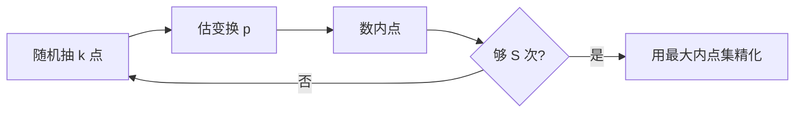
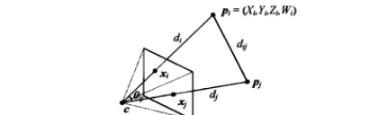

# 第6章 基于特征的配准

来源：Szeliski《计算机视觉——算法与应用》中文第一版第6章；书页 237–262 / PDF 251–276。未越界第7章（书页 263 / PDF 277 起）。

## 本章总览

抽出特征并完成第4.1.3节的匹配之后，下一步是检验这些对应是否几何一致：特征位移能否用简单的 2D 或 3D 变换描述。估出来的运动可接到拼接（第9章）或增强现实（6.2.3）。本章盯的是**几何图像配准**：把一幅图上的特征映到另一幅。三个具体问题是：

- 姿态估计(pose estimation)：摄像机相对已知 3D 物体或场景的位置（6.2）；
- 摄像机内标定(intrinsic calibration)：焦距、径向畸变等内部参数（6.3）；
- 成对 2D/3D 配准本身（6.1）。

如何从 2D 对应同时恢复 3D 点与摄像机运动，即由运动到结构，留第7章。非线性曲面、非刚性与弹性变形接到 8.3 节与 12.6.4 节。图 6.1 给出拼接用的平面、三维标定目标、消失点与场景中的线。

学完应能：用最小二乘或 RANSAC 估平面变换；区分直接线性变换(DLT)与非线性重投影；用 P3P / PnP 估姿态；用标定板、消失点或纯旋转估 $\mathbf{K}$。

🔑 关键速记：第6章把「对应点」变成「变换参数」；多视三维点云留给第7章。

## 核心知识点

### 基于 2D 和 3D 特征的配准

配准是从两幅或多幅图上已匹配的 2D 或 3D 点估计运动。本节限定整体参数变换（表 2.1、图 6.2），不把曲面变形当默认模型。

#### 使用最小二乘的 2D 配准

给定对应 $\{\mathbf{x}_{i},\mathbf{x}_{i}'\}$ 和平面参数变换

$$
\mathbf{x}'=\mathbf{f}(\mathbf{x};\mathbf{p})
\tag{6.1}
$$

常用最小二乘，最小化残差平方和

$$
E_{\mathrm{LS}}=\sum_{i}\lVert\mathbf{r}_{i}\rVert^{2}=\sum_{i}\lVert\mathbf{f}(\mathbf{x}_{i};\mathbf{p})-\mathbf{x}_{i}'\rVert^{2}
\tag{6.2}
$$

残差 $\mathbf{r}_{i}=\mathbf{x}_{i}'-\mathbf{f}(\mathbf{x}_{i};\mathbf{p})=\hat{\mathbf{x}}_{i}'-\mathbf{x}_{i}'$（6.3）：测量值与当前预测之差。平移、相似、仿射在运动 $\Delta\mathbf{x}=\mathbf{x}'-\mathbf{x}$ 与未知 $\mathbf{p}$ 之间常有线性关系 $\Delta\mathbf{x}=\mathbf{J}(\mathbf{x})\mathbf{p}$（6.4），$\mathbf{J}=\partial\mathbf{f}/\partial\mathbf{p}$ 是变换对 $\mathbf{p}$ 的雅可比。此时线性最小二乘变成正规方程

$$
\mathbf{A}\mathbf{p}=\mathbf{b},\qquad
\mathbf{A}=\sum_{i}\mathbf{J}^{T}(\mathbf{x}_{i})\mathbf{J}(\mathbf{x}_{i})
\tag{6.8, 6.9}
$$

$\mathbf{A}$ 称 Hessian（对线性问题），$\mathbf{b}=\sum\mathbf{J}^{T}\Delta\mathbf{x}_{i}$。欠定时可用 QR 代替正规方程（脚注，Björck 1996），图像配准里很少见。纯平移时解就是对应点位移的平均（或加权质心平移）。

表 6.1 列出 2D 变换的矩阵、参数 $\mathbf{p}$ 与雅可比 $\mathbf{J}$（$\mathbf{p}=\mathbf{0}$ 处一致）：平移 $2$ 自由度；欧氏加转角；相似加均匀缩放；仿射 $6$ 自由度；投影的雅可比见 6.1.3。

**不确定性加权。** 实际中各点精度不同。给每个点一个标量方差估计 $\sigma_{i}^{2}$，加权最小二乘为 $E_{\mathrm{WLS}}=\sum\sigma_{i}^{-2}\lVert\mathbf{r}_{i}\rVert^{2}$（6.10）。更细的做法用块 Hessian 的逆当 $\sigma_{i}^{2}$（接到 8.1.3），再给每个残差乘信息矩阵 $\boldsymbol{\Sigma}_{i}^{-1}=\sigma_{i}^{-2}\mathbf{A}_{i}$，得到复合加权最小二乘 $E_{\mathrm{CWLS}}$（6.11）。

#### 应用：全景图

最简单也最有趣的应用是用平移模型把若干图平均合成「全景图」（图 6.3）。网上多数例子是手动配的。用特征时，希望各图对应点在全局坐标里尽量排成一行。设 $\mathbf{t}_{j}$ 为第 $j$ 图像坐标原点的全局位置，$\mathbf{x}_{ij}$ 为第 $j$ 图中第 $i$ 个匹配特征，最小化

$$
E_{\mathrm{PTS}}=\sum_{i,j}\lVert(\mathbf{t}_{j}+\mathbf{x}_{ij})-\bar{\mathbf{x}}_{i}\rVert^{2}
\tag{6.12}
$$

$\bar{\mathbf{x}}_{i}$ 是该特征在全局坐标中的一致位置。也可先分别注册到重叠图，再计算每帧的一致位置。添加旋转和缩放的公式留作习题 6.2。完整选缝、柱面/球面与去鬼影不在本章展开。

旋转相机绕光心转时，单应收成 $\hat{\mathbf{H}}=\mathbf{K}\mathbf{R}\mathbf{K}^{-1}$，本质只有 3 个旋转加焦距。拼 360° 时把首尾匹配的误差四元数变成缝隙角 $\theta_g$，用 $f'=f(1-\theta_g/360^{\circ})$ 改焦距，再把图卷到柱面 $(\theta,h)$ 或球面 $(\theta,\phi)$。视差用局部逆卷绕或选像素去鬼影；融合用羽化、图割选缝、拉普拉斯金字塔或泊松。本章只把多图平均写成最小二乘。

📝待补全：合成表面、图割选缝与泊松细节见第9.3节。运动模型与缝隙改 $f$ 已在第9.1节。

👉 完整深度讲解见第9章。

#### 迭代算法

测量与未知之间多数时候没有线性关系，得到非线性最小二乘(non-linear least squares)或非线性回归(non-linear regression)。以欧氏变换 $(\mathbf{t}_{x},\mathbf{t}_{y},\theta)$ 为例：雅可比含当前角 $\theta$，在 $\mathbf{p}=\mathbf{0}$ 处最简单，因此常把运动重新参数化，使每次迭代从零增量开始。

对当前 $\mathbf{p}$ 找更新 $\Delta\mathbf{p}$，最小化

$$
E_{\mathrm{NLS}}(\Delta\mathbf{p})=\sum_{i}\lVert\mathbf{f}(\mathbf{x}_{i};\mathbf{p}+\Delta\mathbf{p})-\mathbf{x}_{i}'\rVert^{2}
\approx\sum_{i}\lVert\mathbf{J}(\mathbf{x}_{i};\mathbf{p})\Delta\mathbf{p}-\mathbf{r}_{i}\rVert^{2}
\tag{6.13, 6.14}
$$

正规方程 $( \mathbf{A}+\lambda\mathrm{diag}(\mathbf{A}) )\Delta\mathbf{p}=\mathbf{b}$（6.18），$\lambda$ 是阻尼，保证下山，即 Levenberg–Marquardt。这里的「Hessian」$\mathbf{A}$ 是近似 Hessian（一阶导数外积），不是非线性最小二乘的真正二阶 Hessian。细节见附录 A.3。系统能成功收敛时，$\lambda$ 可设为 $0$。

2D 平移加旋转时，最终三个未知 $(\delta\mathbf{t}_{x},\delta\mathbf{t}_{y},\delta\theta)$ 的 $3\times 3$ 正规方程可解；$(\mathbf{t}_{x},\mathbf{t}_{y},\theta)$ 的初值可由 $(\mathbf{t}_{x},\mathbf{t}_{y},\cos\theta,\sin\theta)$ 四参数仿射拟合再令 $\theta=\tan^{-1}(s/c)$ 得到，或先用 2D 点质心估平移再用极坐标估旋转（习题 6.3）。

2D 投影（单应）的新参数形式把 (2.21) 重写为带公共分母 $D$ 的 (6.19)，雅可比 (6.20) 中 $D=h_{20}x+h_{21}y+1$。8 个未知 $\{h_{00},\ldots,h_{21}\}$ 的初始猜测可把 (6.19) 两边同乘分母，得到线性方程组 (6.21)，即直接线性变换(direct linear transform, DLT)。统计上这不是最优：每方程的分母 $D$ 随点变化。补偿是用当前估计的 $1/D$ 加权 (6.22)。最基本的仍是对 (6.13) 做一阶泰勒，得到增量方程 (6.23)：左边是加权预测残差，右边位移是参数扰动。$\mathbf{J}$ 内的量用的是**预测**特征位置而不是观测位置，但与亮度注册的 (8.19) 及 LM 同属一类算法。注意 (6.22) 不一定保证收敛，因为它不是某个明确定义能量的梯度。若在当前单应前再乘一个增量单应，即合成变换，并令 $D=1$（从 $\mathbf{p}=\mathbf{0}$ 起步），公式简化为 (6.24)。

📝待补全：Levenberg–Marquardt 在近似 Hessian $C=\sum J^{T}J$ 的对角上加阻尼：$\bigl[C+\lambda\mathrm{diag}(C)\bigr]\Delta p=d$（A.49）。$\lambda$ 大时步子像最速下降，小时接近高斯–牛顿；残差下降不如预测就加大 $\lambda$。这里的 $C$ 不是真正二阶 Hessian。大型稀疏 $C$ 先重排再 Cholesky；装不下因子时改共轭梯度 + 预处理。完整数值细节见附录 A.3–A.5。本章只用它当前下山。

👉 完整深度讲解见附录 A。

#### 鲁棒最小二乘和 RANSAC

常规最小二乘假定噪声近似正态。对应里几乎总有外点，需要鲁棒最小二乘：把平方换成鲁棒惩罚 $\rho(r)$，

$$
E_{\mathrm{RLS}}(\Delta\mathbf{p})=\sum_{i}\rho(\lVert\mathbf{r}_{i}\rVert)
\tag{6.25}
$$

对 $\mathbf{p}$ 求偏导并令其为零，得到影响函数(influence function) $\psi(r)=\rho'(r)$ 与权重函数 $w(r)=\psi(r)/r$。于是 (6.25) 的不动点等价于迭代重加权最小二乘(iteratively reweighted least squares, IRLS)

$$
E_{\mathrm{IRLS}}=\sum_{i}w(\lVert\mathbf{r}_{i}\rVert)\lVert\mathbf{r}_{i}\rVert^{2}
\tag{6.27}
$$

$w(\lVert\mathbf{r}_{i}\rVert)$ 与 (6.10) 中的 $\sigma_{i}^{-2}$ 起同样的局部加权作用。M-估计能减弱外点，但从太多外点起步时 IRLS（或最陡下降）到不了全局最优。

更常用的起步是 RANSAC(RANdom SAmple Consensus)（Fischler and Bolles 1981）以及最小中位方差(least median of squares, LMS)（Rousseeuw 1984）：随机选 $k$ 个对应估 $\mathbf{p}$，算全体残差 $\mathbf{r}_{i}=\hat{\mathbf{x}}_{i}'(\mathbf{x}_{i};\mathbf{p})-\mathbf{x}_{i}'$（6.28），数预测距离 $\epsilon$ 以内的内点(inlier)（通常 1～3 像素）。RANSAC 最大化内点数；LMS 找中位残差最小的样本。随机选择重复 $S$ 次，取内点最多（或中位残差最小）的样本，再对内点全体做一次精化。观测很多时，最好先评测一个子集再附加检测，即预检验 RANSAC(preemptive RANSAC)；PROSAC(PROgressive Sample Consensus)则从更「可信」的匹配先抽，加快找到好的内点集合。

设任意对应为合法内点的概率为 $p$，最少试验次数满足失败概率 $1-P=(1-p^{k})^{S}$（6.29），故

$$
S=\frac{\log(1-P)}{\log(1-p^{k})}
\tag{6.30}
$$

表 6.2 给出达到 99% 成功率所需的 $S$。扫描件表中清晰可读的两行是：$k=6$、$p=0.6$ 时 $S=97$；$k=6$、$p=0.5$ 时 $S=293$。内点率稍降或最小样本变大，$S$ 陡增，这是实践中常用 RANSAC 而不是在任意给定试验里用最少数目样本的原因。

图注：RANSAC 外环随机假设、内环数内点；精化才交给 IRLS 或普通最小二乘。直线拟合的用法与平面变换相同，只是 $k$ 不同。

**不确定性建模。** 线性问题可用 Hessian (6.9) 的逆，再与特征位置噪声相乘。非线性时 Hessian 的逆提供协方差的 Cramer–Rao 下界；若能量从发现最优解的局部最小开始变平，实际延伸可以有更长的「长尾」。详见附录 B.6。

🔑 关键速记：内点够用最小二乘；外点先 RANSAC 找共识，再用 IRLS 精化。试验次数看 $p^{k}$，不是看图像有多大。

#### 3D 配准

3D 点也常要配准。运动参数是线性时，比如平移、相似、仿射，仍用常规最小二乘 (6.5)。纯欧氏运动

$$
E_{\mathrm{R3D}}=\sum_{i}\lVert\mathbf{x}_{i}'-\mathbf{R}\mathbf{z}_{i}-\mathbf{t}\rVert^{2}
\tag{6.31}
$$

出现得更频繁，称为绝对定向(absolute orientation)（Horn 1987）。做法：两个点云用质心对齐得到 $\mathbf{t}=\mathbf{c}'-\mathbf{R}\mathbf{c}$，再在去质心集合上估旋转。常用正交 Procrustes：对 $3\times 3$ 相关矩阵 $\mathbf{C}=\sum_{i}\mathbf{x}'\mathbf{z}^{T}=\mathbf{U}\boldsymbol{\Sigma}\mathbf{V}^{T}$ 做 SVD（6.32），得 $\mathbf{R}=\mathbf{U}\mathbf{V}^{T}$（当 $\mathbf{x}'=\mathbf{R}\mathbf{z}$ 时可自证）。Horn(1987) 的绝对方向算法在旋转的单位四元数上找最大特征值对应的特征向量。实验表明几种闭式方法精度差异可忽略（低于测量噪声）。

闭式不适用时，例如使用完整 3D 协方差或 3D 配准是一个更大优化的一部分，可用 2.1.4 节增量旋转即时更新。融合距离数据(range data maps)时，对应事先未知，迭代最近点(iterative closest point)先匹配近邻再更新；这些方法将在 12.2.1 节讨论。

📝待补全：距离图上对应事先未知。迭代最近点(ICP)在当前姿态下找最近点，解一次本章的绝对定向（质心 + SVD / 四元数），再迭代；重叠区和外点要用鲁棒核，只能局部收敛。多张已对齐扫描再收成带符号距离加权平均（VRIP），移动立方体抽出网格。完整算法见第12.2.1节。本章只给出已知对应时的一次对齐。

👉 完整深度讲解见第12章。

### 姿态估计

把一组 2D 点映到已知物体的 3D 姿态，也称外参数标定(extrinsic calibration)，相对 6.3 节的内参。从三个对应恢复姿态、信息最少的叫透视三点问题(perspective-3-point problem, P3P)，推广到更多点叫 PnP(perspective n-point)。本节先讲直接线性变换(DLT)恢复 $3\times 4$ 摄像机矩阵，再讲其他「线性」算法，最后看非线性最优迭代。

#### 线性算法

类似从透视投影 (2.55)(2.56) 估 2D 运动 (6.19)：测量 $(x_{i},y_{i})$ 与已知 3D $(\mathrm{X}_{i},\mathrm{Y}_{i},\mathrm{Z}_{i})$ 形成 (6.33)(6.34)。每个方程通过给公式两边同乘分母，用线性方程求 $\mathbf{P}$ 中未知，即 DLT（Sutherland 1974）。因 $\mathbf{P}$ 有缺秩于尺度的未知，通常固定一项，例如 $p_{31}=1$。12 个或 11 个未知至少需要 6 组 3D–2D 对应。

估单应时 (6.21)–(6.23) 更精确的结果可用非线性最小二乘直接最小化 (6.33)(6.34)，少量迭代即可。一旦恢复 $\mathbf{P}$ 的各项，观察 (2.56) 可能同时恢复内标定 $\mathbf{K}$ 和刚性 $(\mathbf{R},\mathbf{t})$：

$$
\mathbf{P}=\mathbf{K}[\mathbf{R}\mid\mathbf{t}]
\tag{6.35}
$$

$\mathbf{K}$ 一般是上三角，可用 $\mathbf{P}$ 前面 $3\times 3$ 的 RQ 分解得到 $\mathbf{K}$ 和 $\mathbf{R}$（Golub and Van Loan 1996）。术语冲突：矩阵代数教材里 $\mathbf{R}$ 常表示上三角，视觉里 $\mathbf{R}$ 是正交旋转。很多应用对 $\mathbf{K}$ 有先验：像素方形、倾斜很小、光心在图像中心 (2.57)–(2.59)，这些限制可并进 $\mathbf{K}$ 与 $(\mathbf{R},\mathbf{t})$ 的非线性最小二乘。

摄像机已标定、$\mathbf{K}$ 已知时，少到 3 个点即可估姿态。线性 PnP 的依据：任意 2D 方向 $\hat{\mathbf{x}}_{i}$、$\hat{\mathbf{x}}_{j}$ 的夹角必须等于对应 3D 点 $\mathbf{p}_{i}$、$\mathbf{p}_{j}$ 的夹角（图 6.4）。单位方向

$$
\hat{\mathbf{x}}_{i}=\mathcal{N}(\mathbf{K}^{-1}\mathbf{x}_{i})=\mathbf{K}^{-1}\mathbf{x}_{i}/\lVert\mathbf{K}^{-1}\mathbf{x}_{i}\rVert
\tag{6.36}
$$

未知是摄像机中心 $\mathbf{c}$ 到 3D 点的距离 $d_{i}$，$\mathbf{p}_{i}=d_{i}\hat{\mathbf{x}}_{i}+\mathbf{c}$（6.37）。三角形余弦定律给出 $f_{ij}(d_{i},d_{j})=d_{i}^{2}+d_{j}^{2}-2d_{i}d_{j}c_{ij}-d_{ij}^{2}=0$（6.38），$c_{ij}=\cos\theta_{ij}=\hat{\mathbf{x}}_{i}\cdot\hat{\mathbf{x}}_{j}$（6.39），$d_{ij}^{2}=\lVert\mathbf{p}_{i}-\mathbf{p}_{j}\rVert^{2}$（6.40）。三元约束用西尔维斯特法则(Sylvester resultant)消元得到关于 $d_{i}^{2}$ 的四次方程 (6.41)。五个或更多对应产生 $(n-1)(n-2)/2$ 个三元组，对 $(d_{i}^{2},d_{i}^{2}d_{j}^{2},d_{j}^{2})$ 线性最小二乘，再用 SVD（Quan and Lan 1999）；$d_{i}^{2}$ 可用连续两个估计的比 $d_{i}^{n+1}/d_{i}^{n}$ 估计再平均。有了深度，把缩放后的方向 $\hat{\mathbf{x}}_{i}$ 组成 3D 结构，即可用绝对定向 (6.1.5) 与 3D 点云 $\{\mathbf{p}_{i}\}$ 配准。P3P 对噪声很敏感，通常先用线性六点算法给初值，再交给 6.2.2 的迭代。

#### 迭代算法

最精确（灵活）的姿态估计是直接最小化 2D 点上的平方或鲁棒重投影误差，把 $\mathbf{x}_{i}=\mathbf{f}(\mathbf{p}_{i};\mathbf{R},\mathbf{t},\mathbf{K})$（6.42）看成 $(\mathbf{R},\mathbf{t})$ 和可选 $\mathbf{K}$ 的函数，用非线性最小二乘求解。鲁棒线性化的重投影误差（6.43）对旋转、平移和可选的 $\mathbf{K}$ 求导。增量旋转可用 2.1.5 节的 $\Delta\mathbf{R}(\boldsymbol{\omega})$。也可把投影链拆成 4 个 4D 变换：平移、旋转、透视除法（图 6.5），链式法则给出 $\partial\mathbf{r}_{i}/\partial\mathbf{p}^{(k)}$（6.48）。世界坐标系平移 $\mathbf{t}_{j}$ 往往比摄像机中心 $\mathbf{c}_{j}$ 更自然。

📝待补全：多摄像机、多三维点同时优化就是光束平差：每个观测 $\mathbf{x}_{ij}$ 依赖一个 3D 点和一台相机，Hessian 先消点块再用 Schur 补缩相机块。视觉特效里把估出的相机接到 CGI 上叫匹配运动(match move)。完整公式见第7.4节。本章只估一台相机相对已知 3D 的姿态。

👉 完整深度讲解见第7章。

#### 应用：增强现实

姿态估计的广泛用途是增强现实：虚拟 3D 图像或标签重叠到实况视频。早期用透视眼镜；跟踪印在卡片或书上的特殊图案实现增强现实。桌面应用可在鼠标垫网格下嵌增量鼠标的摄像机。场景本身提供便于跟踪的对象，例如通过镜头的摄像机控制(through-the-lens camera control)用矩形。VideoMouse 用内嵌摄像机感知相对特殊印刷鼠标垫的六个自由度（图 6.6）。任天堂 Wii 用手柄上的高速摄像机跟踪电视顶部红外发光二极管。现在更常用的是将由运动到结构直接用于电影连续镜头本身。

🔑 关键速记：未标定用 DLT 估 $\mathbf{P}$ 再 RQ 拆 $\mathbf{K}[\mathbf{R}\mid\mathbf{t}]$；已标定则 P3P 看夹角，最终都要重投影迭代。

### 几何内参数标定

相对已知标定对象，摄像机内参数和外部姿态可以同时出现。这实际上是摄影测量学(Slama 1980)和计算机视觉(Tsai 1987)两个领域中的「经典」摄像机标定方法。本节不涉及非线性回归的完整解，而看标定对象、光学非线性（径向畸变）以及消失点一类场景线索。

#### 标定模式

用标定模式或特征集合是更可靠的估内参办法。摄影测量里常在很宽的田野架一个摄像机去观察远处的标定目标，真实位置已用观测工具事先计算了；这时姿态的平移部分变得不相关，只有旋转参数和内参数需要恢复。室内或移动机器人需要较小的标定装备(calibration rig)。最好是标定物体可以尽可能地跨越其工作区域，因为平面状目标常常无法精确预测离该平面的姿态的成分（图 6.8a）。判定是否成功标定的一个好方法是估计参数的协方差矩阵 (6.1.4)，然后把工作区域内不同的 3D 点映射到图像中以估计其 2D 位置上的不确定性。

一个估计焦距和透镜投影中心的方法是把摄像机放在一张大型的平板上，用一个大的金属尺子在纸板上画一些看起来在图像中垂直的直线（图 6.7）：这些线在平面上平行于摄像机传感器的垂直轴向，同时通过透镜的前节点。节点位置垂直映射到透镜前平面的水平范围（由于可见图像左右边缘的弦决定）可以通过把这些线相交然后测量其角度范围得到。

没有可用的标定模式时，也可以在结构和姿态恢复的同时进行标定（6.3.4 节和第7.4节），常称为「自标定」(Faugeras, Luong, and Maybank 1992)。这样的方法需要大量精确的图像。

**平面标定模式。** 当使用的工作区有限且有精确的机械和运动控制平台时，进行标定的一个好的方法是在工作区空间域内以可控的方式移动平面标定目标，该方法有时称为「N-平面标定方法」。其优点是摄像机的每个像素可以映射到空间中唯一的 3D 射线，这既考虑了由标定矩阵 $\mathbf{K}$ 建模的线性影响，也考虑了诸如径向畸变这样的非线性影响（6.3.5 节）。

不那么笨重但也不太精确的方法可以通过在摄像机前滑动平面标定模式得到（图 6.8b）。模式的姿态（在原理上）必须和内参数一道进行恢复。每个输入图像用于计算一个分开的单应 (6.19)–(6.23) $\hat{\mathbf{H}}$，把平面上的标定点 $(X_{i},Y_{i},0)$ 映射到图像点：

$$
\mathbf{x}_{i}\sim\mathbf{K}\begin{bmatrix}\mathbf{r}_{0}&\mathbf{r}_{1}&\mathbf{t}\end{bmatrix}
\begin{bmatrix}X_{i}\\Y_{i}\\1\end{bmatrix}
\sim\hat{\mathbf{H}}\mathbf{p}_{i}
\tag{6.49}
$$

$\mathbf{r}_{0},\mathbf{r}_{1}$ 是 $\mathbf{R}$ 的前两列，表明在相差一个尺度意义又上是相等的。Zhang(2000)给出了如何在矩阵 $\mathbf{B}=\mathbf{K}^{-T}\mathbf{K}^{-1}$ 的 9 个项上形成线性约束，从中标定矩阵 $\mathbf{K}$ 可以用矩阵平方根和逆恢复。矩阵 $\mathbf{B}$ 在摄影几何中称为「绝对二次曲线的像」(image of the absolute conic, IAC)。如果只需要恢复焦距，可以用使用消失点的更简单的方法。

#### 消失点

在实际中经常发生的常见的标定情况是，摄像机观察着人造的场景，其中有大幅扩展的矩形物体，比如盒子和房屋墙壁等。在这个情况下，可以找到对应于 3D 平行线的 2D 线相交，计算它们的消失点，如 4.3.3 节所述，然后用来确定内外标定变换。假设已经检测出两个或者多个正交的消失点。它们都是有限的，即它们不是从在图像平面中看起来是平行的线得到的（图 6.9a）。这还假设标定矩阵 $\mathbf{K}$ 的一个简化形式，其中只有焦距未知 (2.59)，对于粗略的 3D 建模来讲，假设光心在图像的中心、横纵比率 1 且没有倾斜，这通常是安全的。投影方程可写作

$$
\hat{\mathbf{x}}_{i}=\begin{bmatrix}(x_{i}-c_{x})/f\\(y_{i}-c_{y})/f\\1\end{bmatrix}
\sim\mathbf{R}\mathbf{p}_{i}=\mathbf{r}_{i}
\tag{6.50}
$$

$\mathbf{p}_{i}$ 对应其中一个基轴方向，例如 $(1,0,0)$，$(0,1,0)$ 或 $(0,0,1)$，$\mathbf{r}_{i}$ 是旋转矩阵 $\mathbf{R}$ 的第 $i$ 列。旋转矩阵列与列之间是正交的，因此得到

$$
\mathbf{r}_{i}\cdot\mathbf{r}_{j}\sim(x_{i}-c_{x})(x_{j}-c_{x})+(y_{i}-c_{y})(y_{j}-c_{y})+f^{2}=0
\tag{6.51}
$$

从中可以得到 $f^{2}$ 的估计。注意，随着消失点逐渐靠近图像中心，估计的精确度也在增加。换句话说，最好是把标定模式以在 $45^{\circ}$ 附近的合适角度倾斜，如图 6.9a 所示。一旦确定焦距 $f$，$\mathbf{R}$ 的每一列可以通过归一化公式 (6.50) 的左边然后用叉乘得到。另一个方法是用初始 $\mathbf{R}$ 估计的 SVD，它是正交 Procrustes (6.32) 的一个变种。

如果在同一图像中，所有三个消失点都可见且有限，可以用三个消失点形成的三角形的垂心来估计光心（图 6.9b）。然而实际上，更精确的方法是用非线性最小二乘 (6.42) 重新估计任何未知的内标定参数。

#### 应用：单视图测量学

消失点估计和摄像机标定的一个有趣的应用是 Criminisi、Reid 与 Zisserman(2000)提出的单视图测量学系统。他们的系统允许人们交互测量高度或者其他维度，建立分片的平面 3D 模型（图 6.10）。第一步是识别地面上两个正交的消失点和垂直方向上的消失点。用户在图像中标记几个维度，比如参照物体的高度，系统就能自动计算另一个物体的高度。墙和其他平面构件(planar impostor)也可以粗略地描绘出来并重建。最早的形式化中，系统产生了一个仿射重建，即在相差一组独立的、沿每个轴的缩放因子的意义下确定的重建。假设摄像机在相差一个未知焦距意义下是标定好的，这样的标定可以从大的系统（有限）消失方向恢复。一旦这步完成，用户便可以从地面上指出一个原点和另一个已知到原点距离的点。由此，地面上的点可以直接映射到 3D，地面上方的点（与其地面上的投影形成一对的时候）也可以恢复，由此便能够实现全尺寸的重建。建筑多视图方法留 12.6.1。

#### 旋转运动

当没有标定目标或者已知的结构可用但可以绕着节点旋转摄像机（或差不多的情形，工作在一个大的空旷广场中，所有物体都距离较远）时，摄像机可以从一组假定在做纯旋转运动的重叠图像中标定，如图 6.11 所示。如果在这个标定中使用了完整的 $360^{\circ}$ 运动，就可以获得焦距 $f$ 的一个非常精确的估计，因为这个估计的精度和最终产生的柱面全景图的像素总数成正比（9.1.6 节）。

首先计算所有重叠的图像对之间的单应 $\hat{\mathbf{H}}_{ij}$，如公式 (6.19)–(6.23) 所述。然后使用如下观察：每个单应通过（未知的）标定矩阵 $\mathbf{K}_{i}$ 和 $\mathbf{K}_{j}$ 与摄像机间的旋转矩阵 $\mathbf{R}_{ij}$ 相关联，这个观察首先出现在公式 (2.72) 中，然后在 9.1.3 节给出了更多的细节：

$$
\hat{\mathbf{H}}_{ij}=\mathbf{K}_{i}\mathbf{R}_{ij}\mathbf{K}_{j}^{-1}=\mathbf{K}_{i}\mathbf{R}_{ij}\mathbf{K}_{i}^{-1}
\tag{6.52}
$$

获得标定最简单的方法是使用标定矩阵 (2.59) 的简化形式，其中我们假设像素是正方形的，光心在图像中心，即 $\mathbf{K}_{u}=\mathrm{diag}(f_{u},f_{v},1)$。把像素 $(x,y)=(0,0)$ 置于图像中心后，重写 (6.52) 为 (6.53)。利用旋转矩阵 $\mathbf{R}_{10}$ 的正交性和已知公式 (6.53) 左边只相差一个尺度量的事实，得到 (6.54)(6.55)，由此可算出 $f_{0}^{2}$ 的估计 (6.56) 或 (6.57)。如果这两种情况都不满足，$f_{1}$ 可以计算第一行（或者第二行和第三行的点积，通过分析 $\hat{\mathbf{H}}_{10}$ 的结构）。如果对于两张图像焦距都一样，可以用 $f_{0}$ 和 $f_{1}$ 的几何平均 $f=\sqrt{f_{0}f_{1}}$ 作为最终的焦距。

在固定完整的摄像机 $\mathbf{K}_{i}=\mathbf{K}$ 条件下，可以使用 Hartley(1997b) 的方法获得更一般的（上三角形的）$\mathbf{K}$ 估计。从 (6.52) 观察到 $\mathbf{R}_{ij}=\mathbf{K}^{-1}\hat{\mathbf{H}}_{ij}\mathbf{K}$ 和 $\mathbf{R}_{ij}^{T}=\mathbf{K}^{T}\hat{\mathbf{H}}_{ij}^{-T}\mathbf{K}^{-T}$。令 $\mathbf{R}_{ij}=\mathbf{R}_{ij}^{-T}$，可得 $\hat{\mathbf{H}}_{ij}(\mathbf{K}\mathbf{K}^{T})\sim(\mathbf{K}\mathbf{K}^{T})\hat{\mathbf{H}}_{ij}^{-T}$（6.58）。这给我们提供了对 $\mathbf{A}=\mathbf{K}\mathbf{K}^{T}$ 中各项的一些同态线性限制，称为绝对二次曲线的像对偶(dual of the image of the absolute conic)。当估计单应的时候，只能在相差一个未知的尺度量的意义下恢复它。在给定足够数量的独立单应 $\hat{\mathbf{H}}_{ij}$ 时，便可以用 SVD 或者特征值分解恢复 $\mathbf{A}$（相差一个尺度意义下），然后通过 Cholesky 分解（附录 A.1.4）来恢复 $\mathbf{K}$。随时间变化(temporally varying)标定参数和非静止摄像机的讨论参见 Hartley, Hayman, de Agapito et al. 的工作。

构建整个 $360^{\circ}$ 全景图可以大大提高摄像机内参数的质量。因为序列中第一张图像拼接回到自己时，焦距的误估计会导致一个缝隙（图 9.5），正如 9.1.4 节所描述的，得到误配准可以用来改进焦距的估计和重新调整旋转的估计。把摄像机绕着其光轴旋转 $90^{\circ}$ 然后重新拍摄全景是检查纵横比和倾斜像素问题的好方法。最终，标定参数（包括径向畸变）最精确的估计可以用内和外（旋转）参数的完全同时非线性最小化来获得，如 9.2 节所述。

360° 把第一幅与最后一幅匹配，两个旋转估计之差就是缝隙。把误差四元数除以帧数摊匀，或先变成缝隙角 $\theta_g$ 再 $f'=f(1-\theta_g/360^{\circ})$。图 9.5 错误 $f=510$ 有约 $32^{\circ}$ 间隙，正确 $f=468$ 后接缝几乎看不见。柱面映射 $x'=s\tan^{-1}(x/f)$、$y'=sy/\sqrt{x^{2}+f^{2}}$，纯水平摇摄时拼接退化成平移。本章只给出纯旋转单应与 $\mathbf{K}$ 的代数关系。

📝待补全：球面、极坐标与立方贴图合成表面见第9.1.6、9.3.1节。缝隙改焦距与柱面公式已在第9.1.4–9.1.6节。

👉 完整深度讲解见第9.1.4–9.1.6节。

👉 完整深度讲解见第9章。

#### 径向畸变

当图像是通过广角镜头拍摄的时候，经常需要对镜头畸变进行建模，比如径向畸变。正如 2.1.6 节讨论的，径向畸变模型是说，在观察到的图像中，坐标在显示的时候是远离（桶形畸变, barrel distortion）或者靠近（枕形畸变, pincushion distortion）图像中心一个量的，该量正比于它们的径向距离（图 2.13a 和 b）。简单的径向畸变用低阶多项式模型化之比公式 (2.78)

$$
\begin{aligned}
\hat{x}&=x(1+\kappa_{1}r^{2}+\kappa_{2}r^{4})\\
\hat{y}&=y(1+\kappa_{1}r^{2}+\kappa_{2}r^{4})
\end{aligned}
\tag{6.59}
$$

其中 $r^{2}=x^{2}+y^{2}$。$\kappa_{1}$ 和 $\kappa_{2}$ 称为「径向畸变参数」(radial distortion parameters)。有时 $x$ 和 $\hat{x}$ 之间的关系用另一种方式表示，即用右边的被编成的分母 $\mathbf{x}=\hat{\mathbf{x}}(1+\kappa_{1}r^{2})$；如果我们把图像像素射到场景的射线，然后再将射线反转来映射到校正的 2D 射线，即我们应用逆卷绕，这是方便的。

针对给定镜片，有很多方法可以用于估计径向畸变参数。其中一个最简单最有用的方法是拍摄有许多直线，尤其是与图像边缘对齐或者贴近的线条的场景图像，然后可以调整径向畸变参数，直到图像中所有的线都是直的，这通常称为「铅垂线法」(plumb-line method)。另一个方法使用几个重叠的图像，把径向畸变的估计和图像配准过程结合起来，即对 9.2.1 节用于拼接的流水线进行扩展。更一般的镜头畸变模型，比如鱼眼镜头和非中心投影(non-central projection)，可能更复杂 (2.1.6)。一般的方法不是使用已知 3D 位置的标定装置，就是使用场景的多个重叠图像进行自标定。这两种方法都可以用以通过分别标定每个颜色通道，再将通道卷绕后放回去得到配准，用于减少色像差的量（习题 6.12）。

🔑 关键速记：有板用 Zhang 的 N 平面单应；没板用人造场景的正交消失点估 $f$；纯旋转全景用 $\hat{\mathbf{H}}=\mathbf{K}\mathbf{R}\mathbf{K}^{-1}$。

## 易混淆点&差异对比

### 线性最小二乘 vs DLT vs 非线性重投影

平移、仿射在 $\mathbf{p}=\mathbf{0}$ 附近可写成 $\Delta\mathbf{x}=\mathbf{J}\mathbf{p}$，正规方程一步到位。单应和摄像机矩阵把透视除法清掉后得到 DLT，统计上不是最优，因为每行被不同的分母加权。最终精度看重投影误差的非线性最小二乘（LM），DLT 只当初值。

### IRLS / M-估计 vs RANSAC

IRLS 从当前残差重加权，外点不太多时收敛快。外点比例高时要先 RANSAC（或 LMS、PROSAC）找共识内点集。二者不是替代关系：RANSAC 负责起步，IRLS 负责精化。

### 姿态 PnP vs 内参标定 vs SfM

PnP 假定 3D 点已知，只估相机。内参标定用已知几何的板或消失点，同时拿 $\mathbf{K}$ 和姿态。SfM 是 3D 点和多相机一起未知，本章不展开。RQ 分解里的 $\mathbf{R}$ 是旋转，不是上三角。

### 消失点估 $f$ vs Zhang 平面法

消失点公式 (6.51) 只需两个正交有限消失点，假设光心居中、像素方、无倾斜。Zhang 的 $\mathbf{B}=\mathbf{K}^{-T}\mathbf{K}^{-1}$ 能恢复更完整的 $\mathbf{K}$，但要多幅平面单应。三个消失点的垂心能给光心，仍建议用 (6.42) 再非线性 refinement。

## 本章要点总结

- 2D 配准：能量 (6.2)；线性正规方程 (6.8)；加权 (6.10)(6.11)；非线性 LM (6.18)；单应 DLT (6.21) 与增量 (6.23)(6.24)。
- 鲁棒：$\rho$ 惩罚 (6.25) → IRLS (6.27)；RANSAC/LMS，试验次数 (6.30)。
- 3D：绝对定向 (6.31)，Procrustes SVD (6.32)；未知对应时用 ICP 迭代最近点，见第12.2.1节。
- 姿态：DLT 估 $\mathbf{P}$（6.33）（6.34）；$\mathbf{P}=\mathbf{K}[\mathbf{R}\mid\mathbf{t}]$（6.35）；P3P 余弦 (6.38)；迭代重投影 (6.42)。
- 标定：N 平面 (6.49)；消失点 (6.50)(6.51)；纯旋转 (6.52)–(6.58)；径向 (6.59)。拼接与光束平差分别留第9、7章。
