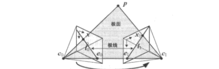
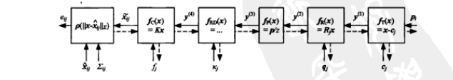
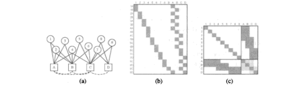

# 第7章 由运动到结构

来源：Szeliski《计算机视觉——算法与应用》中文第一版第7章；书页 263–292 / PDF 277–306。未越界第8章（书页 293 / PDF 307 起）。

## 本章总览

第6章在 2D/3D 对应已知、或 3D 点已知时估姿态与内参。本章处理逆问题：给出几幅图及其图像特征，如何同时估计 3D 点的位置以及 3D 几何与摄像机姿态。这就是通常意义下的由运动到结构(structure from motion, SfM)（Ullman 1979）。

先讲三角测量(7.1)：摄像机已定时把多条视线合成一个 3D 点。再讲二视图（两帧）SfM 与本质矩阵 / 基本矩阵、极线(7.2)，以及自标定(7.2.2)。大量轨迹同时估结构与运动用因子分解(7.3)。对所有摄像机和 3D 结构参数同时做非线性最小二乘，即光束平差法(bundle adjustment)(7.4)。场景里有较高层结构（直线、平面）时见 7.5。稠密亮度运动留第8章，极线约束下的稠密立体留第11章。图 7.1 给出正交因子分解、增量 SfM 与互联网照片重建的例子。

学完应能分清：三角测量假定相机已知；本质矩阵 $\mathbf{E}$ 管已标定两视图；基本矩阵 $\mathbf{F}$ 管未标定；因子分解适合正交/弱透视；精确解看光束平差。

🔑 关键速记：SfM = 从二维对应同时恢复三维点 + 多相机运动；两帧用 $\mathbf{E}/\mathbf{F}$，多帧用分解或光束平差。

## 核心知识点

### 三角测量

三角测量是根据对图像位置的集合和已知的摄像机位置确定一个点的 3D 位置。这是 6.2 节摄像机姿态估计的逆问题。

最简单的办法是寻找离所有 3D 射线都最近的那个 3D 点 $\mathbf{p}$。这些 3D 射线对应于由摄像机 $\{\mathbf{P}_{j}=\mathbf{K}_{j}[\mathbf{R}_{j}\mid\mathbf{t}_{j}]\}$ 观察到的 2D 匹配特征位置 $\{\mathbf{x}_{j}\}$。原点在 $\mathbf{c}_{j}=-\mathbf{R}_{j}\mathbf{c}_{j}$ 的记法与 (2.55)(2.56) 一致，方向为 $\hat{\mathbf{v}}_{j}=\mathcal{N}(\mathbf{R}_{j}^{T}\mathbf{K}_{j}^{-1}\mathbf{x}_{j})$。在每条射线上离 $\mathbf{p}$ 点最近的点定义为 $\mathbf{q}_{j}$，最小化

$$
\sum_{j}\lvert\mathbf{c}_{j}+d_{j}\hat{\mathbf{v}}_{j}-\mathbf{p}\rvert^{2}
\tag{7.1}
$$

它在 $d_{j}=\hat{\mathbf{v}}_{j}\cdot(\mathbf{p}-\mathbf{c}_{j})$ 取得最小值，因此 $\mathbf{q}_{j}=\mathbf{c}_{j}+(\hat{\mathbf{v}}_{j}\hat{\mathbf{v}}_{j}^{T})(\mathbf{p}-\mathbf{c}_{j})$（7.2），用公式 (2.29) 的标记法表示。点 $\mathbf{p}$ 和 $\mathbf{q}_{j}$ 之间的平方距离为 $r_{j}^{2}=\lVert(\mathbf{I}-\hat{\mathbf{v}}_{j}\hat{\mathbf{v}}_{j}^{T})(\mathbf{p}-\mathbf{c}_{j})\rVert^{2}$（7.3）。对所有射线最近的最优点 $\mathbf{p}$ 可以当成常规最小二乘问题来计算，通过累加所有 $r_{j}^{2}$ 的和找出 $\mathbf{p}$ 点的最优值：

$$
\mathbf{p}=\Bigl[\sum_{j}(\mathbf{I}-\hat{\mathbf{v}}_{j}\hat{\mathbf{v}}_{j}^{T})\Bigr]^{-1}
\Bigl[\sum_{j}(\mathbf{I}-\hat{\mathbf{v}}_{j}\hat{\mathbf{v}}_{j}^{T})\mathbf{c}_{j}\Bigr]
\tag{7.4}
$$

图 7.2 画出离光学射线 $\mathbf{c}_{j}+d_{j}\hat{\mathbf{v}}_{j}$ 最近的点。

另外一种形式化方法在统计上更优：当有部分摄像机比其他摄像机更靠近那个 3D 点的时候，它能得到明显更好的估计结果，即最小化测量方程的残差 (7.5)(7.6)。如同 (6.21)(6.33)(6.34)，通过在等号两边同时乘上分母，可以将这一非线性方程组转化成一个线性的最小二乘问题。注意：如果我们采用齐次坐标 $\mathbf{p}=(X,Y,Z,W)$，所得到的方程组将是齐次的，可以用奇异值分解(SVD)或者本征值问题（找最小的奇异向量或者本征向量）很好地解决。假如令 $W=1$，则可以用常规最小二乘求解，不过结果有可能是奇异的或者病态的，即假如所有的视线都是平行的，正如远离摄像机的点所呈现的那样。

由于这个原因，通常优先使用齐次坐标中参数化 3D 点，特别是当我们知道有些点离摄像机的距离有可能有很大差异的时候。当然，不管选择什么表示形式，用非线性最小二乘法最小化观测集 (7.5) 和 (7.6)，如同 (6.14) 和 (6.23) 描述的那样，胜于用线性最小二乘法求解。对于两个观测的情况，准确最小化真实重投影误差 (7.5) 和 (7.6) 的点 $\mathbf{p}$ 的位置，可以用六阶方程组求解得到（Hartley and Sturm 1997）。

三角测量要注意的另一个问题是手性(chirality)的影响，即，必须保证重建点在所有摄像机的前面（Hartley 1998），然而这并不总是能够得到保证的。有一种有用的启发式方法，即将那些在摄像机后面的点看作是因为它们的射线是发散的（想象一下图 7.2 中射线互相背离的情形），并通过将它们的 $W$ 值设为 0 来将这些点置于无穷远的平面上。

🔑 关键速记：相机已知时，3D 点是多条视线的最近交；齐次 $(X,Y,Z,W)$ 比强行 $W=1$ 更稳，还要检查点在相机前方。

### 二视图由运动到结构

迄今为止我们学习的 3D 重建，都是假设事先已经知道 3D 点位置或者 3D 摄像机的姿态。在这节中，我们首次接触由运动到结构，它是从图像的对应同时恢复 3D 结构和姿态。

考虑图 7.3：一个 3D 点 $\mathbf{p}$ 从两个摄像机观察到，相对位置通过旋转 $\mathbf{R}$ 和平移 $\mathbf{t}$ 表达。因为我们对摄像机的位置一无所知，所以在不失一般性的情况下，我们可以将第一个摄像机设定在原点处 $\mathbf{c}_{0}=\mathbf{0}$，并且它的规范方向为 $\mathbf{R}_{0}=\mathbf{I}$。向量 $\mathbf{t}=\mathbf{c}_{1}-\mathbf{c}_{0}$，$\mathbf{p}-\mathbf{c}_{0}$ 和 $\mathbf{p}-\mathbf{c}_{1}$ 共面，并且用像素量测 $\mathbf{x}_{0}$ 和 $\mathbf{x}_{1}$ 表达了所定义的基本极线约束。

点 $\mathbf{p}$ 在第一幅图像中的观测位置为 $\mathbf{p}_{0}=d_{0}\hat{\mathbf{x}}_{0}$，可以通过下面的变换把它映射到第二幅图像中 $d_{1}\hat{\mathbf{x}}_{1}=\mathbf{p}_{1}=\mathbf{R}\mathbf{p}_{0}+\mathbf{t}=\mathbf{R}(d_{0}\hat{\mathbf{x}}_{0})+\mathbf{t}$（7.7），其中 $\hat{\mathbf{x}}_{j}=\mathbf{K}_{j}^{-1}\mathbf{x}_{j}$ 是（局部的）射线方向向量。通过在公式两边同时取与 $\mathbf{t}$ 的叉积，以达到在公式右边去除 $\mathbf{t}$ 的效果：$d_{1}[\mathbf{t}]_{\times}\hat{\mathbf{x}}_{1}=d_{0}[\mathbf{t}]_{\times}\mathbf{R}\hat{\mathbf{x}}_{0}$（7.8）。在公式两边点积 $\hat{\mathbf{x}}_{1}$ 可得 $d_{0}\hat{\mathbf{x}}_{1}^{T}([\mathbf{t}]_{\times}\mathbf{R})\hat{\mathbf{x}}_{0}=d_{1}\hat{\mathbf{x}}_{1}^{T}[\mathbf{t}]_{\times}\hat{\mathbf{x}}_{1}=0$（7.9）。上式为 0 是因为等号右边是有两个相等项的混合积（向量三重积）。叉积矩阵 $[\mathbf{t}]_{\times}$ 是反对称的。因此得到基本的极线约束

$$
\hat{\mathbf{x}}_{1}^{T}\mathbf{E}\hat{\mathbf{x}}_{0}=0,\qquad
\mathbf{E}=[\mathbf{t}]_{\times}\mathbf{R}
\tag{7.10, 7.11}
$$

$\mathbf{E}$ 叫本质矩阵(essential matrix)（Longuet-Higgins 1981）。另一种导出：为使摄像机朝向使射线 $\hat{\mathbf{x}}_{0}$ 和 $\hat{\mathbf{x}}_{1}$ 在 3D 空间相交于点 $\mathbf{p}$ 的方向，连接两个摄像机中心的向量 $\mathbf{c}_{1}-\mathbf{c}_{0}=-\mathbf{K}_{1}^{-1}\mathbf{t}$ 与像素点 $\mathbf{x}_{0}$ 和 $\mathbf{x}_{1}$ 对应的射线（即 $\mathbf{K}_{1}^{-T}\hat{\mathbf{x}}_{j}$）肯定是面的，这就要求有一个混合积（7.12）。因为 $\hat{\mathbf{x}}_{1}^{T}\mathbf{t}=0$，所以本质矩阵 $\mathbf{E}$ 将在图像 0 中的点 $\hat{\mathbf{x}}_{0}$ 映射到图像 1 中的直线 $\mathbf{l}_{1}=\mathbf{E}\hat{\mathbf{x}}_{0}$（图 7.3）。所有的这些直线都必须通过第二个极点 $\mathbf{e}$，因此它被定义为具有 0 奇异值的 $\mathbf{E}$ 的左奇异向量，或者等价地，向量 $\mathbf{t}$ 到图像 1 的投影。与此关系的对偶（转置）给出图像 0 的极线为 $\mathbf{l}_{0}=\mathbf{E}^{T}\hat{\mathbf{x}}_{1}$，$\mathbf{e}_{0}$ 为 $\mathbf{E}$ 的右奇异向量。

给定这个基本关系 (7.10)，怎样使用它来恢复隐含在本质矩阵 $\mathbf{E}$ 中的摄像机运动呢？假如我们有 $N$ 个对应测量 $\{\mathbf{x}_{k0},\mathbf{x}_{k1}\}$，我们可以形成 $N$ 个关于 $\mathbf{E}$ 中 $\{\mathbf{e}_{00},\ldots,\mathbf{e}_{22}\}$ 的 9 个元素的齐次方程 (7.13)，可以更紧凑地写为 $[\mathbf{x}_{k1}\,\mathbf{x}_{k0}^{T}]\otimes\mathbf{E}=\mathbf{Z}_{k}\otimes\mathbf{e}_{z}=0$（7.14），其中 $\otimes$ 表示矩阵元素的逐元素积并求和，$\mathbf{z}_{k}$ 和 $\mathbf{Z}_{k}$ 是 $\hat{\mathbf{x}}_{k0}\hat{\mathbf{x}}_{k1}^{T}$ 和本质矩阵 $\mathbf{E}$ 的栅格（向量化）形式。给出 $N$ 个像这样的方程，我们可以用 SVD 计算本质矩阵每个项在相差一个尺度量的意义下的估计值。

考虑到噪声的情况下，这个估计值与最优值有多接近？如果看图 7.13 中的项，你会看到有些项是图像测量的乘积（即 $\hat{x}_{k0}\hat{y}_{k1}$），而另外一些则是直接的图像测量（甚至是单位项）。假如这些测量具有大小相近的噪声，则这种测量相乘的项会通过乘上其他元素而放大其噪声，从而使得敏感性变得很差。Hartley(1997a)建议应该平移和缩放这些点的坐标从而使其质心在原点处，而它们的方差为单位大小，即 (7.15)(7.16)，使得 $\sum\bar{x}_{k}=\sum\bar{y}_{k}=0$ 和 $\sum\bar{x}_{k}^{2}+\sum\bar{y}_{k}^{2}=2n$。一旦从变换后的坐标 $\{\bar{\mathbf{x}}_{k0},\bar{\mathbf{x}}_{k1}\}$ 计算出本质矩阵 $\bar{\mathbf{E}}$，其中 $\bar{\mathbf{x}}_{k}=\mathbf{T}_{k}\hat{\mathbf{x}}_{k}$，原始的本质矩阵 $\mathbf{E}$ 便可以恢复为 $\mathbf{E}=\mathbf{T}_{1}^{T}\bar{\mathbf{E}}\mathbf{T}_{0}$（7.17）。

一旦恢复出本质矩阵 $\mathbf{E}$ 的一个估计值，就可以估计平移向量 $\mathbf{t}$ 的方向。注意，两个摄像机的绝对距离是不可能仅靠图像测量来恢复的，不论使用多少个摄像机或者多少个点。摄像机和焦点的绝对位置和距离，在摄影测绘学中通常被称作「地面控制点」，在确定最后的尺寸、位置和方向时总是需要中的。

要估计这个方向 $\hat{\mathbf{t}}$，注意到在理想的无噪声条件下，本质矩阵 $\mathbf{E}$ 是奇异的，即 $\hat{\mathbf{t}}^{T}\mathbf{E}=\mathbf{0}$。这个奇异性可以从对本质矩阵 $\mathbf{E}$ 作 SVD 分解后有一个 0 奇异值，$ \mathbf{E}=[\hat{\mathbf{t}}]_{\times}\mathbf{R}=\mathbf{U}\boldsymbol{\Sigma}\mathbf{V}^{T}$，奇异值为 $(1,1,0)$ 的结构（7.18）。在有噪声的情况下对 $\mathbf{E}$ 进行分解时，最小奇异值对应的奇异向量给我们 $\hat{\mathbf{t}}$。（另外两个奇异值会很接近，但是一般情况下不会等于 1，因为 $\mathbf{E}$ 只能在相差一个未知尺度的意义下计算出来。）

因为 $\mathbf{E}$ 是不满秩的，所以我们只需要公式 (7.14) 形式的七个对应而不是八个来估计这个矩阵（Hartley 1994a；Torr and Murray 1997；Hartley and Zisserman 2004）。在 RANSAC 鲁棒拟合阶段使用更少对应的好处是只需要产生更少的随机样本。从这七个齐次方程（我们可以把它们组织成 $7\times 9$ 的矩阵以作 SVD 分析），我们可以得到两个独立的向量 $\mathbf{f}_{0}$ 和 $\mathbf{f}_{1}$ 使得 $\mathbf{Z}_{k}\cdot\mathbf{f}_{j}=0$。这两个向量可以转换成 $3\times 3$ 的矩阵 $\mathbf{E}_{0}$ 和 $\mathbf{E}_{1}$，它们展开为解空间 $\mathbf{E}=\alpha\mathbf{E}_{0}+(1-\alpha)\mathbf{E}_{1}$（7.19）。为了找到 $\alpha$ 的正确数值，我们知道本质矩阵 $\mathbf{E}$ 是不满秩的，所以它的行列式为 0，因此 $\det(\alpha\mathbf{E}_{0}+(1-\alpha)\mathbf{E}_{1})=0$（7.20）。根据上式，我们可以得到关于 $\alpha$ 的三次方程，它有一个或者三个根（极）。将所得的值代入公式 (7.19) 得到 $\mathbf{E}$，我们可以用之前没用过的对应测试该 $\mathbf{E}$ 是否正确的一个。

一旦恢复了 $\hat{\mathbf{t}}$，我们怎样估计对应的旋转矩阵 $\mathbf{R}$？回忆一下叉积算子 $[\hat{\mathbf{t}}]_{\times}$（2.32），它将一个向量投影到一组正交基向量上，其中包括 $\hat{\mathbf{t}}$，让 $\hat{\mathbf{t}}$ 这个方向的分量为零，另外两个向量旋转 $90^{\circ}$。从 (7.18) 和 (7.21) 可以得到 $\mathbf{E}=[\hat{\mathbf{t}}]_{\times}\mathbf{R}=\mathbf{SZ}\mathbf{R}_{90^{\circ}}\mathbf{S}^{T}\mathbf{R}=\mathbf{U}\boldsymbol{\Sigma}\mathbf{V}^{T}$（7.22），从上式可以得出结论 $\mathbf{S}=\mathbf{U}$。回忆一下没有噪声的本质矩阵的情况，$(\boldsymbol{\Sigma}=\mathbf{Z})$，因此 $\mathbf{R}_{90^{\circ}}\mathbf{U}^{T}\mathbf{R}=\mathbf{V}^{T}$，然后 $\mathbf{R}=\mathbf{U}\mathbf{R}_{90^{\circ}}^{T}\mathbf{V}^{T}$（7.23）。不幸的是，我们仅在相差一个符号的意义下知道 $\mathbf{t}$ 和 $\hat{\mathbf{t}}$，而且不能保证矩阵 $\mathbf{U}$ 和 $\mathbf{V}$ 是旋转矩阵（你可以翻转它们的符号仍然能够得到有效的 SVD）。因此，我们必须产生四种可能的旋转矩阵 $\mathbf{R}=\pm\mathbf{U}\mathbf{R}_{90^{\circ}}^{\pm}\mathbf{V}^{T}$（7.25）。然后保留行列式 $|\mathbf{R}|=1$ 的两个矩阵 $\mathbf{R}$。为了消除剩余形成扭曲对（Hartley and Zisserman 2004, p.240）的两个潜在旋转矩阵 $\mathbf{R}$ 的问题，我们需要把它们与平移方向 $\pm\hat{\mathbf{t}}$ 两种可能的组合考虑，选择两个摄像机「前面都能看到的点数最大的组合」。

所有的观测点必须在摄像机前面，即，在从摄像机射出的视线上距离为正，这个性质就叫「手性」(chirality)（Hartley 1998）。除了确定旋转和平移的正负性之外，如前所述，重建过程中点的手性（距离的正负）可以用于在 RANSAC 过程中（与重投影误差一起）以区分可能的和不可能的构型。手性还可以用于把投影重建 (7.2.1 节和 7.2.2 节) 转化为拟仿射(quasi-affine)重建（Hartley 1998）。

前面描述的标准「八点算法」(Hartley 1997a)并不是通过对关系来估计摄像机运动的唯一方法。变种方法有：在矩阵 $\mathbf{E}$ 中使用为零的约束 (7.19)–(7.20) 而使用七个点的方法，另外一种是五点算法。这个算法需要寻找一个十阶多项式的根（Nistér 2004）。因为这些算法使用更少的点来计算估计，所以作为随机采样 (RANSAC) 策略的一部分使用时它们对外点不敏感。

**单纯平移（已知旋转参数）。** 在已知旋转参数的情况下，我们可以预先旋转第二幅图像中的点使其与第一幅图像的视场方向匹配。得到的 3D 点都集向（或远离）汇集点(focus of expansion, FOE)，如图 7.4 所示。所产生的本质矩阵 $\mathbf{E}$（在没有噪声情况下）是反对称的，所以可以通过在公式 (7.13) 中设置 $e_{ij}=-e_{ji}$ 和 $e_{ii}=0$，从而更直接地估计 $\mathbf{E}$。现在，根据这两个具有非零视差的点足以估计 FOE。一种更直接的推导出 FOE 估计的方法是最小化混合积 $\sum_{i}(\mathbf{x}_{i0},\mathbf{x}_{i1},\mathbf{e})^{2}$（7.26），它等价于求解如下方程组的零空间 (7.27)。注意，正如八点算法中演示的那样，在计算估计之前，建议归一化 2D 点使其具有单位方差。在有大量点位于无穷远处的情形下，例如，拍摄室外场景时或者摄像机的运动相对远距离的物体而言很小时，需要另外一种 RANSAC 策略来估计摄像机的运动。首先，选取一对点估计旋转矩阵，最好这两点都在无穷远处（距离摄像机非常远）。然后，计算 FOE 并检查残差是否很小（表明与旋转假设一致）而且所有指向或者远离极点 (FOE) 的运动是合同的（忽略非常微小的运动，它们可能被噪声所污染了）。

**单纯旋转。** 纯旋转运动的情况将导致本质矩阵 $\mathbf{E}$ 和平移方向 $\hat{\mathbf{t}}$ 估计退化。首先假设旋转矩阵我们知道已知的情况。FOE 的估计过程将退化，因为 $\mathbf{x}_{i0}=\mathbf{x}_{i1}$，从而导致公式 (7.27) 的退化。这表明如下做法可能是明智的：在计算整个本质矩阵之前，先用公式 (6.32) 估计旋转矩阵 $\mathbf{R}$，这可能只需要少量的点就能完成，然后计算旋转这些点后的残差，再推进到计算整个本质矩阵 $\mathbf{E}$ 这一步。

#### 投影（未标定）的重建

在很多情况下，比如要根据网上照片或老照片（由未知摄像机拍摄的、没有任何 EXIF/可交换图片文件资料/标签）来建立 3D 模型时，我们事先并不知道与这些输入图像关联的内标定参数。在类似情况下，尽管真正的度量结构可能无法获得（例如，在世界坐标系中正交的线或面在重建过程中最终也许不能恢复成正交的），但我们还是可以估计出一个二视图重建。

考虑我们用来估计本质矩阵 $\mathbf{E}$ 的推导过程 (7.10)–(7.12)。在未标定的情况下，我们不知道标定矩阵 $\mathbf{K}_{j}$，所以无法使用归一化射线方向 $\hat{\mathbf{x}}_{j}=\mathbf{K}_{j}^{-1}\mathbf{x}_{j}$。我们只能得到图像坐标 $\mathbf{x}_{j}$，所以从本质矩阵 (7.10) 变为

$$
\hat{\mathbf{x}}_{1}^{T}\mathbf{E}\hat{\mathbf{x}}_{0}=\mathbf{x}_{1}^{T}\mathbf{K}_{1}^{-T}\mathbf{E}\mathbf{K}_{0}^{-1}\mathbf{x}_{0}=\mathbf{x}_{1}^{T}\mathbf{F}\mathbf{x}_{0}=0
\tag{7.28}
$$

其中

$$
\mathbf{F}=\mathbf{K}_{1}^{-T}\mathbf{E}\mathbf{K}_{0}^{-1}=[\mathbf{e}]_{\times}\hat{\mathbf{H}}
\tag{7.29}
$$

称为「基本矩阵」(fundamental matrix)（Faugeras 1992；Hartley, Gupta, and Chang 1992；Hartley and Zisserman 2004）。与本质矩阵类似，基本矩阵（原理上）的秩为 2，$\mathbf{F}=[\mathbf{e}_{1}]_{\times}\hat{\mathbf{H}}=\mathbf{U}\boldsymbol{\Sigma}\mathbf{V}^{T}$，$\boldsymbol{\Sigma}=\mathrm{diag}(\sigma_{0},\sigma_{1},0)$（7.30）。它左侧最小的奇异向量代表图像 1 中的极点 $\mathbf{e}_{1}$ 而右侧最小的奇异向量是 $\mathbf{e}_{0}$（如图 7.3 所示）。公式 (7.29) 中的单应矩阵 $\hat{\mathbf{H}}$，在原理上应该等于 $\hat{\mathbf{H}}=\mathbf{K}_{1}^{-T}\mathbf{R}\mathbf{K}_{0}^{-1}$（7.31），它并不能唯一地从 $\mathbf{F}$ 恢复出来，因为任何形式的 $\hat{\mathbf{H}}'=\hat{\mathbf{H}}+\mathbf{e}\mathbf{v}^{T}$ 单应矩阵最后都会得到同一个 $\mathbf{F}$ 矩阵。（注意，$[\mathbf{e}]_{\times}$ 会使 $\mathbf{e}$ 的任何倍数都消失。）

这些有效的单应矩阵 $\hat{\mathbf{H}}$ 中的任何一个都将场景中的某个平面从一幅图像映射到另一幅图像。不可能事先知道究竟是哪一个，除非作为基本矩阵 $\mathbf{F}$ 估计过程的一部分（与估计本质矩阵 $\mathbf{E}$ 的旋转矩阵类似）。我们选取四个或更多点对应来计算单应矩阵 $\hat{\mathbf{H}}$，或者通过单应矩阵映射一幅图像上的所有点到另一幅图像，看哪幅图的点与其在另一幅图上的对应点排成线。

为了进行场景的投影重建，我们可以选取满足公式 (7.29) 的任何单应矩阵 $\hat{\mathbf{H}}$。例如，通过类比公式 (7.18)–(7.24) 的方法，我们得到 $\mathbf{F}=[\mathbf{e}_{1}]_{\times}\hat{\mathbf{H}}=\mathbf{SZ}\mathbf{R}_{90^{\circ}}\mathbf{S}^{T}\hat{\mathbf{H}}=\mathbf{U}\boldsymbol{\Sigma}\mathbf{V}^{T}$（7.32），因此 $\hat{\mathbf{H}}=\mathbf{U}\mathbf{R}_{90^{\circ}}^{T}\boldsymbol{\Sigma}\mathbf{V}^{T}$，将奇异矩阵的最小奇异值替换成合理的数值（比如中间值）就形成其中的 $\hat{\boldsymbol{\Sigma}}$（7.33）。这样，我们可以形成一对摄像机矩阵 $\mathbf{P}_{0}=[\mathbf{I}\mid\mathbf{0}]$ 和 $\mathbf{P}_{1}=[\hat{\mathbf{H}}\mid\mathbf{e}_{1}]$（7.34）。根据这对摄像机矩阵，就可以使用三角测量 (7.1 节) 对场景进行投影重建。

尽管投影重建在实践中可能没什么用处，但它通常可以升级为仿射或者度量重建，后文将给出详细内容。即使没有这个步骤，基本矩阵 $\mathbf{F}$ 在寻找其他对应时还是非常有用的，因为它们肯定都在对应的极线上，即，假设点的运动是由刚性变换引起的，那么图像 0 中任何特征点 $\mathbf{x}_{0}$ 的对应点都肯定位于图像 1 中的关联极线 $\mathbf{l}_{1}=\mathbf{F}\mathbf{x}_{0}$ 上。

📝待补全：极线把对应搜索从二维变成一维，稠密立体正是沿极线比亮度。先把两幅图矫正成水平扫描线，标准几何下 $d=fB/Z$、$x'=x+d$；更一般的平面扫描用一组单应把任意相机填进视差空间图像 $C(x,y,d)$。局部窗口聚集后 WTA，或写全局 $E_d+\lambda E_s$（DP / 扫描线 / 图割 / BP）。完整算法见第11章。本章只建立 $\mathbf{F}$ 与极线。

👉 完整深度讲解见第11章。

#### 自标定

如果能够得到度量重建，即平行线重建出来之后还是平行的，正交的墙面重建出来也是正交的，且重建的模型是真实情形的一个缩放，则由运动到结构的计算结果将非常有用（更易于理解）。多年来，为了把投影重建转换到度量重建，这等价于恢复关联于每幅图像的未知标定矩阵 $\mathbf{K}_{j}$，人们提出了大量自标定(self-calibration)或者自动标定(auto-calibration)方法。

如果已知场景的其他特定信息，也许可以采用不同的方法。例如，假如场景中有平行线（通常，让若干条线汇聚到同一个消失点便是验证），三个或者更多的消失点（它们是无穷远处那些点的图像），可用于为无穷远处的平面建立单应矩阵。消失点可以由它恢复出焦距和旋转矩阵，如果能够观测到两个或者更多有限正交消失点，就可以使用基于消失点的单幅图像标定方法（6.3.2 节）。

在缺乏这种外部信息的情况下，单纯依靠图像中的对应不可能恢复出每幅图像的独立参数化独立标定矩阵 $\mathbf{K}_{j}$。要明白这一点，可考虑所有摄像机矩阵 $\mathbf{P}_{j}=\mathbf{K}_{j}[\mathbf{R}_{j}\mid\mathbf{t}_{j}]$ 的集合，将世界坐标系中的点 $\mathbf{p}_{i}=(X,Y,Z,W)$ 投影到屏幕坐标 $\mathbf{x}_{j}\sim\mathbf{P}_{j}\mathbf{p}_{i}$。现在考虑通过任意的 $4\times 4$ 投影变换矩阵 $\hat{H}$ 变换 3D 场景中的点 $\{\mathbf{p}_{i}\}$，能够得到新的点 $\mathbf{p}_{i}'=\hat{H}\mathbf{p}_{i}$，从而构成新的模型。对每个摄像机矩阵 $\mathbf{P}_{j}$ 都后乘上 $\hat{H}^{-1}$ 也会得到相同的屏幕坐标，而对新的摄像机矩阵 $\mathbf{P}_{j}'=\mathbf{P}_{j}\hat{H}^{-1}$ 使用 RQ 分解，能够得到一组新的标定矩阵。

为此，所有自标定方法都假设标定矩阵的形式有限，不是设定一部分参数或使一部分参数相等，就是假设它们不随时间变化。Hartley and Zisserman(2004)；Moons, Van Gool, and Vergauwen(2010)中讨论的大多数方法都要求三幅以上的图像，但在这一节中，我们提出一种简单的方法，它能够从二视图重建过程中的基本矩阵 $\mathbf{F}$ 中恢复出这两幅图像的焦距 $(f_{0},f_{1})$（Hartley and Zisserman 2004, p.456）。

为了完成这个任务，我们假设摄像机的扭曲为零、已知的纵横比（通常设为 1）和一个已知的光心，如公式 (2.59) 所示。在实际中，这些假设的合理性怎么样，就像很多问题那样，答案视情况而定。

现在如果要绝对的度量精度，就像在摄影测绘学应用中那样，则必须要预先标定摄像机，这可以用 6.3 节介绍的其中一种方法来进行，并使用地面控制点确定重建。如果我们只是为了可视化或者基于图像的绘制应用而希望重建世界，如同 Snavely, Seitz, and Szeliski(2006)的照片游览系统那样，这样的假设在实际中是很合理的。

现在大部分摄像机都方形像素，而且光心就在图像中心附近，且很可能因为径向畸变 (6.3.5 节) 而与简单的摄像机模型有所不同，这意味着主要可能就应该进行补偿。最大的问题出现在图像的截取偏离心的时候（即光心不再位于中间）或视频图片是从一个不同的图片拍摄得到的时候（这种情况下，需要有一般的摄像机矩阵）。鉴于以上警示，Hartley and Zisserman(2004, p. 456)提出了基于 Kruppa 公式的二视图焦距估计法，过程如下。取基本矩阵 $\mathbf{F}$（7.30）的左右奇异向量 $\{\mathbf{u}_{0},\mathbf{u}_{1},\mathbf{v}_{0},\mathbf{v}_{1}\}$ 和它们关联的奇异值 $\{\sigma_{0},\sigma_{1}\}$，形成下面这组等式（7.35），其中两个矩阵 $\mathbf{D}_{j}=\mathbf{K}_{j}\mathbf{K}_{j}^{T}=\mathrm{diag}(f_{j}^{2},f_{j}^{2},1)$（7.36）。为了简单起见，我们重写 (7.35) 的分子和分母得到 $c_{ij0}(f_{0}^{2})=\mathbf{u}_{i}^{T}\mathbf{D}_{0}\mathbf{u}_{j}=a_{ij}+b_{ij}f_{0}^{2}$（7.37），$c_{ij1}(f_{1}^{2})=\sigma_{i}\sigma_{j}\mathbf{v}_{i}^{T}\mathbf{D}_{1}\mathbf{v}_{j}=c_{ij}+d_{ij}f_{1}^{2}$（7.38）。注意，两者中的任何一个都是 $f_{0}^{2}$ 或者 $f_{1}^{2}$ 的仿射变换（线性变化加常量）。因此，我们可以通过交叉相乘这些等式得到 $f_{0}^{2}$ 的二次方程，后者很容易求解。另一种解决方案是，观察到我们有一个关于未知标量 $\lambda$ 的三公式方程组，即 $c_{ij0}(f_{0}^{2})=\lambda c_{ij1}(f_{1}^{2})$（7.39），这很容易求解得到 $(f_{0}^{2},\lambda f_{1}^{2})$。

在实际中这种方法的效果怎么样？这种情况下的退化模型，例如，没有旋转的时候，或者光轴交叉的时候，这种方法根本不起作用的时候。（在这种情况下，可以改变摄像机的焦距以获得更深的或者更浅的重建，这是浅浮雕歧义的一个例子 (7.4.3 节)。）Hartley and Zisserman(2004)推荐使用基于至少三帧图像的重建方法。然而，如果能够找到从两幅图像可以很好地估计得到 $(f_{0}^{2},\lambda f_{1}^{2})$，则可用它们来初始化对所有参数找到的更完全的光束平差法 (7.4 节)。另一种方法，经常被用于诸如照片游览等系统，是用摄像机的 EXIF 标签信息或者一般默认值来初始化焦距的估计并作为光束平差法的一部分对它们求精。

#### 应用：视图变形

视图变形是二视图由运动到结构的一个有趣的应用（也叫「视图插值」，参见 13.1 节），它可以用于产生从 3D 场景的一个视角到其另一个视角的平滑的 3D 动画。为实现这种转变，必须首先平滑地插值摄像机矩阵，即摄像机位置、角度和焦距。可以用简单的线性插值法（用四元组来表示旋转矩阵 (2.1.4 节)），但是用渐入(easing in)和渐出(easing out)的方法得到摄像机参数，效果更好。为了生成中间帧，要么建立 3D 对应对的完全集合，要么为每个参考图像创建 3D 模型（原型）。13.1 节介绍了几种解决这个问题的常用方法。其中最简单的方法是三角剖分每幅图像上的匹配特征点集合，例如，使用 Delaunay 三角剖分。因为这些 3D 点被重投影到其中间视图，所以可以通过仿射变换或投影变换把像素从原始的源图像映射到它们的新视图（Szeliski and Shum 1997）。然后，最后的图像由两张参考图像的线性融合而成，就像使用通常的变形那样（3.6.3 节）。

📝待补全：视点插值用两张参考图加各自深度，按姿态把像素卷到虚拟相机再交叉淡入；前向卷绕会留空洞，常改反向或从后往前画。层次深度图像在同一像素存多层颜色–深度，被挡的层新视点才看得见。几乎不建网格时走 4D 光场 $L(s,t,u,v)$ 重采样。完整方法见第13.1–13.3节。本章只把视图变形当成两帧 SfM 的应用。

👉 完整深度讲解见第13章。

🔑 关键速记：已标定两视图用本质矩阵 $\mathbf{E}=[\mathbf{t}]_{\times}\mathbf{R}$；未标定用基本矩阵 $\mathbf{F}=\mathbf{K}^{-\mathrm{T}}\mathbf{E}\mathbf{K}^{-1}$。八点要先归一化；RANSAC 里五点、七点更省样本。

### 因子分解

在处理视频序列的时候，我们通常会得到扩展的特征轨迹 (4.1.4 节)，可从它使用一个称作「因子分解」的过程恢复出结构和运动。考虑由一个旋转乒乓球生成的轨迹，球上标注点以便形状和运动更易于分解（图 7.5）。我们很容易从轨迹的形状判断出这个运动物体是球形的，但如何从数学上推导出这个结论呢？

结果证明，我们下面讨论的正交投影或者相关的模型下，使用奇异值分解可以同时恢复出形状和运动（Tomasi and Kanade 1992）。考虑公式 (2.47)–(2.49) 中介绍的正交和弱透视投影模型。因为最后一行通常是 $(0\ 0\ 0\ 1)$，所以没有透视除法 (perspective division)，我们可以写成

$$
\mathbf{x}_{ji}=\hat{\mathbf{P}}_{j}\bar{\mathbf{p}}_{i}
\tag{7.40}
$$

其中 $\mathbf{x}_{ji}$ 是第 $j$ 帧的第 $i$ 个点的位置，$\hat{\mathbf{P}}_{j}$ 是投影矩阵 $\mathbf{P}_{j}$ 的上面 $2\times 4$ 的部分，$\bar{\mathbf{p}}_{i}=(X_{i},Y_{i},Z_{i},1)$ 是增广了齐次的 3D 点位置。我们假设（暂时）每一帧 $j$ 的每个点 $i$ 都是可见的。我们可以得到在 $j$ 帧中的所有投影点 $\mathbf{x}_{j}$ 的质心（平均值），

$$
\bar{\mathbf{x}}_{j}=\frac{1}{N}\sum_{i=1}^{N}\mathbf{x}_{ji}=\hat{\mathbf{P}}_{j}\frac{1}{N}\sum_{i=1}^{N}\bar{\mathbf{p}}_{i}=\hat{\mathbf{P}}_{j}\mathbf{c}
\tag{7.41}
$$

其中 $\bar{\mathbf{c}}=(\bar{X},\bar{Y},\bar{Z},1)$ 是点云的 3D 质心的齐次坐标。由于由运动到结构中世界坐标系总是任意的，即，我们不能在没有地面控制点（已知测量值）的情况下恢复出真正的 3D 位置，所以我们可以把世界坐标系的原点移到点的质心位置，即，$\bar{X}=\bar{Y}=\bar{Z}=0$，所以 $\bar{\mathbf{c}}=(0,0,0,1)$。因此，在每帧中 2D 点集的质心 $\bar{\mathbf{x}}_{j}$ 是矩阵 $\hat{\mathbf{P}}_{j}$ 的最后的元素。

2D 点在减去其图像质心后的位置可以表示成 $\hat{\mathbf{x}}_{ji}=\mathbf{x}_{ji}-\bar{\mathbf{x}}_{j}$。现在我们可以写成 $\hat{\mathbf{x}}_{ji}=\mathbf{M}_{j}\mathbf{p}_{i}$（7.42），其中 $\mathbf{M}_{j}$ 是投影矩阵 $\mathbf{P}_{j}$ 的上面 $2\times 3$ 的部分，$\mathbf{p}_{i}=(X_{i},Y_{i},Z_{i})$。联合所有这些测量公式可以得到一个大的矩阵

$$
\hat{\mathbf{X}}=\begin{bmatrix}\hat{\mathbf{x}}_{11}&\cdots&\hat{\mathbf{x}}_{1N}\\\vdots&&\vdots\\\hat{\mathbf{x}}_{M1}&\cdots&\hat{\mathbf{x}}_{MN}\end{bmatrix}
=\begin{bmatrix}\mathbf{M}_{1}\\\vdots\\\mathbf{M}_{M}\end{bmatrix}
[\mathbf{p}_{1}\ \cdots\ \mathbf{p}_{N}]=\hat{\mathbf{M}}\hat{\mathbf{S}}
\tag{7.43}
$$

$\hat{\mathbf{X}}$ 是「测量矩阵」，$\hat{\mathbf{M}}$ 和 $\hat{\mathbf{S}}$ 分别是运动矩阵和结构矩阵（Tomasi and Kanade 1992）。因为运动矩阵 $\hat{\mathbf{M}}$ 是 $2M\times 3$ 的，结构矩阵 $\hat{\mathbf{S}}$ 是 $3\times N$ 的，所以对 $\hat{\mathbf{X}}$ 进行 SVD 分解只能得到 3 个非零的奇异值。当 $\hat{\mathbf{X}}$ 中的测量包含噪声时，SVD 返回在最小二乘意义下最接近 $\hat{\mathbf{X}}$ 的秩为 3 的分解因子。如果对 $\hat{\mathbf{X}}=\mathbf{U}\boldsymbol{\Sigma}\mathbf{V}^{T}$ 进行 SVD 分解能直接得到 $\hat{\mathbf{M}}$ 和 $\hat{\mathbf{S}}$ 就好了，但是得不到。我们只能写成如下关系 $\hat{\mathbf{X}}=\mathbf{U}\boldsymbol{\Sigma}\mathbf{V}^{T}=[\mathbf{U}\mathbf{Q}][\mathbf{Q}^{-1}\boldsymbol{\Sigma}\mathbf{V}^{T}]$（7.44），且设 $\hat{\mathbf{M}}=\mathbf{U}\mathbf{Q}$ 和 $\hat{\mathbf{S}}=\mathbf{Q}^{-1}\boldsymbol{\Sigma}\mathbf{V}^{T}$。

我们怎样才能恢复出 $3\times 3$ 的矩阵 $\mathbf{Q}$？这取决于所采用的运动模型。在正交投影 (2.47) 中，$\mathbf{M}_{j}$ 中的项是旋转矩阵 $\mathbf{R}_{j}$ 的前两行，所以我们有 $\mathbf{m}_{j0}\cdot\mathbf{m}_{j0}=\mathbf{u}_{0j}\mathbf{Q}\mathbf{Q}^{T}\mathbf{u}_{0j}^{T}=1$ 等一组二次约束（7.45）。针对矩阵 $\mathbf{Q}\mathbf{Q}^{T}$ 中的所有项，我们可以得到大量的公式，并且应用一种叫做矩阵平方根的方法（附录 A.1.4 节）可以恢复出矩阵 $\mathbf{Q}$。如果处理归一的正交投影的情况，即 $\mathbf{M}_{j}=s_{j}\mathbf{R}_{j}$，第一和第三个公式等于 $s_{j}$，所以可以把它们设置成彼此相等。

注意，即使恢复出矩阵 $\mathbf{Q}$，仍然存在浅浮雕歧义，即，我们不可能确定物体是从左向右旋转还是在其深度反转后是向相反的方向运动。这个难题在经典旋转 Necker Cube 视觉错觉中可以见到。额外的线索，例如特征点或透视效果的出现和消失，这些都会在下文讨论，可以用来消除歧义。

对于不同于单纯正交投影的运动模型，例如，对于归一的正交投影和弱透视投影，前面这个方法必须以合适的方式加以扩展。最初因子分解算法的其他扩展还包括多体刚性运动、增加线和面、以及重缩放测量以加入个体位置的不确定性。

因子分解方法的一个缺点是它们要求有轨迹的完整集合，即为了让因子分解方法有效，每个特征点在每帧中必须都是可见的。Tomasi and Kanade(1992)提出了一种处理方法，首先在较小的稠密子集上应用因子分解，然后用已知的摄像机（运动）或者点（结构）的估计来幻觉出(hallucinate)出其余缺失的数值，从而以增量方式合并更多特征和摄像机。Buchanan and Fitzgibbon(2005)提出了一种快速迭代算法以处理含有缺失数据的大规模矩阵的因子分解。带有缺失数据的主成分分析(principal component analysis, PCA)主题也出现在其他计算机视觉问题中。

#### 透视与投影因子分解

常规因子分解的另一个缺点是不能处理透视摄像机。绕过这个问题的一种途径是首先进行仿射（例如，正交）重建，然后以迭代方式校正这个结果以符合透视效果（Christy and Horaud 1996）。注意，以物体为中心的投影模型 (2.76)

$$
x_{ji}=s_{j}\frac{\mathbf{r}_{xj}\cdot\mathbf{p}_{i}+t_{xj}}{1+\eta_{j}\mathbf{r}_{zj}\cdot\mathbf{p}_{i}},\qquad
y_{ji}=s_{j}\frac{\mathbf{r}_{yj}\cdot\mathbf{p}_{i}+t_{yj}}{1+\eta_{j}\mathbf{r}_{zj}\cdot\mathbf{p}_{i}}
\tag{7.46, 7.47}
$$

与归一的正交投影模型 (7.40) 有所区别，它包含分母项 $(1+\eta_{j}\mathbf{r}_{zj}\cdot\mathbf{p}_{i})$。如果已知 $\mathbf{t}_{zj}=t_{zj}^{-1}$（结构参数 $\mathbf{p}_{i}$ 和运动参数 $(\mathbf{R}_{j},\mathbf{t}_{j})$ 的准确值），我们就可以在公式左边（可视点测量 $x_{ji}$ 和 $y_{ji}$）交叉乘上分母得到校正值。双线性投影模型 (7.40) 对它而言是精确的。在实践中，初始重建后，$\eta_{j}$ 可以通过比较每帧的重建点和感知到的点的位置单独估计。（旋转矩阵 $\mathbf{r}_{zj}$ 的第三行作为前两行的叉积总是可以获得的。）注意，因为 $\eta_{j}$ 是从图像测量确定的，所以摄像机并不需要事先进行标定，即，它们的焦距可以通过 $f_{j}=s_{j}/\eta_{j}$ 恢复。一旦估计出 $\eta_{j}$ 的值，特征位置就能够得到更正以进行新一轮的因子分解。注意，由于初始深度反因 $\eta_{j}$ 反号的二义性缘故，在计算 $\eta_{j}$ 时两个重建都需要尝试。（不正确的重建会使 $\eta_{j}$ 为负，这在物理上是没有意义的。）Christy and Horaud(1996)报告称他们的算法通常可以在三到五个迭代过程中收敛，大部分的时间都在进行 SVD 分解计算。

在没有假设已知部分摄像机参数的情况下（已知光心、正方形象素和零扭曲），另一种方法是进行完全投影因子分解（Sturm and Triggs 1996；Triggs 1996）。在这种情况下，列入摄像机矩阵的第三行 (7.40) 等价于每个重建测量 $\mathbf{x}_{ji}=\mathbf{M}_{j}\mathbf{p}_{i}$ 乘上其投影深度 $d_{ji}$，深度的逆 $\eta_{ji}=d_{ji}^{-1}=1/(\mathbf{P}_{j3}\mathbf{p}_{i})$。或者等价于每个测量位置乘上其投影深度 $d_{ji}$，测量矩阵变成带 $d_{ji}\hat{\mathbf{x}}_{ji}$ 的 $\hat{\mathbf{X}}=\hat{\mathbf{M}}\hat{\mathbf{S}}$（7.48）。在 Sturm and Triggs(1996)最初的论文中，投影深度 $d_{ji}$ 是通过二视图重建得到的，然后在每一轮迭代中不断地更新。所有作者都没有建议实际将矩阵 $\hat{\mathbf{P}}_{j}$ 的第三行的估计作为投影深度计算的一部分。无论在哪种情况下，我们都不清楚什么时候该方法的重建胜于部分方法的重建，特别是要用于它们来初始化光束平差法全部参数的时候。

因子分解方法的魅力在于它提供一种「闭式」（有时「线性」）方法来初始化迭代方法，例如光束平差法。另一种初始化方法是估计针对所有摄像机都能看到的某个公共平面估计其对应的单应（Rother and Carlsson 2002）。对于已标定的摄像机，这相当于为所有摄像机估计一致的旋转，例如，使用匹配的消失点。一旦恢复出这些参数，就可以通过求解一个线性系统来获得摄像机的位置。

#### 应用：稀疏 3D 模型提取

一旦估计出场景的多视角 3D 重建，就可以创建物体的带有纹理映射的 3D 模型，并从新的角度观察它。第一步是创建比由运动到结构产生的稀疏点云更稠密的 3D 模型。另外一种方法是使用稠密多视角立体视觉 (11.3 节–11.6 节)。可替代的一种更简单的方法是 3D 三角剖分，如图 7.6 所示，对 207 个重建得到的 3D 点进行三角剖分，生成一个表面网格。为了得到更真实的模型，可以为每个三角形抽出纹理图像。把 3D 三角形面上的点映射到 2D 图像上的公式是直观易懂的：只需要通过 $3\times 4$ 的投影矩阵得到三角形面的 2D 坐标即可获得一个 $3\times 3$ 的单应矩阵（平面透视），可获得多个视角的图像时，正如在多视角重建中的情况，或者使用最近的和最正面平行的(fronto-parallel)图像，或者融合多幅图像来处理视角相关的透视收缩。另一种方法是从每个参考摄像机创建一个分开的纹理图，然后在绘制阶段融合这些纹理图，这是视角相关的纹理映射 (13.1.1 节)。

📝待补全：把稀疏点变成稠密表面，走第11.6节多视立体：体素着色 / 空间雕刻、水平集、多边形网格，或多张深度图再合并。轮廓交集只能给出视觉外壳，凹洞要靠影像一致性往里雕。纹理映射和视角相关绘制见第13.1节；深度融成带符号距离或泊松网格见第12章。本章因子分解只给出稀疏点。

👉 完整深度讲解见第11、12、13章。

🔑 关键速记：正交投影下测量矩阵秩为 3，SVD 拆成运动×结构；缺轨迹、真透视都要迭代补，最后仍应交给光束平差。

### 光束平差法

最准确的估计结构和运动的方法是非线性最小化测量（重投影）误差，这是在摄影测绘学（和现在的计算机视觉）界中所说的光束平差法(bundle adjustment)。「光束」(bundle)一词表示连接光心和 3D 点的射线束，「平差」(adjustment)一词表示通过迭代的方法最小化重投影误差。Triggs, McLauchlan, Hartley et al.(1999)给出了这个主题的概述。

图 7.7 将 3D 点 $\mathbf{p}_{i}$ 通过一系列的变换 $f^{(k)}$ 变换到 2D 测量 $\mathbf{x}_{ij}$ 的变换链，每个变换由其自身的参数集控制。虚线表示在向后传递期间在计算偏导时的信息流。径向畸变函数的公式是 $f_{\mathrm{RD}}(\mathbf{x})=(1+\kappa_{1}r^{2}+\kappa_{2}r^{4})\mathbf{x}$。我们已经在前面的迭代姿态估计 (6.2.2 节) 的讨论中介绍了光束平差法的要素，即，公式 (6.42)–(6.48) 和图 6.5。这些公式和完全光束平差法的最大差别在于现在点的测量 $\mathbf{x}_{ij}$ 不但和点（轨迹索引 $i$）有关，还跟摄像机的姿态索引 $j$ 有关，

$$
\mathbf{x}_{ij}=\mathbf{f}(\mathbf{p}_{i},\mathbf{R}_{j},\mathbf{c}_{j},\mathbf{K}_{j})
\tag{7.49}
$$

且 3D 点位置 $\mathbf{p}_{i}$ 也同时得到更新。另外，如果摄像机没有经过预先的标定，如图 7.7 所示，普遍的做法将是加入径向畸变参数估计 (2.78) 的环节 (7.50)。图 7.7 中的大多数盒子（变换）前面都已经介绍过，预测 $\hat{\mathbf{x}}_{ij}$ 做过后缩放之后对它们进行鲁棒比较。这个操作可以写成 $\mathbf{r}_{ij}=\hat{\mathbf{x}}_{ij}-\mathbf{x}_{ij}$（7.51），$s_{ij}^{2}=\mathbf{r}_{ij}^{T}\boldsymbol{\Sigma}_{ij}^{-1}\mathbf{r}_{ij}$（7.52），$e_{ij}=\rho(s_{ij}^{2})$（7.53），其中 $\rho(s^{2})=\rho(r)$。对应的雅可比矩阵（偏导数）可以写成 $\partial e_{ij}/\partial\hat{\mathbf{x}}_{ij}=\rho'(s_{ij}^{2})$（7.54），$\partial e_{ij}/\partial\hat{\mathbf{x}}_{ij}=\boldsymbol{\Sigma}_{ij}^{-1}\mathbf{r}_{ij}$（7.55）。

链式表示法的优点是，不仅使偏导数和雅可比矩阵的计算更简单，而且它还可以被调整为适合于任何摄像机机构型。作为例子，我们来考虑安装在机器人的一个上的一对摄像机，该机器人在世界中移动，如图 7.8a 所示。把图 7.7 最右边的两个变换用图 7.8b 中的变换替换，除了恢复出世界的 3D 结构外，我们还可以同时恢复出每一时刻机器人的位置和每个摄像机相对于平台的标定参数。

#### 挖掘稀疏性

大规模的光束平差法问题，例如要对因特网上成千上万的图像进行 3D 场景重建，需要对上百万的测量（特征的匹配）和数以万计的未知参数（3D 点的位置和摄像机的姿态）这样的数据进行非线性最小二乘问题的求解。除非有特定的约束，否则这类问题很难求解，因为这种稠密最小二乘问题的（直接）求解的算法复杂度是未知量数目的立方级别的。

幸运的是，由运动到结构是一个二分问题。给定图像中的每个特征点 $\mathbf{x}_{ij}$ 依赖于一个 3D 点位置 $\mathbf{p}_{i}$ 和一个 3D 摄像机的姿态 $(\mathbf{R}_{j},\mathbf{c}_{j})$。正如图 7.9a 所示，每个圆（1～9）代表着一个 3D 点，每个正方形（A–D）代表一个摄像机，连线（边）表示哪些点在哪些摄像机（2D 特征）中是可见的。如果所有点的值都已知或者是固定的，则所有摄像机的公式都是独立的，反之亦然。

如果我们在 Hessian 矩阵 $\mathbf{A}$ 中将结构变量排在运动变量之前（且因此右手侧向量 $\mathbf{b}$ 也是一样），我们得到如图 7.9c 所示的 Hessian 矩阵的一种结构。当这样的系统使用稀疏 Cholesky 因子分解（见附录 A.4）进行求解后，更小的运动 Hessian 矩阵 $\mathbf{A}_{cc}$ 中就会出现一些替代项。更详细地说，缩减的运动 Hessian 矩阵通过 Schur 补集计算得到

$$
\mathbf{A}_{cc}'=\mathbf{A}_{cc}-\mathbf{A}_{cs}^{T}\mathbf{A}_{ss}^{-1}\mathbf{A}_{cs}
\tag{7.56}
$$

其中 $\mathbf{A}_{ss}$ 是点（结构）的 Hessian 矩阵（图 7.9c 所示的左上方区域），$\mathbf{A}_{cc}$ 是点摄像机 Hessian 矩阵（右上方的区域），注意 $\mathbf{A}_{ss}$ 和 $\mathbf{A}_{cc}'$ 是点变量消减前后的运动 Hessian 矩阵（图 7.9c 中对应的项就不为零）。注意，如果两个摄像机能看到共同的 3D 点，则它们在 $\mathbf{A}_{cc}'$ 中对应的项就不为零。注意在图 7.9a 中用虚线画在图 7.9c 中对应浅蓝色方块标示。不管什么时候，如果在重建算法中出现全局参数，例如所有的摄像机都有相同的内参数，或者是摄像机平台的标定参数，如图 7.8 所示，我们就会挂在最后（放在矩阵 $\mathbf{A}$ 的右下角），达到减少填充的效果。

Engels, Stewénius, and Nistér(2006)介绍了一种很好的稀疏光束平差法，还介绍了迭代初始化所必须的所有步骤，还有系统实时设置下使用固定回溯帧数的典型计算时间。他们还推荐用齐次坐标来表示结构参数 $\mathbf{p}_{i}$，这是一个好主意，因为它避免了接近无穷远处那些点的数值不稳定性。

光束平差法现在是许多由运动到结构问题的标准算法，普通应用于含有几百个源标定图像和几十万个点的问题中，例如 Photosynth 这样的系统中（在摄影测绘学和航拍成像中，通常要解决更复杂的大问题，不过这些通常都经过仔细标定且使用的是测量过的地面控制点。）但是，随着问题的规模变大，在每次迭代中重新计算全部光束平差问题变得不太现实。

解决这个问题的一种方法是使用增量算法，其中随着时间的推移，加入新的摄像机（如果处理的数据是从视频摄像机或移动车辆获得的，这种方法就特别有实际意义）。一旦采集到新的数据，卡尔曼滤波器便能用于增量地更新估计。不幸的是，这种顺序的更新对非线性最小二乘问题而言，只能说是统计上最差的。对于更特殊的问题，例如由运动到结构的问题，需要使用扩展的卡尔曼滤波器，它在当前估计附近对测量和更新方程进行线性化。因为点会从视角中消失（且老的摄像机会变得不相关），可变状态维数滤波器(VSDF)可以用于随时间而调整状态变量集合。使用数量固定的特征、一种更灵活的方法是通过点和摄像机机向后传播更正，直至参数的变化低于阈值。

在需要最大精确度的时候，最好的方法还是使用所有帧进行整体的光束平差。为了控制所产生的计算复杂度，一种方法是将这些帧分成具有局部刚性的帧的子集合，并优化这些子集的相对位置。另一种不同的方法是选取较少量的帧形成骨架集，其子仍然能展开整个数据集并能产生相同精确度的重建。我们将在 7.4.4 节更详细地介绍这些新方法。

尽管我们在解决大部分由运动到结构问题时选择了光束平差法和其他鲁棒的非线性最小二乘方法，但它们会受到初始化问题的影响，如果开始处不是充分靠近全局最优，它们可能会给予局部可能最差的值。许多系统为了解释这种情况，在早期会保守地进行重建且谨慎地选取组合的摄像机和点加入解 (7.4.4)。然而还有另一种方法，即使用一种支持全局最优化的范式(norm)重新定义这个问题。Kahl and Hartley(2008)介绍了在几何重建问题中使用 $L_{\infty}$ 范式的方法。这类范式的优点是能够用二次锥规划(second-order cone programming, SOCP)高效地求解全局最优值。缺点是 $L_{\infty}$ 范式对外点特别敏感，所以在使用它们之前必须先用好的外点剔除方法进行预处理。

#### 应用：匹配运动和增强现实

由运动到结构的一个有趣的应用是估计一个视频或者电影摄像机的 3D 运动，以及一个 3D 场景的几何信息，以便把 3D 图形或者计算机生成的图像(CGI)添加到场景中。在视觉特效行业，这称作「匹配运动」(match move)（Roble 1999）。因为用来渲染图形的合成 3D 摄像机的运动必须与真实世界摄像机的运动匹配。对于轻缓的运动，或者只涉及单纯摄像机旋转的运动，一个或者两个跟踪特征足以计算出必要的视觉运动。对于在 3D 场景中运动的平面，则需要用四个点来计算单应矩阵（然后可用于在场景中插入平面覆盖物），例如，在体育比赛中替换广告的内容。

这个问题的一般化版本需要估计整个 3D 摄像机姿态及透镜的变焦（焦距和可能的径向畸变参数）（Roble 1999）。如果事先已拍场景中的 3D 结构，则可以使用一些姿态估计方法，例如视图相关（Bogart 1991）或者通过镜头的摄像机控制（Gleicher and Witkin 1992），正如 6.2.3 节中介绍的那样。

对于更复杂的场景，通常更倾向于使用由运动到结构方法同时恢复出 3D 结构和摄像机运动。使用这种方法的技巧在于为了避免合成图形和真实场景之间的可视抖动，必须高精度地跟踪特征且在插入位置附近必须有足够多的特征跟踪轨迹。

与匹配运动紧密相关的是机器人导航，其中机器人必须估计它相对于环境的位置，同时避开任何危险的障碍。这个问题通常称作「同时定位和制图」(SLAM)。本版只点到这一名称及早期测距传感、没有展开滤波/关键帧 SLAM 或视觉惯性里程计的算法细节。

Klein and Murray(2007)介绍了一个并行跟踪和映射(PTAM)系统。这个系统能够同时从视频序列中选取的关键帧进行完整的光束平差，并且在中间帧中进行鲁棒的实时姿态估计。图 7.10a 展示了他们这个系统的一个用法示例。一旦初始的 3D 场景被重建出来，就可以估计出一个主平面（在这个例子中，桌面），然后虚拟插入 3D 动画角色。Gordon and Lowe(2006)首先使用特征匹配和由运动到结构方法为单个物体建立一个 3D 模型。一旦系统被初始化，他们就针对每一个新的帧，使用 3D 实例识别算法找出这个物体及其姿态，然后将图形物体叠加到那个模型上，如图 7.10b 所示。尽管现在可以可靠地跟踪物体和环境是一个已经得到很好解决了的问题，但是确定哪些像素会被前景元素遮挡这个问题还是一个悬而未决的问题。

📝待补全：把 SfM 接到连续镜头上的匹配运动，导论里指向 7.4.2。更完整的三维网格：多张深度先 ICP 对齐，再 VRIP 带符号距离或泊松指示函数，移动立方体出表面；也可走三角网格 / 有向点 / 水平集三种表达，见第12.2–12.5节。遮挡处的新视图：层次深度把被挡层留下，或用视图相关纹理按视角选照片混合；几乎不建网格则走光场。完整绘制见第13.1–13.3节。本章给出的是稀疏点与相机。

👉 完整深度讲解见第12、13章。

#### 不确定性和二义性

因为由运动到结构涉及对许多高度耦合的参数的估计，往往并不知道「真值」分身，所以由运动到结构算法产生的估计常常显现出大量的不确定性。一个例子是典型的浅浮雕歧义，它使我们很难同时估计出场景的 3D 深度和摄像机的运动基线。正如之前所说的，单纯单目视觉测量本身，是不可能得到重建场景的唯一的坐标系框和尺度的（使用立体平台的时候，我们不知道摄像机之间的距离（基线），就能够恢复尺度）。这个七个自由度的测量二义性(gauge ambiguity)使计算与 3D 重建关联的协方差矩阵变得棘手。一种忽略测量自由度（不确定性）的计算协方差矩阵的简单方法是，丢弃信息矩阵（协方差矩阵的逆）的七个最小的特征值，它们的数值往往在相差一个噪声缩放意义下等价于该问题的 Hessian 矩阵 $\mathbf{A}$（参见 6.1.4 节和附录 B.6 节）。在这样做之后，对所得矩阵求逆即可得到协方差的一个估计值。

Szeliski and Kang(1997)使用这种方法来可视化由运动到结构问题类型中的最大变化方向。不足为奇的是，他们发现（忽略测量自由度），对于从少量邻近视点观测一个物体的类似问题而言，最不确定的是相对于摄像机运动范围的 3D 结构的深度。我们还可以估计单个参数的局部和边沿不确定性范围但对于从整个由运动到结构的估计中取子矩阵块。在一些特定条件下，例如在摄像机的姿态相对 3D 点位置比较确定的时候，这种不确定性估计会很有意义。然而，在很多情况下，单独的不确定性测度可能罩住(mask)一个范围，在这个范围重建误差是相互关联的，正因为此，考查最大联合变化的范围几个模态会很有帮助。

测量二义性对由运动到结构的影响特别对光束平差法的影响。另一种表现方式是它们使 Hessian 矩阵 $\mathbf{A}$ 变得不满秩，因而不能求逆。有许多方法可用来缓解这个问题，在实践中，把 Hessian 矩阵的对角元素乘上一个小常量（damping）再加到 Hessian 矩阵 $\mathbf{A}$，正如 Levenberg–Marquardt 的非线性最小二乘法（附录 A.3 节）所做的那样，通常很有效。

#### 应用：由因特网照片重建

由运动到结构最广泛的应用是使用视频序列和图像集进行物体和场景的 3D 重建。最近十年，能够自动完成这个任务的方法呈现出爆炸性增长，这些方法不需要人工匹配或先验量的地平面控制点。许多方法都假设使用相同的摄像机机来取景，所以图像都具有相同的内参数。这些方法中，很多都会先进行稀疏特征匹配和由运动到结构的计算，再使用多视角立体视觉方法对得到的结果计算得到稠密 3D 表面模型 (11.6 节)。

在这个领域中，最新的进展是对互联网上成千上万的图像应用由运动到结构来进行的 3D 重建：对拍摄这些照片的摄像机几乎一无所知。首先必须先建立不同图像对的稀疏对应，然后将这些对应连接到成特征轨迹（将单个的 2D 图像特征和全局 3D 点关联起来）。因为所有图像对的比较数量是 $O(N^{2})$，速度很慢，所以在识别领域中提出了加速这一过程的一些方法 (14.3.2 节)。

为了开始重建过程，选择一对好的图像是很重要的，既有大量一致的匹配（降低不正确对应的可能性，也有很明显的平面外观差）以确保可以获得稳定的重建。照片中关联的 EXIF 标签可以用于得到一个很好的摄像机焦距的初始估计，但这并不总是必须的，因为这些参数会作为光束平差过程中的一部分被重新调整。

一旦重建出初始图像对，就可以估算其他摄像机的姿态，只要它们看到的 3D 点足够多 (6.2 节)，而且整个摄像机集合和特征对应可以用于执行下一轮光束平差。图 7.11 展示了增量光束平差算法的进展过程，其中每次光束平差后都加入了更多的摄像机和点。图 7.12 展示了另外一些结果。另一种播种和生长的方法是，首先根据图像三元组重建，然后分层地将三元并入更大的集合。不幸的是，随着增量式由运动到结构算法不断加入新的摄像机和点，它会变得非常慢，为摄像机机姿态更新直接求解一个包含 $O(N)$ 个方程的稠密系统，需要花 $O(N^{3})$ 的时间；而由运动到结构问题很少是稠密的，像城市广场那样的场景，大部分摄像机看到的点都是一样的。每次加入少量摄像机后重新进行光束平差法，所产生的运行时间是数据集中图像数的二次方。解决这个问题的一种方法是选取更少量图像进行原始场景的重建而在最后阶段混入剩余图像。

Snavely, Seitz, and Szeliski(2008b)提出一种方法来计算这样的图像骨架集，保证产生的重建误差在最优重建精确度的限定范围内。他们的算法首先计算所有重叠图像间的逐对不确定性（位置协方差），然后把它们链接起来为每对远距离图像的相对不确定性估计一个下界。构造这样的骨架集使其任意图像对之间最大不确定性的增长不超过一个常量因子。图 7.13 展示了罗马万神殿 784 幅图用的骨架集的一个例子。可以看出，尽管骨架集只包含一小部分原始图像，但骨架集的形状和完整光束平差法重建的形状实际上没有什么区别。能够使用大型非结构化图像集自动重建 3D 模型，引发了很多附加的应用，包括自动找到和标记感兴趣位置及区域。一些这样的应用将在 13.1.2 节中详细介绍。

📝待补全：互联网照片集上先用词汇树把 SIFT 量化成视觉词，倒排检索缩小「该和谁配」的图像对，再几何验证，见第14.3.2节。照片游览：有了每张图的姿态和稀疏点，用户可在照片之间选择虚拟相机或感兴趣区域跳转，场景用半透明平面代理，选稳的 3D 轴能减轻晃动，见第13.1.2节。稠密表面见第11.6节：在已标定相机上做多视立体，表达可以是体素、网格或多张深度图，也可用视觉外壳初始化。本章只讲增量 SfM 与骨架集。

👉 完整深度讲解见第11、13、14章。

🔑 关键速记：光束平差同时动点和相机；Hessian 先消点再 Schur 补相机块。尺度与坐标系有 7 个自由度测不准，近邻小基线最怕浅浮雕。

### 限定结构和运动

最一般的由运动到结构算法对重建的物体或场景不做任何先验假设。然而，在很多情况下，场景中要包含较高层的几何元素，例如直线和平面，这些可以提供与兴趣点有关的补充信息，还可作为 3D 建模和可视化的有用构件。此外，这些元素还时常以特殊的关系排列，即，许多直线和平面是互相平行或者彼此正交。建筑场景和模型尤其如此，请将在 12.6.1 节介绍。

有时，我们不在场景结构中挖掘规整性，而利用限定运动模型的优势。例如，如果一个感兴趣物体在转盘上旋转。在另外一些情况中，摄像机可能在绕着某个旋转中心的固定圆孤上运动。移动立体视觉摄像机平台或者装着多个固定摄像机的运动车辆，这样的特殊获取装置可以充分利用单个摄像机相对获取平台（大多数）都是固定的这种知识。

#### 基于线条的方法

众所周知，成对图像的极线单单靠线条匹配是不能恢复的，即使摄像机已经标定好。为了解了这种情况，可以想象一下将每幅图上的线条集投影到空间中的 3D 平面集。你可以移动两个摄像机到任意构型，仍将可以得到 3D 线条的有效重建。当线条在三个或者更多视角可见时，可以用三视点（三焦点）张量(trifocal tensor)将线条从一对图转换到另一对图。Schmid and Zisserman(1997)介绍了一种广泛应用的 2D 线条匹配方法，这种方法基于 $15\times 15$ 像素相关窗口的平均值来进行匹配，平均值是根据共有线段交叠的所有像素计算得到的。在他们的系统中，假设极线几何已知。Bartoli and Sturm(2003)介绍了这样一个完整的系统，该系统从手工线条对应计算出的三视关系（三视点张量）扩展到对所有线条和摄像机机参数进行完整的光束平差法。

没有重建 3D 线条，Bay, Ferrari, and Van Gool(2005)使用 RANSAC 将线条组织为可能共面的子集。Shum, Han, and Szeliski(1998)介绍了一个 3D 建模系统，首先为多幅图像构建已经标定的全景图 (7.4 节)，然后根据用户所需的垂直和水平线绘制全平面区域划分。Werner and Zisserman(2002)提出了一种基于线条的由运动到结构的全自动方法：首先找到线条，并根据每幅图像上的消失点将这些线条分组 (4.3.3 节)，然后用消失点标定摄像机，即执行「度量升级」(6.3.2 节)，同时使用表观和三视点张量来匹配有颜色编码的共有消失点的线条。这些线条随后被用于推断平面和场景一个块结构模型，12.6.1 节将详细介绍。

📝待补全：建筑场景用平面和消失点，不必从每个体素抠。Façade 让用户勾边，用几何约束从少数对应恢复平面尺寸和相机，再局部平面扫描出偏移图。Werner–Zisserman 自动检直线、按消失点分组并度量升级，三视重建 3D 线段后再假设共面、交线定墙角。Shum–Han–Szeliski 则在已标定全景上画铅垂 / 水平线划分墙面。完整建模见第12.6.1节。本章只说明线条要三视才能定，两视不够。

👉 完整深度讲解见第12章。

#### 基于平面的方法

在一些平面结构丰富的场景（例如，在建筑或家具之类的手工物体）中，使用基于特征或者基于亮度的方法直接估计不同平面之间的单应变换是有可能的。原则上，这个信息可用于同时推断摄像机的姿态和平面方程，即，计算基于平面的由运动到结构。Luong and Faugeras(1996)介绍了怎样使用代数运算和最小二乘计算直接从两个或更多单应变换计算得到一个基本矩阵。不幸的是，这种方法的效果通常很差，因为代数误差与有意义的重投影误差并不对应。一种更好的方法是在一定的区域内选出在虚拟的点对应，从中计算出每个单应，并将它们添加到一个标准的由运动到结构算法中。一种更好的方法是使用带有明确平面方程的完整光束平差法，并用额外的约束强制重建的共面特征准确位于其对应平面上。一个合乎原则的做法是为每个平面建立一个坐标系，例如，取其中一个特征点作为原点，然后在这个平面内的其他点都用 2D 坐标表示。

🔑 关键速记：两视线条定不了极线；三视张量才能转线条。平面多时与其从单应硬抠 $\mathbf{F}$，不如把共面约束写进光束平差。

## 易混淆点&差异对比

### 本质矩阵 vs 基本矩阵

$\mathbf{E}$ 作用在标定后的方向 $\hat{\mathbf{x}}=\mathbf{K}^{-1}\mathbf{x}$ 上，$\mathbf{E}=[\mathbf{t}]_{\times}\mathbf{R}$，奇异值理想为 $(1,1,0)$。$\mathbf{F}$ 直接乘像素，$\mathbf{F}=\mathbf{K}_{1}^{-\mathrm{T}}\mathbf{E}\mathbf{K}_{0}^{-1}$，秩仍为 2，极点是左右零空间。有 $\mathbf{K}$ 用 $\mathbf{E}$ 拿度量运动（差一个尺度）；没 $\mathbf{K}$ 用 $\mathbf{F}$ 只能投影重建，再自标定或地面控制点升级。

### 八点 / 七点 / 五点

八点线性、实现简单，点要 Hartley 归一化。七点利用 $\det\mathbf{E}=0$ 少一个点，RANSAC 样本更少。五点多项式阶数高，外点多时更合适。纯旋转时 $\mathbf{E}$ 退化，应先绝对定向再决定要不要估平移。

### 因子分解 vs 光束平差

因子分解在正交/弱透视下一次 SVD 出结构和运动，要求轨迹尽量完整。真透视、缺失数据、径向畸变都要把结果交给光束平差。光束平差是重投影非线性最小二乘，靠稀疏 Schur 才能撑大规模；初始化不好会掉进局部最小。

### 三角测量 vs PnP vs SfM

三角测量：相机已知，求点。PnP（第6章）：点已知，求一台相机。SfM：点和多台相机一起未知。不要把第6章的单应配准当成已经恢复了三维。

### 浅浮雕与测不准

近距离、小基线时深度和相机平移互相换：压扁物体、拉长基线，投影几乎一样。整体还有 7 个自由度（相似变换）无法从图像单独钉死，要地面控制点或已知基线。

## 本章要点总结

- 三角测量 (7.4) 求射线最近点；齐次点更稳；检查手性。
- 两视图：$\hat{\mathbf{x}}_{1}^{T}\mathbf{E}\hat{\mathbf{x}}_{0}=0$，$\mathbf{E}=[\mathbf{t}]_{\times}\mathbf{R}$（7.10）（7.11）；八点 / 七点 / 五点；四种 $(\mathbf{R},\mathbf{t})$ 选手性。
- 未标定：$\mathbf{x}_{1}^{T}\mathbf{F}\mathbf{x}_{0}=0$（7.28）；投影摄像机对 (7.34)；Kruppa 估两焦距；视图变形留第13章。
- 因子分解：测量矩阵秩 3（7.43）；$\mathbf{Q}$ 由旋转行约束恢复；透视用 $\eta$ 或投影深度迭代。
- 光束平差 (7.49)；稀疏 Hessian 与 Schur 补 (7.56)；匹配运动；增量 SfM 与骨架集。线条 / 平面约束；建筑用消失点 + 平面块，见第12.6.1节。稠密运动留第8章，立体留第11章。
