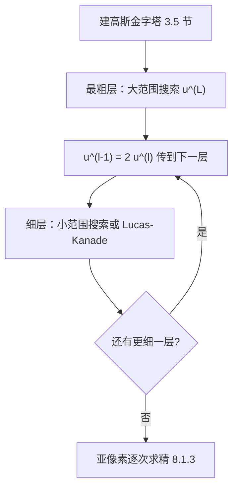
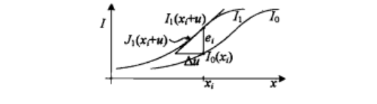
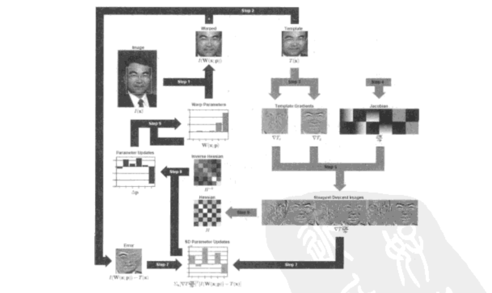
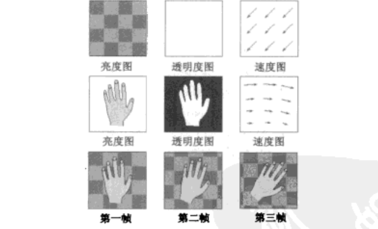

# 第8章 稠密运动估计

来源：Szeliski《计算机视觉——算法与应用》中文第一版第8章；书页 293–326 / PDF 307–340。未越界第9章（书页 327 / PDF 341 起）。

## 本章总览

第6、7章从稀疏特征对应估变换或三维结构。本章改用**整幅图像的亮度**，估计稠密或参数化的运动场。视频里的图像配准(image registration)和运动估计(motion estimation)几乎覆盖计算机视觉：摄像机去抖叫帧速图像稳定化(image stabilization, IS)；块平移配准是 Lucas–Kanade 光流的前身，也是 MPEG / H.263 一类补偿编码的基础。

运动模型由简到繁排成一条链：两块之间的平移（8.1）→ 仿射 / 透视等全局参数化运动（8.2）→ 少量控制点上的样条场（8.3）→ 每像素独立光流（8.4）→ 把场景拆成几层再各自运动（8.5）。大位移先分层（金字塔）或傅里叶相关；亚像素再用图像函数的 Taylor 展开做逐次求精。立体几何与场景流不在本章展开。

学完应能分清：SSD / SAD / NCC / 偏差–增益各自对付什么；Lucas–Kanade 的 $2\times 2$ Hessian 何时孔径；前向复合与逆复合差在卷谁；Horn–Schunck 正则化如何把欠定光流摆稳。

🔑 关键速记：稠密运动 = 用亮度差估位移；模型从 2 自由度平移一直加到每像素 2 个未知数。

## 核心知识点

### 平移配准

两幅图像或两个块对齐，最简单是相对一幅平移另一幅。离散位置 $\{\mathbf{x}_i=(x_i,y_i)\}$ 上的模板 $I_0$ 要在 $I_1$ 里找到位移 $\mathbf{u}=(u,v)$，使误差平方和(sum of squared differences, SSD)最小：

$$
E_{\mathrm{SSD}}(\mathbf{u})=\sum_{i}\bigl[I_1(\mathbf{x}_i+\mathbf{u})-I_0(\mathbf{x}_i)\bigr]^{2}=\sum_{i}e_i^{2}
\tag{8.1}
$$

残差 $e_i=I_1(\mathbf{x}_i+\mathbf{u})-I_0(\mathbf{x}_i)$。视频编码里常叫平移帧差分(displaced frame difference)。两幅图对应像素颜色保持相同的假设称为**亮度恒常性约束**(brightness constancy constraint)。位移 $\mathbf{u}$ 一般是分数，所以 $I_1(\mathbf{x})$ 必须用合适的插值；双三次(bicubic)往往比双线性好一些。彩色图可对三通道误差分别求和，也可先转到其他颜色空间。

#### 鲁棒度量、SAD 与窗口

把二次项换成鲁棒函数 $\rho(e_i)$，可以压低外点（异常值）：

$$
E_{\mathrm{SRD}}(\mathbf{u})=\sum_{i}\rho\bigl(I_1(\mathbf{x}_i+\mathbf{u})-I_0(\mathbf{x}_i)\bigr)
\tag{8.2}
$$

绝对误差和(sum of absolute differences, SAD)

$$
E_{\mathrm{SAD}}(\mathbf{u})=\sum_{i}\lvert I_1(\mathbf{x}_i+\mathbf{u})-I_0(\mathbf{x}_i)\rvert
\tag{8.3}
$$

速度更快，但原点处不可导，不适合梯度下降。原点处二次、增长比二次慢的平滑函数更常用，例如 Geman–McClure

$$
\rho_{\mathrm{GM}}(x)=\frac{x^{2}}{1+x^{2}/a^{2}}
\tag{8.4}
$$

$a$ 是外点阈值，可用中绝对偏差(median absolute deviation, MAD)来定：先算 $d=\mathrm{med}\,\lvert e_i\rvert$，再取一个内点远离过程的鲁棒估计。

空间变化权重把边界外、被遮挡或「不想对齐」的像素压下去，得到加权 SSD：

$$
E_{\mathrm{WSSD}}(\mathbf{u})=\sum_{i}w_0(\mathbf{x}_i)w_1(\mathbf{x}_i+\mathbf{u})\bigl[I_1(\mathbf{x}_i+\mathbf{u})-I_0(\mathbf{x}_i)\bigr]^{2}
\tag{8.5}
$$

权在图像边界外为 0。大范围运动时，带窗的误差面偏向重叠面积更大的解，可用面积

$$
A=\sum_{i}w_0(\mathbf{x}_i)w_1(\mathbf{x}_i+\mathbf{u})
\tag{8.6}
$$

把平方误差换成均方根亮度误差 $\mathrm{RMS}=\sqrt{E_{\mathrm{WSSD}}/A}$（8.7）。

#### 偏差、增益与规范化互相关

两幅图曝光经常不同。偏差与增益(bias and gain)是两图像间的一种简单仿射亮度变化：

$$
I_1(\mathbf{x}+\mathbf{u})=(1+\alpha)I_0(\mathbf{x})+\beta
\tag{8.8}
$$

最小二乘为

$$
E_{\mathrm{BG}}(\mathbf{u})=\sum_{i}\bigl[I_1(\mathbf{x}_i+\mathbf{u})-(1+\alpha)I_0(\mathbf{x}_i)-\beta\bigr]^{2}
\tag{8.9}
$$

对 $\alpha,\beta$ 是线性回归（附录 A.2）。彩色图可每通道各算一套，或先做摄像机自动色阶修正。更一般的非参数亮度模型出现在曝光合成与高动态范围流程里。👉 包围曝光与色调映射见第10.2节。

相关性(correlation)把匹配写成内积最大化：

$$
E_{\mathrm{CC}}(\mathbf{u})=\sum_{i}I_0(\mathbf{x}_i)I_1(\mathbf{x}_i+\mathbf{u})
\tag{8.10}
$$

它偏向排成线而且对比大的块，对偏差不敏感，但仍吃增益。实践中更常用**规范化互相关**(normalized cross-correlation, NCC)：

$$
E_{\mathrm{NCC}}(\mathbf{u})=\frac{\sum_{i}(I_0(\mathbf{x}_i)-\overline{I}_0)\,(I_1(\mathbf{x}_i+\mathbf{u})-\overline{I}_1)}{\sqrt{\sum_{i}(I_0-\overline{I}_0)^{2}}\,\sqrt{\sum_{i}(I_1-\overline{I}_1)^{2}}}
\tag{8.11}
$$

均值 $\overline{I}_0=\frac{1}{N}\sum I_0$、$\overline{I}_1=\frac{1}{N}\sum I_1(\mathbf{x}_i+\mathbf{u})$（8.12）（8.13）。NCC 落在 $(-1,1)$，块真正匹配时接近 $1$，阈值更好定。两块里有一块方差为零时 NCC 无定义。规范化的 SSD（NSSD，8.14）与 NCC 相关，并与 (8.9) 的隐式偏差–增益回归等价。

注意：目录里没有「第 8.9 节 / 第 8.11 节」。**(8.9) 是偏差–增益能量，(8.11) 是 NCC 公式**，都写在 8.1 平移配准正文里。

🔑 关键速记：SSD 对曝光敏感；偏差–增益补仿射亮度；NCC 减均值再除标准差，输出在 $(-1,1)$。

#### 分层运动估计

误差函数定了，还要找到最小值。固定范围内整数步全搜索太慢，运动补偿视频压缩里搜索范围常到 $\pm 16$ 像素。加速办法是**分层运动估计**(hierarchical motion estimation)：先建图像金字塔(3.5 节)，在最粗层搜较少像素的平移，再把结果当下一层初值，只在小范围细化。粗层位移 $\mathbf{u}^{(l)}$ 传到较细一层时乘 2：

$$
\mathbf{u}^{(l-1)}=2\mathbf{u}^{(l)}
\tag{8.16}
$$

更正式地，令 $I_1^{(l)}(\mathbf{x}_i)=\tilde{I}_1^{(l-1)}(2\mathbf{x}_i)$（8.15）表示第 $l$ 层采样的图像。不能保证与全搜索相同，但通常接近且快得多。找到整数位移后再用 8.1.3 的逐次求精做亚像素。也可以用当前运动把图像卷绕，只估计精细层上的小增量。

图注：分层（金字塔）运动估计：粗层给大位移初值，每下一层把位移乘 2 再局部细化。

👉 高斯金字塔每级宽高减半、面积为四分之一，见第3.5节。

#### 基于傅里叶的配准

搜索范围对应图像的大部分区域时（例如第9章图像拼接），分层可能把重要特征模糊掉。平移对应傅里叶位移定理：

$$
\mathcal{F}\{I_1(\mathbf{x}+\mathbf{u})\}=\mathcal{F}\{I_1(\mathbf{x})\}e^{-j2\pi\mathbf{u}\cdot\boldsymbol{\omega}}=\mathcal{I}_1(\boldsymbol{\omega})e^{-j2\pi\mathbf{u}\cdot\boldsymbol{\omega}}
\tag{8.17}
$$

空间相关变成频谱共轭相乘（8.18）（8.19）。对 $I_0$ 和 $I_1$ 做 FFT，相乘后再逆变换，复杂度 $O(N^{2}\log N)$，比空间域全搜索 $O(N^{4})$ 快。SSD 本身也可以写成两幅图能量减两次相关（8.20）。窗口相关、加权 SSD 同样能推到傅里叶域（8.21）–（8.23），但窗口外要填零或循环，移位出界时算法没意义。

**相位相关**(phase correlation)在做逆变换前把每个频率的乘积除以幅度：

$$
\mathcal{F}\{E_{\mathrm{PC}}(\mathbf{u})\}=\frac{\mathcal{I}_0(\boldsymbol{\omega})\mathcal{I}_1^{*}(\boldsymbol{\omega})}{\lvert\mathcal{I}_0(\boldsymbol{\omega})\rvert\lvert\mathcal{I}_1(\boldsymbol{\omega})\rvert}
\tag{8.24}
$$

理想无噪声循环移位时输出变成单峰 $\delta(\mathbf{u})$（8.25），$\mathbf{u}$ 的定位更干净。低频噪声或尖刺杂声时白化往往有帮助；纹理很弱、信噪比低的区域，白化反而会恶化。

平面内旋转可先把图像重采到极坐标，再对角度做 FFT（8.26）–（8.28）；同时有尺度则用对数极坐标（8.29）–（8.31）。De Castro 与 Morandi(1987)给出先傅里叶幅度（对平移不敏感）估旋转尺度、再常规相关估平移的流程。大块和小平移时这套很巧；一般块运动仍用 8.2 的参数化运动或第6章基于特征的方法更稳。

部分重叠或无序照片集仍以特征 + RANSAC 为主；视频连续帧、圆柱图上的大范围平移，可用第8.1.2节 FFT 相关或相位相关当前值。配上之后的全局光束平差、柱面/球面展开、选缝与金字塔/泊松融合见第9.2–9.3节。

📝待补全：无序集「认出全景」与选缝融合已在第9章。本章只给出平移 / 旋转 / 尺度的频谱技巧。

👉 完整深度讲解见第9章。

👉 完整深度讲解见第9章。

🔑 关键速记：大范围平移用 FFT 相关或相位相关；旋转尺度先极坐标 / 对数极坐标。

#### 逐次求精：Lucas–Kanade

整数像素不够时，Lucas 与 Kanade(1981)在 SSD 上做梯度下降。对图像函数 Taylor 展开（图 8.2）：

$$
E_{\mathrm{LK-SSD}}(\mathbf{u}+\Delta\mathbf{u})=\sum_{i}\bigl[I_1(\mathbf{x}_i+\mathbf{u}+\Delta\mathbf{u})-I_0(\mathbf{x}_i)\bigr]^{2}
\approx\sum_{i}\bigl[\mathbf{J}_1(\mathbf{x}_i+\mathbf{u})\Delta\mathbf{u}+e_i\bigr]^{2}
\tag{8.33, 8.35}
$$

$\mathbf{J}_1=\nabla I_1=(\partial I_1/\partial x,\partial I_1/\partial y)$ 是梯度，$e_i$ 是当前亮度误差（8.36）（8.37）。最简单的导数是相邻像素差。

线性化形式 (8.35) 称为**光流约束**(optical flow constraint)或亮度恒常性约束方程

$$
I_x u+I_y v+I_t=0
\tag{8.38}
$$

$I_x,I_y$ 是空间导数，$I_t$ 是时间导数（可理解为序列中的瞬时速度）。在一个区域上平方求和就是 Horn 与 Schunck(1981)用来算光流的那一项。正规方程 $\mathbf{A}\Delta\mathbf{u}=\mathbf{b}$（8.39），

$$
\mathbf{A}=\sum_{i}\mathbf{J}_1^{T}(\mathbf{x}_i+\mathbf{u})\mathbf{J}_1(\mathbf{x}_i+\mathbf{u}),\qquad
\mathbf{b}=-\sum_{i}e_i\mathbf{J}_1^{T}(\mathbf{x}_i+\mathbf{u})
\tag{8.40, 8.41}
$$

写成 $2\times 2$ 就是经典结构张量（8.42）。接近正确配准时，可用模板梯度 $\mathbf{J}_0$ 代替 $\mathbf{J}_1$（8.43），Hessian 和残差都能预计算。卷积实现时，梯度场与移位后的 $I_0$ 的内积可在常数时间完成。

**孔径与不确定性。** $\mathbf{A}$ 的较小特征值接近 0 时，该方向位移不可靠：这就是第4章的孔径问题。图 8.3、图 8.4 用 SSD 表面说明：高纹理区有清晰最小；边缘只有一维谷；平坦区几乎没有峰。协方差 $\Sigma_{\mathbf{u}}=\sigma_n^{2}\mathbf{A}^{-1}$（8.44）。实践中常在小特征值上加一个相对大特征值的比例（如 5%）再求逆，避免完全无纹理处「匹配得毫无道理」。

偏差–增益、加权和鲁棒度量都能写进 Lucas–Kanade：四参数同时估 $\Delta\mathbf{u}$ 与 $\alpha,\beta$（8.45）；加权窗版见（8.47）；鲁棒 $\rho$ 用 6.1.4 的 IRLS（8.48）。Baker、Gross、Ishikawa 等(2003)表明，纹理足够时只用 5%～10% 的像素，性能也不会大幅下降。

迭代终止看 $\lVert\mathbf{u}\rVert$ 的量级，小于某阈值（如一个像素的 1/10）即停。大运动必须先分层，否则 Taylor 失效。

👉 孔径、Harris 结构张量与「可跟踪点」见第4.1节；IRLS 见第6.1.4节。

🔑 关键速记：Lucas–Kanade 把亮度差线性化成 $\mathbf{A}\Delta\mathbf{u}=\mathbf{b}$；$\mathbf{A}$ 就是第4章那块自相关矩阵。

### 参数化运动

手持拼接、摄像机抖动稳定化，需要比平移更丰富的模型：仿射、透视等。逐次求精的 Lucas–Kanade 可以扩到参数化运动模型，并和分层结合。位移改成空间变化运动场 $\mathbf{u}(\mathbf{x};\mathbf{p})$ 或对应图(correspondence map)，用低维 $\mathbf{p}$ 参数化，$\mathbf{x}'$ 是表 2.1 里的任一平面运动。能量变成

$$
E_{\mathrm{LK-PM}}(\mathbf{p}+\Delta\mathbf{p})=\sum_{i}\bigl[I_1(\mathbf{x}_i';\mathbf{p}+\Delta\mathbf{p})-I_0(\mathbf{x}_i)\bigr]^{2}
\tag{8.49}
$$

雅可比 $\mathbf{J}_1(\mathbf{x}_i')=\nabla I_1(\mathbf{x}_i')\,\partial\mathbf{x}'/\partial\mathbf{p}$（8.52）。Hessian 与残差为

$$
\mathbf{A}=\sum_{i}\mathbf{J}_{\mathbf{x}'}^{T}(\mathbf{x}_i)\bigl[\nabla I_1^{T}\nabla I_1\bigr](\mathbf{x}_i')\mathbf{J}_{\mathbf{x}'}(\mathbf{x}_i)
\tag{8.53}
$$

对 $n$ 参数、$N$ 像素，直接算 $\mathbf{A}$ 和 $\mathbf{b}$ 要 $O(n^{2}N)$。显著加速：把图划成小块 $P_j$，块内只算 $2\times 2$ 量 $\mathbf{A}_j,\mathbf{b}_j$（8.55），再拼回（8.56）–（8.58）（Shum and Szeliski 2000）。

**复合方法。** 复杂运动时，与其每次重算运动雅可比，不如先把目标图按当前估计 $\mathbf{x}'(\mathbf{x};\mathbf{p})$ 卷绕成 $\tilde{I}_1(\mathbf{x})=I_1(\mathbf{x}'(\mathbf{x};\mathbf{p}))$（8.59），再对增量运动做 Lucas–Kanade。Baker 与 Matthews(2004)称之为**前向复合**(forward compositional)：增量可以在 $\mathbf{p}=\mathbf{0}$ 附近算，平面投影的 $\mathbf{J}_{\mathbf{x}'}$ 取单位矩阵处的简单形式（8.63）。卷绕图与模板足够像时，也可用 $I_0$ 的梯度代替，Hessian 预计算，称为**逆加性**(inverse additive)。

**逆复合**(inverse compositional)反过来：重卷绕的是模板 $I_0$，最小化

$$
E_{\mathrm{LK-BMI}}(\Delta\mathbf{p})=\sum_{i}\bigl[\tilde{I}_1(\mathbf{x}_i)-I_0(\hat{\mathbf{x}}(\mathbf{x}_i;\Delta\mathbf{p}))\bigr]^{2}
\tag{8.64}
$$

梯度换成 $\nabla I_0$，除了 $e_i$ 符号外，得到的 $\Delta\mathbf{p}$ 是前向公式的结果求反，因此增量变换的逆必须前置到当前变换。因为 Hessian 的逆和最速下降图像都可以预计算，Baker 与 Matthews(2004)把它列为当时综述里最优先的算法。图 8.5 画出逐步：图像卷绕、求差、点积、乘 Hessian 逆、更新卷绕。

📝待补全：高斯–牛顿用 $C=J^{T}J$。LM 写成 $\bigl[C+\lambda\mathrm{diag}(C)\bigr]\Delta p=d$（A.49）：$\lambda$ 按实际下降与预测下降的比调节，是信任域方法的一种。真正 Hessian 还含残差对二阶导的项，LM 不算它。稀疏直接法用符号化 Cholesky；超大网格用 CG 或多重网格。完整写法见附录 A.3–A.5。本章把高斯–牛顿当成一阶展开的最小二乘。

👉 完整深度讲解见附录 A.3。

#### 应用：视频稳定化

参数化运动估计的广泛应用是视频稳定化。Matsushita、Ofek 等(2006)把全帧稳定化分成三步：运动估计、运动平滑、图像卷绕。运动估计常用相似变换处理摄像机平移、旋转和缩放。诀窍是把算法锁定在由摄像机运动产生的背景运动上，少受独立运动前景影响。运动平滑常恢复运动的低频（慢变化）部分，再让估计需要移除的高频抖动分量。最后用图像卷绕把序列做视频修正。

稳定化摄像机仅仅平滑抖动而拍摄的图像。平滑运算可以大大改善抖动视频的视觉效果，但也可能包含人工视觉变形，例如图像卷绕会导致图像边缘的消失，必要时用其他信息来剪裁、填充，或者用插图方法来处理。另外，在快速运动下拍摄的视频帧往往很模糊，可以用去模糊方法从较少或聚焦不当的帧中得到好的像素信息。

在摄像机 3D 平移的情况下，例如摄影师在走动，一个更好的办法是通过完整的由运动到结构方法重建摄像机运动和 3D 场景，然后可以计算出一个平滑的 3D 摄像机路径，用插值的 3D 点云作为几何原型来视图插值，重新渲染视频。

📝待补全：3D 平移稳像可先 SfM 再沿平滑路径做视图插值；照片密时也可对 4D 光场 $L(s,t,u,v)$ 重采样，不规则手持走发光图，见第13.1、13.3节。去模糊与超分把观察写成 $o=D(b*s\circ h)+n$：本章估出的参数运动或光流可当作卷绕 $h$，再与模糊核、高分辨率图像一起做正则化最小二乘；输入太糊时超分只能减糊，不能无中生有。完整先验与 Bayer 去马赛克见第10.3节。本章只讲 2D 参数运动平滑。

👉 完整深度讲解见第10、13章。

#### 学习的运动模型

另一条路是学习一组定制的基函数，来参数化比仿射更复杂、又比每像素光流更低维的运动。先通过一组训练序列得到一组稠密运动估计场，对运动场做奇异值分解得到几个特征向量 $\mathbf{v}_k(\mathbf{x})$，测试序列再用由粗到精算法估系数 $a_k$（8.66）。图 8.6 展示走路序列学到的基流。同样想法可用于特征跟踪。👉 特征跟踪见第4.1.4节。

🔑 关键速记：全局仿射 / 透视用参数化 Lucas–Kanade；逆复合把模板梯度预计算，稳像是最常见应用。

### 基于样条的运动

参数化模型捕不住复杂变形。传统光流给每个像素独立的 $(u,v)$，未知数是观测量的两倍，问题欠约束。介于「一块全局参数」和「每像素独立」之间的办法：用少量控制顶点 $\{\hat{\mathbf{u}}_j\}$ 上的二维样条表示运动场

$$
\mathbf{u}_i=\sum_{j}\hat{\mathbf{u}}_j B_j(\mathbf{x}_i)
\tag{8.68}
$$

$B_j$ 是基函数，只在一小段有限支持区间内非零。代入 SSD 后，公式类似参数化运动，差别在于雅可比由权重矩阵里的稀疏项构成。平面加视差(plane plus parallax)可以自然融进样条：平面运动用单应，平面外视差 $d$ 由每个样条控制点处的一个标量表达。

图 8.7 画出控制顶点网格；图 8.8 给出块、线性、双线性、双三次等基函数。大面积无纹理或孔径问题时，要在邻接控制网格点间加入误差平方惩罚（正则化，3.7 节）。多层时从一层到另一层需要重新缩放这些平滑项。线性系统稀疏且规则，可用 Cholesky 或迭代法。

基本方法的缺点是运动不连续附近模型不好，除非使用更多节点。四叉树(quadtree)样条在平滑区用大单元、不连续处加密（图 8.9）。医学图像注册把图像和形变都表示成多分辨率样条，弹性形变在 CT / MRI 上应用很广；三维体积可用八叉树样条，例如脊椎表面模型。

🔑 关键速记：样条运动用稀疏控制点插出稠密场，是全局参数和逐像素光流的中间档。

### 光流

最一般（也最难）的运动估计是独立估计每个像素运动，一般称作光流(optical flow / optic flow)。能量仍是对应像素亮度或色差之和：

$$
E_{\mathrm{SSD-OF}}(\{\mathbf{u}_i\})=\sum_{i}\bigl[I_1(\mathbf{x}_i+\mathbf{u}_i)-I_0(\mathbf{x}_i)\bigr]^{2}
\tag{8.69}
$$

变量 $\{\mathbf{u}_i\}$ 数量是观测的两倍，问题欠约束。两条经典路：在重叠区域（块或窗口）上算，即 Lucas–Kanade；或在 $\{\mathbf{u}_i\}$ 上加正则化 / 马尔可夫随机场，搜全局最小。

Anandan(1989)把局部不连续约束加进 Lucas–Kanade 逐步求解，并分析局部运动估计不确定性如何与局部 Hessian 矩阵的特征值有关。Bergen、Anandan、Hanna 等(1992)给出同时描述参数化运动和基于块的光流的统一框架，每次由粗到精金字塔迭代。

Horn 与 Schunck(1981)提出基于正则化的光流：在 (8.69) 同时最小化全体流向量，不独立计算每个运动。在原来每个像素误差度量里加入了平滑约束，即光流微分平方范数。解析形式更普遍记为

$$
E_{\mathrm{HS}}=\int\bigl(I_x u+I_y v+I_t\bigr)^{2}\,dx\,dy
\tag{8.70}
$$

再加平滑项。Horn–Schunck 模型可以看作基于块的运动估计在样条变为 $1\times 1$ 像素块时的情况。把局部 Hessian 换成区域累加形式，可以得到使用基于区域的亮度恒常约束的局部和全局小化算法。

如果已知运动是由静态场景中的摄像机移动造成的（刚性运动），可以把深度或全摄像机机动参数结合进来。这与立体视觉匹配密切相关。👉 立体几何与对应见第11章。

每个像素独立计算亮度恒常性、而不是在块上计算，每块上可能不符合常数光流假设，所以全局最优方法在运动不连续处可能会得到更好结果。在平滑约束上使用鲁棒度量时，该问题非常像图割和「全变差」(total variation, TV)：它导出一个可求全局最小值的凸能量。各向异性平滑（沿图像梯度的平行和垂直方向用不同平滑）是另一种常用方法。

光流估计中有大的 2D 搜索空间时，更多算法使用梯度下降变型和由粗到精搜索来最小化能量函数。这和立体匹配「较简单」的一维视差估计问题形成鲜明对比。组合优化方法在近期发表的光流数据集上显示出趋势是性能更好的方法。书中图 8.12 引用 2009 年 10 月 Middlebury 光流评测当时的 24 种算法排名。

📝待补全：沿极线把二维光流收成一维视差：矫正后 $d=fB/Z$，或用平面扫描把任意相机填进 DSI，再局部 WTA 或全局 $E_d+\lambda E_s$。多帧还可估场景流（形状 + 每个表面点的 3D 速度）和运动立体的时序选窗，见第11.5–11.6节。本章光流是未矫正的二维位移场。

👉 完整深度讲解见第11章。

🔑 关键速记：逐像素光流欠定；要么窗口里的 Lucas–Kanade，要么 Horn–Schunck / TV 正则化把邻像素绑在一起。

#### 多帧运动估计

前面把运动估计当作两帧问题。实际中整个图像序列都可以用来计算。一个经典多帧方法是用有向或导向滤波器滤波时空体，类似有向边缘检测。图 8.13 展示花园序列两帧以及时空上的水平切片：有纹理像素轨迹的斜率对应水平速度。时空滤波器通过使用每个像素周围的 3D 体来确定时空最优方向，直接估计像素速度。

为了得到图像中所有像素准确合理的速度估计，2D 滤波器都具有比较大的范围，这降低了运动不连续处的估计质量。另一种办法是估计更多的局部时空导数，在全局最优框架中用它们来填充无纹理区域。

还可以选择处理遮挡：匹配的视频帧 $\mathbf{u}_i(\mathbf{x})$ 做奇异值分解得到主运动，其他切片表示和关键帧插值预测颜色匹配的视频帧。多视角框架更适合于刚性场景运动（多视角立体视觉），其中每个像素处的未知是深度，而可以由像素深度得到遮挡关系。加上对物体加速度和遮挡关系的模型，也可以用于一般运动。

#### 应用：视频去噪与去隔行扫描

视频去噪是指去除噪声及其他缺陷，如电影和视频划痕。不同于只有一幅图像信息的单图像去噪，视频去噪可以取均值或使用邻近帧的信息。但是，为了引入有模糊或跳动（不正常运动），需要准确的像素级的运动估计。Gai 和 Kang(2009)描述了他们近期提出的还原过程，包括处理特殊性质旧电影的一系列步骤。👉 单图去噪与修补见第3章。

像素运动估计另一种常见的应用是去隔行扫描，将一个奇偶行交换存储的视频转换为每帧包含所有无损信号的视频。两个简单的方法是摆动(bob)和波动(weave)。名称由这两种方法带来的视觉缺陷而来：摆动导致沿水平方向上下摆动运动；波动沿水平变化边缘产生「拉链」效应。将简单拷贝变为求均值会改善但不能完全解决这些缺陷。为此提出了很多方法，一般嵌入计算机视频数字化板卡的特制 DSP 芯片里（广播电视常常隔行扫描，而计算机显示器则不是）。一类方法是估计局部逐像素的运动并利用邻近时空的信息来插值缺失数据。

### 层次运动

很多情况下，视觉运动是由场景中少量不同深度的物体移动造成的。此时，如果将像素按合适的物体或层分组，像素运动可以更简洁地描绘（并更可靠地估计）。

完整的运动序列可以通过前景和背景物体来重建，可以表达为透明度遮罩(alpha-matted)图像（子画面(sprite)或视频物体）和对应于每层的参数化运动。按从后到前顺序位移和合成这些层，重建了原始的视频序列。图 8.14 前两行描述两层，每层由亮度图、透明度图和参数化运动场组成；第三行是复合结果。

分层运动表达不仅使表达简洁，也可以挖掘多个帧中的可用信息，还能在不连续运动处准确建模。这使其特别适合用于基于图像的渲染和物体层的视频编辑。👉 基于图像的绘制见第13章。

计算上，Wang 与 Adelson(1994)先在不重叠块上估计仿射运动，再用 $k$ 均值聚类；然后从像素转换到层，根据像素结果重计算每层的运动估计，卷绕合并所有帧碎片。后续工作引入形式的概率混合模型来推断层的最终数量和每个像素属于哪个层；或把每层的运动模型替换为像素规范化平滑运动估计，更好处理弯曲和波动的层。

Baker、Szeliski 与 Anandan(1998)把各层的运动用 3D 摄像机机构表达，并用 3D 平面加视差来表达每层的像素差余深度偏差。最终的模型修正了最小化重合成和观测序列，同时优化层像素颜色、透明度和 3D 深度、平面以及运动参数。分层并不是把分割归入运动估计的唯一办法：有大量算法把光流向量估计看作分割为一致区域这个问题。

📝待补全：超像素把图切成颜色相近的小区域，本身没有物体语义，只是减少后续单元。第8章用的是「按运动/深度分层」和「把光流当成区域分割」，不是第5章那种过分割超像素算法。立体侧 11.5.2 把分割块当视差平面片，再在片段上做 MRF；均值移位切图是其中一种前置。识别见第14章。

👉 完整深度讲解见第5、11、14章。

#### 应用：帧插值

帧插值是另一种广泛使用的运动估计应用，通常与去隔行扫描在同一个电路里，用来匹配视频和显示器的实际刷新率。与去隔行扫描一样，新的帧间帧的信息需要从之前和之后的帧里插值。如果可以在每个未知像素的位置上计算出准确的运动估计，就可以得到最优结果。但除了计算运动之外，移动前景物体可能遮挡前后帧的个别像素造成污染，此时遮挡信息对于防止这种被污染的色彩十分重要。

考虑更多细节，在图 8.13c 中，假设箭头指示我们希望在其间插值图像的关键帧。图中条纹的方向代表像素的速度，如果在图像 $I_0$ 的 $\mathbf{x}_0$ 处得到的运动估计 $\mathbf{u}_0$ 和在图像 $I_1$ 的 $\mathbf{x}_0+\mathbf{u}_0$ 处得到的运动估计 $\mathbf{u}_1$ 是时间一致的，我们说光流向量一致。运动估计可以传导得到图像 $I_j$ 的 $\mathbf{x}_0+t\mathbf{u}_0$ 处，其中 $t\in(0,1)$ 是时间值。最终 $\mathbf{x}_0+t\mathbf{u}_0$ 处颜色可以用线性混合得到

$$
I_t(\mathbf{x}_0+t\mathbf{u}_0)=(1-t)I_0(\mathbf{x}_0)+t I_1(\mathbf{x}_0+\mathbf{u}_0)
\tag{8.72}
$$

但是如果运动向量在对应位置不一致，必须用一些方法决定哪一个是正确的，哪个图的颜色是被遮挡的。真实的原因往往比这更微妙。

#### 透明层和反射

分层运动一个常出现的特例是透明层，通常由窗口和相框中所见到的反射造成。处理透明运动时有两种方法：估计部件运动；把各个像素赋值到相互竞争的透明层。为了准确分离真正的透明层，需要更好的与反射相关的运动模型：因为光线被玻璃表面反射同时也可以穿透，所以反射模型是一个加性的模型，每个运动层都对最终图像的某些亮度有贡献。

如果已经知道每个层的运动，每层的恢复变成一个简单的受约束的最小二乘问题。每层的图像必须为正。但该问题仍用扩展很低不确定性影响很大，尤其是在层缺少深色（黑色）像素或者运动是单方向的时候。Szeliski、Avidan 与 Anandan(2000)通过交替进行鲁棒计算运动层和做层亮度的主成分分析，同时估计运动和层的值。图 8.17、图 8.18 展示带反射的相框：反射光和透射光（女孩）相比很少，但算法依然能同时恢复两个层。简单参数化运动模型只对平面反射和深度较浅的场景有效；曲面反射和非常深的场景的扩展研究指向更复杂 3D 深度场的运动模型。

🔑 关键速记：层次运动 = 少数层 ×（颜色 + $\alpha$ + 参数运动）；反射是加性透明层，不是简单遮挡。

## 易混淆点&差异对比

### SSD vs SAD vs NCC vs 偏差–增益

SSD（8.1）可导，适合 Lucas–Kanade，但对曝光和少量外点敏感。SAD（8.3）更快、对少量外点略鲁棒，原点不可导。鲁棒 $\rho$（8.2）（8.4）专门压外点。偏差–增益（8.8）（8.9）显式补仿射亮度。NCC（8.11）隐式做了减均值和归一化，输出有界，块方差为零时失效。NSSD（8.14）和 NCC、隐式偏差–增益是近亲，不是另一种物理模型。

### 平移 / 参数化 / 样条 / 光流 / 分层

下表对比五档模型从少参数到每像素独立。越往下越能贴复杂运动，也越要正则。

| 名称 | 功能 | 主要参数 | 约束&坑点 |
| --- | --- | --- | --- |
| 平移配准 | 整块一个 $\mathbf{u}$ | 2 自由度 | 大位移要金字塔或 FFT |
| 参数化运动 | 仿射 / 透视等全局 $\mathbf{p}$ | 6～8 自由度 | 稳像、拼接；前景独立运动会带偏 |
| 样条运动 | 控制点插值稠密场 | 控制顶点 $\{\hat{\mathbf{u}}_j\}$ | 不连续处要加密或正则 |
| 光流 | 每像素 $\mathbf{u}_i$ | $2N$ 未知 | 欠定，必须窗口或平滑 |
| 层次运动 | 每层一块参数运动 + $\alpha$ | 层数 × 层参数 | 层数和归属本身也是分割问题 |

自由度从 2 加到 $2N$。不要把「光流」当成「任意配准」的同义词。

自由度从 2 加到 $2N$，模型越灵活越能贴复杂运动，也越要正则。不要把「光流」当成「任意配准」的同义词。

### 前向复合 vs 逆复合

前向复合：按当前 $\mathbf{p}$ 卷绕**目标图** $I_1$，在 $\mathbf{p}=\mathbf{0}$ 附近估增量，增量变换接到已有变换后面。逆复合：卷绕的是**模板** $I_0$，梯度与 Hessian 可预计算，增量要取逆再前置。概念上对称，实现上逆复合往往更快。二者都假设当前卷绕后两图已经比较像；差太大仍要金字塔。

### 分层运动 vs 第5章超像素

第5章超像素是颜色相近的过分割，没有运动语义。本章层次运动按**深度 / 物体 / 仿射参数**把像素归层，每层再估运动。把光流向量估计看成「分割成运动一致区域」是第三条路，仍然不是 Felzenszwalb / 均值移位那种超像素算法。立体匹配用超像素当对应单元，留给第11章。

### 二维光流 vs 立体视差

光流是未矫正图像上的二维位移，搜索空间大。立体在极线几何已知后把对应收成沿扫描线的一维视差，全局优化更成熟。不要用光流评测替代立体评测，也不要把场景流（三维运动）写进本章。

🔑 关键速记：NCC 和 (8.9) 是公式号不是节号；光流 ≠ 立体；分层 ≠ 超像素。

## 本章要点总结

- 平移配准的误差族：SSD、鲁棒 $\rho$、SAD、加权窗、RMS；曝光用偏差–增益或 NCC（公式 8.9 / 8.11，都在 8.1 节）。
- 大位移：金字塔分层，粗层结果 $\times 2$ 传到细层；更大范围用 FFT 相关或相位相关，旋转尺度走极坐标 / 对数极坐标。
- 亚像素：Lucas–Kanade 把亮度差 Taylor 成 $\mathbf{A}\Delta\mathbf{u}=\mathbf{b}$，$\mathbf{A}$ 小特征值对应孔径；可加偏差–增益、权重、IRLS。
- 参数化运动把 $\mathbf{u}(\mathbf{x};\mathbf{p})$ 写进同一套最小二乘；逆复合预计算模板梯度，是稳像和高效配准的常用实现。稳像三步：估运动、平滑高频抖动、卷绕；3D 路径平滑要接到 SfM。
- 样条用稀疏控制点插值稠密场，医学弹性注册常用多分辨率 / 四叉树 / 八叉树。
- 稠密光流欠定：窗口 Lucas–Kanade 或 Horn–Schunck / 鲁棒 TV 正则；多帧可用时空滤波器；应用包括去噪、去隔行、帧插值。
- 层次运动 = 透明度层 + 每层参数运动；反射是加性透明层。立体对应、场景流、基于图像的绘制不在本章展开。

🔑 关键速记：先选对运动模型，再选误差和搜索；大位移走金字塔或傅里叶，小位移走 Lucas–Kanade，逐像素必须加平滑。
