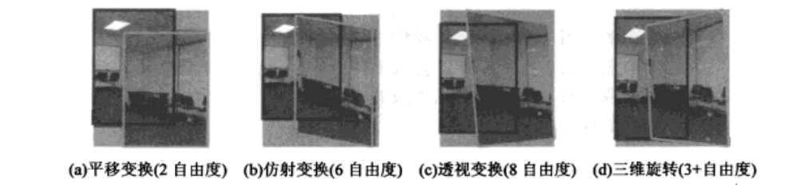
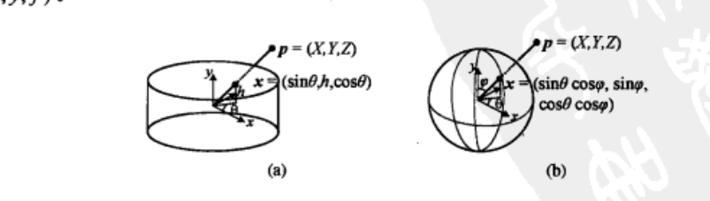
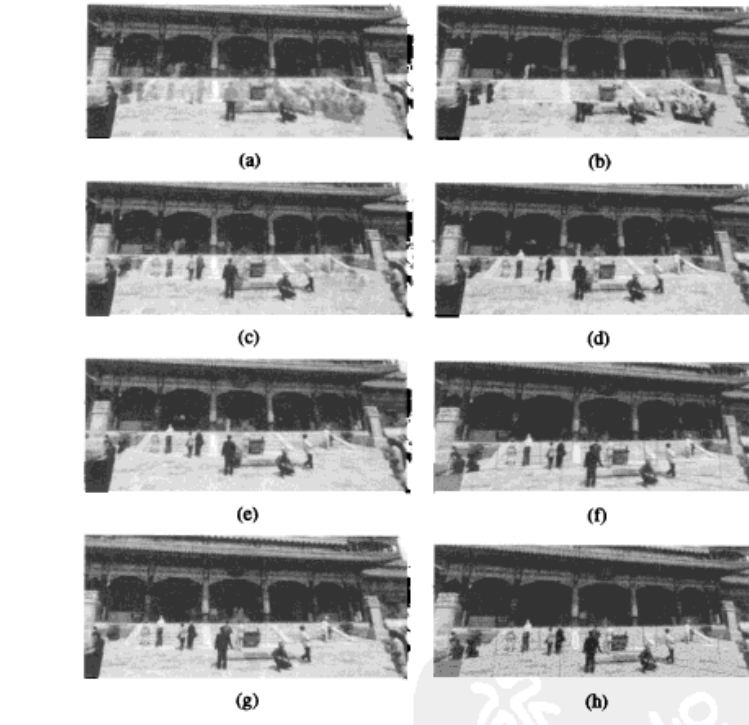

# 第9章 图像拼接

来源：Szeliski《计算机视觉——算法与应用》中文第一版第9章；书页 327–358 / PDF 341–372。未越界第10章（书页 359 / PDF 373 起）。

## 本章总览

把若干重叠照片无缝拼成一张大图，是计算机视觉里最老、也最常用的算法之一。它可以出高分辨率拼图、数字地图、星空图，也可以做进数码相机生成特宽角全景。早期靠摄影测量的连接点(tie point)手工注册；关键突破是光束平差(7.4 节)让摄像机位置有全局一致性。胶片时代就有绕轴旋转、缝隙曝光的宽角相机；1990 年代起，普通手持相机的无缝全景才真正铺开。

不同于早期直接比较像素差的方法，现在通常先抽特征再匹配（第4章）。基于特征的拼接对场景运动更鲁棒，速度也往往更快；实现得好，能从无序照片集里找出邻接关系，让一般用户自动拼图。

流水线分三块：先选运动模型，把一图像素映到另一图（9.1）；再把多图配到全局一致（9.2）；最后选合成表面、选缝、融合，处理曝光差、视差和鬼影（9.3）。大曝光差应回到辐射度域做 HDR（10.2）；输入分辨率不够可用超分（10.3）；半透明前景要用 $\alpha$ 抠图而不是硬选缝（10.4）。

学完应能分清：平面单应、纯旋转 $\hat{\mathbf{H}}=\mathbf{K}\mathbf{R}\mathbf{K}^{-1}$、柱面/球面坐标各在什么场景成立；360° 缝隙如何反推焦距；平均 / 羽化 / Voronoi / 图割选缝 / 拉普拉斯金字塔 / 泊松梯度融合各自去掉什么瑕疵。

🔑 关键速记：拼接 = 运动模型 + 全局配准 + 选缝融合；纯旋转全景比任意平面单应少很多自由度。

## 核心知识点

### 运动模型

要把一图像素映到另一图，需要几何变换。可用的参数化运动很多：简单 2D 变换、平面透视、3D 摄像机旋转、镜头畸变、非平面（柱面）模型。表 2.1 与 6.1 节已经介绍过同构（单应，8 参数）以及纯旋转下的简化单应 (2.72)。

本章不仅回顾这些模型，还说明它们用在哪类拼图上，并介绍球形和圆柱形合成表面。给定数据时判断最佳配准模型叫「模型选择问题」，本书不展开。

#### 平面透视运动

最简单的配准模型是 2D 里的平移加旋转，对应有重叠的「拼贴画」。平移、仿射、透视、三维旋转的观感差很多，见图 9.2。

两台摄像机看同一平面时，映射是 $3\times 3$ 同构（2.71）。把第一图的像素映到 3D 再映到第二图，对应矩阵 $\mathbf{M}_{10}$：

$$
\tilde{\mathbf{x}}_1\sim\tilde{\mathbf{P}}_1\tilde{\mathbf{P}}_0^{-1}\tilde{\mathbf{x}}_0=\mathbf{M}_{10}\tilde{\mathbf{x}}_0
\tag{9.1}
$$

若最后一行换成平面方程且所有点都在该平面上（视差 $d_0=0$），可去掉最后的深度缓冲。最终同构 $\tilde{\mathbf{H}}_{10}$（$\mathbf{M}_{10}$ 左上 $3\times 3$）描述两图像素映射：

$$
\tilde{\mathbf{x}}_1\sim\tilde{\mathbf{H}}_{10}\tilde{\mathbf{x}}_0
\tag{9.2}
$$

这是最早自动拼接算法的基础。当时特征匹配还不稳，多用直接像素值匹配，即 8.2 节的参数化运动。更新的算法先抽特征，用 RANSAC 算内点，再最小二乘拟合单应（9.3），公式与 6.1.3 的 DLT 一致。👉 RANSAC 与单应 DLT 见第6.1节；参数化 Lucas–Kanade 见第8.2节。

#### 应用：白板和文档扫描

把平板扫描仪得到的多块扫描图拼起来，是拼接最简单的应用：地图或儿童画太大，只能分多次扫。只要相邻块有足够重叠，抽特征匹配，必要时用两点 RANSAC 估 2D 刚体变换（9.4），再重采样到第一幅的坐标系上平均。旋转角 $\theta$ 非线性，要用非线性最小二乘，或把 $\mathbf{R}$ 约束在正交流形上。像素点配准误差会漂移，丧失全局一致性时，需要 9.2 节的全局优化。手持拍摄的大面积平坦物体，原则上可用更复杂模型，但平面 3D 刚体（加未知焦距变化）仍常以同构为自然运动模型。

#### 旋转全景图

全景里最典型的是摄像机**单纯旋转**。在峡谷边上拍，远处物体相对焦距几乎在无穷远平面上，令 $\mathbf{t}_k=\mathbf{t}_1=0$，得到简化的 $3\times 3$ 单应（图 9.3）：

$$
\hat{\mathbf{H}}_{10}=\mathbf{K}_1\mathbf{R}_1\mathbf{R}_0^{-1}\mathbf{K}_0^{-1}=\mathbf{K}_1\mathbf{R}_{10}\mathbf{K}_0^{-1}
\tag{9.5}
$$

$\mathbf{K}_k=\mathrm{diag}(f_k,f_k,1)$（光心居中）。映到标定坐标后变成 $\tilde{\mathbf{x}}_1/f_1\sim\mathbf{R}_{10}\tilde{\mathbf{x}}_0/f_0$（9.6）（9.7）。本质上只剩 3 个旋转参数，加上可选的焦距，比 8 参数同构更稳；很多大尺度拼图都用这套。

增量更新：当前估计 $\hat{\mathbf{H}}_{10}$ 上再乘增量旋转 $\mathbf{R}(\boldsymbol{\omega})$，

$$
\hat{\mathbf{H}}(\boldsymbol{\omega})=\mathbf{K}_1\mathbf{R}(\boldsymbol{\omega})\mathbf{R}_{10}\mathbf{K}_0^{-1}=\mathbf{D}\hat{\mathbf{H}}_{10}
\tag{9.8}
$$

$\mathbf{D}\approx\mathbf{K}_1(\mathbf{I}+[\boldsymbol{\omega}]_{\times})\mathbf{K}_1^{-1}$（9.9），与单应参数 $h_{00},\ldots,h_{21}$ 有一一对应（9.10），从而得到对 $\boldsymbol{\omega}$ 线性的更新（9.11）。该规则依赖目标视角焦距 $f_1$，与模板焦距 $f_0$ 无关。焦距更新更复杂，9.2.1 用最小化 3D 光束后投影误差同时估焦距。图 9.4 显示四幅手持照片用 3D 旋转注册后，同构（不是任意变换）如何把图拉成合适的梯形。

#### 缝隙消除

只串局部旋转和焦距，很难拼出闭合的 $360^{\circ}$ 全景，结果里总有缝隙或重叠（图 9.5）。把序列第一幅与最后一幅匹配，得到与重现的第一幅相关的两个旋转矩阵估计值之差。把该误差四元数除以序列中图像数量，均匀分配注册误差（假设相邻帧相对旋转差不多）。也可以把误差四元数先变成缝隙角(gap angle) $\theta_g$，再用

$$
f'=f(1-\theta_g/360^{\circ})
$$

更新焦距。图 9.5a 错误焦距 $f=510$ 有约 $32^{\circ}$ 间隙；正确 $f=468$ 后两幅拼图几乎看不见接缝。这种启发式只适用于摄像机朝一个方向连续转的「一维」全景；任意运动下的缝隙/重叠放到 9.2 节。

👉 第6.3 节已指出 360° 缝隙能改进 $f$；本章给出把缝隙角折回焦距的显式更新。

#### 应用：视频摘要和压缩

摇动摄像机拍的视频可以做成拼图静态摘要(salient still)，也能当视频压缩和索引的背景层。早期方法用仿射；后来扩到 8 参数完整同构，拼出的背景层叫「视频子画面」，进了 MPEG-4。运动前景可用中值滤波去掉。视频也可生成动态全景视频覆盖。构造全景时若光学中心不固定，仍可抽出水平运动摄像机的细条来做 VideoBrush 一类系统。同心拼图、多投影中心全景、多透视全景是更一般的 3D 场景表示。

📝待补全：光学中心不固定时，绕竖直轴转一圈得到同心拼图：每列射线与一组同心圆相切，虚拟视点的每一列到源图里找最近列，视点锁在拍摄平面附近。更一般的 4D 光场 $L(s,t,u,v)$ 用两平面参数化任意光线，换视点即重采样。完整方法见第13.3节。本章视频摘要仍假设近似旋转或平移全景。

👉 完整深度讲解见第13章。

#### 圆柱面和球面坐标

用同构或 3D 运动配准之后，可以先把图像卷到柱面坐标系，再用简单平移模型配准。这只在所有图像共用同一水平线、或已知倾斜角时适用。规范位置取 $\mathbf{R}=\mathbf{I}$，光轴沿 $z$、与 $y$ 轴垂直。单位半径圆柱上，点由角度 $\theta$ 和高度 $h$ 参数化：

$$
(\sin\theta,\,h,\,\cos\theta)\propto(x,y,f)
\tag{9.12}
$$

正映射 $x'=s\theta=s\tan^{-1}(x/f)$，$y'=sh=sy/\sqrt{x^{2}+f^{2}}$（9.13）（9.14）；$s$ 是缩放（有时叫圆柱半径），常取 $s=f$ 以减小中心变形。球面用 $(\theta,\phi)$：$(\sin\theta\cos\phi,\sin\phi,\cos\theta\cos\phi)\propto(x,y,f)$（9.17），正逆映射见（9.18）–（9.21）。注意本书球面坐标与普通物理坐标不同：看水平照片时 $y$ 轴沿重力，北极在 $y$ 而不是 $z$。

摄像机只绕垂直轴转时，圆柱图像拼接变成单纯水平平移，避免了透视配准的大量计算，是入门课里很有吸引力的题目。图 9.8 给出水平平移关系的两幅圆柱卷绕图；图 9.9 是 54 张照片构成的球面全景。专业全景摄影常用摇动–俯仰云台(pan-tilt head)。极坐标映射把北极放在光轴上而不是垂直轴，对某些广角全景是好看的可视化，也对鱼眼畸变给出良好模型。

🔑 关键速记：远处/纯旋转用 $\mathbf{H}=\mathbf{K}\mathbf{R}\mathbf{K}^{-1}$；360° 缝隙角直接改 $f$；柱面把旋转变成平移。

### 全局配准

一对图像配准之后，真正目标是**全局一致**的配准参数，从而最小化所有图像对之间的注册误差。把 6.2、8.1、8.50 的能量扩成全局能量，涉及每一幅的姿态参数。算出全局参数后，常常还要局部修正(local adjustment)，比如视差消除(parallax removal)，即消除由于局部注册错误出现的重影和模糊现象。最后，从无排序的图像集里发现哪些该放在一起，叫「认出全景图」(panorama recognition)。

#### 光束平差法

一种做法是每次往全景里加一幅新图，与集合中原有的重叠图配准。360° 时累积误差会导致两端缝隙或过重叠。更好的办法是在最小均方误差框架下对图像同时配准，以正确地分配注册偏差。摄影测量学把调整有重叠的大量图像的姿态参数称为光束平差法；视觉里它先用于一般 SfM，后来为全景拼接特殊化。

👉 稀疏 SfM 的光束平差、Schur 补见第7.4节。本章把它收成「每帧一个旋转 + 焦距」的全景能量。

基于特征的全局配准比直接像素能量更简单。多幅图时，用 $n$ 个特征的集合：第 $i$ 个特征在第 $j$ 幅的位置 $\mathbf{x}_{ij}$ 及置信度 $c_{ij}$。假设图像姿态由旋转 $\mathbf{R}_j$ 和焦距 $f_j$ 决定。3D 点 $\mathbf{x}_i$ 映到第 $j$ 图：

$$
\mathbf{x}_{ij}\sim\mathbf{K}_j\mathbf{R}_j\mathbf{x}_i,\qquad \mathbf{x}_i\sim\mathbf{R}_j^{-1}\mathbf{K}_j^{-1}\tilde{\mathbf{x}}_{ij}
\tag{9.26}
$$

成对能量把 (9.25) 扩成多视角（9.28）。实践中特征多时，可直接用常规非线性最小二乘精化。潜在缺点：实际对应次数会被计 $\binom{m}{2}$ 次而不是 $m$ 次；预测位置 $\hat{\mathbf{x}}_{ik}$ 对 $(\mathbf{R}_j,f_j)$ 的导数不好处理。

另一种是真正的光束平差，同时优化姿态 $(\mathbf{R}_j,f_j)$ 和 3D 坐标 $\{\mathbf{x}_i\}$：

$$
E_{\mathrm{BA-2D}}=\sum_i\sum_j c_{ij}\lVert\hat{\mathbf{x}}_i(\mathbf{x}_i;\mathbf{R}_j,f_j)-\mathbf{x}_{ij}\rVert^{2}
\tag{9.29}
$$

变量更多，但每次迭代的收敛速度及整体的收敛缺点都会变慢（想象每次更新旋转矩阵后 3D 空间中的点是如何「漂移」的）。每次线性化高斯–牛顿的计算复杂度可以用稀疏矩阵方法简化。也可以在 3D 投影射线上最小化（9.30），或在 3D 射线空间逐对写能量（9.31）。焦距 $f_j$ 可包含在用 (9.7) 构造齐次坐标向量的过程中；Shum 与 Szeliski(2000) 把每次迭代的残差 (3D 误差) 乘以 $\sqrt{f_j f_k}$，减少倾向更长焦距的偏置。

**向上矢量的选择。** 算出来的 3D 摄像机姿态在全局性的歧义上可能并不要紧，但人们更喜欢最后的拼接图像是「直立」的。希望每个旋转 $\mathbf{R}_k$ 再乘一个全局旋转 $\mathbf{R}_g$，使 $\mathbf{i}^{T}\mathbf{R}_k\mathbf{R}_g\mathbf{j}=0$（9.33）：$\mathbf{R}_k$ 的第一行与 $\mathbf{R}_g$ 的第二列垂直。约束写成最小二乘，解是散度矩阵最小特征向量（9.34）。再让所有旋转的 $z$ 轴平均尽量靠近世界 $z$，用三次叉乘补全 $\mathbf{R}_g$。

#### 视差消除

全局方向和焦距优化之后，拼图仍可能局部模糊或重影：径向畸变、3D 视差（摄像机未能绕其光学中心旋转）、微小的场景运动。径向畸变可用 2.1.6 的几种方法之一估计，例如铅垂线法，不断调整直到稍稍弯曲的线变直。3D 视差可用完整 3D 光束平差，把 (9.29) 换成 (2.68) 并对摄像机平移建模，代价高；一旦恢复 3D，理论上可投影到不含视差的单轴中心视角，但需要详细的立体视觉对应。部分重叠时，透视平面扫描(multi-perspective plane sweep, MPPS) 可修正重叠区视差。

场景运动比较剧烈、目标出现或完全消失时，一个明智的解决方式是每次只从一幅图像挑选像素点作为最后合成图像的来源。运动比较小时，混合之前可以用一般的 2D 运动估计（光流法）做适当修正，然后再用局部配准。Shum 与 Szeliski(2000) 提出局部配准：全局光束平差之后，3D 点用后向投影平均值表示（9.35），与原始特征的差构成一组局部运动估计 $\mathbf{u}_{ij}$（9.36），再逆卷绕(inverse warping)插值成稠密修正场。多次消除虚影后，图像块从 32 像素收到 8 像素（图 9.10）。

Kang、Uyttendaele、Winder 等(2003) 的方法通过估计每幅输入图像和中心参考图像之间的稠密光流来达到目的，用照片一致性(photo-consistency)度量来检查光流向量的精确度。因为需要一个参考图像，不太适用于一般的无参考拼接。

📝待补全：把视差收成沿极线的稠密立体：矫正后在 DSI 上匹配，或用透视平面扫描（MPPS）修正重叠区视差。局部方法窗口聚集后 WTA，全局写 $E_d+\lambda E_s$；多深度图再一致化见第11.5–11.6节。本章局部配准只给出特征残差上的 2D 修正。

👉 完整深度讲解见第11章。

#### 认出全景图

无序照片集要先识别哪些图像实际上是在一起的，Brown 和 Lowe(2007) 称为「认出全景图」。如果用户是依次拍摄全景的，那么每一幅图像都和它的前一个有重叠的部分，而且第一幅图像和最后一幅图像应该拼接在一起。在这种情况下，结合「拓扑推理」过程的光束平差法可以用来自动生成全景图。用户拍摄时经常会跳转，可能在前一幅图像的上面开始一行，或者跳回之前的某个地方重新拍摄一个镜头，或者需要发现 360° 全景图的端到端重叠部分。

Brown 和 Lowe(2007) 首先用基于特征的方法找出所有存在重叠部分的图像对，然后再通过找出重叠图像之间的连接部分来「认出」单独的全景图。匹配阶段先从所有输入图像中提取尺度不变特征（SIFT），并将放入某种索引结构中。对于每一幅需要考量的图像对，针对第一幅图像中的每一个特征找出最近匹配的邻居特征，利用索引结构快速找出候选，然后通过比较特征描述子找出最佳匹配。为了找出符合要求的内点匹配集合，常常使用 RANSAC 算法，即用几个匹配对来做相似运动模型假设，然后在用其计算内点的数目。最近，Brown、Hartley 与 Nistér(2007) 提出了一种特别针对旋转全景图的 RANSAC 算法。

实践中，完全自动的算法最困难的是决定哪些图像实际上对应场景中的同一个部分。场景中的重复结构（如图 9.12 的窗户）采用基于特征的方法时可能会导致错误的匹配。一种缓解这个的问题的方式是对注册后的图像直接进行像素级别的比较，判断它们是否实际上属于相同场景的不同视图。遗憾的是，当场景中有运动物体时（图 9.13），这种启发式方法可能会失败。虽然缺乏对完整场景理解的条件下，这个问题并没有完美的解决方法（magic bullet），但是可以利用在特定领域上的启发式方法做出进一步的改进。

#### 直接配准和基于特征的配准

早期基于特征的匹配方法可能因为某些纹理太强或太弱的区域而造成失败。特征分布常常是不均匀的。现在的特征检测和匹配方案的鲁棒性已经非常高了，甚至可以用于存在很大间隔的不同视角下的已知物体的识别问题。特征不仅可以在尺度、方向甚至透视收缩的图像对上进行匹配，并且使用的特征描述子重复性很好，就可以找出充足的图像拼接所需要的对应。

直接基于像素级别比较的配准方法最大的局限性在于，该方法的收敛范围有限。虽然理论上可以在分层（由粗到精）的框架下进行估计，但是在实践中很难使用两三层以上的图像金字塔，否则就会丢失很多重要的细节而产生模糊。对于视频中图像序列的匹配问题，直接配准方法通常都是有效的。但是，对于图像只有部分重叠的照片全景图，或者对于其中对比度或内容变化太大的图像集合，它们常常不能为力，因此这时一般倾向于采用基于特征的方法。

📝待补全：第8.1.2 节的傅里叶相关 / 相位相关可给连续帧一个大范围平移初值，圆柱图上尤其合适。本章无序照片集仍以特征 + RANSAC 为主。

👉 完整深度讲解见第8.1.2节。

🔑 关键速记：多图必须同时光束平差，不能只两两拼接；无序集先「认出全景」，重复纹理和运动物体都会骗匹配。

### 合成

所有输入图像注册到一起之后，还要产生最后的合成图像：选择合成表面（平面、圆柱面、球面等）和视图（参考图像），决定哪些像素点来合成最终的图像，以及如何以最优方式把这些像素融合在一起，以最小化可见的缝隙、模糊和重影现象。创建高质量全景图或站贴图既是计算性任务，也是艺术性创作。部分交互工具的详细介绍参见 10.4 节。👉 抠图与修图见第10.4–10.5节。

#### 合成表面的选择

只有少量图像要拼接时，最自然的方法是选择一幅图像为参考图像，然后将其他所有的图像都卷绕到参考坐标系中。由于到最终合成表面的投影仍然是透视投影，而原来的直线变换后依然是直线（这通常是一种符合预期的属性），因此这种合成结果有时也称作「平坦」(flat)的全景图。

视野更大时，平坦全景图就不能保持用平坦的表示方法。（在实践中，当视角扩展到 90° 附近，平坦全景图就开始看起来变得严重扭曲。）对于合成大角度全景图来说，通常的选择是使用圆柱面投影或者球面投影。实际上，可以使用任何计算机图形学中的环境映射(environment mapping)表面，比如立方贴图(cube map)就代表带有立方体六个正方形表面的完整球形视野。全景摄影中最近出现了一个有趣的进展，即利用立体摄影投影方法从上方拍摄地面（在室外场景中）来创建「小行星」渲染效果。

视角选择：平坦表面上几乎总位于几何中心的图像是一个比较合理的选择。对于用一系列 3D 旋转矩阵表示的旋转全景图来说，我们可以选择那些 $z$ 轴坐标最接近平均 $z$ 轴坐标的图像，或者使用向上轴坐标（或者用更巧妙的四元数方法）来定义参考旋转矩阵。360° 全景图情况，选择输入序列中间的图像可能效果更好。9.2.1 节中介绍的「向上矢量」计算过程有效，这个问题甚至可以简化为摇动图像或者为最后的全景图设置一条「中垂线」。

坐标变换：如果最后的合成表面是平坦的，坐标变换就是公式 (9.5) 表的那种简单同构。圆柱或球面则要把每个像素转成一条 3D 视线，再按投影方程（及可能的径向畸变）映回每一幅源图。预计算查找表或在较粗网格上算精确映射再插值，可以提高效率。最后的合成表面是一个纹理映射多面体时，必须对 3D 坐标和纹理映射坐标进行适当的处理。

采样问题：如果最后全景图的分辨率低于输入图像的分辨率，那么对输入图像进行预滤波便可以有效防止出现图像走样。图形学里的 MIP 映射、椭圆加权高斯平滑是常用近似；要最高视觉质量，需要更高阶插值算子。某些情况下，也可以利用超分辨率过程来产生比输入图像分辨率更高的图像。

📝待补全：超分把若干已配准的低分辨率观察写成 $o_k=D(b*s\circ h_k)+n_k$，本章的全局旋转/焦距以及局部逆卷绕都可以当作 $h_k$。再加导数或样例先验才能压噪声；Bayer 去马赛克是同一方程在 CFA 上的特例。完整先验与拉链伪彩见第10.3节。本章只指出「需要时可以超分」。

👉 完整深度讲解见第10章。

#### 像素选择和加权（去虚影）

源像素映射到合成表面之后，必须决定如何将它们融合在一起以产生一个漂亮的全景图。如果所有图像都完美注册在一起，并且像素点保持一致性，那么这个问题就非常简单了，即任意选择一个或综合多个像素点都可以。但是，对于真实的图像数据，可能会产生可见的缝隙（由曝光差异引起）、模糊（由错误注册引起）或虚影（由运动物体引起）。

要构造干净美观的全景图，涉及到决定使用哪些像素点，如何对它们进行加权或者融合。这两个步骤之间的划分不是绝对的。为了确定每个像素点权重的过程可以看作选择过程和融合过程相结合的产物。

**羽化和中心加权。** 最简单的最终合成图像的方法，就是简单计算每个像素点所在位置的平均值（9.37）。$w_k(\mathbf{x})$ 在合法像素点处的值是 1，其他像素点处的值是 0。由于曝光差异、错误注册和场景运动都非常显著，所以简单求平均值的方法常常得不到很好的结果。如果唯一的问题在于快速运动的物体，那么通常就可以利用中值滤波器（一种选择像素点的算子）来消除它们。相反，中心加权法和最小似然度法有时可以用来保留运动物体的多个复制。

相对直接计算均值而言，将图像中心附近的像素点权重增大，而将图像边缘附近的像素点权重降低，会得到更好的结果。图像包含某些裁断区域时，应该将图像边缘和裁断区域边缘附近的像素点权重都降低。这可以通过计算距离图(distance map)或烧草变换(grassfire transform)得到：

$$
w_k(\mathbf{x})=\arg\min_{\mathbf{y}}\{\lVert\mathbf{y}\rVert \mid \tilde{I}_k(\mathbf{x}+\mathbf{y})\text{ is invalid}\}
\tag{9.38}
$$

欧式距离图可以通过两遍光栅扫描算法来快速计算得到。利用距离图进行加权平均的做法，通常称为「羽化」(feathering)。这种做法对于存在曝光差异的图像之间的融合效果不错。但是，依然还存在着模糊和虚影的问题。需要注意的是，即使将权重值（归一化之后）作为 alpha 通道（透明度通道）的值，加权平均的做法与单个图像合成里面经典的覆盖(over)操作也是不同的。这是因为，覆盖操作削弱了更远表面上像素点的影响，从而与直接求和并不等价。👉 覆盖算子见第3.1节。

一种对羽化操作进行改进的做法是，将距离图转换为更高幂次的数值，即使用公式 (9.37) 中的 $w_k^p(\mathbf{x})$。$p\to\infty$ 时只选最大权重的像素，变成标号赋值(label assignment)或像素点选择(pixel selection)，对应熟悉的 Voronoi 图。当曝光变化较大时，倾向于会产生非常明显的边缘和缝隙。Xiong 和 Torkowski(1998) 基于这种 Voronoi 思想（烧草变换的局部最大值）来选择拉普拉斯图像金字塔融合。但是，由于随着新图像的加入，选择缝是顺序进行的，所以可能会产生一些缺陷。

**选择最佳缝合。** 针对最终合成图像重叠区域中不同图像的缝合区域，计算 Voronoi 图是一种解决方法。但是，Voronoi 图完全忽略了缝合中的局部图像结构问题。一个更好的方法是，将缝合区域放在图像保持一致的地方，这样从一幅图像到另一幅图像的过渡就是不可见的。在这种情况下，该算法就能够避免「切断」运动的物体，从而防止出现看起来不自然的缝合区域。对于一对图像来说，该过程可以形式化为一个从重叠区域一端到另一端的动态规划问题。

为了克服这个难题，Uyttendaele、Eden 和 Szeliski(2001) 观察到，对于那些很好地注册在一起的图像，绝大部分可见缺陷都是由运动物体引起的，也称为「半透明的虚影」。因此，他们的系统要决定哪些物体需要保留，哪些物体需要删除。首先，该算法对所有输入图像对，计算其不一致的重叠部分对应的差分区域(regions of difference, RODs)。其次，用顶点表示 RODs，用边表示 ROD 对在最后合成图像中的重叠关系，就可以构造出一个图（图 9.15）。由于存在一条边就代表存在一个不一致的区域，所以在最后的合成图像中，必须不断删除顶点（区域），直到剩下的顶点之间不存在边为止。满足这种要求的最小集合可以用顶点覆盖(vertex cover)算法来计算得到。

另一种选择像素点和缝合位置的算法是 Agarwala、Dontcheva、Agrawala 等(2004) 提出来的。图像目标项 $C_D=\sum_{\mathbf{x}} D(\mathbf{x},l(\mathbf{x}))$（9.41）决定哪些像素点最可能得到好的合成图像；$D(\mathbf{x},l)$ 是在像素点 $\mathbf{x}$ 处挑选图像 $l$ 时所关联的数据惩罚。用户可以在图像上「绘画」的方式来选择要使用的像素点。缝合目标项

$$
C_S=\sum_{(\mathbf{x},\mathbf{y})\in\mathcal{N}} S(\mathbf{x},\mathbf{y},l(\mathbf{x}),l(\mathbf{y}))
\tag{9.42}
$$

惩罚相邻像素标号差异。最简单的基于颜色的缝合惩罚可以写成

$$
S=\lVert\tilde{I}_{l_x}(\mathbf{x})-\tilde{I}_{l_y}(\mathbf{x})\rVert+\lVert\tilde{I}_{l_x}(\mathbf{y})-\tilde{I}_{l_y}(\mathbf{y})\rVert
\tag{9.43}
$$

这两个目标函数的和构成一个马尔科夫随机场。对这类的标记计算（标注）问题，Boykov、Veksler 和 Zabih(2001) 提出的 $\alpha$ 扩展算法效果特别好。图割(graph cut)算法与顶点覆盖算法常常得到的结果看起来类似，不过前者由于要在所有像素点上进行优化，所以速度明显要慢一些，而后者对于判定差分区域阈值的变化更敏感。👉 MRF 与图割见第3.7节、第5.5节。

#### 应用：照片蒙太奇

图像拼接方法通常用于合成有部分重叠的照片，但是它也可以用同一个场景的重复照片来合成图像，以获得图像中每一个元素最佳的合成效果。图 9.16 演示了照片蒙太奇系统：用户可以在已经对齐的图像上，用画线的方式来表示他们想保留每一幅图像中的哪些部分。当系统求解出了这个多标签的图割问题之后，就可以用一种泊松图像融合方法的变形来将不同图像源的片段融合在一起。他们的系统还可以用来将一系列等焦距的图像融合成一幅对焦的图像，或者从一组图像集合中去除电线或其他不想要的元素。

#### 融合

在确定图像之间的缝合方式并移除那些不想要的物体之后，我们还需要进行图像的融合，以补偿曝光差异和处理其他错误配准的问题。前面讨论的空间渐变权重（羽化）方法可以用来完成这个目标。但是，在实践中很难在平滑低频的曝光变化和保留锐化的过渡效果（虽然在羽化过程中使用高阶指数项有一定的帮助）之间取得令人满意的平衡。

**拉普拉斯图像金字塔融合。** 解决该问题的一个吸引人的方法就是采用 Burt 和 Adelson(1983b) 提出的拉普拉斯图像金字塔融合方法，参见第 3.5 节中的讨论。与一般选用单个过渡宽度不同，我们用频域自适应的宽度来构造一个带通（拉普拉斯）金字塔，从而让每一层都有一个是层级的函数的过渡宽度，即在像素级别具有相同的宽度。在实践中，只要很少的金字塔层数，比如只要两层，就能够补偿曝光差异的影响。使用这种金字塔融合的结果如图 9.14h 所示。

👉 拉普拉斯金字塔：本级减去上采样的下一级（带通），重建可逆；混合时低频缓慢过渡、高频按纹理尽快切换。完整构造见第3.5节。

**梯度域融合。** 另一种进行多频段图像融合的方法是在梯度域(gradient domain)进行操作。从梯度场重建图像已经有很长的历史了，最早来源于亮度恒定性理论，由明暗到形状，以及光度测定学立体视觉的相关工作。最近，相关的思路已经应用于从图像的边界重建图像、消除图像阴影、从单幅图像分离反射、通过减少图像边缘（梯度）的幅值来完成高动态范围的色调映射。

Perez、Gangnet 和 Blake(2003) 演示了如何将梯度域的重建方法应用于图像编辑中的无缝物体嵌入问题（图 9.18）。与直接复制像素点不同，他们将源图像片段的梯度部分进行复制。复制区域的实际像素点数值是通过求解一个泊松方程(Poisson equation)得到的，该方程需要在满足固定狄利克雷(Dirichlet)严格匹配条件下，在缝合区域附近对梯度进行匹配。该问题与计算源图像和目标图像沿着边界上的误差的加性薄膜插值(membrane interpolant)等价。

Agrawala 等(2004) 将这个思路扩展为多个图像源的形式：直接最小化一个变分问题

$$
\min_{C(\mathbf{x})}\lVert\nabla C(\mathbf{x})-\nabla\tilde{I}_{l(\mathbf{x})}(\mathbf{x})\rVert^{2}
\tag{9.44}
$$

离散化是一组梯度约束方程（9.45）（9.46）。实践中一个更好的选择是使结果略微倾向于原始的颜色值。Levin、Zomet、Peleg 等(2004) 的梯度图像拼接(Gradient-domain Image Stitching, GIST) 调研了源图像梯度的羽化以及在重建中使用 L1 范数代价函数。

在缝合区域，直接从源图像复制梯度场是梯度域融合的一种方法。必须非常小心，不要引入「双重边界」(double edge)。曝光补偿方面，金字塔和梯度域融合方法，对于图像之间适度的曝光差异可以有较好的补偿效果。但是，当曝光差变得比较大的时候，就需要采用其他的方法了。Uyttendaele、Eden 和 Szeliski(2001) 对每一幅源图像和融合后的合成图像进行局部的迭代修正：先在每一幅源图像和对羽化合成图像之间拟合一个基于块的转移二次方程，再邻域平均得到更平滑的逐像素转移函数。最根本的问题在于，处理曝光差异问题最合理的方法是在辐射度域内对图像进行拼接，即将根据图像自身的曝光度，将每一幅图像都转化为辐射度图像，然后再拼接得到一个高动态范围的图像。

📝待补全：辐射度域拼接先用 Debevec–Malik 估响应 $g$，再按帽子权重把各曝光映到 $\log E$；手持还要配准和去鬼影。得到的 HDR 不能直接显示，须用全局曲线或双边/梯度域色调映射压回 8 位。金字塔和泊松只能补「适度」曝光差。完整公式见第10.2节。本章合成阶段仍在已曝光补偿的 8 位图上选缝。

👉 完整深度讲解见第10章。

🔑 关键速记：先选缝（一致处切开，别切人），再融合（金字塔管曝光，泊松管梯度）；平均和简单羽化去不干净鬼影。

## 易混淆点&差异对比

### 平面单应 vs 纯旋转单应 vs 柱面平移

平面单应 8 自由度，适合白板、文档、近平面。纯旋转 $\hat{\mathbf{H}}=\mathbf{K}\mathbf{R}\mathbf{K}^{-1}$ 只有 3 个旋转加焦距，远处景物或绕光心转时更稳。柱面/球面是把已经旋转配准（或已知水平线）的图再参数化，水平摇摄变成平移，不是第三种独立的 2D 矩阵族。

### 两两配准 vs 全局光束平差

只把每张接到前一张，360° 两端一定缝或叠。全局能量同时动所有 $\mathbf{R}_j,f_j$（以及可选 3D 点），才能把误差摊匀。第7章 BA 动的是一般相机 + 稀疏点；本章常把相机收成旋转+焦距。

### 羽化 vs 选缝 vs 金字塔 vs 泊松

下表对比合成阶段几种融合。没有一种能单独对付「配准错 + 曝光差 + 运动鬼影」三件事。

| 名称 | 功能 | 主要参数 | 约束&坑点 |
| --- | --- | --- | --- |
| 平均 / 中值 | 重叠处混合或选中值 | 合法像素掩模 | 曝光斑、半透明鬼影 |
| 羽化 | 距边界越远权重越大 | 距离图、$p$ 次幂 | 曝光尚可，运动仍糊 |
| Voronoi / 硬选 | $p\to\infty$ 只留最近图 | 标号 $l(\mathbf{x})$ | 曝光差时缝很硬 |
| 图割 / 顶点覆盖 | 把缝放在一致处 | 数据项 + 缝代价 | 慢；阈值敏感 |
| 拉普拉斯金字塔 | 低频缓、高频快切换 | 塔层数（常 2 层就够） | 管曝光，不管大位移鬼影 |
| 泊松 / GIST | 梯度域重建 | Dirichlet 边界 | 小心双重边界 |

### 直接像素配准 vs 基于特征

视频连续帧、重叠大、曝光稳，直接法（金字塔 Lucas–Kanade 或 FFT）够用。部分重叠、无序集、内容变化大，必须特征 + RANSAC。直接法金字塔很难超过两三层，否则细节糊掉。

🔑 关键速记：几何用旋转模型，多图必须 BA；像素先选缝再多频段融合，不要只做平均。

## 本章要点总结

- 拼接三步：运动模型（9.1）→ 全局配准（9.2）→ 合成选缝与融合（9.3）。
- 平面透视是 8 参数单应；绕光心旋转收成 $\mathbf{K}\mathbf{R}\mathbf{K}^{-1}$。360° 首尾误差四元数变成缝隙角，可按 $f'=f(1-\theta_g/360^{\circ})$ 改焦距。
- 柱面 $(\theta,h)$、球面 $(\theta,\phi)$ 把射线投到单位曲面；纯水平摇摄时圆柱拼接退化为平移。
- 全局配准用特征光束平差同时估各帧旋转与焦距，并选向上矢量让全景直立。视差用局部逆卷绕或光流修；大运动则选像素而不是混合。
- 无序集先 SIFT + 索引 + RANSAC「认出全景」；重复窗户和运动物体会骗匹配，必要时加像素一致性检查。
- 合成表面：小视角用平坦参考平面，大视角用柱/球/立方贴图。羽化和平均去不干净鬼影；ROD 顶点覆盖或图割把缝放在一致处；拉普拉斯金字塔补曝光，泊松补梯度。大曝光差应回到辐射度域做 HDR（先估 $g$ 再合成 $\log E$，见第10.2节）。

🔑 关键速记：旋转全景少参数、360° 缝隙改焦距；好看的拼图一半靠选缝，一半靠金字塔或泊松，不靠直接平均。
