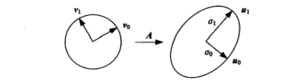

# 附录 A 线性代数与数值方法

来源：Szeliski《计算机视觉——算法与应用》中文第一版附录 A；书页 569–584 / PDF 583–598。未越界附录 B（书页 585 / PDF 599 起）。本附录管「怎么稳定地解方程」，不新开视觉任务。

## 本附录总览

正文里反复出现正规方程、雅可比、稀疏 Hessian 和「用 LM 下山」。本附录把这些数值工具收在一起：矩阵分解（SVD、特征值、QR、Cholesky）→ 线性最小二乘 → 非线性最小二乘（含 Levenberg–Marquardt）→ 稀疏直接法 → 共轭梯度 / 预处理 / 多重网格。

索引约定与计算机科学常见的 0 起始不同：本附录向量、矩阵下标从 1 起，与书中其他章节一致。高度优化的现成实现列在附录 C.2（LAPACK、SuiteSparse 等），这里只讲适用场景和坑。

学完应能分清：SVD 截断是最小二乘最佳低秩逼近；正规方程用 Cholesky 快但不稳，QR / SVD 更稳；LM 在近似 Hessian 对角上加阻尼，不是真正的二阶 Hessian；问题大到装不下因子时才换迭代法。

🔑 关键速记：先选对分解，再决定直接因子还是迭代；视觉里的「Hessian」多半是 $J^{T}J$，不是二阶导。

## 核心知识点

### A.1 矩阵分解

#### A.1.1 奇异值分解(SVD)

任意 $m\times n$ 实矩阵可写成

$$
A_{m\times n}=U_{m\times p}\,\Sigma_{p\times p}\,V_{p\times n}^{T},\qquad p=\min(m,n)
\tag{A.1}
$$

$U$、$V$ 正交，$U^{T}U=I$、$V^{T}V=I$，列满足 $u_{i}\cdot u_{j}=v_{i}\cdot v_{j}=\delta_{ij}$（A.2）。奇异值非负且降序 $\sigma_{0}\ge\cdots\ge\sigma_{p-1}\ge 0$。几何上 $A v_{j}=\sigma_{j} u_{j}$（A.4）：$A$ 把 $V$ 的基转到 $U$ 的基，并按 $\sigma_{j}$ 缩放。

若只有 $r$ 个奇异值为正，秩就是 $r$，可丢掉 $U$、$V$ 的后 $p-r$ 列。截断展开

$$
A=\sum_{j=0}^{r-1}\sigma_{j}u_{j}v_{j}^{T}
\tag{A.5}
$$

是 $A$ 在最小二乘意义下的最佳低秩逼近。书把它接到特征脸（14.2.1）和可分核估计（3.21）。

🔑 关键速记：SVD 同时给出正交基、尺度和最佳低秩近似；秩亏时直接丢掉小奇异值。

#### A.1.2 特征值分解

对称方阵 $C$ 可写成 $C=U\Lambda U^{T}=\sum_{i}\lambda_{i}u_{i}u_{i}^{T}$（A.6）（A.7），$\lambda_{0}\ge\cdots\ge\lambda_{n-1}$。由外积堆成的 $C=\sum_{i}a_{i}a_{i}^{T}=AA^{T}$（A.8）半正定：$x^{T}Cx\ge 0$。数据点 $\{x_{i}\}$ 绕均值的协方差

$$
C=\frac{1}{n}\sum_{i}(x_{i}-\bar{x})(x_{i}-\bar{x})^{T}
\tag{A.10}
$$

其特征分解就是主成分分析(PCA)：主轴指向方差最大的方向，$\sigma_{j}=\sqrt{\lambda_{j}}$ 是沿该轴的标准差。若 $A=U\Sigma V^{T}$，则 $C=AA^{T}$ 的特征值 $\lambda_{i}=\sigma_{i}^{2}$，左奇异向量就是 $C$ 的特征向量（A.11）（A.12）。特征脸那一类「样本数 $\ll$ 维数」的问题，改算较小的 $\hat{C}=A^{T}A$（A.13），再反推 $U$。

小矩阵可用特征方程 $\lvert\lambda I-C\rvert=0$（A.16）；大矩阵先把 $C$ 正交相似成实对称三对角，再 QR 迭代。缺数据、鲁棒 PCA 是另一路，本附录只点到名称。

🔑 关键速记：对称半正定矩阵的特征基 = SVD 的左奇异向量；PCA 与特征脸都是在算这组轴。

#### A.1.3–A.1.4 QR 与乔里斯基(Cholesky)

QR：$A=QR$（A.17），$Q$ 正交，$R$ 上三角。视觉里用来把摄像机矩阵拆成上三角 $\mathbf{K}$ 和旋转（6.35），也出现在自标定（7.2.2）。相对正规方程，对 $A$ 做 QR 再解 $Rx=Q^{T}b$（A.34）通常更稳，只慢一个常数。

Cholesky 把对称正定 $C$ 写成 $C=LL^{T}=R^{T}R$（A.18）。它是对称版的高斯消元，不选主元也对正定矩阵稳定——正规方程 $C=A^{T}A$ 正是这种。算法 A.1 在 $R$ 上做原地分解，稠密代价 $O(N^{3})$，稀疏时可低很多（A.4）。$L$ 或 $R$ 有时被称作「矩阵的平方根」。

🔑 关键速记：正定用 Cholesky；病态或要保留 $A$ 的条件数时改 QR / SVD。

### A.2 线性最小二乘

目标 $E_{\mathrm{LLS}}=\sum_{i}\lvert a_{i}x-b_{i}\rvert^{2}=\lVert Ax-b\rVert^{2}$（A.28）。展开后正规方程为

$$
(A^{T}A)x=A^{T}b
\tag{A.30}
$$

令 $C=A^{T}A=R^{T}R$，先解 $R^{T}z=d$、$d=A^{T}b$，再回代 $Rz=x$（A.31）–（A.33）。这只是两次三角系统。

![图注：原书图 A.2。左：竖向平方误差 $\sum[y_{i}-(mx_{i}+b)]^{2}$ 拟合直线。右：各向同性噪声时应改成点到直线的垂直距离，即全部最小二乘。](./assets/appendixA_ls.png)

病态时给 $C$ 加正则，或直接对 $A$ 做 QR / SVD。全部最小二乘(total least squares)处理的是「$x$ 和 $y$ 都有噪声」：几何拟合、三维平面拟合属于这一类，对应附录后文与第7.2节的「异方差的变量含噪声模型」(HEIV)。

👉 2D 配准里的正规方程与加权最小二乘见第6.1节；拼接与泊松融合里的大型稀疏 $L$ 见第9.3.4节。

🔑 关键速记：线性最小二乘 = 正规方程 + 三角回代；点的两个坐标都有噪声时，不要再用竖向残差。

### A.3 非线性最小二乘与 LM

许多视觉问题对未知 $p$ 非线性，例如光束平差（7.4）。在当前估计附近把残差线性化，增量 $\Delta p$ 的目标是

$$
E_{\mathrm{NLS}}(\Delta p)=\sum_{i}\lVert f(x_{i};p+\Delta p)-x_{i}'\rVert^{2}\approx\sum_{i}\lVert J(x_{i};p)\Delta p-r_{i}\rVert^{2}
\tag{A.46}
$$

$J=\partial f/\partial p$ 是雅可比，$r_{i}$ 是当前残差。局部近似只在 $\Delta p$ 小时成立，因此更新 $p\leftarrow p+\Delta p$ 不一定下降。一种补救是直线搜索 $p\leftarrow p+\alpha\Delta p$，$0<\alpha\le 1$（A.47）。

另一种是带阻尼的高斯–牛顿：把对角项加到近似 Hessian

$$
C=\sum_{i}J^{T}(x_{i})J(x_{i}),\qquad \bigl[C+\lambda\mathrm{diag}(C)\bigr]\Delta p=d,\qquad d=\sum_{i}J^{T}(x_{i})r_{i}
\tag{A.48}–\tag{A.50}
$$

$\lambda$ 大时步子像最速下降，小时接近高斯–牛顿。残差下降不如预测则增大 $\lambda$，下降过头则减小 $\lambda$。把牛顿步（一阶泰勒）和自适应阻尼合在一起，就是 Levenberg–Marquardt(LM)（Levenberg 1944；Marquardt 1963），也是信任域方法的一个例子。

正文第6.1.3 节的 $(A+\lambda\mathrm{diag}(A))\Delta p=b$ 就是这里的（A.49）：那里的 $A$ 是 $J^{T}J$，不是真正的二阶 Hessian。测量分量噪声不同时，要写异方差 / 变量含噪声模型，不能假设各残差等权。

📝待补全：增量 SfM 里每个观测依赖一个 3D 点和一台相机，Hessian 先对点块消元再用 Schur 补缩到相机块，见第7.4节。本附录只给出单块 $C+\lambda\mathrm{diag}(C)$ 的阻尼形式。

👉 完整深度讲解见第7.4节；2D 参数化运动的前向 / 逆复合见第8.2节。

🔑 关键速记：LM = 高斯–牛顿 + 对角阻尼；成功时 $\lambda$ 可收到 0，失败时加大 $\lambda$ 改走最速下降。

### A.4 直接稀疏矩阵方法

图像网格、样条、光束平差的 $C$ 大多稀疏。重排序（嵌套剖分、沿扫描线、沿边界）能显著减少填充；无结构数据仍有启发式图划分。算法 A.2 `SparseCholeskySolve` 的步骤是：符号化分析（可选块结构）→ 确定填充模式并分配压缩存储 → 按重排复制 $C$ 与 $d$ → 对 $R$ 做 Cholesky → 解 $R^{T}z=\hat{d}$、$Rx=z$ → 撤重排。块状结构（每相机 $6\times 6$、每点 $3\times 3$）时，重排代价很小。

若每一步非线性最小二乘的稀疏模式不变，符号化分析只需做一次，后续迭代只更新数值。病态时也可对稀疏 $A$ 做 QR。找最小填充的最佳重排本身是 NP-难的，实践用启发式。

🔑 关键速记：稀疏直接法的时间主要花在填充上；先重排，再分解，模式不变就别反复符号化。

### A.5 迭代方法：共轭梯度、预处理、多重网格

$C$ 大会装不下因子，分解也太贵。共轭梯度(CG)只拿矩阵–向量积。算法 A.3 同时给出 $Cx=d$ 的 CG 和最小二乘形式 $A^{T}Ax=A^{T}b$ 的 CGNR。非线性问题可每步重建局部二次 $C$，或直接对能量 $E$ 做非线性 CG，步长 $\alpha$ 用直线搜索；Polak–Ribière 公式（A.51）常用来算 $\beta_{k+1}$。

收敛速度受条件数 $\kappa(C)$ 限制。预处理改坐标系 $\hat{x}=Sx$（A.52），使 $S^{-T}CS^{-1}$ 更接近单位阵。最简单的是对角（雅可比）预处理 $S=D^{1/2}$，$D=\mathrm{diag}(C)$：尺度差一个数量级（角度 vs 平移、3D 点 vs 6D 相机）时，块对角往往就够。更强的有不完全 Cholesky、树 / 聚类的稀疏近似逆。图像网格上还常用金字塔或小波改写 $S$，把低频交给粗层（与 3.5 节金字塔、附录后文多重网格相接）。

多重网格(multigrid)：构造问题的粗分辨率版本，只修正低频误差，再在细层上做几次松弛。循环形状叫 V 循环或 W 循环。泊松一类规则网格上它可以接近线性时间；不规则网格或不规则稀疏结构更欢迎代数多重网格(AMG)。表面插值、光流、高动态范围色调映射、彩色化、分割都用过这一套。

👉 图像金字塔见第3.5节；泊松融合见第9.3.4节；光流正则见第8.4节。本附录只给求解器，不重讲这些能量。

🔑 关键速记：装得下因子就直接分解；否则 CG + 预处理，网格问题再加多重网格。

## 易混淆点&差异对比

### SVD vs 特征值 vs QR vs Cholesky

SVD 对任意矩形阵，给出最佳低秩逼近。特征值分解要方阵，对称时与 SVD 的奇异向量对齐。QR 稳、适用最小二乘和 $\mathbf{K}R$ 分解。Cholesky 最快，但只要正定；把病态 $A$ 先乘 $A^{T}$ 会把条件数平方。

### 正规方程 vs QR/SVD 解最小二乘

正规方程 $(A^{T}A)x=A^{T}b$ 形成 $C$ 后再 Cholesky，快，对舍入更敏感。对 $A$ 做 QR 或 SVD 更稳、更慢。书的建议：先试 Cholesky，数值不稳再升级。

### 近似 Hessian $J^{T}J$ vs 真正 Hessian

高斯–牛顿 / LM 用的 $C=\sum J^{T}J$ 丢掉残差对二阶导的贡献。残差大、模型很非线性时，真正 Newton 步可能不同；LM 用 $\lambda$ 把步子限制在信任域里，不显式算二阶项。

### 直接稀疏 vs 迭代

直接法一次分解、多次回代，适合同一稀疏模式反复求解。迭代法省存储，适合单次超大规模或只要粗解。预处理选不好，CG 会迭代很久。

🔑 关键速记：分解选「稳还是快」；求解选「因子放得下否」；不要把 $J^{T}J$ 当成二阶 Hessian。

## 本附录要点总结

下表对应正文最常调用的工具。用前先看约束，不要把名称当可运行接口。

| 名称 | 功能 | 主要形式 | 约束&坑点 |
| --- | --- | --- | --- |
| SVD | 正交分解、低秩逼近、伪逆 | $A=U\Sigma V^{T}$（A.1）；截断（A.5） | 小奇异值即秩亏；特征脸用较小的 $A^{T}A$ |
| 特征值 / PCA | 主轴与方差 | $C=U\Lambda U^{T}$；（A.10） | 要对称；$\lambda$ 可为负若 $C$ 不半正定 |
| QR | 稳最小二乘、$KR$ 分解 | $A=QR$（A.17）（A.34） | 比正规方程慢一常数，对舍入更钝 |
| Cholesky | 正定因子 | $C=R^{T}R$（A.18）；算法 A.1 | 只对正定；稀疏时先重排 |
| 线性 LS | 正规方程 | $(A^{T}A)x=A^{T}b$（A.30） | 病态加正则；双边噪声改全部 LS |
| LM | 非线性 LS | $[C+\lambda\mathrm{diag}(C)]\Delta p=d$（A.49） | $C=J^{T}J$ 不是真正 Hessian；$\lambda$ 按下降调节 |
| 稀疏 Cholesky | 直接解大型 $C$ | 算法 A.2 | 填充主导时间；模式不变可复用符号化 |
| CG / 预处理 / MG | 迭代解超大系统 | 算法 A.3；（A.52） | 条件数决定步数；网格问题用多重网格 |

- 下标从 1 起，不要和 0 起始的代码混。
- 现成实现见附录 C.2，本附录不给库函数原型。

🔑 关键速记：视觉数值问题多半是稀疏最小二乘；LM 管非线性，Cholesky / CG 管线性化之后的那一跃。
