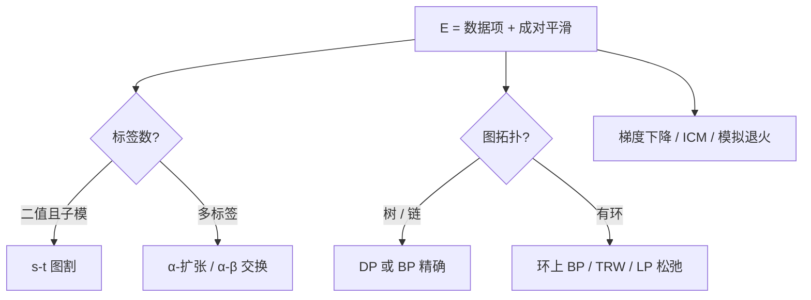
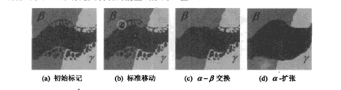

# 附录 B 贝叶斯建模与推断

来源：Szeliski《计算机视觉——算法与应用》中文第一版附录 B；书页 585–603 / PDF 599–617。未越界附录 C（书页 604 / PDF 618 起）。本附录管「噪声下怎么估计、格子上怎么推断」，不新开视觉任务。

## 本附录总览

正文把立体、光流、分割、去噪都写成数据项 + 平滑项。本附录从估计理论往下讲：似然与马氏距离 → 最大似然 / 最小二乘 / 贝叶斯 MAP → 鲁棒统计与 RANSAC → 先验 → 马尔可夫随机场(MRF)的一族算法（梯度下降 / 模拟退火、动态规划、信念传播、图割、线性规划松弛）→ 不确定性（协方差 / 信息矩阵）。

图形学是典型的正向模拟：已知物体、相机、光照，生成图像。视觉通常是逆问题：已知图像，反推结构或参数。同一套方程往往有许多代数解，观测还有噪声，所以必须先对误差建模，再选损失函数和推断算法。

学完应能分清：MLE 在单峰高斯下回到最小二乘；MAP 比 MLE 多一项先验；二值子模能量用 s-t 图割；多标签用 $\alpha$-扩张 / $\alpha$-$\beta$ 交换或 BP；树上 DP / BP 精确，环上只是近似。

🔑 关键速记：先写似然和先验，再选推断；图割解二值子模，BP 在树上精确、环上近似。

## 核心知识点

### B.1 估计理论：逆问题与误差模型

从带噪声的测量（图像、特征位置）估计未知结构或参数，叫估计理论，是统计决策理论的一支。作者用摄像机矩阵标定当例子：已知三维点 $(X_{i},Y_{i},Z_{i})$ 和像点 $(x_{i},y_{i})$，投影

$$
x_{i}=\frac{p_{00}X_{i}+p_{01}Y_{i}+p_{02}Z_{i}+p_{03}}{p_{20}X_{i}+p_{21}Y_{i}+p_{22}Z_{i}+p_{23}}
\tag{B.1}
$$

$y_{i}$ 同理（B.2）。把分母移到左边得到线性组（B.3）（B.4），看起来能直接最小二乘。问题立刻出现：这是不是我们真正要解的方程？测量有没有噪声？最优解是否存在？除非对误差建了模型，并设计在误差下仍工作的算法，否则无法判断结果是不是合理估计。

👉 姿态 DLT 与重投影误差见第6.2节；这里强调的是「线性化之后的方程」不必等于「噪声模型下的最优方程」。

🔑 关键速记：能列出线性方程不等于估计已经正确；先问噪声从哪来、损失怎么写。

### B.2 最大似然与最小二乘

高斯、各向同性噪声下，似然是测量到预测的马氏距离。若 $\Sigma_{i}=\sigma_{i}^{2}I$，

$$
L=\prod_{i}(2\pi\sigma_{i}^{2})^{-N_{i}/2}\exp\Bigl(-\frac{1}{2\sigma_{i}^{2}}\lVert y_{i}-f_{i}(x)\rVert^{2}\Bigr)
\tag{B.9}
$$

负对数似然变成加权平方和

$$
E=-\log L=\frac12\sum_{i}\lVert y_{i}-f_{i}(x)\rVert_{\Sigma_{i}^{-1}}^{2}+k
\tag{B.11}–\tag{B.12}
$$

$\Sigma_{i}^{-1}$ 常叫 Fisher 信息矩阵：它告诉你这一次测量对 $x$ 含多少信息；奇异甚至意味着缺测量。$C_{i}=\Sigma_{i}^{-1}$ 对每个残差加权。线性测量 $f_{i}(x)=H_{i}x$ 时，（B.13）回到附录 A.2 的二次型（B.16）；非线性则用 A.3 迭代。

没有先验时，最大化 $L=p(y\mid x)$ 就是最大似然估计(MLE)。单峰时 MLE 常不错；多峰（跟踪、CONDENSATION、粒子滤波、MCMC）时一个点估计不够。另一种选择是最小化期望风险：损失 $l(x-\hat{x})$ 对后验积分（B.14）。平方损失给出后验均值(MSE)；碰撞一类非对称损失会把最优估计从众数上推开。高斯噪声 + 线性模型时，最小二乘还是最佳线性无偏估计(BLUE)。

🔑 关键速记：高斯似然的 $-\log$ 就是马氏距离平方；MLE 是「只信数据」，MAP 才把先验加进来。

### B.3 鲁棒统计学

热噪声很小、高斯合适；特征错配、立体遮挡、扫描线缺损是严重污染。这时二次代价会把外点拉歪整个解。改用增长更慢的 $\rho$，即 M-估计（Huber）：

$$
E_{\mathrm{RLS}}(\Delta p)=\sum_{i}\rho(\lVert r_{i}\rVert)
\tag{B.17}
$$

令 $\psi=\rho'$，再定义权重 $w(r)=\psi(r)/r$，驻点等价于迭代重加权最小二乘(IRLS)（B.19）。$\rho$ 里通常有一个尺度参数，可用中位绝对偏差 $\mathrm{MAD}=\mathrm{med}_{i}\lVert r_{i}\rVert$（B.20）来估。实践上常先 RANSAC（或 PROSAC）找出内点，再在内点上跑 IRLS / LM。

👉 RANSAC 试验次数 $S=\log(1-P)/\log(1-p^{k})$ 见第6.1.4节。本附录补的是「平方换成 $\rho$」这一层。

🔑 关键速记：外点先用 RANSAC 丢掉，剩下的用 IRLS 把平方核换成 $\rho$；不要对外点集做普通最小二乘。

### B.4 先验与贝叶斯推断

贝叶斯规则 $p(x\mid y)=p(y\mid x)p(x)/p(y)$（B.21）。负对数后验丢掉与 $x$ 无关的 $\log p(y)$，

$$
E(x,y)=E_{d}(x,y)+E_{p}(x)
\tag{B.23}
$$

$E_{d}$ 是数据（负对数似然），$E_{p}$ 是先验（负对数 $p(x)$）。最大化后验得到 MAP。MAP 选的是后验众数，不是后验均值；多峰时众数可能不是决策理论下的最佳点。先验过强会引出奥卡姆剃刀：参数一多，$p(x)$ 变稀，模型选择会惩罚过分复杂的解释。

图像上最常用的先验是分块光滑：相邻像素标号应相近，这正是 MRF。扫描物体尺寸、焦距的合理范围，也可以写成 $p(x)$，用来收紧本来测不准的解。

🔑 关键速记：MAP = 似然 + 先验；平滑项不是「再加一个正则这么巧」，它就是 $-\log p(x)$。

### B.5 马尔可夫随机场推断

网格、光流、深度、分割，都常写成 MRF。成对先验

$$
E_{p}(\mathbf{x})=\sum_{\{(i,j),(k,l)\}\in\mathcal{N}}V_{i,j,k,l}\bigl(f(i,j),f(k,l)\bigr)
\tag{B.24}
$$

（与正文 (3.109) 同一形式。）非成对、高阶团、条件随机场是扩展，本附录以成对格子为主。下面按 B.5.1–B.5.5 收推断算法。

图注：同一能量，按标签数和图上有没有环选算法。局部搜索最容易写，全局保证最弱。

#### B.5.1 梯度下降与模拟退火

ICM、最高置信度优先(HCF)每次只改一个或一小簇节点。变量可按光栅顺序或棋盘格并行。容易陷入局部最小。模拟退火 / MCMC 按 Boltzmann 分布 $p(x)\propto e^{-E(x)/T}$（B.25）接受较差状态，$T$ 从高温降到低温。Swendsen–Wang 一次翻转整块同标号集合，状态改变更大。20 世纪 80–90 年代常用，速度慢；图割和 BP 起来之后，退火多半当对照。

#### B.5.2 动态规划

无环（链、树）时，从叶子往根递推

$$
\hat{E}_{k}(x_{k})=\min_{x_{i}:i<k}\Bigl(\sum_{i<k}E_{i}(x_{i})+\sum_{\mathrm{cliques}}V(\cdot)\Bigr)
\tag{B.28}
$$

根上的 $\hat{E}$ 就是 MAP 能量，再回推状态。链上就是立体扫描线 DP。树上信息从叶到根，再反向标注。有环则（B.28）的消去顺序不再合法；强行把环收成超节点，团的规模可能随图指数增长。高阶团上可用低秩 / 紧凑势（Potts、delta、高斯 MRF）把复杂度从 $O(l^{n})$ 降下来。

👉 立体扫描线 DP 与序约束见第11.5.1节。本附录给出的是树上精确消去这一层。

#### B.5.3 信念传播(BP)

Pearl 的消息传递最初针对树，后来用在带环 MRF 上。树 / 链上 BP 与 DP 等价、给出精确边际或 MAP（取决于 sum-product 还是 max-product）。环上不再保证，但立体、去噪上仍然常用。加速包括：棋盘格交替、多重网格、距离变换把 min-卷积从 $O(l^{2})$ 降到 $O(l)$（Felzenszwalb–Huttenlocher）。顺序更新（沿扫描线走一棵生成树再反向）往往比同步更新收敛快。TRW / TRW-S 在树重参数化下维护对偶下界，实验上常接近线性规划松弛的最优。高阶、专家场、可操控随机场是同一消息传递框架的扩展。

#### B.5.4 图割

图割是一类用最小割 / 最大流解 MRF 的算法的统称。二值子模能量可多项式时间求全局最优。多值问题收成一串二值 MRF。Boykov、Veksler 与 Zabih 的两种移动：

- **$\alpha$-$\beta$ 交换(swap)**：只允许当前标为 $\alpha$ 或 $\beta$ 的像素在这两个标签之间对换。
- **$\alpha$-扩张(expansion)**：任意像素可改成 $\alpha$，或保持原标签。

两者内环都调用一次二值图割，因此能量也要满足二值子模条件。$\alpha$-扩张通常比交换更快收到不错的解，尤其是大片同标签区域（拼接源图标签，正文图 3.60）。凸的顺序标签可在每次最小割里考虑取值范围内全部标签。后续工作放宽了能量约束，并出现动态 MRF、针对 $\alpha$-扩张内环的更快最大流。

👉 二值分割编成 s-t 容量见第5.5节；立体全局能量见第11.5节；拼接选缝见第9.3.2节。本附录补移动策略与子模条件。

#### B.5.5 线性规划松弛

一般 MRF 推断是 NP-难的，但不少实际问题可用线性规划(LP)松弛给出全局最优或紧下界（Kolmogorov 供稿的一节）。把能量写成指示变量 $x_{i;\alpha}$、$x_{ij;\alpha\beta}$（B.35）–（B.39），把 $\{0,1\}$ 松弛到 $[0,1]$。求解可用树重加权消息传递、最大和扩散、次梯度、Bregman 投影等；和积 / 最大积 BP 不保证收到 LP 的全局最大。原始解可能不是整数，需要舍入。LP 松弛 + $\alpha$-扩张：松弛给出下界和对偶，再用扩张把分数解收成整数；Fast-PD 维护一对偶解，度量相互作用下常优于原始 $\alpha$-扩张。

🔑 关键速记：链 / 树用 DP 或 BP；二值子模用图割；多标签用扩张或环上 BP / TRW；要界就上 LP 松弛。

### B.6 不确定性估计

点估计之外往往还要误差条。一般要完整后验，做不到。特例：加性高斯噪声 + 线性测量，后验仍是高斯，协方差由 Hessian（信息矩阵的逆）给出。大规模 SfM 的完整协方差装不下，只报告感兴趣参数（某几个 3D 点、某几台相机）的边缘协方差；主模态可用特征值分析。非线性或鲁棒最小二乘，可在最优点附近用局部 Hessian 当 Cramer–Rao 型下界——局部宽度可能低估真实不确定度。MRF 的 MAP 本身不给方差，可改估最小边际能量一类不确定性。卡尔曼滤波要把新测量和先验协方差合成，显式维护这一矩阵。

👉 光流窗口协方差见第8.1.3节；特征匹配的协方差椭圆见第4章。本附录给出「信息矩阵 = Hessian ≈ 协方差的逆」这一层。

🔑 关键速记：高斯线性时协方差是信息矩阵的逆；大规模只报感兴趣块，不要试图存整张 BA 协方差。

## 易混淆点&差异对比

### MLE vs MAP vs 后验均值

MLE 最大化 $p(y\mid x)$，无先验。MAP 最大化 $p(x\mid y)$，多了 $E_{p}$。平方损失下的贝叶斯最优是后验均值，不是众数。多峰时三个答案可以完全不同。

### 图割 vs 规范割 vs BP

图割解的是子模 MRF 的 MAP，网络流意义上的最小割。规范割最小化 $\mathrm{cut}/\mathrm{assoc}$，松弛成本征向量，不是同一套最大流。BP 传的是消息不是容量；树上精确，环上近似。

### $\alpha$-扩张 vs $\alpha$-$\beta$ 交换 vs 标准移动

标准移动一次改一个像素，最容易卡。交换只动已经是 $\alpha$ 或 $\beta$ 的像素。扩张允许任何像素变成当前 $\alpha$，大片重标更快。三者都依赖内层二值图割。

### 退火 vs 现代推断

模拟退火理论上可收敛到全局，实践慢。图割 / BP / TRW 在视觉格子上又快又稳，书把退火留作历史对照和评测基线。

🔑 关键速记：损失决定「最优」是众数还是均值；算法决定「能不能收到那个最优」。

## 本附录要点总结

下面这张表只对应本附录写出的估计与推断工具，不是库函数清单。

| 名称 | 功能 | 主要形式 | 约束&坑点 |
| --- | --- | --- | --- |
| MLE / 马氏距离 | 高斯噪声下的点估计 | （B.9）（B.11） | 多峰时一个点不够；缺测量时信息矩阵奇异 |
| MAP | 似然 + 先验 | （B.23） | 选众数不是选均值 |
| M-估计 / IRLS | 抑制外点 | （B.17）（B.19）；MAD（B.20） | 尺度要估；常先 RANSAC |
| ICM / 退火 | 局部或随机搜索 | （B.25） | 易陷局部；退火慢 |
| DP | 链 / 树上精确 MAP | （B.28） | 有环失效；立体 DP 还有序约束 |
| BP / TRW | 消息传递 | 树精确、环近似 | 同步更新慢于顺序；高阶团要压缩势 |
| 图割 / $\alpha$-扩张 | 二值或移动式多标签 | 图 B.4 | 要子模；非度量平滑不一定合法 |
| LP 松弛 / Fast-PD | 下界 + 可分数解 | （B.35）–（B.39） | NP-难本体；要舍入 |
| 协方差 / 信息矩阵 | 不确定度 | Hessian 的逆 | 大规模只报边缘块 |

- 正向图形学 vs 逆向视觉：同一投影公式，未知量在两边对调。
- 评测与参考实现见附录 C（Middlebury MRF、FastPD 等），本附录不给代码。

🔑 关键速记：高斯平方回到最小二乘；外点换 $\rho$；格子能量按「二值 / 多标签、树 / 环」选图割或 BP。
