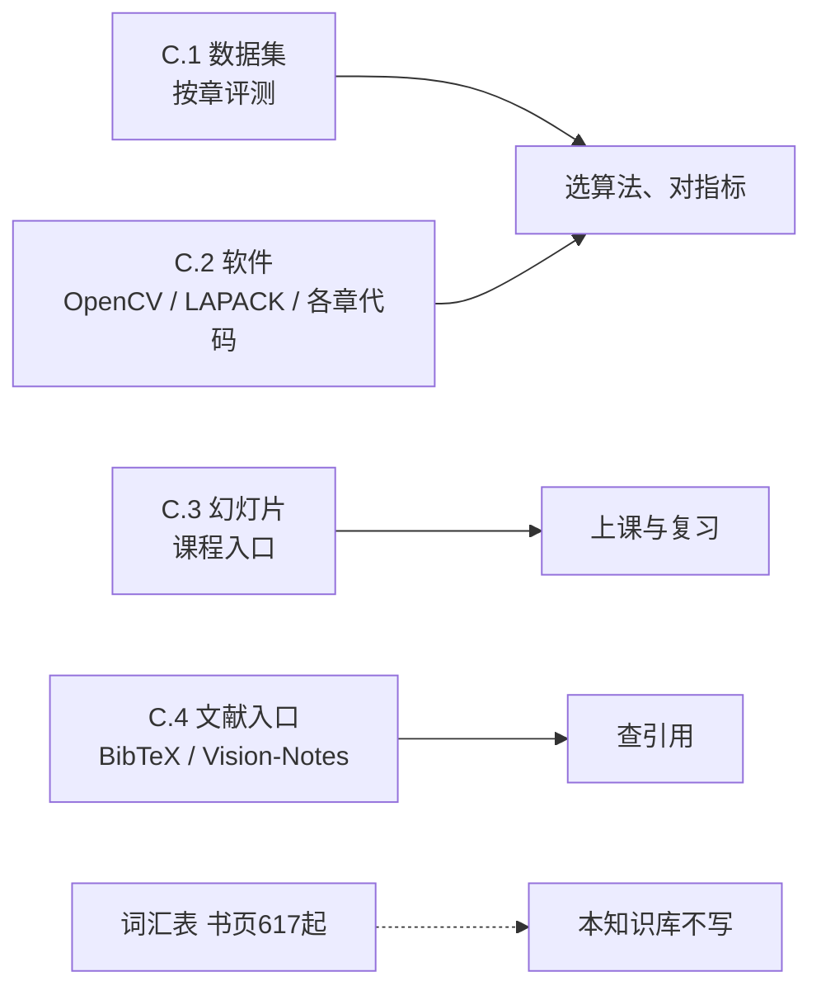

# 附录 C 补充材料

来源：Szeliski《计算机视觉——算法与应用》中文第一版附录 C；书页 604–616 / PDF 618–630。硬停止：词汇表自书页 617 / PDF 631 起不渲染、不写笔记。C.4 是补充材料内的参考文献入口，不是独立参考文献部。

## 本附录总览

本附录不讲新算法。它把正文各章用得到的数据集、软件、幻灯片和文献入口按章节归了一次类，并指向本书网站 http://szeliski.org/Book 上可能更新的列表。分组原则是「和书中哪一章最密」，不是「这个库现在还活着」。

学完应能：按章找到当时用来评测的典型数据（Middlebury 立体 / 光流 / MRF、Berkeley 分割、VOC 一类识别集在第14章正文）；知道 OpenCV / MATLAB / LAPACK / SuiteSparse 分别接哪一类计算；知道幻灯片和 BibTeX 在网站，而不是在这本书的末页再开一部参考文献。

🔑 关键速记：C.1 测什么，C.2 用什么跑，C.3 课怎么讲，C.4 文献去哪查；词汇表另页，不在本附录。

## 核心知识点

### C.1 数据集：按章对号

可靠算法要在有挑战、有代表、最好带真值的集合上测。书列出的门户包括 CVonline、VisionBib、Computer Vision Online；下面只收正文明确点名、并按章分组的那些。链接以印刷时为准，是否仍有效以网站为准。

**第2章 图像形成**：CURET 反射 / 纹理；Middlebury 彩色数据集（研究相机对色域的变换）。

**第3章 图像处理**：Middlebury 测试集，专门评 MRF 最小化 / 推断。

**第4章 特征**：Affine Covariant Features（检测器 / 描述子质量与可重复性）；已匹配图像块库（学习与描述子评测）。

**第5章 分割**：Berkeley Segmentation Dataset and Benchmark（约 1000 张、30 人标注，带测评程序）；Weizmann 灰度分割集（约 100 张，附标准结果）。

**第8章 运动**：Middlebury 光流；Human-Assisted Motion Annotation。

**第10章 计算摄影**：Debevec HDR 辐照图集；Alpha 抠图评测。

**第11章 立体**：Middlebury Stereo；SPE 代价分类；Middlebury 多视；Oxford Colleges 建筑重建；Strecha 多视与评测。

**第12章 3D 重建**：HumanEva（合成视频 + 运动捕捉，评关节人体）。

**第13章 绘制**：Stanford Light Field Archive；Virtual Viewpoint Video（多视视频，每帧带深度）。

**第14章 识别**：详细列表见正文 14.1–14.2；附录另外点到 Buffy 姿态、Buffy 棒状人、H3D 人体姿态 / 关节、若干动作识别集。

第6、7、9 章在 C.1 未单列数据集块：配准 / SfM / 拼接的评测往往并进特征、立体或多视重建那几条。

📝待补全：印刷时的 URL 可能失效。作者声明最新列表在本书网站 http://szeliski.org/Book。本笔记不追踪链接是否可打开，也不把网站内容抄进知识库。

👉 该细节以印刷附录与网站为准，笔记只保留章–数据集对应关系。

🔑 关键速记：立体 / 光流 / MRF 看 Middlebury；分割看 Berkeley；识别看第14章正文那一批，不在本附录重新开清单。

### C.2 软件：库、按章代码、数值后端

当时作者把 Open Source Computer Vision(OpenCV) 列为首选开源库（Bradski 与 Kaehler；维护在 Willow Garage）。功能块包括：滤波 / 形态学 / 金字塔；几何变换；傅里叶与距离变换；直方图；分水岭与均值移位；Canny / Harris / MSER / SURF；光流与均值移位跟踪；相机标定与 3D 重建；机器学习（k-均值、SVM、决策树、boosting、随机森林、期望最大化、神经网络）。Intel IPP 可给许多同类运算加速；MATLAB Image Processing Toolbox 覆盖空域 / 频域、形态学、对齐。VXL、LTI-Lib 书中写到已较少开发但仍有用。照片浏览（Picasa、GIMP、IrfanView 等）和 Vision on Tap、Video-Man 属于周边工具，不是算法正文。

按章点名的研究代码（名称以印刷为准）：

| 章节 | 典型入口 | 用来干什么 |
| --- | --- | --- |
| 第3章 | matlabPyrTools | 拉普拉斯 / QMF / 导向金字塔 |
| 第6章 | 非递归 PnP、Tsai / EasyCalib / Caltech Toolbox、Hartley–Zisserman MATLAB | 姿态与标定 |
| 第7章 | SBA、SSBA、Bundler | 光束平差与无序照片 SfM |
| 第8章 | Black 光流、Celu 光流、TV-L1 GPU、Elastix、MRF 变形注册 | 光流与非刚性注册 |
| 第9章 | Microsoft ICE | 拼接合成 |
| 第10章 | HDRShop | 包围曝光合成 HDR |
| 第14章 | AAMtools、FASTANN、FLANN、词袋与部件检测器、SVM / Kernel Machines | 检测、检索、分类 |
| 附录 A | BLAS、LAPACK、GotoBLAS、ATLAS、MKL、ACML；MINPACK、Levmar；SuiteSparse、PARDISO、TAUCS、HSL、ITSOL、ILUPACK | 分解、LM、稀疏直接 / 迭代 |
| 附录 B | Middlebury MRF、高效 BP、FastPD | 推断对照 |

高斯噪声：多数库有均匀随机数，正态要用 Box–Muller（算法 C.1）或后续改进。伪彩色：把整数标签的比特拆到 RGB（例如 RGBRGBRGB 交错），便于看分割 / 立体标号。GPU：像素着色器与计算着色器当时已用于分割、跟踪、立体、运动估计；CVGPU / GPGPU / OpenVIDIA 是入口，不是本版算法正文。

本知识库规则禁止写可运行工程代码，算法 C.1 只保留「用 Box–Muller 把均匀随机数变成高斯」这一句，不抄 C 例程。

🔑 关键速记：通用图像运算走 OpenCV / MATLAB；BA 走 SBA / Bundler；稀疏线性代数走 LAPACK / SuiteSparse；MRF 对照走 Middlebury 那套。

### C.3 幻灯片与讲座

作者计划上传与本书配套的幻灯片，并建议在定稿前先看华盛顿大学本科 / 研究生课、Stanford CS223B、MIT 6.869、Berkeley CS 280、UNC COMP 776、Middlebury CS 453 等大纲。计算摄影另有 CMU 15-463、MIT 6.815/6.865、Stanford CS 448A、SIGGRAPH 课程。在线讲座集覆盖置信传播、图分割等主题（UW-MSR Course of Vision Algorithms）。

这些是课程入口，不是算法推导。推导仍回第1–14章与附录 A、B。

🔑 关键速记：幻灯片帮上课，公式以书为准；课表链接以印刷时的学校页面为准。

### C.4 参考文献入口

本书引用的全部文献目录以 BibTeX 文件（BibTex.bib）放在书网站，不是印成独立「参考文献」部。更全、带部分注释的视觉出版物目录由 Keith Price 维护（Vision-Notes bibliography）；图形学侧可查 SIGGRAPH 文献库。Google Scholar 与 CiteSeer 是额外入口。

词汇表从下一页（书页 617 / PDF 631）开始，本知识库按规划不写词汇表笔记。

📝待补全：网站上的 BibTeX 与 Keith Price 目录是否仍在原 URL，本笔记不核。需要某条文献时回到印刷附录给出的入口，不要把第二版文献表抄进来。

👉 该细节原书指向网站，暂不展开。

图注：附录 C 四块的分工。词汇表与 C.4 相邻但不属于本附录笔记范围。

🔑 关键速记：C.4 是「去哪找文献」，不是把全书参考文献印在这里。

## 易混淆点&差异对比

### 附录 C vs 词汇表 vs 独立参考文献

C.4 只有入口（网站 BibTeX、Price 目录）。词汇表是术语对译，从书页 617 起。二者都不是「每章末尾那一串引用」的印刷版。

### OpenCV 列表 vs 本仓库 OpenCV 笔记

这里的 OpenCV 是 2010 年前后的功能地图（Willow Garage 文档）。本仓库 `Visual-Knowledge/OpenCV/` 按后来的 OpenCV3/4 手册另写，函数名、模块切分不要和本附录混用。

### 「按章分组」不是「该章唯一数据」

Middlebury 同时出现在第3（MRF）、第8（光流）、第11（立体）——同一门户、不同子任务。识别的主清单在第14章，C.1 只补姿态 / 动作几个额外集。

🔑 关键速记：附录 C 是索引，不是新方法；OpenCV 版本以各知识库自己的手册为准。

## 本附录要点总结

- C.1：按章给评测集；立体 / 光流 / MRF 以 Middlebury 为主，分割 Berkeley，摄影 HDR / 抠图，绘制光场，重建 HumanEva。
- C.2：OpenCV 与 MATLAB 做通用运算；SBA / Bundler 做 BA；LAPACK / SuiteSparse 做附录 A；Middlebury MRF / FastPD 做附录 B。
- C.3：若干大学课与计算摄影课程入口，推导不在这里。
- C.4：BibTeX 在书网站；Price / SIGGRAPH 目录是更全的外部入口。
- 词汇表书页 617 起不写笔记。
- 链接以印刷为准，更新看 szeliski.org/Book。

🔑 关键速记：算法在第1–14章和附录 A/B；本附录只告诉你当时用哪套数据和哪类软件去验收。
